# Demo: `asteroids` — the ballad

The engine's living showcase: a scripted flight through an asteroid field, improved with
every system that lands (see the showcase section of [ROADMAP.md](../ROADMAP.md)). This page
records what it shows today and the numbers it produced.

Run: `cargo run --release -p asteroids`.
Options: `--width W --height H` (1600 × 900), `--count N` asteroids (10 000; 3000 until #23), `--variants N` chunk shapes per
size class (4; 1 until #23), `--length M` belt length (1200), `--duration S`
seconds per lap (90), `--sun-dir x,y,z`, `--planet-dir x,y,z`, `--planet-angle DEG` (18; 0
hides it), `--vsync`, `--validate`, `--fixed-step` (path advances per frame, for
deterministic captures), `--frames N`, `--capture file.png --capture-frame N`,
`--capture-every N` (a PNG sequence), `--no-taa`, `--no-shadows` (no ray-traced sun
shadows), `--no-textures` (the Phase 0 rock, untextured), `--no-hex-tiling` (the rock's texture
repeating as before #66), `--no-ao`, `--ao-radius M` (2),
`--soft-shadows`, `--no-dust`, `--dust E` (its extinction per metre, 1e-4),
`--no-translucency`, `--clear-ice` (#59's one clear ice), `--ice-belt D` (the ice in its own
belt D metres away from the sun, negative for sunward; 0), `--round-rocks` (Phase 0's round
rocks), `--no-crust` (no weathered crust on the chunks), `--rock-shaped-ice` (the ice in the
rock's shapes), `--no-occlusion`, `--no-cone`,
`--show-culled`, `--taa-blend F` (1 = jitter without history), `--lod-error PX` (projected
error a drawn cluster may have, 1.0), `--lod-normals W` (the weight of the normals when
the chunks are cooked, 0.5; 0 before #65), `--no-lod` (full detail only), `--lod-colors`,
`--no-group-window` (A/B: must not change the image), `--tonemap aces|agx|neutral` (ACES),
`--ev100 EV` (a fixed exposure instead of the automatic one), `--exposure-compensation EV`,
`--sun-lux LUX` (128 000, the Sun at 1 AU), `--exposure-log file.csv` (EV100 and its target
per frame), `--look x,y,z` (hold the view direction while moving along the path: stills of
the sky), `--upscaler taa|dlaa|quality|balanced|performance|ultra-performance` (taa),
`--cycle-upscaler N` (switch as U does every N frames: tests the switch in scripted runs),
`--force-fallback` (the device without mesh shaders: the geometry goes through
`vkCmdDrawIndexedIndirectCount`, pixel-identical; see [meshlets.md](meshlets.md)).
With Tracy: `cargo run --release -p asteroids --features profiling` and connect
`tracy/tracy-profiler.exe`. With DLSS: `cargo run --release -p asteroids --features dlss`
(Windows, the Streamline SDK in `streamline-sdk/`, an RTX GPU; without them the ballad says
so and keeps TAA).
Controls: **F1** profiling overlay (**1**–**9** fold a group), **P** pause the path and fly
freely (right mouse look, WASD/QE, Shift fast), **T** temporal anti-aliasing, **O** occlusion
culling, **C** cone culling, **L** cluster LOD, **K** LOD colours, **[** / **]** halve /
double the LOD error threshold, **X** culling-error view (what culling rejected is drawn in
red; any red pixel is a bug), **M** meshlet colours, **Tab** wireframe, **B** bloom (`--bloom S`, 0.04), **J** sun shadows (`--no-shadows`), **Z** soft shadows (`--soft-shadows`), **N** ambient occlusion (`--no-ao`), **V** the belt's dust (`--no-dust`), **Y** translucent ice (`--no-translucency`), **G** tone curve,
**-** / **=** exposure compensation (half an EV), **U** anti-aliasing (TAA → DLAA → DLSS
Quality → Balanced → Performance → Ultra Performance, with `--features dlss`), **Esc** quit.
Machine: RTX 5070 Ti, driver 617.14, Vulkan 1.4, Slang 2026.13, 1600×900, 2026-09-24.

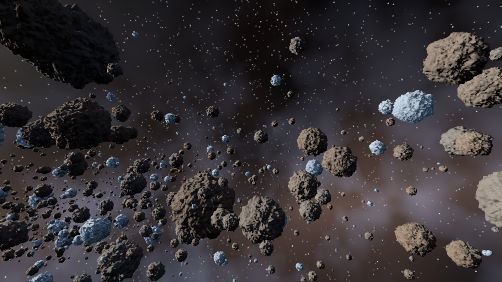


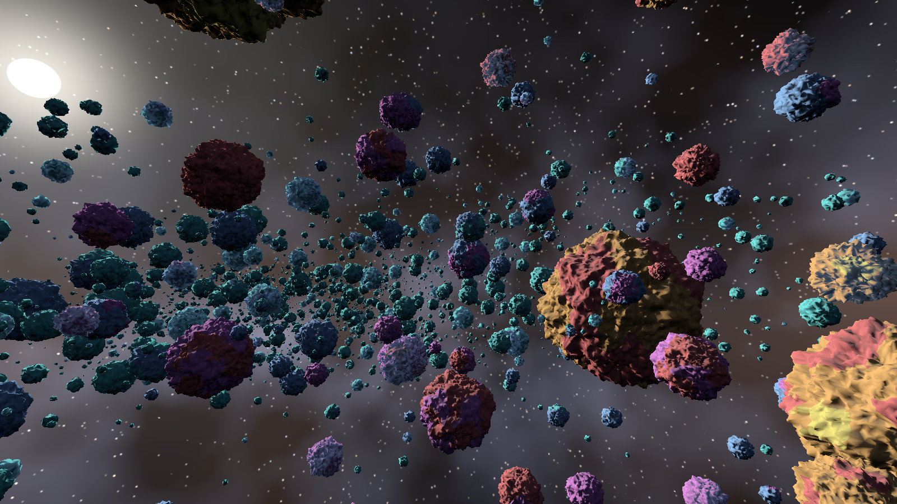

The compact view (the default) is the header and one line per subject; a digit opens a
subject, F1 cycles off → compact → full. The memory group (the last subject) moves beside the
timings when it would push the counters off the screen, and turns red when a heap passes
90 % of its budget:


 The verdicts behind the numbers are in
[PROFILE.md](../PROFILE.md).

## What it shows (phase 0)

- Seven procedural asteroid meshes (cube-spheres of 48 to 192 segments per face displaced by
  fractal noise, 28 k to 442 k triangles each), built in parallel on the job system, cooked
  into meshlets by meshoptimizer and concatenated into one set of GPU tables (0.64 s at
  start-up since issue #34 gave each simplification only its group's vertices; 10.1 s before).
- 3000 instances scattered along an S-shaped belt (a flattened disc 140–360 m across with
  density clumps), big rocks rare, no two rocks overlapping (a placement grid rejects
  intersections), a clear corridor kept around the flight path: **195 M source triangles,
  14.2 M meshlets** in the culling universe. A fifth of the rocks are ice: brighter, bluish,
  with a specular highlight.
- The GPU-driven pipeline of the `meshlets` bench: one draw per pass, task-shader culling
  (frustum, normal cone, two-pass hierarchical-Z occlusion), mesh-shader emission, no
  descriptor sets, statistics read back without stalls.
- **A cluster LOD DAG per mesh** (Nanite-style, built with meshoptimizer: groups of eight
  clusters, locked group borders, each group simplified to half and re-clustered, 9 to 13
  levels down to one root cluster, about twice the leaf triangles in the tables). The task
  shader selects, per cluster, the one cut of the DAG whose projected error is under a
  threshold (1 px by default) with monotonic errors and spheres so the cut has no cracks; a
  per-mesh per-level table lets a task group of 32 clusters exit before reading a cluster
  when none of its levels can be selected at the instance's distance.
- **Temporal anti-aliasing**: Halton-jittered projection, motion vectors from depth and the
  two cameras, Catmull-Rom history clipped to the neighbourhood (ported from the previous
  project). Without it, sub-pixel triangles of distant rocks shimmer badly. The scene is
  drawn into an HDR target and resolved to the swapchain. The occlusion test reads the depth
  pyramid where the jittered projection put the sphere, so culling stays exact under TAA.
- A procedural sky as one full-screen triangle: two star lattices whose glow is never
  narrower than a pixel (so stars do not twinkle), a Milky-Way band and dusty nebula, the sun
  with disc, halo and wide glow, and a **planet** (continents, ice caps, clouds and
  night-side city lights under a physical atmosphere since #8: the limb, the terminator
  and the sun through the air come from Hillaire's integral, below).
- A closed Catmull-Rom camera path through the belt, 90 s per lap, looking along the tangent.
- Tracy: frame marks, `update` / `wait for frame slot` / `record` / `submit and present`
  zones and a `gpu ms` plot (`--features profiling`).

## Numbers

| | value |
|---|---|
| scene | 3000 asteroids, 7 meshes, 195 M leaf triangles; DAG tables 28 k clusters, 4.6 M cluster slots over all instances |
| drawn per frame, LOD 1 px (moving, default path) | 6–8 k meshlets, **0.5–0.6 M triangles**, mean LOD level 6.3 |
| GPU per frame, LOD 1 px | **0.325 ms** along the path with TAA (0.60–0.77 ms with DLSS, below), 0.34 facing the planet (full split in [PROFILE.md](../PROFILE.md): geometry 0.12, shading 0.05 since #20 (0.03 as one resolve), sky 0.11, or 0.14–0.16 with the planet, exposure 0.02, TAA 0.06) |
| GPU per frame, LOD 0.5 px / 2 px | 0.39 ms (1.24 M triangles) / 0.28 ms (0.30 M) |
| GPU per frame, full detail (`--no-lod`) | 5.15 ms (852 k + 33 k meshlets, 82 M triangles) |
| CPU per frame (main thread) | 0.16 ms |
| frame time, uncapped, LOD 1 px | p50 0.34 ms, p99 0.60 ms (~2 800 fps) |
| field build (7 DAGs on 6 workers + scatter + upload) | ~2.5 s |

The table is the 3000-asteroid field of Phases 0 and 1 (`--count 3000 --variants 1`). Since
issue #23 the default is 10 000 asteroids in 28 shapes (section below).

The `meshlets` bench (1152 rocks, 127 M triangles) goes the same way: 2.18 ms → **0.15 ms**
at 1 px (15 k meshlets, 1.1 M triangles).

Earlier configurations for reference: 6000 rocks in a 60–160 m tube drew 50 M triangles at
7 ms and looked like a cave; the first belt layout without overlap rejection drew 20 M
triangles at 3.4 ms because rocks stacked inside each other. The 58–64 M triangles at
5.6–6.0 ms reported before the culling fixes below were measured with a quarter of the
geometry silently missing; 78 M at 7.0 ms was the honest full-detail number before the DAG.

## The cluster LOD DAG (2026-09-24)

Build (`crates/forge-geom/src/lod.rs`): level 0 is the mesh cut into clusters; each level
partitions the previous level's clusters into spatial groups of about eight
(`meshopt::partition_clusters`), locks every vertex shared between groups, simplifies each
group's triangles to half (`simplify_with_locks`), re-clusters the result and records two
spheres and two errors per cluster: `self` (the group that produced it; error 0 at level 0)
and `parent` (the group that consumed it; infinite for a root). A group's error is at least
its children's and its sphere contains theirs, and every cluster of a group carries the
group's values, so "draw when `project(parent) > t >= project(self)`" selects exactly one cut
with no cracks: siblings decide together, and the children of a group decide with the same
numbers their parents used. Vertices are shared across levels; the tables hold about twice
the leaf triangles (the 442 k-triangle rock: 13 levels, 884 k triangles, 9 434 clusters).

Selection (`shaders/meshlet.slang`): the projected error is the object-space error scaled by
the instance, times the projection scale and half the viewport height, over the distance to
the sphere's nearest point. Every level-0 cluster passes the `self` test; every root passes
the `parent` test. The culling universe is now every instance's real cluster count (a
group-to-instance table, exact task-group counts, per-instance visibility bits) instead of
"largest mesh × instances", and each task group first checks, from a per-mesh per-level table
of error and sphere bounds, whether any of its 32 clusters can be selected at the instance's
distance; most groups of a far instance exit there without reading a cluster. Both are
provably conservative, and `--no-group-window` proves it empirically.

Exactness checks at frame 600 (`imgdiff`): `--no-lod` against the pre-DAG full-detail image,
occlusion against brute force with LOD on, and the group window on against off all differ in
**0 of 1 440 000 pixels**. LOD on against full detail changes 28 % of the pixels by a mean
of 7.7 levels: the far field is simplified, which is the point, and the picture reads the
same (captures above).

Two things cost more than the geometry itself while this was built and are worth
remembering: reading a 368-byte `Mesh` record by value in every task thread, and dispatching
`instances × largest mesh` task groups (885 k per pass, all but 145 k exiting on the first
instruction) because a wrapped line hid the old formula from a replacement. The profiler
showed both passes at exactly 1.94 ms whatever was drawn, which is the signature of launch
overhead, not work.

**The instance cull pass (issue #4).** With exact tables the two passes still launched
145 k task groups each and cost 0.45 ms apiece, launch-bound. A compute pass with one thread
per instance now frustum-culls the instance, evaluates the per-level window once per level
and appends only the task groups of the levels that can hold selected clusters to a work
list; both meshlet passes are indirect mesh-task draws over that list. The work list holds a
few thousand groups instead of 145 k, and the passes went from 0.46 + 0.42 ms to
0.06 + 0.02 ms (the cull pass itself: 0.02 ms). Same A/B results: 0 pixels against the
previous LOD image, against brute force, and with the window off. The sky is now the largest
item of the frame.

## The culling A/B check, and the two bugs it found (2026-09-24)

The owner still saw "the surface of the asteroids trembling / glitching" after TAA. Numbers
looked fine and the picture looked plausible, so the demo grew a harness instead of another
guess: with `--fixed-step` every run is deterministic frame by frame, `--no-occlusion`,
`--no-cone` and `--no-taa` switch stages off, and `tools/imgdiff` compares captures. Two
identical runs differ in 0 pixels. Culling on versus off must also differ in 0 pixels, since
culling may only remove what cannot be seen. It differed in 70 000.

1. **The depth pyramid was point-sampled.** The min-reduction sampler used for the
   hierarchical-Z pyramid was created with NEAREST filtering. The reduction mode only applies
   to the texels a filter would read; with NEAREST that is one texel, so every pyramid level
   was an arbitrary subsample of the level below and the occlusion test read one random
   depth instead of the farthest one in the rectangle. Result: holes all over rough rocks,
   flickering as the visibility bits changed. Fix: LINEAR filtering for that sampler (the
   mip level is always chosen explicitly), and a four-tap corner test at the level where a
   texel is at most the rectangle's size, which is provably conservative (see
   `shaders/meshlet.slang`).
2. **Wide normal cones were normalised to NaN.** meshoptimizer marks a cluster whose normal
   cone is wider than a hemisphere with `cone_cutoff = 1` and leaves `cone_axis` at zero.
   `normalize(0)` is NaN on the GPU, every comparison with NaN is false, and the meshlet was
   culled — permanently, whatever the camera did. Twelve percent of the meshlets of the
   roughest rock are wide cones. The CPU tests had hidden it by using `normalize_or_zero`;
   they now evaluate the test exactly as the shader does, and one asserts the convention.
   Fix: skip the cone test when `cone_cutoff >= 1`.

After both fixes: occlusion on versus off, cone on versus off, jittered versus unjittered,
at several frames along the path — **0 of 1 440 000 pixels differ** every time. The `X` view
(`--show-culled`) draws what culling rejected in red; a correctly culled meshlet is
back-facing or hidden and leaves no pixel, so the image must stay free of red, and does.
The `--taa-blend 1` mode (jitter, no history) makes TAA frames comparable one by one.

## Through the render graph (2026-09-24, issue #1)

The ballad's frame is declared, not recorded: the TAA declares the HDR colour transient and
returns the jittered projection, the sky declares a colour-attachment pass, the meshlet
renderer declares the instance cull, the first mesh pass, eleven pyramid passes and the
second mesh pass (returning the depth transient), the TAA declares motion vectors, resolve
and the blit, and the shell adds the overlay, the capture and the present. The graph derives
the barriers from what each pass declared and from the state the previous frame left:

| per frame | passes | image barriers | memory barriers | transients |
|---|---|---|---|---|
| ballad (TAA on, occlusion on), at the migration | 19 | 37 | 3 | colour 12.8 MB, depth 6.4 MB, motion 6.4 MB |
| ballad after #19 and #18 (sky last, no blit) | 18 | 37 | 2 | the same |
| ballad with the visibility buffer (#6) | 19 | 39 | 3 | + visibility 6.4 MB; 32 MB requested in a 25.6 MB heap (visibility and motion share memory) |
| ballad with the exposure histogram (#7) | 23 | 39 | 8 | the same |
| bench (occlusion on), at the migration | 15 | 28 | 2 | depth 6.4 MB |
| bench with the visibility buffer (#6) | 17 | 32 | 4 | depth 6.4 MB, visibility 6.4 MB, colour 12.8 MB; 25.6 MB in a 19.2 MB heap |
| bench with the display pass (#7) | 17 | 32 | 3 | the same |

**The sky is drawn last (issue #19, same day).** With the graph in place the starfield moved
after the mesh passes: it reads the depth transient as a read-only attachment and its
full-screen triangle sits at depth 0, so in reversed-Z the fragment shader runs only where
no rock was drawn. Same pixels (0 differences on the four ballad captures), GPU frame
0.33 → 0.28 ms; the atmosphere pass (#8) will take the same slot.

`FORGE_GRAPH_LOG=1` prints the plan; `FORGE_GRAPH_NO_ALIAS=1` gives every transient its own
memory. Proof that nothing changed: the seven reference captures taken before the migration
(frames 240 and 600 with and without TAA, with and without occlusion, the bench static and
orbiting) differ from the graph's in **0 pixels**, as do aliased vs non-aliased transients;
validation and synchronization validation are silent. The F1 overlay's counters show the
graph's per-frame numbers and the transient heap. Not in this step: async compute and
transfer queues, transient buffers.

**The resolve writes the swapchain directly (issue #18, same day).** The TAA resolve now has
two colour attachments, the next history (HDR) and the swapchain image, so the blit pass and
its two layout transitions are gone: the swapchain goes undefined → colour attachment →
present. The display value is the same number converted to sRGB by the attachment write
instead of by the transfer engine: 747 of 1 440 000 pixels differ by exactly one level
(0.05 %, none by more), which is the rounding difference between the two paths. GPU frame
0.28 → 0.27 ms.

## Through the visibility buffer (2026-09-24, issue #6)

The mesh passes no longer shade. The task shader appends each drawn cluster to a per-frame
visible-cluster list (one atomic per task group, capacity 1 M with an overflow counter in
the statistics), the mesh shader emits positions only with `visible slot << 7 | triangle`
as the per-primitive id, and the fragment stage writes that id into an `R32_UINT` transient
next to the depth buffer (cleared to `0xFFFFFFFF`). The new `shading/visibility resolve`
compute pass (8×8 tiles) reads the id, walks the visible list to the instance, cluster and
triangle, projects the three vertices with the frame's jittered camera, reconstructs the
perspective-correct barycentrics and their screen-space derivatives analytically (no
`ddx`, no helper lanes; the derivation is in `docs/ARCHITECTURE.md` §4 and its CPU mirror
is unit-tested in `forge_render::visibility`), interpolates the normal and shades once per
pixel into the HDR colour transient; the pixels with no rock are left to the sky pass. The
bench does the same into a bench colour image with a background colour and blits it to the
swapchain, so both demos share one shading path.

Numbers (same frame 400): mesh pass 1 0.07 → 0.06 ms, resolve 0.03 ms, GPU frame
0.27 → **0.30 ms** over the 6000-frame run; bench 0.15 → 0.18 ms. On a lit rock with one
light the resolve costs more than the forward shading saved: this step is structure, the
saving arrives with expensive materials and small triangles (Hable 2021 measured the
crossover at about 8–10 px triangles). The graph now has an aliasing customer: the
visibility buffer dies at the resolve and the motion vectors are born after it, so they
share 6.4 MB of the heap.

Proof: the culling harness (occlusion on/off, cone on/off, `--show-culled`, the bench
orbiting) stays at **0 pixels**. Against the forward-shaded captures the resolve differs in
39 of 1 440 000 pixels by more than two levels at frame 600 without TAA (28 at frame 240;
with TAA 1 276, the history amplifying the same pixels), max 36 levels, mean error 0.01:
isolated single pixels on sliver triangles at silhouettes, where the hardware interpolator
(snapped vertex positions) and the analytic form (exact float positions) round differently.
Validation and synchronization validation are silent. One capability detail: a fragment
shader reading `SV_PrimitiveID` declares the SPIR-V `Geometry` capability, which needs the
`geometryShader` device feature although no geometry shader runs; the device enables it.
Material classification and the material table came with #20 (below). The software
rasteriser (#3) later merged its 64-bit depth|id samples into this buffer (keys **R** and
**H**; `docs/demos/meshlets.md`).

## The rock's texture without repeats (2026-09-25, issue #66)

The owner saw the rock's texture repeating, "visible on large flat surfaces". The rock's
albedo and normal maps are one 512² tile, projected along the object's three axes and
repeating every 4 m. A big chunk's fracture face is tens of metres of flat plane, so the same
blotches lay in a grid across it. And every rock of a shape showed the same pattern in the
same place. The slow brightness drift already in the shader did not hide the structure.

**Hex-tiling** (Mikkelsen, "Practical Real-Time Hex-Tiling", JCGT 2022, after Heitz and
Neyret 2018):
- **Tiles:** the texture is sampled in three overlapping hexagonal tiles, each at a random
  offset and rotation.
- **Blend:** the tiles are blended by weights that favour the brighter sample near a tile's
  edge, so the blend keeps the contrast instead of averaging it away.
- **Code:** adapted from the paper's reference code (MIT; credited in `CREDITS.md`, its
  notice in `shaders/third-party/`).
- **Forge's choices:**
  - The tiles are three times the paper's size, about one repeat across. At the paper's
    size the seams, where the blend softens the texture, covered most of a face and blurred
    the blotches.
  - The tiles' weights come from the albedo and blend the normal map too, so colour and
    relief stay together.
  - Each instance takes its own place in the texture, so the rocks of one shape stop
    sharing a pattern.

It is a switch on the material row, `RenderLayer::hex_tiling`. It suits stochastic textures
(rock, sand, concrete) but would break structured ones (brick courses, tiles, windows), so the
city's rows keep it off. `--no-hex-tiling` gives the old look.

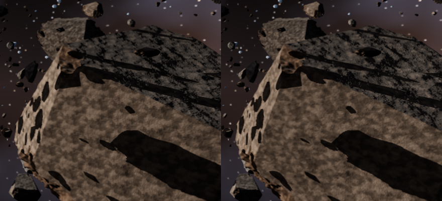

**Cost:** the rock samples each texture nine times instead of three, one per tile and
projection. `shading/standard` goes from 0.133 to 0.171 ms, and the frame from 1.29 to 1.33 ms
at 1600 × 900 (alternating runs, 1500 frames each).

**Checks:**
- `--no-hex-tiling` gives the previous build's captures exactly, on both paths.
- The culling harness and mesh against fallback stay at 0; the bench and the city are
  unchanged.
- With a static camera and TAA on, 0.68 % of the pixels change from frame to frame, against
  0.65 % without the tiling: no new shimmer.
- Synchronization validation is silent.

## LOD pops (2026-09-25, issue #65)

The owner saw "a lot of lod pops". A still frame shows where they came from: at frame 240
without TAA, 6.7 % of the pixels drawn with LOD differ from full detail (`--no-lod`) by more
than 16 levels, over whole surfaces:
- **Near rocks:** the crust's relief is smoothed flat.
- **Mid distance:** the ice's facets are rounded into blobs.
- **Crust and faces:** their borders wander.

**The cause:** the chunks were cooked with geometric error only. Their relief is shallow but
steep, so a level could flatten its shading while moving its surface less than a pixel, and
at every switch of level the shading flipped: a pop. A finer threshold does not reach it:
`--lod-error 0.5` still leaves 5.1 %. The city's facades met the same problem with their
windows (#41) and weigh their normals when they are cooked (`CookOptions::normal_weight`); the
chunks did not.

**The fix:** the chunks weigh their normals too, `--lod-normals 0.5`: metres of error per unit
of normal change, per metre of the rock's radius. In proportion to the radius, the normal
change a level may make depends only on the rock's size on screen: a rock 100 pixels across
keeps its shading within 0.04, one 10 pixels across within 0.4. `--lod-normals 0` restores the
old cooking.

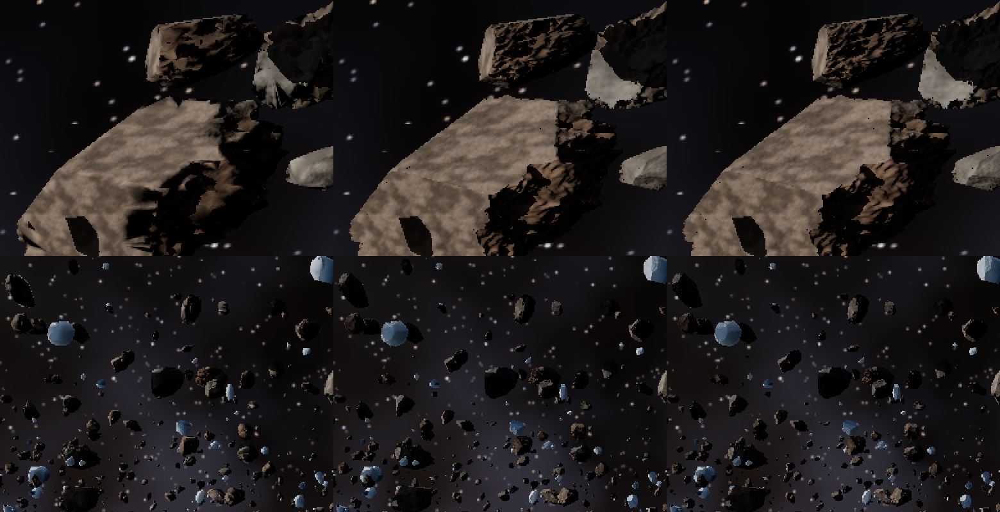

**Pops in motion:** `imgdiff a.png b.png --then next_a.png next_b.png` counts the pixels whose
change to the next frame differs between two sequences. The measure runs along 300 frames of
the path (960 × 540, TAA off), each cooking against a full-detail sequence of its own. It
counts, per frame pair, the pixels that change by more than 16 levels where full detail does
not:

| Cooking | Pops per frame pair | GPU at 1600 × 900 |
|---|---|---|
| Geometry only (before) | 7.65 % | 0.795 ms |
| Weight 0.2 | 3.5 % | 1.04 ms |
| Weight 0.3 | 3.0 % | 1.14 ms |
| **Weight 0.5 (the default)** | **2.38 %** | **1.30 ms** |
| Weight 1 | 1.6 % | 1.72 ms |
| Weight 0.5 at `--lod-error 0.25` (the floor) | 1.00 % | 2.25 ms |

The floor is what a quarter-pixel threshold still leaves: the silhouettes' sub-pixel aliasing,
which TAA resolves. Above it, weight 0.5 leaves 1.4 % against 6.65 % before, 4.8 times fewer
pops. The masks show the difference in kind: before, whole rock surfaces flip; after, what is
left is pixel speckle in the dense far field.

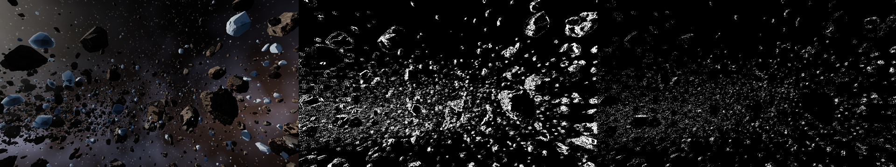

**Cost:**
- **More detail kept:** each rock keeps its shading detail until it is under a pixel. A frame
  at 1600 × 900 draws 122 k clusters and 8.9 M triangles (before: 10 k and 0.57 M).
- **The software rasteriser (#3) now pays:** auto mode takes 107 k of those clusters, in
  0.20 ms.
- **GPU:** 0.795 → 1.30 ms at 1600 × 900, and 1.75 → 2.63 ms at 1440p. Both are well inside the
  8.33 ms of 120 fps.
- **Mesh build:** about 0.15 s longer, behind the loading screen.
- **Visible-cluster list:** now reserved up front for this demand, 24 clusters per asteroid at
  900 lines, scaled with the height. It used to start at 65 536 and grow only after a frame
  had dropped clusters. With the new cooking, the first two frames dropped some, and the
  automatic exposure carried a one-level trace of them into frame 240. The culling harness
  caught it.

**Tried and dropped:**
- **Section borders kept as seams**, so that no level simplifies across the crust's border
  with the fracture faces: no measurable change once the normals are weighed (2.383 against
  2.386 %).
- **A finer threshold with the old cooking:** `--lod-error 0.5` leaves 5.1 % of the pixels off
  in the still frame, and the relief still flattened.

**Checks:**
- `--lod-normals 0` gives the previous build's captures exactly.
- The culling harness (occlusion, cone, the culling-error view) and mesh against fallback stay
  at 0 on every capture, TAA's frame 600 included. The bench and the city are unchanged.
- Synchronization validation is silent.

## Loading screen (2026-09-25, issue #25)

The owner's idea: "loading screen with a simple animation while loading in the background".
Since #23 and #63 the ballad takes 2.7 s to build its field, and the window sat frozen until
it was done. `forge_app::run_loading` runs a demo's CPU-heavy start on a thread of its own
while the window shows a ring of dots turning. The step the thread returns then finishes the
demo on the main thread: the uploads, the ray-tracing structures and the pipelines. For the
ballad:
- **On the thread:** the 42 meshes and their cluster DAGs, 2.2 s.
- **On the main thread, after:** 0.45 s.


- **Loading frames don't count.** Frame numbers, `--frames`, captures, the profile and the
  memory counters all start with the demo, so every capture is unchanged. The finishing step's
  time stays out of the first update's CPU zone and out of the next frame's time.
- **They last at least 8 ms,** since the build needs the cores more than the dots need frames.
- **Shaders compile ahead.** After a shader change, the cache misses every entry, and the
  finishing step used to compile them all: about 10 s, with the window frozen. The compiler
  now records the entries a program asks for, and the shell lists them in
  `shader-cache/<program>.entries` at the end of loading. At the next start, the loading
  screen compiles that list into the cache on four threads, alongside the mesh build. After a
  shader change, the ballad is ready in 3.9 s (33 entries compiled ahead) instead of 12 s
  frozen.
- **The city** starts behind it too: its props cook, or load from the cache, on the thread.
- **Not covered yet:** the overlay and loading shaders themselves compile before the loading
  screen can show (four entries).

**Checks:**
- Every capture is identical to the previous build: both demos, both paths, the culling
  harness.
- The GPU summary still averages 598 of 600 frames. It counts a frame's zones only if the
  frame was recorded after the loading screen: a fixed skip count went wrong once a frame
  bailed out after its slot wait.
- Synchronization validation is silent, loading frames included.

## Ice blocks (2026-09-25, issue #63)

The owner asked for "the ice ones more like ice blocks/chunks". Until now the ice asteroids
used the rock's chunk shapes, bumps and all, and read as blue rocks. The ice now has its own
shapes, two per size class:
- **Smoother body:** a third of the rock's displacement.
- **More cuts:** 20 planes and up instead of 8 and up, so the pieces are crisp, faceted blocks.
- **The shape:** each ice asteroid takes one by a hash of its id, so the placement does not
  change.

`--rock-shaped-ice` keeps the ice in the rock's shapes.

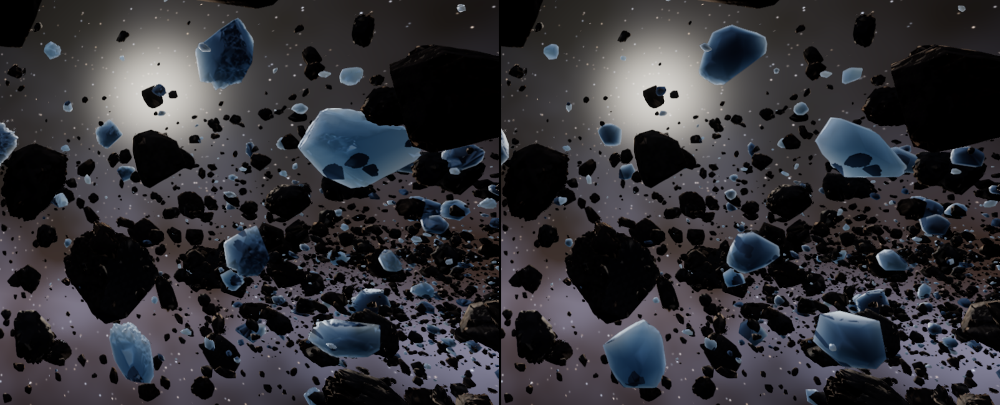

**Numbers:** 28 → 42 meshes, and the mesh build takes 1.8 → 2.4 s (the field is ready in
2.7 s). The GPU time drops a little, 0.815 → 0.80 ms in alternating runs: the smoother blocks
simplify better.

**Checks:**
- `--rock-shaped-ice` gives the previous build's captures exactly.
- The culling harness and mesh against fallback stay at 0; the bench and the city are
  unchanged.
- Synchronization validation is silent.

## Weathered crust (2026-09-25, issue #62)

The chunks of #60 have flat fracture faces, but faces and old surface shared one material,
so the fracture did not show in the colour. On real asteroids, space weathering (the solar
wind and micrometeorites) darkens and reddens exposed surfaces over time, while fresh
fractures show the brighter rock beneath. A chunk broken off a bigger body wears its old
crust around fresh faces:
- **The faces:** `procedural::chunk` marks the triangles lying on its cut planes as
  section 1. The material sections of issue #41 draw them with the row after the instance's,
  and #51's majority vote carries them through the LOD.
- **The rows:** the crust is today's rock darkened and reddened (× 0.72, 0.62, 0.55 per
  channel); the faces keep the rock as it was. The ice is the same ice on both.
- **`--no-crust`** draws the old surface like the faces.

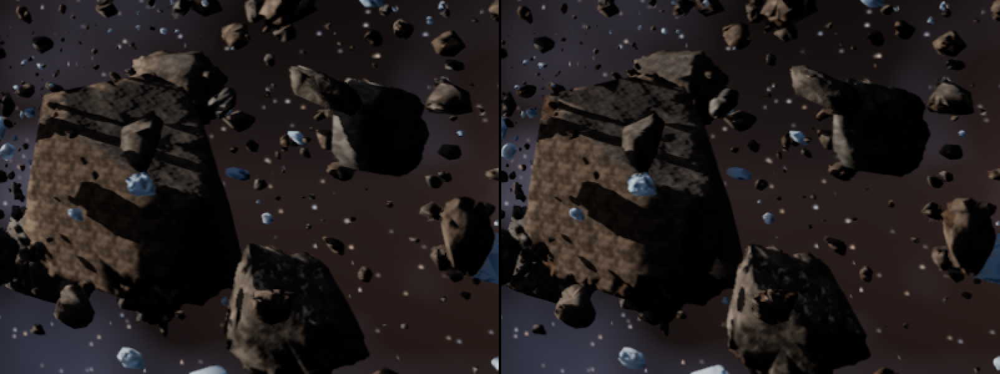

**Cost:** the sections add seams to the simplification, so 12.6 → 13.2 M cluster slots, and
the mesh build takes 0.1 s more. The GPU time does not move: 0.831–0.837 ms with and without
in alternating runs.

**Checks:**
- `--no-crust` gives the previous build's captures exactly.
- The culling harness and mesh against fallback stay at 0; the bench and the city are
  unchanged.
- Synchronization validation is silent. The chunk test covers the sections.

## Two belts, as an option (2026-09-25, issue #22)

The owner's idea: "make asteroid belt separate from ice asteroid belt but still 'orbit' the
same way, ice belt can be 'behind' the first belt". `--ice-belt D` moves the ice asteroids
to a belt of their own. It follows the same centre line, D metres along the orbit's radial
axis:
- **Positive D, away from the sun:** where ice would sit in a real system, beyond the frost
  line. From the path, the ice belt shows behind the rock belt, lit from the front.
- **Negative D, sunward:** the ice would be backlit and glow (#59, #61).

At 0, the default, it is the single mixed belt, identical to #23's build. Which side and
distance the showcase should use is the owner's call.


**Checks:** the default is identical to the previous build; with `--ice-belt 400` the
culling harness and mesh against fallback are at 0, and synchronization validation is silent.

## More chunks (2026-09-25, issue #23)

The owner's idea: "More chunk of rocks like asteroid belts". The belt gets more shapes and
more pieces:
- **Shapes:** each of the seven size classes comes as four chunks (`--variants`, 4), each cut
  by its own planes. All but the first are stretched along two axes, since real asteroids are
  rarely round: axis ratios of 1 : 0.6–0.95 : 0.45 and up. An asteroid takes its shape by a
  hash of its id, so the placement does not change: `--variants 1 --count 3000` gives #61's
  field, pixel for pixel.
- **Pieces:** 10 000 asteroids instead of 3000 (`--count`), with the same size distribution.
  The big rocks stay rare, and the belt fills with small chunks.

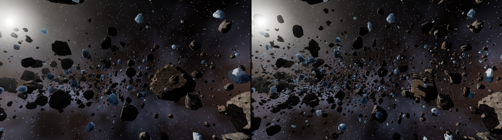

**Numbers:**

| | before | after |
|---|---|---|
| meshes | 7 | 28 |
| mesh build (in parallel) | 0.83 s | 1.6 s (the field ready in 1.8 s) |
| leaf triangles over all instances | 195 M | 531 M |
| cluster slots over all instances | 4.6 M | 12.6 M |
| ray-tracing structures | 267 k triangles, 16 MiB, 8 ms | 1.06 M triangles, 65 MiB, 43 ms |
| drawn per frame | 3 k meshlets, 0.3 M triangles | 6 k meshlets, 0.6–0.7 M triangles |
| GPU over 600 frames | 0.665 ms | 0.808 ms |

The four shapes alone cost nothing measurable (0.691 ms at 3000 asteroids); the extra
asteroids add shading, dust shadow rays and geometry in about equal parts.

**Stability:** the belt has more small, sharp pieces, so it was checked for shimmer. With the
camera nearly still (a 90 000 s lap), frames 300 and 308 (the same jitter phase) differ in
0.30 % of pixels by more than four levels, against 0.18 % for the 3000-asteroid field of #62
(`--count 3000 --variants 1 --rock-shaped-ice --no-crust`). That is in proportion to the
doubled edges, and the changes are sparse dots in the dense far field, as before.

**Checks:**
- `--variants 1 --count 3000` gives the previous build's captures exactly.
- The culling harness and mesh against fallback stay at 0 on the new field; the bench and the
  city are unchanged.
- Synchronization validation is silent.

## Ice of three densities (2026-09-25, issue #61)

The owner asked for ice "translucent depending on their density and on how thick they are";
#59 did the thickness. What makes ice dense or clear is its air. Clear ice holds almost no
bubbles. White ice holds many, and they scatter the light inside it, as they set the look of
lake ice (Mullen and Warren 1988). A row now says how much air its ice holds
(`RenderLayer::bubbles`), and the ballad's ice asteroids take one of three rows by their
instance hash:

| Row | Bubbles | Scattering | Share | Density |
|---|---|---|---|---|
| clear ice | 3 · 10⁻⁵ | 0.045 /m | 35 % | 917 kg/m³ |
| ice | 6 · 10⁻⁴ | 0.9 /m | 40 % | 916.4 kg/m³ |
| white ice | 3 · 10⁻³ | 4.5 /m | 25 % | 914.2 kg/m³ |

- **Scattering:** bubbles of about a millimetre, far larger than the wavelength, block twice
  their cross-section (the extinction paradox), so the coefficient is 1.5 · bubbles / r.
- **Through the ice:** bubbles scatter mostly forwards (g = 0.8). The delta-Eddington
  approximation keeps that forward peak, g² of what they scatter, in the straight beam, which
  still shows the sun. The rest follows the diffusion approximation:
  - it leaves the far side like a Lambertian surface;
  - it is dimmed by the effective attenuation √(3σa(σa + σs')), since scattering lengthens
    the path through the absorbing ice;
  - it is dimmed again by 1 / (1 + ¾σs'L), the share a scattering slab lets through.
- **The surface:** the bubbles within half a metre whiten the albedo towards snow's.

Towards the sun, the clear blocks still glow deep blue through metres of ice. The white ones
glow only at their thin edges, dimly and evenly, and their thick cores stay dark. In side
light, the white blocks read white. `--clear-ice` keeps #59's single clear row.

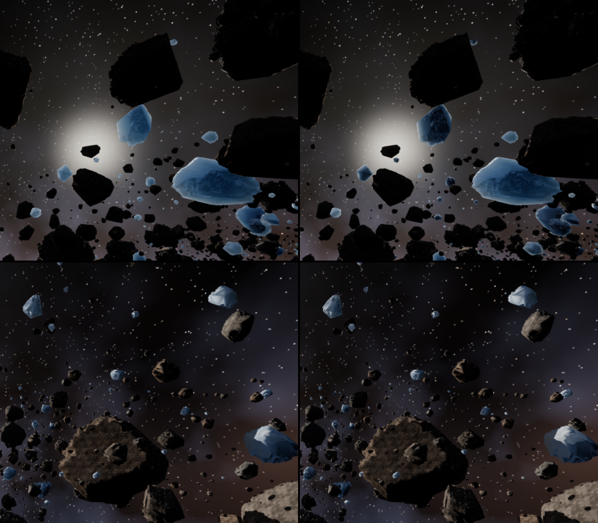

**Cost:** none measurable. `shading/ice` is 0.056–0.058 ms either way, and the ballad
0.663–0.668 ms over 600 frames.

**Checks:**
- With `--clear-ice`, the captures without TAA are identical to the previous build. With
  TAA, rounding below 8 bits reaches the history (the mechanism of issue #20): 0.008 % of
  pixels differ by more than two levels at frame 600.
- With the three ices, the whiter ice moves the automatic exposure by 0.015 EV, so most pixels
  shift by a level; 1.5–2.6 % differ by more than two, the ice itself.
- The culling harness and mesh against fallback stay at 0; the bench (clear stock ice) and
  the city are unchanged.
- Synchronization validation is silent. A test covers the scattering coefficient and the
  lighter density.

## Rock chunks (2026-09-25, issue #60)

The owner's look asked for "rock asteroids as angular *chunks* of rock (fractured faces,
edges, flat facets)" and "ice asteroids as ice *blocks/chunks*". The seven meshes are now
chunks (`forge_geom::procedural::chunk`):
- **The cuts:** Phase 0's displaced cube-sphere, cut by 8 to 14 random planes 0.58 to 0.88
  of its radius from the centre. Every vertex beyond a plane moves back onto it, so flat
  facets meet at sharp edges.
- **The grain:** a faint noise keeps the facets from reading as machined.
- **The Voronoi link:** a Voronoi fracture cuts a body into such convex cells, the
  intersections of half-spaces. The destruction system (Phase 3, #12) can build its cells from
  the same cuts.

The ice blocks glow through their thin edges with #59's translucency. `--round-rocks` keeps
the round rocks. The bench keeps them too.

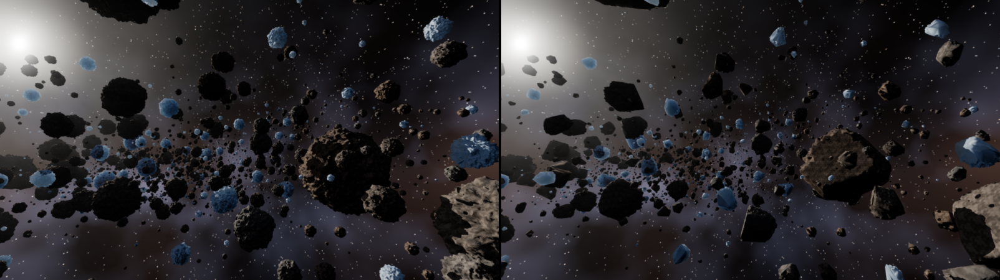

**Numbers:** the field builds in 871 ms (832 for the round rocks). The GPU time *drops*,
0.709 → 0.665 ms over 600 frames, because the flat facets simplify well in the cluster DAG.
The same 195 M leaf triangles become 4.60 M cluster slots instead of 4.65 M.

**Checks:**
- With `--round-rocks`, the captures are identical to the previous build.
- The culling harness and mesh against fallback stay at 0; the city and the bench are
  unchanged.
- Synchronization validation is silent. A test covers the generator: deterministic, the
  sphere's topology, every vertex pulled in.

## Translucent ice (2026-09-25, issue #59)

The owner's look for the ice asteroids asked for transmission through the body: the sun
glowing through thin edges. The ice rocks now let sunlight through (D-033). The fractured
chunk shapes remain for the destruction work (#12).
- **Thickness:** an ice pixel sends a ray towards the sun through its rock. The last crossing
  of the rock's own surface, within its bounding sphere, is where the light went in; the rule
  ignores winding and the traced cut's error.
- **The sun:** a shadow ray from there says whether the sun reaches it.
- **The light:** it crosses per Beer–Lambert, per channel (0.16, 0.10 and 0.065 per metre), so
  thick ice glows blue. It is tinted by the ice and scattered forwards (Henyey–Greenstein,
  g = 0.5) towards the camera.

Looking towards the sun, the backlit ice rocks light up blue, the thinnest brightest; ice
with the sun behind the camera is unchanged. The rays are deterministic per pixel, with no noise
to shimmer. `--no-translucency` / **Y** turns it off, and devices without ray queries have
none.

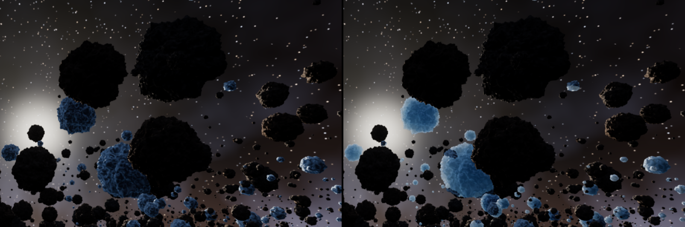

**Cost:** `shading/ice` 0.018 → 0.065 ms (0.021 → 0.078 looking towards the sun): the ray
visits every crossing of its rock. The ballad goes 0.646 → 0.694 ms.

**Checks:**
- With `--no-translucency`, the captures are identical to the previous build. With it, the
  brighter ice moves the automatic exposure, so every pixel shifts a little.
- The culling harness and mesh against fallback stay at 0; the city and the bench are
  unchanged.
- Synchronization validation is silent.

## The belt's dust (2026-09-25, issue #58)

The belt is no longer empty space: thin dust between the rocks scatters the sun's light
towards the camera (D-032). It follows Wronski 2014 and Hillaire 2015, as the city's aerial
perspective does (`forge_render::dust`):
- **`dust/light`:** a froxel volume of 160 × 90 × 64 in front of the camera, quadratic in
  depth to 700 m. Each froxel takes the dust's extinction there (value noise in world space,
  so the dust stays put as the camera flies) and the sunlight it scatters: Henyey–Greenstein
  with g = 0.7, forwards. A shadow ray against the ballad's TLAS darkens the dust in the
  rocks' shadow. The sample jitters within the froxel over TAA's 8-frame cycle.
- **`dust/integrate`:** each froxel column, front to back.
- **`dust/apply`:** each pixel's colour is dimmed by the dust in front of it and brightened by
  what that dust scatters. The sky sees the whole volume.

The densest dust takes 1e-4 of the light per metre (`--dust`), a few per cent over the belt.
That is enough for depth: the far rocks recede into a sunlit haze, and a glow grows around the
sun. The rocks between the camera and the sun leave darker dust in front of them, faint
shafts. `--no-dust` / **V** removes it; devices without ray queries have none.

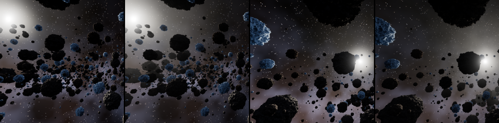

**In motion** (the ballad never stops), consecutive frames differ in 7.7 % of the pixels by
more than four levels with dust, against 8.8 % without. The difference maps show only the
rocks' moving edges, with no froxel blocks.

**Cost:** 0.105 ms. `dust/light` takes 0.073, with its 0.9 M shadow rays; integrate 0.015; apply
0.017. The ballad goes 0.538 → 0.644 ms.

**Checks:**
- With `--no-dust`, the captures are identical to the previous build.
- The culling harness and mesh against fallback stay at 0 pixels with the dust on.
- Synchronization validation is silent, and so is a run without ray queries.

## Ambient occlusion on the fill (2026-09-25, issue #55)

The rocks' shaded sides are lit by the space fill alone: a wrap term and a bluish fill from
the nebula's side. Nothing occluded it, so the craters of the textured rock read flat in the
shade. The ballad now computes GTAO (D-030, as in the city) and scales both terms by it,
through the multi-bounce fit. The effect radius is 2 m (`--ao-radius`); **N** / `--no-ao`
turns it off.

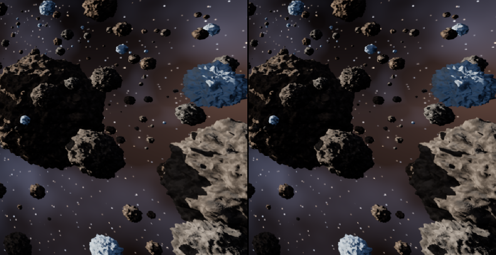

**Soft shadows** (#54) are opt-in here: `--soft-shadows`, **Z**. The ballad's camera never
stops, and its penumbrae are wide, since the rocks shadow each other from tens of metres. TAA
smears the per-pixel sampling along the motion into streaks. #54's first sampling was
independent points per frame, and it streaked in still frames as well. The shipped one is a
Vogel disc turned per pixel, and it cleans up still frames. Motion still smears it. The city,
with narrow penumbrae, keeps them on.

**Cost** (1600×900, 1500 frames): 0.463 → 0.554 ms. The passes take 0.085 ms: the chain 0.024,
gtao 0.043, the denoise 0.017. #50's mirror-ray code had raised `shading/standard` from 0.078 ms (#46) to 0.095 ms without
AO. #52 moved it to a pass of its own: 0.082 ms, and the ballad 0.540 ms with AO.

**Checks:**
- With `--no-ao`, the captures with and without TAA are identical to the previous build, on
  both paths.
- The culling harness and mesh against fallback stay at 0 pixels with AO on.
- Synchronization validation is silent.

## Shadows between the rocks, textured rock (2026-09-25, issue #46)

The rocks now shade each other. The ballad builds the ray-traced sun shadows the city got in
#45 (D-029):
- a bottom-level structure per mesh, over the finest cut of its cluster DAG that fits 40 000
  triangles: 267 k triangles for the seven meshes, built in 8 ms;
- a top-level structure over the 3000 asteroids, built in 1 ms; 16 MiB in all.

The field stays still until Phase 3, so both are built once at start. The resolve traces one
ray per sun-facing pixel, and a rock in another's shadow is lit by the fill alone. **J**
toggles the shadows; `--no-shadows` starts without them.

The rock row takes the procedural rock texture and its relief (albedo and normal, triplanar,
4 m tiles; `forge_render::textures::rock`, #41), tinted with the Phase 0 colours.
`--no-textures` keeps the plain Phase 0 rock. The ice stays smooth.

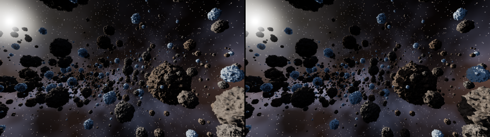

**Cost** (1600×900, 1500 frames): the ballad 0.393 → 0.444 ms.
- The textures take 0.025 ms (`shading/standard` 0.041 → 0.058 ms with `--no-shadows`).
- The rays take 0.027 ms (`shading/standard` 0.058 → 0.078 ms, `shading/ice` 0.011 → 0.016 ms).

**Checks:**
- With `--no-shadows --no-textures`, the captures with and without TAA (frames 600 and 240)
  are identical to the previous build, on both paths.
- With both on, the culling harness and mesh against fallback stay at 0 pixels.
- Synchronization validation is silent.

## Bloom (2026-09-25, issue #44)

The sun now spreads into the rocks in front of it, as it would through a lens. Bloom
(Jimenez 2014, D-022) is built from the pre-exposed HDR frame:
- six half-size levels, down with a 13-tap filter (the first step weighted against
  fireflies);
- back up with a 3×3 tent, each level adding the one below;
- blended into the shown image before the tone curve by the TAA resolve: 4 % of the image
  by default (`--bloom S`, **B**). The history stays unbloomed.

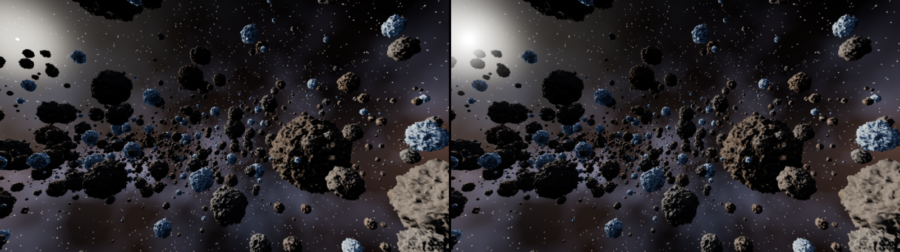

**Cost:** `post/bloom` takes 0.04 ms at 1600×900 (the ballad 0.337 → 0.387 ms with the resolve's
extra sample), and 0.08 ms in city-blocks' 1440p flight.

**Checks:** with bloom off (`--bloom 0`), the ballad's captures without TAA and the city's
(with TAA) are identical to the previous build. The ballad's TAA frame 600 moves 0.12 % of
its pixels by more than two levels, from the resolve's recompiled arithmetic. Two runs are
identical.

## Rock and ice as material rows (2026-09-25, issue #20)

The ballad's two looks were two branches of the resolve, chosen by a hash of the instance
id. Now they are two rows of the material table (D-007, D-026), `stock::rock()` and
`stock::ice()`. The field gives each instance its row when it places it, by the same rule:
a fifth of the rocks are ice. The resolve is two passes:
- **`shading/standard`** covers the frame. It shades the rock and lists the 8×8 tiles that
  hold ice.
- **`shading/ice`** shades the ice in those tiles: its colour from how the surface faces
  the rock's centre, the sharp highlight, and the rim where it turns from the sun.

**Proof.**
- The captures without TAA are identical to the single resolve's: 0 pixels at frames 100,
  240, 300, 500 and 600, both paths.
- The culling harness stays at 0 pixels.
- With TAA, frame 600 differs in 1.7 % of pixels (0.08 % by more than two levels). The
  refactored shading rounds its floats differently below 8 bits, and the history carries
  that forward: the first difference appears at frame 10, in two pixels, by one level.
  Each build is identical to itself from run to run.
- Validation and synchronization validation are silent.

**Cost.** GPU 0.318 → 0.340 ms: `shading/standard` 0.035 and `shading/ice` 0.011 against one
0.024 resolve. The ice pays for its code only in its own tiles, and a new class adds a pass
rather than registers to every pixel.

Next: the rows are ready for textures (the city's rock, `docs/demos/city-blocks.md`).
Translucent ice and fractured rock are #12.

## Physical light, automatic exposure, tone curves (2026-09-24, issue #7)

**Units.** The sun delivers 128 000 lux (the Sun at 1 AU, outside any atmosphere;
`--sun-lux`). The rocks return albedo × E / π in cd/m² from the visibility resolve, the
planet is lit by the same sun the same way, and the sun's disc is drawn at its physical
size (0.267° in radius, about 3.4 pixels at this field of view) with the luminance that
illuminance implies over that solid angle: 1.9 · 10⁹ cd/m². The stars, the nebula and the
glow around the sun are **authored**, in units of a sunlit white Lambertian surface: a real
starfield is some eight orders of magnitude below a sunlit rock and would vanish at the
rocks' exposure, as it does in photographs from the Moon. Every pass writes luminance times
the frame's exposure (pre-exposure), so the fp16 targets hold values near 1; the sky is
clamped at 16 384 so the disc cannot overflow them.

**Exposure.** EV100 is either fixed (`--ev100`) or automatic: the pass group
`exposure/luminance histogram` bins the luminance of every pixel of the finished HDR image
into 256 log2 bins (shared-memory atomics, then device-local memory), copies the 1 KB
result into a cached readback buffer of the frame slot and declares a `HostRead`; the CPU
reads it two frames later, ignores the black bin, takes the log-average of the samples
between the 50th and 98th percentiles and moves EV100 towards the value that meters that
key as middle grey (1.5 per second towards darker, 0.8 towards brighter; **-** / **=**
shift it by half an EV). The TAA rescales its history by the ratio of exposures, so
adaptation never ghosts. Along the whole 90-second path (`--fixed-step --exposure-log`):

| EV100 over the path | largest change | reversals larger than 0.1 EV | largest swing |
|---|---|---|---|
| 14.4 – 15.0 | 0.55 EV per second | 10 in 90 s | 0.52 EV |

The meter settles around the sunny-16 value because the sunlit rocks dominate the upper
half of the histogram; it opens up by half a stop where the path leaves the belt and the
view is mostly nebula, and closes again in the dense clumps. Nothing pumps: one reversal
every nine seconds, never faster than half a stop per second.

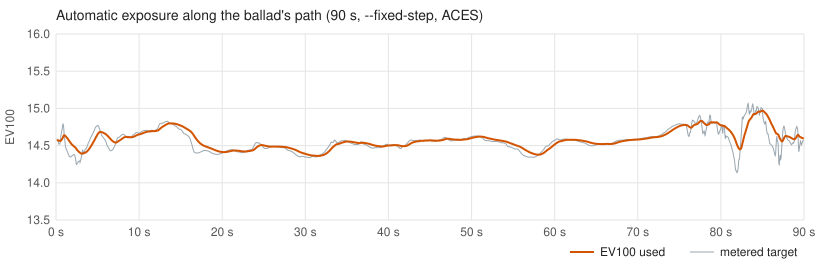

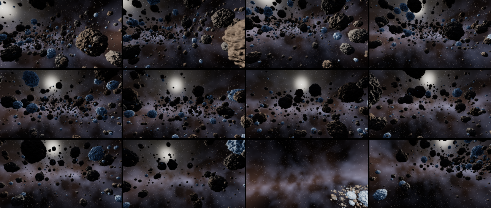

**Tone curves.** **G** cycles ACES → Khronos PBR Neutral → AgX (`--tonemap`). The curve is
applied in the TAA resolve, which writes the HDR history and the display image in one pass;
the bench uses the stand-alone display pass. The same frame 600 (`--fixed-step`, TAA on,
automatic exposure), the golden captures of the three curves:

| ACES (Hill's fit of the 1.x RRT + ODT), the ballad's default | Khronos PBR Neutral | AgX |
|---|---|---|
| 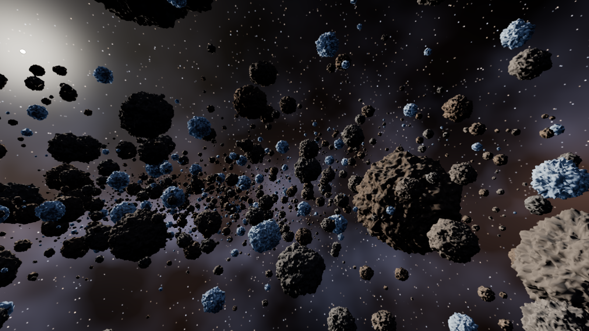 | 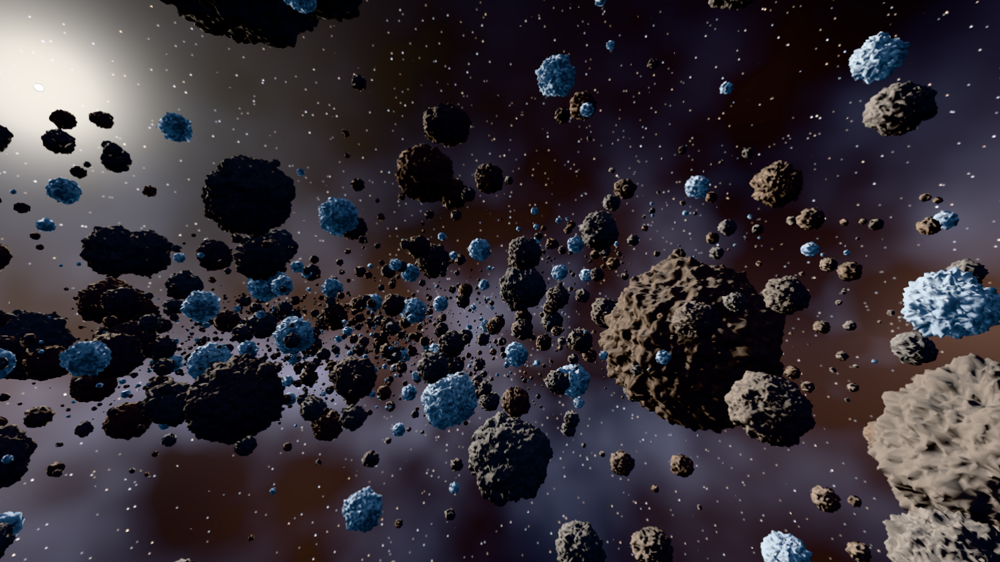 | 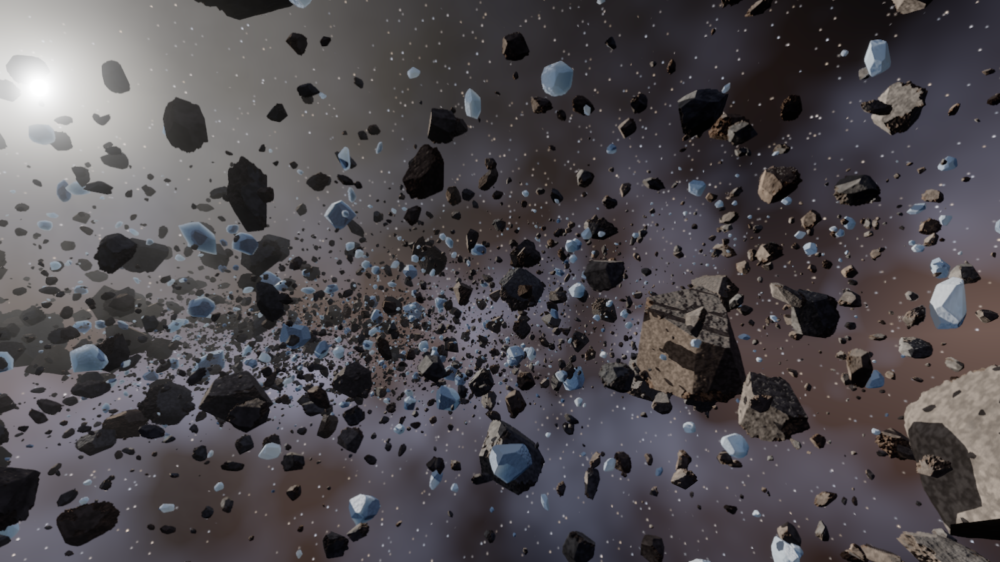 |

ACES is the default here because its toe keeps space black and the lit rocks contrasted;
PBR Neutral keeps base colours (the nebula's browns and purples show), which is what it is
for; AgX, the engine's default elsewhere and the most hue-safe, spends the display range on
16.5 stops and lifts this mostly dark scene to a flat grey. Middle grey lands at 0.106
(ACES), 0.14 (Neutral) and 0.21 (AgX) of display white; `forge_render::display` pins these
in tests against CPU mirrors of the shader.

**Checks.** Occlusion, cone and `--show-culled` A/B at 0 pixels without TAA; occlusion on
vs off with TAA and automatic exposure at frame 600: 0 pixels (the histograms, hence the
exposures, are identical); two runs of the golden capture: bit-identical. Validation and
synchronization validation silent with each curve and with a fixed exposure. The goldens
are checked with:

```
cargo run --release -p asteroids -- --fixed-step --frames 601 --capture aces.png --capture-frame 600
cargo run --release -p imgdiff -- --tolerance 0 docs/demos/images/asteroids-hdr-aces.png aces.png
```

**Cost.** The histogram group (clear, count, copy, host read) is 0.02 ms of GPU; the frame
went from 0.30 to 0.30–0.31 ms over two 6000-frame runs. A first version counted straight
into host-visible memory: in video memory (Resizable BAR) the CPU paid 0.02 ms per frame
to read 1 KB, in cached system memory the GPU paid 0.4 ms for atomics across PCIe;
counting on the device and copying 1 KB costs neither. The frame is now 23 passes (19
before), 39 image and 8 memory barriers (3 before): the histogram group is four small
passes sharing one profiler zone.

## The planet's atmosphere (2026-09-24, issue #8)

The planet used to be painted: a lit sphere with an "atmosphere rim" term and a halo drawn
beyond the limb. It is now an Earth-sized ground (6 360 km) under Earth's air (Hillaire
2020's coefficients: Rayleigh, a continental aerosol, the ozone layer, 100 km thick), seen
from where its ground fills a disc of `--planet-angle` (18°: 20 580 km from its centre).
The air exists only in that shell; the rocks and the space between them have none. The
still at the top of this page shows the default planet; below, its edge zoomed and a
closer planet.
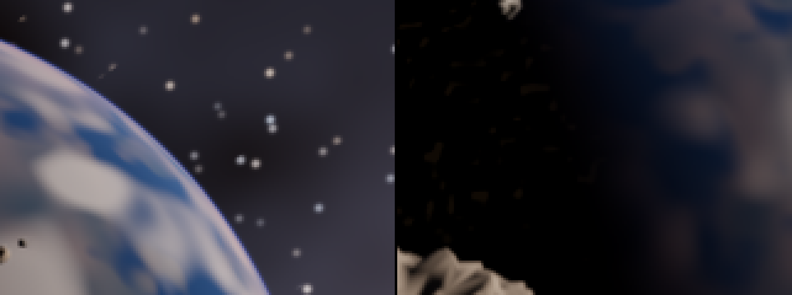


How (`forge_render::atmosphere`, `shaders/atmosphere.slang`, D-023): two tables built by
compute passes on the first frame and whenever the atmosphere changes (`sky/atmosphere
tables`: transmittance 256 × 64, multiple scattering 32 × 32), then, in the sky pass, every
pixel whose ray crosses the atmosphere marches it in 16 segments packed towards the ray's
lowest point, with single scattering through the transmittance table, the planet's shadow
and the multiple-scattering term. The ground is lit by the sun through the air plus the
skylight; the stars and the sun behind the air are multiplied by its RGB transmittance.
Pixels outside the cone of the atmosphere skip all of it (a dot product against the
planet's direction; no pixel changes). The ground (oceans, continents, ice caps, a cloud
deck, city lights) is the old procedural surface, now as albedo.

What it shows, and why it is thin: from 14 000 km up the whole atmosphere is 0.3° thick, three
pixels, and the part that scatters (below 20 km) less than one, so the limb is a hairline,
as in photographs of the Earth from high orbit. The blue limb over the day side, the haze
brightening towards it, the warm terminator and, at 50°, the red ring of light that grazed
the ground at sunset all come from the same integral, with nothing painted. The sun behind
the limb stays white: its disc is 10⁹ cd/m², and even a hundredth of it is far above white
at this exposure (a camera clips it the same way); the reddening shows in the thin air
around it. Whether the ballad's planet should sit closer, where the air reads as a band,
is an art-direction question for the owner.

Checks: the CPU mirror of the transmittance integral (tests: the noon sun 0.87 in green;
a horizon sun red over blue by more than 20×; a ray from space grazing 10 km up reddened;
metre-precise spans 20 000 km out); 16 segments within 4/255 of a 128-segment reference
at 18° and 50° (24 within 2/255, 12 off by 9/255); culling A/B at 0 pixels along the path
and facing the planet; validation and synchronization validation silent. With a fixed
exposure, frame 600 of the path is bit-identical to before the change; with the
automatic exposure it moves by 0.0002 EV (the old painted halo reached the edge of a few
early frames), so the three tone-curve goldens were recaptured.

Cost: the sky pass is 0.11 ms with the planet out of view (0.10 before), 0.14–0.16 ms with
the default planet in view, 0.31 ms for a planet filling most of the screen; the tables cost
nothing after the first frame. The frame along the path is 0.325 ms (0.315 before, two
6000-frame runs each) and 0.34 ms facing the planet. A planet-view table would make the
big-planet case a lookup (#26).

Stills of the sky: `--look x,y,z` holds the camera's direction while it moves along the
path, for example:

```
cargo run --release -p asteroids -- --fixed-step --look=-0.45,0.10,-1.0 --frames 61 --capture planet.png --capture-frame 60
cargo run --release -p asteroids -- --fixed-step --planet-angle 50 --look=0.27891,0.29307,-0.91451 --sun-dir=0.40811,0.31726,-0.85603 --frames 601 --capture sunrise.png --capture-frame 600
```

## DLSS (2026-09-24, issue #8)

With `--features dlss` the Vulkan API comes through NVIDIA Streamline's interposer, and
**U** (or `--upscaler`) replaces the TAA resolve with DLSS: the scene is drawn jittered at
DLSS's input size, DLSS upscales the pre-exposed HDR colour with the depth and the TAA's
motion vectors into an HDR image at the window's size, and the display pass takes it
through the tone curve (D-024). TAA stays the default and the fallback. Without the
feature, the SDK or an RTX GPU, U says so and nothing changes.

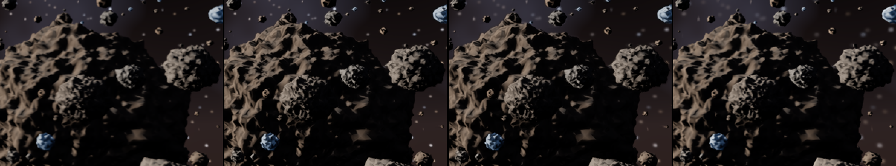

| anti-aliasing | drawn at | GPU per frame (path average) | the resolve pass | triangles |
|---|---|---|---|---|
| TAA | 1600×900 | 0.333 ms | TAA resolve 0.05 ms | 0.56 M |
| DLAA | 1600×900 | 0.768 ms | DLSS 0.46 ms | 0.56 M |
| DLSS Quality | 1067×600 | 0.690 ms | DLSS 0.45 ms | 0.57 M |
| DLSS Balanced | 928×522 | 0.662 ms | — | 0.56 M |
| DLSS Performance | 800×450 | 0.646 ms | DLSS 0.45 ms | 0.55 M |
| DLSS Ultra Performance | 533×300 | 0.600 ms | DLSS 0.43 ms | 0.55 M |

One 6000-frame run per mode with `--fixed-step`, TAA measured in the same Streamline build
(0.325 ms without it); the pass times come from the F1 overlay at frame 1200. What the
numbers say: the DLSS pass costs what the **output** costs, 0.43–0.46 ms at 1600×900 in
every mode. Drawing smaller saves this scene only 0.1–0.2 ms, so here DLSS costs more
than it saves. It pays once the scene saves more than about 0.5 ms at the input size (the
city-blocks target at 1440p). Streamline also adds about 0.07 ms of CPU to recording.

What it took (details in D-024 and the research notes):

- **The LOD error is measured in output pixels.** In render pixels the cluster DAG picked
  coarser cuts at the smaller sizes, and Quality and Performance drew faceted rocks that
  DLSS cannot restore. Scaled by the render/output ratio, every mode draws the same
  0.56 M triangles, and DLSS only reconstructs shading.
- **A longer jitter sequence**: 8 × (output / render)² Halton phases (32 at Performance).
- **The graph declares everything.** The images tagged for Streamline are declared by the
  `temporal/DLSS` pass. The output uses a new `Custom` access because NGX clears it at the
  transfer stage before writing it. Synchronization validation caught the missing stage.
- **Tags valid until present**: tagged `eOnlyValidNow`, Streamline copied every input first
  (and validation flagged the copies).
- **IMMEDIATE present under Streamline**: through the interposer, MAILBOX presents were held
  to the display's refresh in most runs (acquire waiting 8 ms); IMMEDIATE never was. The
  plain build keeps MAILBOX.

Checks: validation and synchronization validation silent in every mode and while
switching (`--cycle-upscaler 60` through all six); DLAA lines up with the TAA frame
(camera, jitter and motion vectors agree); the TAA path is bit-identical to the golden
after the refactor (motion vectors now a pass of their own, the LOD scale 1 at native).
DLSS output is not used as a golden image: it changes with the DLSS model the driver ships.

## Resolved: TAA history is bit-exact between runs since the render graph (issue #10)

Before the graph, two identical runs with TAA on and the camera moving differed at frame
600 in about 700 of 1 440 000 pixels by up to 30 levels (invisible), sometimes in 0.
Everything narrower was exact: TAA off, jitter without history (`--taa-blend 1`), a static
camera with history, and the per-frame CPU inputs (`FORGE_TRACE_FRAMES` traces of two runs
identical). Synchronization validation and GPU-assisted validation reported nothing; a full
barrier before every pass, a device wait after every frame and vsync changed nothing; a CPU
sleep of 20 ms after every frame (`FORGE_STALL_MS=20`) made every run bit-identical. The
outcome was bimodal (runs landed on one of two histories): a GPU-side ordering effect that
only the temporal feedback loop amplified.

With the render graph deriving every barrier from declared accesses (2026-09-24), **twelve
of twelve runs** of `--fixed-step --frames 601 --capture --capture-frame 600` are
bit-identical (0 pixels, max channel error 0), without any stall. Which hand-written
dependency was incomplete was not isolated; the graph replaced them all, and the plan it
derives (`FORGE_GRAPH_LOG=1`) is the record of what the frame now waits for.
`FORGE_STALL_MS` stays as a debugging aid.

**The mechanism, found in issue #5.** The same bimodal signature came back when the culling
moved into compute and filled the visible-cluster list with atomics, and this time it was
isolated: two triangles can meet a sample at exactly the same depth, the depth test keeps the
one drawn last, and the draw order followed the order in which workgroups won the atomics.
Only TAA's history makes the rare ties visible, and a stall hides them because it changes
the scheduling, not the synchronization. Both culls now append in a fixed order (a prefix
sum over workgroups in ticket order; [meshlets.md](meshlets.md), "The draw order is part of
the output"), which makes the draw order, and so the image, independent of timing. The fixed
order moved the golden once (14 946 pixels at ±1 with TAA and automatic exposure; identical
with a fixed exposure or without TAA); it is identical from run to run since.

## What the numbers say

- Before the DAG almost every drawn triangle was smaller than a pixel (54 per pixel): a
  442 k-triangle rock 300 m away covers a few hundred pixels. The DAG draws that rock with a
  few clusters of its coarse levels, and the instance cull pass hands the task shader only
  the groups that can matter: the geometry passes went from 5.8 ms to 0.13 ms.
- With a static camera and TAA on, consecutive frames differed in ~1.4 % of the pixels by up
  to 41 levels at full detail: the temporal filter cannot settle on geometry that changes
  every jitter. With the DAG the far field is a few triangles per pixel, which the filter can
  settle; the trembling the owner saw was the culling holes above.
- TAA costs 0.06 ms here (motion vectors and the resolve, which also writes the display
  image through the tone curve, at 1600×900); the sky 0.10 ms.
- The CPU is idle (0.18 ms per frame). Everything below the frame loop is the GPU walking
  pointer tables.

## Reference look (owner's references)

Dense belts against a planet or a sun with a bright halo, volumetric light between the
rocks, ice asteroids in blue, dark rock in the foreground with lit rims; later, bases carved
into the big asteroids, ships in pursuit, lasers, missiles, rocks breaking by mass on impact.

## Next for the ballad

1. Cluster LOD DAG, the instance cull pass and the visibility buffer: done (above). Next in
   geometry: material classification of the visibility buffer (#20), streaming of cluster
   pages, the software rasteriser for the smallest clusters once triangle counts rise again
   (a million-triangle city, not a rock field).
2. Bloom and the sun's hard ray-traced shadows: done (above). Next: soft shadows from the
   sun's disc, a closer planet if the owner wants its air to read as a band, the planet-view
   table (#26), volumetric dust and the nebula lit by the sun.
3. Physics (Phase 3): tumbling, collisions, fracture by mass; then ships, lasers, missiles,
   crashes (Phases 5–7), a second player, spatial audio.
4. Look (owner's request, 2026-09-24, after the systems): rock asteroids as angular
   *chunks* of rock (fractured faces, edges, flat facets — a Voronoi/fracture-based
   generator rather than a displaced sphere), and ice asteroids as ice *blocks/chunks*,
   translucent according to their density and to the thickness of ice between the light and
   the camera (transmission through the body, so the sun glows through thin edges; a
   material-layer job for the lighting phase, with the fracture generator shared with the
   destruction system). **First pass done (2026-09-25):** the chunks (#60, plane cuts, one Voronoi
   cell each) and the translucent ice (#59, D-033: the sun through its thickness, by rays). Then the
   ice's density (#61: bubbles scatter the light inside it; clear, bubbly and white blocks),
   the weathered crust around the fracture faces (#62), the ice's own blockier shapes (#63)
   and a denser belt in more shapes (#23). Left: edge wear, and fracture on impact with the
   destruction system (#12).
