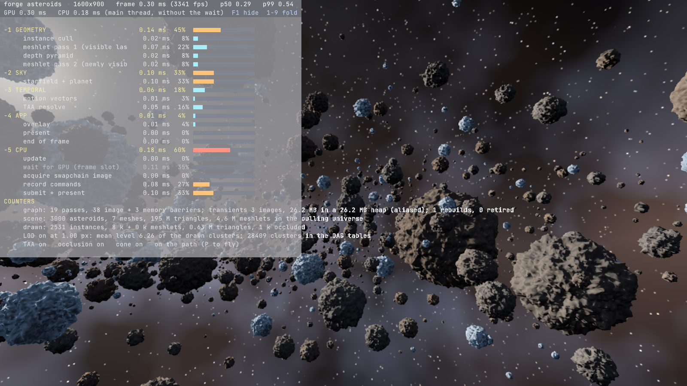

# Demo: `asteroids` — the ballad

The engine's living showcase: a scripted flight through an asteroid field, improved with
every system that lands (see the showcase section of [ROADMAP.md](../ROADMAP.md)). This page
records what it shows today and the numbers it produced.

Run: `cargo run --release -p asteroids`.
Options: `--count N` asteroids (3000), `--length M` belt length (1200), `--duration S`
seconds per lap (90), `--sun-dir x,y,z`, `--planet-dir x,y,z`, `--planet-angle DEG` (18; 0
hides it), `--vsync`, `--validate`, `--fixed-step` (path advances per frame, for
deterministic captures), `--frames N`, `--capture file.png --capture-frame N`,
`--capture-every N` (a PNG sequence), `--no-taa`, `--no-occlusion`, `--no-cone`,
`--show-culled`, `--taa-blend F` (1 = jitter without history), `--lod-error PX` (projected
error a drawn cluster may have, 1.0), `--no-lod` (full detail only), `--lod-colors`,
`--no-group-window` (A/B: must not change the image).
With Tracy: `cargo run --release -p asteroids --features profiling` and connect
`tracy/tracy-profiler.exe`.
Controls: **F1** profiling overlay (**1**–**9** fold a group), **P** pause the path and fly
freely (right mouse look, WASD/QE, Shift fast), **T** temporal anti-aliasing, **O** occlusion
culling, **C** cone culling, **L** cluster LOD, **K** LOD colours, **[** / **]** halve /
double the LOD error threshold, **X** culling-error view (what culling rejected is drawn in
red; any red pixel is a bug), **M** meshlet colours, **Tab** wireframe, **Esc** quit.
Machine: RTX 5070 Ti, driver 617.14, Vulkan 1.4, Slang 2026.13, 1600×900, 2026-09-24.

The compact view (the default) is the header and one line per subject; a digit opens a
subject, F1 cycles off → compact → full. The verdicts behind the numbers are in
[PROFILE.md](../PROFILE.md).

## What it shows (phase 0)

- Seven procedural asteroid meshes (cube-spheres of 48 to 192 segments per face displaced by
  fractal noise, 28 k to 442 k triangles each), built in parallel on the job system, cooked
  into meshlets by meshoptimizer and concatenated into one set of GPU tables.
- 3000 instances scattered along an S-shaped belt (a flattened disc 140–360 m across with
  density clumps), big rocks rare, no two rocks overlapping (a placement grid rejects
  intersections), a clear corridor kept around the flight path: **195 M source triangles,
  14.2 M meshlets** in the culling universe. A fifth of the rocks are ice: brighter, bluish,
  with a specular highlight.
- The GPU-driven pipeline of the `meshlets` bench: one draw per pass, task-shader culling
  (frustum, normal cone, two-pass hierarchical-Z occlusion), mesh-shader emission, no
  descriptor sets, statistics read back without stalls.
- **A cluster LOD DAG per mesh** (Nanite-style, built with meshoptimizer: groups of eight
  clusters, locked group borders, each group simplified to half and re-clustered, 9 to 13
  levels down to one root cluster, about twice the leaf triangles in the tables). The task
  shader selects, per cluster, the one cut of the DAG whose projected error is under a
  threshold (1 px by default) with monotonic errors and spheres so the cut has no cracks; a
  per-mesh per-level table lets a task group of 32 clusters exit before reading a cluster
  when none of its levels can be selected at the instance's distance.
- **Temporal anti-aliasing**: Halton-jittered projection, motion vectors from depth and the
  two cameras, Catmull-Rom history clipped to the neighbourhood (ported from the previous
  project). Without it, sub-pixel triangles of distant rocks shimmer badly. The scene is
  drawn into an HDR target and resolved to the swapchain. The occlusion test reads the depth
  pyramid where the jittered projection put the sphere, so culling stays exact under TAA.
- A procedural sky as one full-screen triangle: two star lattices whose glow is never
  narrower than a pixel (so stars do not twinkle), a Milky-Way band and dusty nebula, the sun
  with disc, halo and wide glow, and a **planet** (lit sphere with continents, ice caps,
  clouds, night-side city lights, atmosphere rim and a scattered halo beyond the limb).
- A closed Catmull-Rom camera path through the belt, 90 s per lap, looking along the tangent.
- Tracy: frame marks, `update` / `wait for frame slot` / `record` / `submit and present`
  zones and a `gpu ms` plot (`--features profiling`).

## Numbers

| | value |
|---|---|
| scene | 3000 asteroids, 7 meshes, 195 M leaf triangles; DAG tables 28 k clusters, 4.6 M cluster slots over all instances |
| drawn per frame, LOD 1 px (moving, default path) | 6–8 k meshlets, **0.5–0.6 M triangles**, mean LOD level 6.3 |
| GPU per frame, LOD 1 px | **0.34 ms** (sky 0.13 + instance cull 0.02 + meshlet pass 1 0.06 + pyramid 0.02 + pass 2 0.02 + TAA 0.07) |
| GPU per frame, LOD 0.5 px / 2 px | 0.39 ms (1.24 M triangles) / 0.28 ms (0.30 M) |
| GPU per frame, full detail (`--no-lod`) | 5.15 ms (852 k + 33 k meshlets, 82 M triangles) |
| CPU per frame (main thread) | 0.16 ms |
| frame time, uncapped, LOD 1 px | p50 0.34 ms, p99 0.60 ms (~2 800 fps) |
| field build (7 DAGs on 6 workers + scatter + upload) | ~2.5 s |

The `meshlets` bench (1152 rocks, 127 M triangles) goes the same way: 2.18 ms → **0.15 ms**
at 1 px (15 k meshlets, 1.1 M triangles).

Earlier configurations for reference: 6000 rocks in a 60–160 m tube drew 50 M triangles at
7 ms and looked like a cave; the first belt layout without overlap rejection drew 20 M
triangles at 3.4 ms because rocks stacked inside each other. The 58–64 M triangles at
5.6–6.0 ms reported before the culling fixes below were measured with a quarter of the
geometry silently missing; 78 M at 7.0 ms was the honest full-detail number before the DAG.

## The cluster LOD DAG (2026-09-24)

Build (`crates/forge-geom/src/lod.rs`): level 0 is the mesh cut into clusters; each level
partitions the previous level's clusters into spatial groups of about eight
(`meshopt::partition_clusters`), locks every vertex shared between groups, simplifies each
group's triangles to half (`simplify_with_locks`), re-clusters the result and records two
spheres and two errors per cluster: `self` (the group that produced it; error 0 at level 0)
and `parent` (the group that consumed it; infinite for a root). A group's error is at least
its children's and its sphere contains theirs, and every cluster of a group carries the
group's values, so "draw when `project(parent) > t >= project(self)`" selects exactly one cut
with no cracks: siblings decide together, and the children of a group decide with the same
numbers their parents used. Vertices are shared across levels; the tables hold about twice
the leaf triangles (the 442 k-triangle rock: 13 levels, 884 k triangles, 9 434 clusters).

Selection (`shaders/meshlet.slang`): the projected error is the object-space error scaled by
the instance, times the projection scale and half the viewport height, over the distance to
the sphere's nearest point. Every level-0 cluster passes the `self` test; every root passes
the `parent` test. The culling universe is now every instance's real cluster count (a
group-to-instance table, exact task-group counts, per-instance visibility bits) instead of
"largest mesh × instances", and each task group first checks, from a per-mesh per-level table
of error and sphere bounds, whether any of its 32 clusters can be selected at the instance's
distance; most groups of a far instance exit there without reading a cluster. Both are
provably conservative, and `--no-group-window` proves it empirically.

Exactness checks at frame 600 (`imgdiff`): `--no-lod` against the pre-DAG full-detail image,
occlusion against brute force with LOD on, and the group window on against off all differ in
**0 of 1 440 000 pixels**. LOD on against full detail changes 28 % of the pixels by a mean
of 7.7 levels: the far field is simplified, which is the point, and the picture reads the
same (captures above).

Two things cost more than the geometry itself while this was built and are worth
remembering: reading a 368-byte `Mesh` record by value in every task thread, and dispatching
`instances × largest mesh` task groups (885 k per pass, all but 145 k exiting on the first
instruction) because a wrapped line hid the old formula from a replacement. The profiler
showed both passes at exactly 1.94 ms whatever was drawn, which is the signature of launch
overhead, not work.

**The instance cull pass (issue #4).** With exact tables the two passes still launched
145 k task groups each and cost 0.45 ms apiece, launch-bound. A compute pass with one thread
per instance now frustum-culls the instance, evaluates the per-level window once per level
and appends only the task groups of the levels that can hold selected clusters to a work
list; both meshlet passes are indirect mesh-task draws over that list. The work list holds a
few thousand groups instead of 145 k, and the passes went from 0.46 + 0.42 ms to
0.06 + 0.02 ms (the cull pass itself: 0.02 ms). Same A/B results: 0 pixels against the
previous LOD image, against brute force, and with the window off. The sky is now the largest
item of the frame.

## The culling A/B check, and the two bugs it found (2026-09-24)

The owner still saw "the surface of the asteroids trembling / glitching" after TAA. Numbers
looked fine and the picture looked plausible, so the demo grew a harness instead of another
guess: with `--fixed-step` every run is deterministic frame by frame, `--no-occlusion`,
`--no-cone` and `--no-taa` switch stages off, and `tools/imgdiff` compares captures. Two
identical runs differ in 0 pixels. Culling on versus off must also differ in 0 pixels, since
culling may only remove what cannot be seen. It differed in 70 000.

1. **The depth pyramid was point-sampled.** The min-reduction sampler used for the
   hierarchical-Z pyramid was created with NEAREST filtering. The reduction mode only applies
   to the texels a filter would read; with NEAREST that is one texel, so every pyramid level
   was an arbitrary subsample of the level below and the occlusion test read one random
   depth instead of the farthest one in the rectangle. Result: holes all over rough rocks,
   flickering as the visibility bits changed. Fix: LINEAR filtering for that sampler (the
   mip level is always chosen explicitly), and a four-tap corner test at the level where a
   texel is at most the rectangle's size, which is provably conservative (see
   `shaders/meshlet.slang`).
2. **Wide normal cones were normalised to NaN.** meshoptimizer marks a cluster whose normal
   cone is wider than a hemisphere with `cone_cutoff = 1` and leaves `cone_axis` at zero.
   `normalize(0)` is NaN on the GPU, every comparison with NaN is false, and the meshlet was
   culled — permanently, whatever the camera did. Twelve percent of the meshlets of the
   roughest rock are wide cones. The CPU tests had hidden it by using `normalize_or_zero`;
   they now evaluate the test exactly as the shader does, and one asserts the convention.
   Fix: skip the cone test when `cone_cutoff >= 1`.

After both fixes: occlusion on versus off, cone on versus off, jittered versus unjittered,
at several frames along the path — **0 of 1 440 000 pixels differ** every time. The `X` view
(`--show-culled`) draws what culling rejected in red; a correctly culled meshlet is
back-facing or hidden and leaves no pixel, so the image must stay free of red, and does.
The `--taa-blend 1` mode (jitter, no history) makes TAA frames comparable one by one.

## Through the render graph (2026-09-24, issue #1)

The ballad's frame is declared, not recorded: the TAA declares the HDR colour transient and
returns the jittered projection, the sky declares a colour-attachment pass, the meshlet
renderer declares the instance cull, the first mesh pass, eleven pyramid passes and the
second mesh pass (returning the depth transient), the TAA declares motion vectors, resolve
and the blit, and the shell adds the overlay, the capture and the present. The graph derives
the barriers from what each pass declared and from the state the previous frame left:

| per frame | passes | image barriers | memory barriers | transients |
|---|---|---|---|---|
| ballad (TAA on, occlusion on), at the migration | 19 | 37 | 3 | colour 12.8 MB, depth 6.4 MB, motion 6.4 MB |
| ballad after #19 and #18 (sky last, no blit) | 18 | 37 | 2 | the same |
| bench (occlusion on) | 15 | 28 | 2 | depth 6.4 MB |

**The sky is drawn last (issue #19, same day).** With the graph in place the starfield moved
after the mesh passes: it reads the depth transient as a read-only attachment and its
full-screen triangle sits at depth 0, so in reversed-Z the fragment shader runs only where
no rock was drawn. Same pixels (0 differences on the four ballad captures), GPU frame
0.33 → 0.28 ms; the atmosphere pass (#8) will take the same slot.

`FORGE_GRAPH_LOG=1` prints the plan; `FORGE_GRAPH_NO_ALIAS=1` gives every transient its own
memory. Proof that nothing changed: the seven reference captures taken before the migration
(frames 240 and 600 with and without TAA, with and without occlusion, the bench static and
orbiting) differ from the graph's in **0 pixels**, as do aliased vs non-aliased transients;
validation and synchronization validation are silent. The F1 overlay's counters show the
graph's per-frame numbers and the transient heap. Not in this step: async compute and
transfer queues, transient buffers.

**The resolve writes the swapchain directly (issue #18, same day).** The TAA resolve now has
two colour attachments, the next history (HDR) and the swapchain image, so the blit pass and
its two layout transitions are gone: the swapchain goes undefined → colour attachment →
present. The display value is the same number converted to sRGB by the attachment write
instead of by the transfer engine: 747 of 1 440 000 pixels differ by exactly one level
(0.05 %, none by more), which is the rounding difference between the two paths. GPU frame
0.28 → 0.27 ms.

## Resolved: TAA history is bit-exact between runs since the render graph (issue #10)

Before the graph, two identical runs with TAA on and the camera moving differed at frame
600 in about 700 of 1 440 000 pixels by up to 30 levels (invisible), sometimes in 0.
Everything narrower was exact: TAA off, jitter without history (`--taa-blend 1`), a static
camera with history, and the per-frame CPU inputs (`FORGE_TRACE_FRAMES` traces of two runs
identical). Synchronization validation and GPU-assisted validation reported nothing; a full
barrier before every pass, a device wait after every frame and vsync changed nothing; a CPU
sleep of 20 ms after every frame (`FORGE_STALL_MS=20`) made every run bit-identical. The
outcome was bimodal (runs landed on one of two histories): a GPU-side ordering effect that
only the temporal feedback loop amplified.

With the render graph deriving every barrier from declared accesses (2026-09-24), **twelve
of twelve runs** of `--fixed-step --frames 601 --capture --capture-frame 600` are
bit-identical (0 pixels, max channel error 0), without any stall. Which hand-written
dependency was incomplete was not isolated; the graph replaced them all, and the plan it
derives (`FORGE_GRAPH_LOG=1`) is the record of what the frame now waits for.
`FORGE_STALL_MS` stays as a debugging aid.

## What the numbers say

- Before the DAG almost every drawn triangle was smaller than a pixel (54 per pixel): a
  442 k-triangle rock 300 m away covers a few hundred pixels. The DAG draws that rock with a
  few clusters of its coarse levels, and the instance cull pass hands the task shader only
  the groups that can matter: the geometry passes went from 5.8 ms to 0.13 ms.
- With a static camera and TAA on, consecutive frames differed in ~1.4 % of the pixels by up
  to 41 levels at full detail: the temporal filter cannot settle on geometry that changes
  every jitter. With the DAG the far field is a few triangles per pixel, which the filter can
  settle; the trembling the owner saw was the culling holes above.
- TAA costs 0.06 ms here (motion + resolve + blit at 1600×900); the sky 0.14 ms.
- The CPU is idle (0.18 ms per frame). Everything below the frame loop is the GPU walking
  pointer tables.

## Reference look (owner's references)

Dense belts against a planet or a sun with a bright halo, volumetric light between the
rocks, ice asteroids in blue, dark rock in the foreground with lit rims; later, bases carved
into the big asteroids, ships in pursuit, lasers, missiles, rocks breaking by mass on impact.

## Next for the ballad

1. Cluster LOD DAG and the instance cull pass: done (above). Next in geometry: streaming of
   cluster pages, the software rasteriser for the smallest clusters once triangle counts
   rise again (a million-triangle city, not a rock field), the visibility buffer.
2. HDR exposure and tonemapping, DLSS; a proper sun with ray-traced shadows on the RTX
   tiers; volumetric dust and the nebula lit by the sun.
3. Physics (Phase 3): tumbling, collisions, fracture by mass; then ships, lasers, missiles,
   crashes (Phases 5–7), a second player, spatial audio.
4. Look (owner's request, 2026-09-24, after the systems): rock asteroids as angular
   *chunks* of rock (fractured faces, edges, flat facets — a Voronoi/fracture-based
   generator rather than a displaced sphere), and ice asteroids as ice *blocks/chunks*,
   translucent according to their density and to the thickness of ice between the light and
   the camera (transmission through the body, so the sun glows through thin edges; a
   material-layer job for the lighting phase, with the fracture generator shared with the
   destruction system).
