# Demo: city-blocks

The Phase 1 closing demo (issue #13): a 16 km² procedural terrain patch holding a million
GPU-placed instances of twenty props of 0.5–3 M triangles each, flown at 300 m/s with
streaming on, 120 fps at 1440p on the RTX 5070 Ti. It is built in steps:

| Step | Issue | State |
|---|---|---|
| The meshlet renderer at a million instances | #33 | ✅ 197 MiB for 980 k instances (`docs/demos/meshlets.md`) |
| Twenty props, cooked once and cached on disk | #34 | ✅ the prop gallery (`--gallery`) |
| Terrain patch and GPU placement | #35 | ✅ the city, a million instances |
| Culling at a million instances | #37 | ✅ far instances' roots 32 to an item: the city in 1.06 ms instead of 4.90 |
| Streaming of cluster pages | #36 | ✅ 128 KiB pages from the cache files; the flight at 300 m/s in a 48 MiB pool, no holes |
| The flight, 1440p, numbers | #13 | ✅ the flight at 300 m/s at 1440p: worst frame 2.6 ms (385 fps) on the 5070 Ti |
| Materials: brick, plaster, concrete, glass, grass, rock | #20 | ✅ a row per prop, textured, 1.79 ms for the 1440p flight |
| Windows of glass: material sections within a mesh | #41 | ✅ two sections per building through the DAG |
| Streets, sidewalks, plazas: terrain layers | #42 | ✅ a layer map from the city's grid, 0.031 ms |
| The sky from the ground: sky-view table, aerial perspective, the sun | #43 | ✅ 0.05 ms for the three passes |
| Bloom | #44 | ✅ 0.04 ms at 900p |
| The sun's shadows by ray query | #45 | ✅ a BLAS per prop from its DAG, a TLAS over the million instances |
| Sky light: the sky's irradiance on the shaded sides | #47 | ✅ nine SH coefficients a frame, 0.016 ms |
| Ambient occlusion of the sky's light (GTAO) | #48 | ✅ 0.13 ms at 900p, 0.25 ms at 1440p |

```
cargo run --release -p city-blocks
```

Keys: WASD/QE move, Shift fast, right mouse look, **L** cluster LOD, **K** LOD colours,
**M** cluster colours, **O** occlusion, **R** software rasteriser (auto → on → off), **H**
what it drew, **[** / **]** LOD threshold, **T** TAA, **B** bloom (`--bloom S`, 0.04), **J** shadows, **I** sky light, **N** ambient occlusion, **V** its view, **Tab** wireframe, **G** tone curve.

Options:
- `--gallery` shows the twenty props side by side instead of the city.
- `--focus NAME` frames one prop of the gallery (`fountain`, `tower-wide`, …).
- `--instances N` sets how many instances are placed (1 000 000).
- `--recook` cooks every prop and the terrain again.
- `--orbit` gives a scripted camera; `--fly` flies a loop at 300 m/s, 140 m up, over the
  city's edge and the hills (in real time; `--fixed-step` advances 1/60 s a frame instead).
- `--stream-pool MIB` sets the pool the cluster pages stream through (512; 0 keeps every
  page resident, read once at start), `--stream-upload MIB` the most uploaded per frame (8).
- `--no-shadows` draws without the sun's ray-traced shadows (**J** toggles them).
- `--no-sky-light` lights the shaded sides with the ballad's constant fill instead of the sky
  (**I** toggles it).
- `--no-ao` leaves the sky's light unoccluded (**N** toggles the occlusion), `--ao-radius M`
  sets how far an occluder reaches (1.5 m), `--show-ao` shows the occlusion in grey (**V**).
- `--sun-elevation DEG` sets the sun over the horizon (63.4; at low suns `--ev100 13` or so keeps the exposure).
- `--width W --height H` sets the window (1600 × 900; `--width 2560 --height 1440` for the
  target); `--no-taa` draws without TAA.
- `--no-lod`, `--no-occlusion`, `--lod-error PX`, `--sw-raster auto|on|off`,
  `--sw-raster-area PX`, `--ev100 EV`, `--tonemap agx|aces|neutral`, `--force-fallback`,
  `--frames N`, `--capture file.png`, `--capture-frame N`.

## Ambient occlusion (issue #48, 2026-09-25)

The sky's light is now occluded where the depth around a pixel hides part of the sky. The
method is GTAO (Jimenez et al. 2016, D-030), ported from Intel's XeGTAO (MIT; the notice is in
`shaders/third-party/`). It runs four passes a frame, all from the depth (`forge_render::gtao`):
- **`ao/depth chain`**: every pixel's distance along the view axis, and four levels below
  it, each a 2×2 average weighted towards the near samples;
- **`ao/gtao`**: per pixel, 3 directions and 3 samples each way along each, read from the
  level that matches the sample's distance. The highest horizons bound the visible arc,
  integrated against a normal rebuilt from the depth. The effect radius is 1.5 m
  (`--ao-radius`), widened by XeGTAO's factor of 1.457;
- **`ao/denoise`**: a 3×3 blur that does not cross depth edges.

The resolve scales the sky's irradiance (#47) by it, with the paper's multi-bounce fit: a
white wall loses less than a dark one. The sun keeps its own shadow ray. The effect lives
in contacts and recesses: the inside of a basin, the foot of a pedestal, window reveals, the
base of a building. In the sun it touches only the sky's part of the light, so it shows
most on the shaded sides.

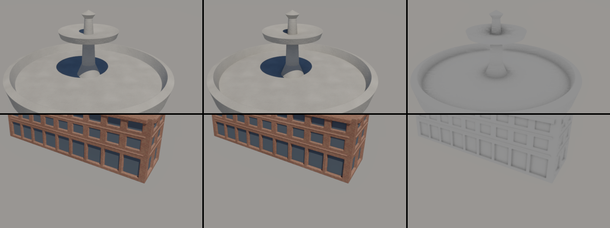

**Stability.** The noise that places the samples changes every frame, and TAA averages it.
XeGTAO's noise repeats every 64 frames, which is 8 cycles of TAA's jitter, so TAA's history
drifted between patterns. Repeating the noise with the jitter (every 8 frames) fixes that.
On the static south view, pixels changing by more than two levels:

| | frame 300 → 301 | frame 300 → 332 (same jitter) |
|---|---|---|
| without AO | 1.55 % | 0.09 % |
| AO, XeGTAO's 64-frame noise | 1.61 % | 0.24 % |
| AO, the noise on the jitter's 8 frames | 1.60 % | 0.10 % |

A second denoise pass changed neither figure (1.59 % and 0.10 %) and cost 0.04 ms at 1440p,
so there is one.

**Cost** (RTX 5070 Ti):

| | without | with | the passes |
|---|---|---|---|
| the south view, 1600×900 | 1.683 ms | 1.852 ms | chain 0.026, gtao 0.084, denoise 0.019 |
| the flight at 1440p | 2.204 ms | 2.456 ms | chain 0.046, gtao 0.156, denoise 0.048 |

**Checks:**
- With `--no-ao`, the city's three captures are identical to the previous build.
- The ballad and the bench are identical (0 pixels), and mesh against fallback is at 0 with
  AO on (the occlusion reads only the depth, the same on both paths).
- Synchronization validation is silent, with the occlusion view too.

## Sky light (issue #47, 2026-09-25)

The shaded sides were lit by the ballad's model for space: a constant wrap and a bluish fill,
1–3 % of the sun, the same in every direction. Now they take the light the sky and the ground
send them.
- **`sky/irradiance`** projects the sky-view table (sky and sunlit ground, per unit of the
  sun's illuminance) onto nine spherical-harmonic coefficients, convolved with the clamped
  cosine (Ramamoorthi and Hanrahan 2001). One workgroup sums 4096 directions and reduces them
  in a fixed order, so the result is the same on every run.
- **The resolve** adds that irradiance for the pixel's normal to the sun's light, on every
  class of material. The ballad and the bench, which have no sky, keep the constant fill.

What a surface receives, per unit of the sun's illuminance above the air (logged at frame 30):

| sun | roof | wall facing the sun | wall facing away | floor (the ground's bounce) | the sun on a roof |
|---|---|---|---|---|---|
| 63° (default) | 0.075 | 0.204 | 0.195 | 0.286 | 0.772 |
| 20° | 0.051 | 0.105 | 0.090 | 0.096 | 0.235 |

The sky alone gives a roof 0.075 of the sun, about 10 klux, as a clear sky does. Most of a
wall's light comes up from the planet's sunlit ground (albedo 0.3). Nothing occludes it yet:
a wall at the foot of a tower gets the same light as one in the open, except for what the
ambient occlusion of #48 (above) takes away.

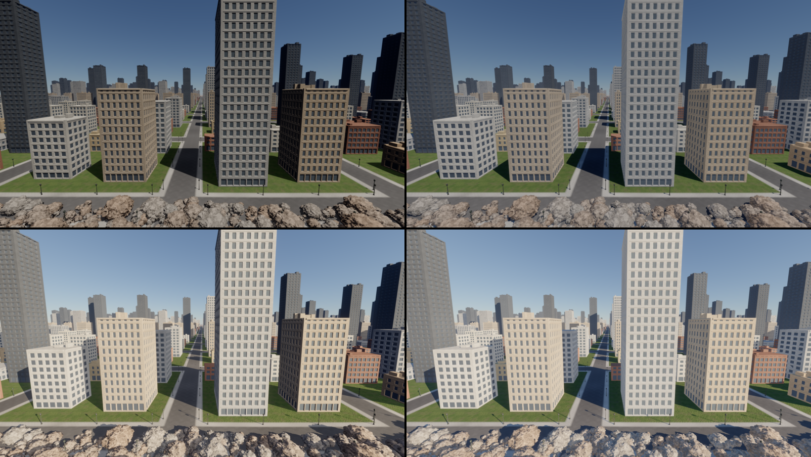

**Cost:** `sky/irradiance` takes 0.016 ms, its single group's latency, and shading does not
change. The south view goes 1.660 → 1.677 ms, the 1440p flight 2.192 → 2.200 ms.

**Checks:**
- With `--no-sky-light`, the city's three captures are identical to the previous build.
- The ballad and the bench are identical (0 pixels), and mesh against fallback is at 0 in
  the city too.
- Synchronization validation is silent.

## Shadows (issue #45, 2026-09-25)

The sun casts ray-traced shadows (D-008's first tier, D-029): the buildings over the streets,
the lamp posts on the sidewalks, the rocks on each other.
- **The structures, built once at start-up:** one bottom-level structure per prop, from a cut
  of its cluster DAG that fits 40 000 triangles (600 000 for the terrain); one top-level
  structure over the million placed instances, its records written from the instance table
  on the GPU. The BLASes take 58 ms, the TLAS 12 ms, 278 MiB in all.
- **The rays:** the resolve traces one shadow ray per sun-facing pixel (a ray query, the first
  hit ends it).
- **Options:** `--no-shadows` or **J** draws without. Devices without ray queries have none.

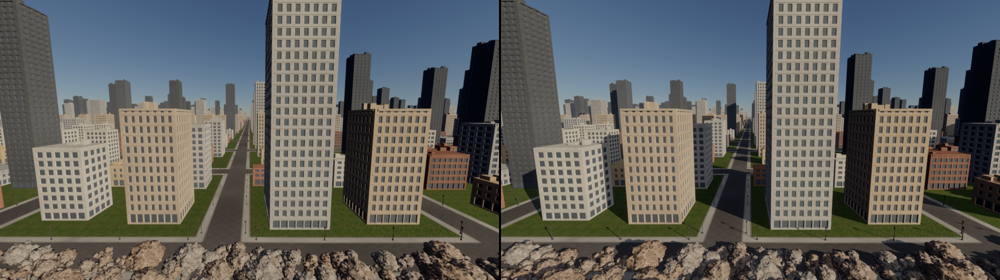

| RTX 5070 Ti | without shadows | with shadows |
|---|---|---|
| the south edge, 1600×900 | 1.591 ms | 1.660 ms (standard 0.094 → 0.136, layered 0.030 → 0.040) |
| the flight at 1440p | 2.023 ms | 2.192 ms (standard 0.203 → 0.326, layered 0.041 → 0.057) |

## The sky (issue #43, 2026-09-25)

The city stands on the surface of an Earth-sized planet under the ballad's atmosphere
(Hillaire 2020, D-023). The flat background is gone; three passes a frame replace it:
- **`sky/sky-view table`**, 192 × 108 directions around the camera;
- **`sky/aerial perspective`**, a 32 × 32 × 32 volume to 8 km;
- **`sky/compose`**, the sky and the sun's disc behind the city and the haze of distance
  over it.

The sunlight on the city is the sun seen through the air: warm and dimmer at a low sun.
`--sun-elevation` sets it.

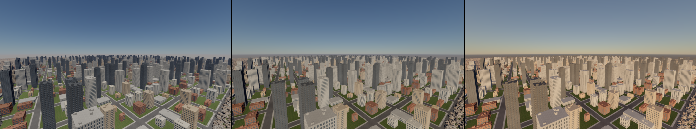

```
city-blocks --stream-pool 0 --orbit --frames 241 --capture sky.png --capture-frame 240 --sun-elevation 20 --ev100 14.5
```

**Cost:**
- at 1600×900 the three passes cost 0.014 + 0.011 + 0.024 ms (the south view 1.491 → 1.541 ms);
- at 1440p the compose takes 0.055 ms (the flight 1.868 → 1.938 ms).

The sun's disc is clamped below fp16's range once pre-exposed. Bloom (issue #44, 4 %, **B**) spreads it
into its surroundings: 0.043 ms at 1600×900, 0.078 ms at 1440p (the flight 1.938 → 2.023 ms).

## Materials (issue #20, 2026-09-25)

Every prop is made of a row of the material table (D-007, D-026) instead of the ballad's rock
and ice. Each mesh names its row, and every instance of it mixes the row's two colours by its
own hash:

| Prop | Material |
|---|---|
| terrain | grass |
| house-narrow, terrace | red brick |
| corner-block, school | brown brick |
| house-wide | ochre plaster |
| apartments, clinic | cream plaster |
| hotel | sandstone |
| office, warehouse, tower-wide | concrete |
| tower-slim | dark glass (a sharper highlight) |
| boulders, rubble | rock |
| column | marble |
| fountain | stone |
| lamp post | painted metal |

**Textures.** The textures are procedural: rock, concrete, brick and grass, albedo and normal
maps, 512 × 512 with their mips. They are generated in parallel at start-up in 140 ms and
take 10.7 MiB. Cluster pages hold no texture coordinates, so the textures are projected along
each object's axes (triplanar) and sampled with the derivatives the visibility resolve
reconstructs. A value noise over several repeats varies their brightness, so the grass does
not show its 12 m tile. The texture level of detail is checked against a fragment shader's
in `docs/demos/meshlets.md` ("Textures and the mip check").

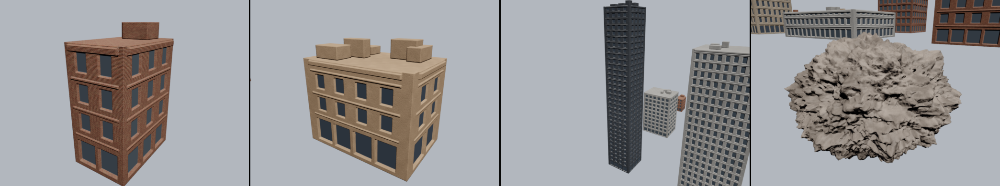

**What it costs** (RTX 5070 Ti):

| View | Shading before (one untextured pass) | `shading/standard` | GPU per frame |
|---|---|---|---|
| the south edge, 1600×900 | 0.052 ms | 0.099 ms | 1.257 → 1.249 ms |
| the flight at 1440p, TAA | 0.090 ms | 0.215 ms | 1.652 → 1.788 ms |
| the same with glass windows (#41) | | 0.215 ms | 1.830 ms |
| the south edge with glass windows (#41) | | 0.100 ms | 1.465 ms (the culls 0.36 + 0.38) |
| the south edge with streets (#42) | | 0.091 + layered 0.030 ms | 1.491 ms |
| the flight at 1440p with streets (#42) | | 0.206 + layered 0.05 ms | 1.868 ms |

The flight's frame stays under 1.8 ms against the 8.33 ms of the 120 fps target.

**Windows (issue #41, D-027).** A building has two material sections: its facade, and its
window panes, the flat backs of the recesses. Each facade row in the table is followed by
the row its windows take: dark, bluish, a sharp highlight. The sections go through the cook:
- vertices on their borders are split;
- the simplifier may cross a border, but pays half a metre of error to do so, so windows
  keep their glass until they are a few pixels wide;
- a cluster holds up to two sections, its triangles sorted by section.

The buildings cook to 3–4 % more clusters. The south view draws 58 k clusters and 3.72 M
triangles instead of 50 k and 3.43 M.

**Streets (issue #42, D-028).** The terrain's row is a layered one: a layer map, a byte per
square metre, generated from the city's grid (45 ms), picks per texel among the rows after
it:
- asphalt down the streets, sidewalks 3.5 m wide along them;
- paving around the plaza crossings, grass on the lots;
- rock where the hills rise steeply.

The layered pass blends the two heaviest layers around each pixel. It costs 0.031 ms on the
south view.

## The flight (issue #13, 2026-09-25)

The closing measurement of Phase 1: the city flown at 300 m/s with streaming on, at 1440p,
through TAA.

```
cargo run --release -p city-blocks -- --width 2560 --height 1440 --fly
```

| 2560 × 1440, RTX 5070 Ti, LOD 1 px, TAA, streamed through 512 MiB | GPU per frame | frame p50 / p99 / worst |
|---|---|---|
| **the flight at 300 m/s** (a 29 s lap, 20 000 frames) | **1.64 ms** | 1.65 / 2.04 / **2.58 ms** |
| the south edge | 1.58 ms | 1.56 / 1.96 / 2.37 ms |
| the orbit (the whole city from 1.5 km) | 2.19 ms | 2.18 / 2.65 / 6.66 ms |
| the flight through the indirect-count fallback (`--force-fallback`) | 2.33 ms | 2.37 / 2.88 / 6.04 ms |

- **The target was 120 fps (8.33 ms).** The flight's worst frame is 2.58 ms and its median
  frame is five times inside the budget. The frames are unthrottled (MAILBOX) and the
  GPU sets them: the CPU works 0.25 ms of each.
- **The flight streams little.** 540–720 pages are resident, 0–1.6 are uploaded a frame in
  real time, and nothing waits (the counters under "Streaming" above).
- **TAA** costs 0.15 ms at 1440p (motion vectors 0.02, resolve 0.13). It is on by default:
  at 300 m/s the window grids and rock fields shimmer without it (**T**, `--no-taa`).
- **Where the time goes** in the flight (F1 overlay below):
  - the culls 0.72 ms (instance 0.32, clusters 0.19 + 0.20);
  - hardware and software raster 0.57;
  - resolve 0.09 and TAA 0.15.
- **The RTX 3080** half of the target (60 fps at 1440p) waits for a run on the server PC
  (#39).

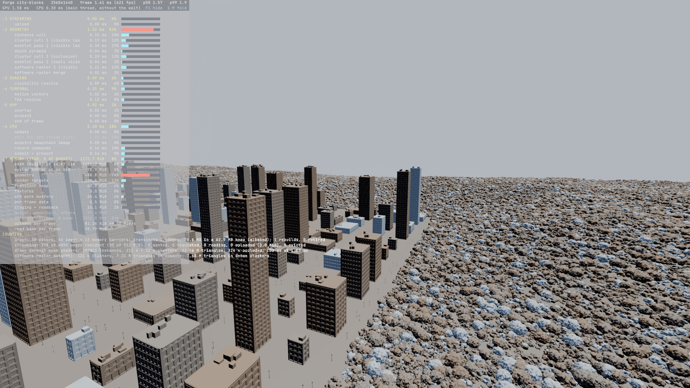

**Golden captures** (1600 × 900, every page resident, so that a capture does not depend on
the I/O's timing; re-taken with the materials, glass, streets, sky, bloom and shadows of #20 to #45). Two runs of each are identical to
the pixel.

| The south edge, frame 60 | The orbit, frame 240 |
|---|---|
| 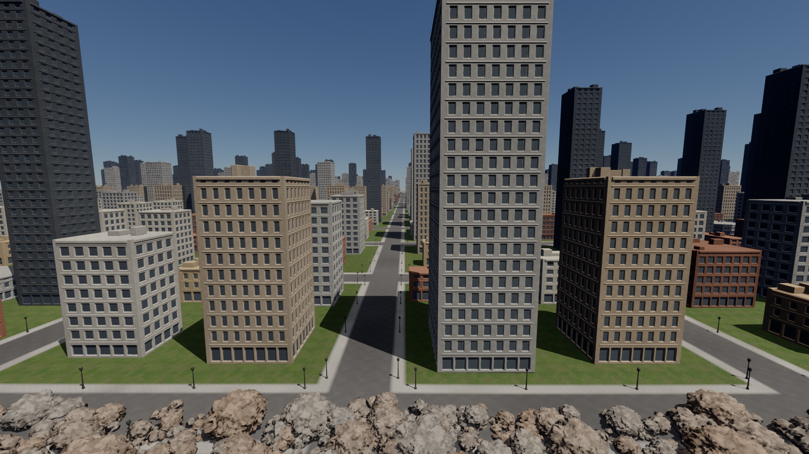 | 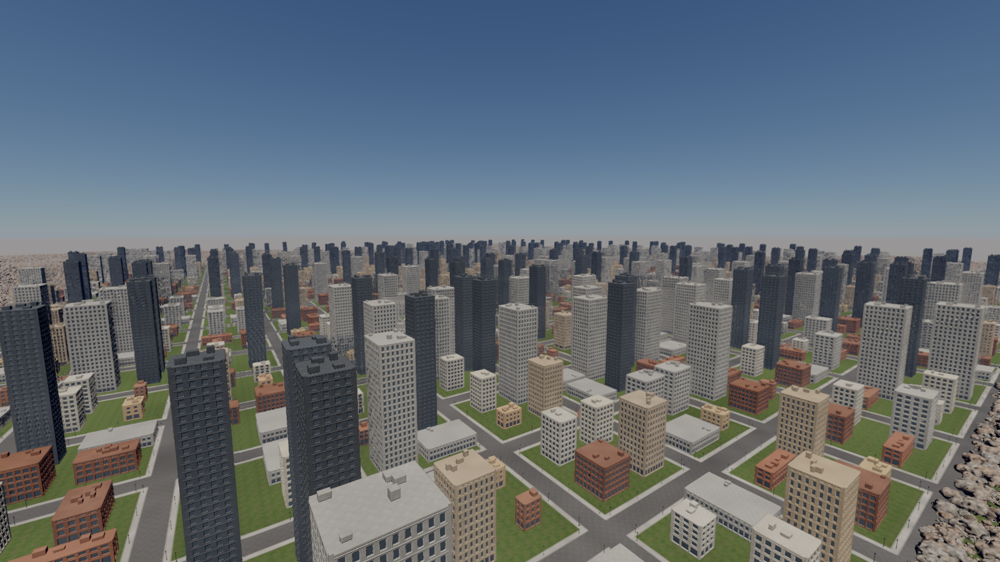 |
| **The flight, frame 600** (`--fly --fixed-step`) | **The gallery, frame 60** (`--gallery`) |
| 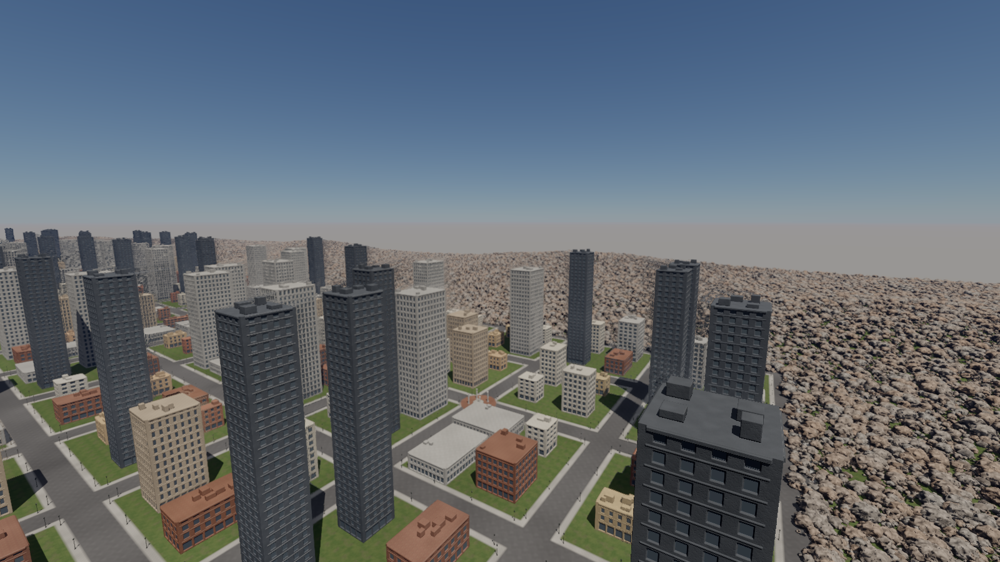 | 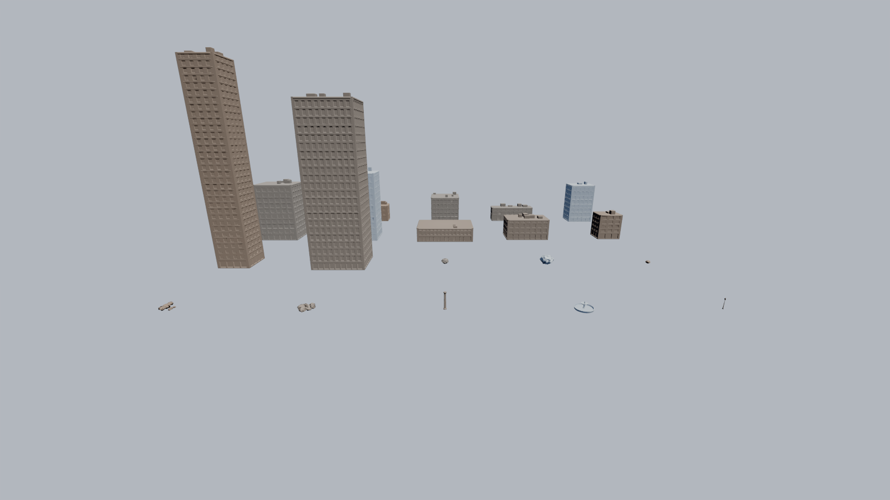 |

```
city-blocks --stream-pool 0 --frames 61 --capture south.png --capture-frame 60
city-blocks --stream-pool 0 --orbit --frames 241 --capture orbit.png --capture-frame 240
city-blocks --stream-pool 0 --fly --fixed-step --frames 601 --capture flight.png --capture-frame 600
city-blocks --gallery --frames 61 --capture gallery.png --capture-frame 60
```

**What a starved pool looks like.** The same flight frame with every page resident, then
through a 16 MiB pool: too small for the cut, so the distant buildings stand as their
coarse root boxes. The surfaces lose their detail but stay whole (the third panel shows
the pixels that differ):

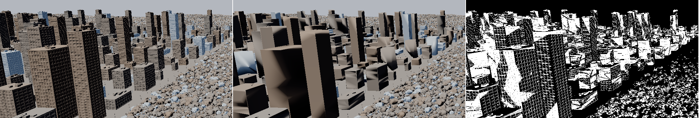

## The city (issue #35, 2026-09-24)

**The ground** is one mesh through the same DAG and cache as the props:
- 4 km across, a sample every 2 m: **8 M triangles**, 186 k clusters, 14 levels;
- flat in a 2.4 km city square, rising over 300 m into fractal hills of up to 90 m;
- a single mesh has no tile borders, so it cannot crack;
- the mesh's outer edge is locked like a group border, which leaves 173 roots along it;
- cooking takes 12 s once, loading 0.85 s with the props.

**A compute pass places the instances** (`forge_render::placement`, `place_main`), once
before the first frame. A thread per slot writes its instance from the seed and the slot's
index alone. The slots come in category ranges:
- **buildings:** four per block of a 24 × 24 grid of 100 m blocks with 20 m streets,
  chosen and turned by `pcg4d`: 2 304;
- **lamp posts:** every 25 m along both sides of every street: 9 600;
- **plazas:** a fountain and four columns on every fourth crossing: 36 plazas, 180 props;
- **rocks and rubble:** everything else, 987 916 of them, uniform over the hills around the
  city, any turn, a slight tilt, 0.5–1.6× scale, sunk a little.

Every prop stands on the ground height interpolated between the terrain's samples: the
terrain mesh's own vertices, which cooking keeps in grid order.

**Determinism and cost.**
- The CPU mirrors only the mesh choice (the same `pcg4d`), for the scene's per-mesh counts.
- After the pass the table (96 MB) is read back once: its FNV-1a checksum goes to the log
  (`ed6454c65dd1e823` on every run and on both paths so far), and its meshes are checked
  against the mirror.
- Two runs capture the same frame to the pixel.
- The pass takes 3–6 ms once its shader is compiled (384 ms on the first run, compilation
  included).

| The city, from the south edge (1600×900, LOD 1 px) | |
|---|---|
| instances | 1 000 001 (644 G triangles, 15.4 G clusters if all drawn at full detail) |
| drawn | 500 k instances in view; the culls test 28 k work items and 791 k roots; 48 k clusters, 3.32 M triangles drawn (13 k clusters in software: auto mode, far rocks) |
| GPU per frame | **1.05 ms** with every page resident (4.90 before #37): instance cull 0.31, cluster culls 0.23 + 0.23, meshlet pass 1 0.16, resolve 0.05, software raster and merge 0.03, depth pyramid 0.02; **1.12 ms** streamed (below) |
| CPU per frame | 0.25 ms of work (record 0.09, submit + present 0.16), the rest waiting for the GPU |
| memory | every page resident: 1.25 GiB allocated, geometry 1 160 MiB (983 of pages, 89 of cluster records, the instance table 96), work buffers 84; streamed through the default 512 MiB pool, geometry 689 MiB |
| start-up | 13.3 s the first time (the terrain's cook), 0.85 s from the cache |

The orbit (`--orbit`) views the whole city from 1.5 km out at 160 m: 1.52 ms.

**Culling at a million instances (issue #37).** Before, the culls were the frame: 4.1 of
its 4.9 ms went to 526 k work items of 32 clusters for the 500 k instances in view. Most
were far rocks down to their last cluster, with 31 idle lanes. Now an instance whose roots
alone are the cut lists those roots instead, and the cluster culls take them 32 to an item.
- **What changed:** 4.90 → 1.06 ms here, 5.50 → 1.52 ms for the orbit, and the same
  pixels.
- **How:** `docs/demos/meshlets.md`, "Far instances without work items".
- **What is left:** 791 k roots are tested for 48 k drawn clusters, the rest hidden by the
  hills and the buildings. Instance occlusion and a hierarchy over instances are #38.

The flight at 300 m/s, 1440p and the closing numbers (#13) come next.

## Streaming (issue #36, 2026-09-25)

The city's geometry no longer has to fit in VRAM. Every mesh is cut into **128 KiB pages
of clusters** (7 868 for the city, 983 MiB), which stay in the cache files. The GPU keeps a
**pool of page slots** and a page table, and the cut through the LOD DAG follows whatever
is resident. How it works is in [D-025](../DECISIONS.md) and `forge_render::streaming`:
- **Pages:** a cluster's own 16-byte vertices and its triangles; a DAG group never spans
  two pages; the roots' pages always resident.
- **The cut:** a cluster draws when its page is resident, its parent is too coarse, and it
  is fine enough or its children's page is absent. What is missing costs detail, never a
  piece of surface.
- **The loop:** the culls write each page's need (pixels of error it takes away); an I/O
  thread reads the neediest absent pages; a `streaming/upload` pass copies up to 64 a
  frame into free slots or over the least-needed leaves of the resident set.

The overlay (F1) has the group `streaming` (the upload pass) and a counter line: pages
resident, wanted, requested, reading, uploaded and evicted this frame.

| streamed (1600×900, LOD 1 px) | pool | resident | GPU per frame | geometry |
|---|---|---|---|---|
| every page resident (`--stream-pool 0`) | — | 7 868 pages | 1.05 ms | 1 160 MiB |
| the south edge, default | 512 MiB | 395 pages (49 MiB), settled after 39 frames (44 ms) from the roots alone | 1.12 ms | 689 MiB |
| the orbit | 512 MiB | 620 pages | 1.56 ms | 689 MiB |
| the flight at 300 m/s (`--fly`) | 512 MiB | 540–640 pages | 1.18 ms | 689 MiB |
| the same flight | 48 MiB | 384 of 384 slots, 0–1.6 pages uploaded a frame at 60 Hz | 1.18 ms | 225 MiB |

- **What streaming costs.** The streamed cull runs 0.26 ms a pass against 0.23. Coarser
  levels stay in the LOD window, since they may have to stand in for absent children, and
  every cluster checks its pages. It is a separate pipeline, so a resident scene does not
  carry that code. The CPU spends about 0.03 ms a frame on residency: needs for 7 868
  pages, placements, requests.
- **No holes.** `imgdiff --background-at` counts the pixels that show the sky in one image
  but not in the other, and those inside the other image's surfaces. Flight frames 300 and
  900 (`--fixed-step`, so about 16 times faster than real time against the streamer's
  clock) give these results:
  - 512 and 48 MiB pools: 0 pixels apart from the resident frames.
  - 24 and 16 MiB pools, too small for the cut: about 30 % of pixels differ. The distant
    buildings are drawn as their coarse root boxes, and 17–41 sky pixels appear where the
    resident image had rooftop units and window reveals on the skyline. None show through
    a surface.
- **Captures.** With every page resident, the city and every other demo draw the same
  pixels as the paged format did before streaming. A streamed capture can differ by a few
  hundred pixels (the orbit at frame 120: 466), all one LOD level coarser where a page
  arrived a frame late. The golden captures of the city therefore use `--stream-pool 0`.
- **Auto software raster.** A streamed start is coarse, so the dense-triangle count stays
  under the auto mode's switch-on threshold and the static view stays in hardware
  (0.20 ms against 0.16 + 0.03).

## The props (issue #34, 2026-09-24)

`forge_geom::city` generates twenty props: ten buildings, two towers, three boulders, two
rubble piles, and a column, a fountain and a lamp post turned on a lathe. Together they hold
**25.8 M triangles in 612 k clusters** (both at full detail).

- **Buildings.** A building is a closed box whose faces are dense grids, 7 to 11 cm per
  cell, cut to the triangle target. The grids are displaced along the face normal into a
  facade:
  - flush corner pilasters and a plinth;
  - shop fronts on the ground floor;
  - a ledge at every floor line;
  - recessed windows with bevelled reveals in regular bays;
  - a cornice under the roof line.

  The face edges never move, so the box stays closed (a test checks every edge has its
  twin). Boxy units on the roof are placed from the building's seed.
- **Boulders and rubble.** The asteroid generator, flattened and sunk into the ground.
- **Lathed props.** A profile polyline resampled evenly and revolved, with optional
  flutes. Where the profile meets the axis there is one vertex and a fan of triangles: a
  ring of copies there made degenerate triangles, which stalled the simplifier and left
  the column and the fountain with 25 and 35 roots.

**Cooking with the normals.** With geometric error alone, the coarse levels of a facade
dropped its windows while they were still several pixels wide. A recess is 25 cm deep, and
that is all the error the simplifier saw. The vertices left behind kept normals that no
longer matched the surface, so the facades smeared at a distance. Hard-surface props
therefore add their normals to the simplification error (`CookOptions::normal_weight`):
- buildings count a 90° turn of the normal like about a metre;
- lathes count half that;
- rocks count geometry alone, like the ballad's asteroids.

At 1 px, the gallery's LOD view and its full-detail view now differ by 1 % of their pixels,
all of them sub-pixel window edges.

| prop | triangles | clusters | levels | roots | fill | cook ms | cached ms | file MB |
|---|---|---|---|---|---|---|---|---|
| house-narrow | 517 k | 12 096 | 14 | 2 | 0.69 | 890 | 9 | 15.7 |
| house-wide | 632 k | 14 778 | 14 | 2 | 0.69 | 1 055 | 14 | 19.2 |
| corner-block | 1 219 k | 28 584 | 15 | 2 | 0.69 | 2 043 | 35 | 36.9 |
| terrace | 828 k | 19 331 | 16 | 2 | 0.69 | 1 640 | 27 | 25.1 |
| apartments | 1 515 k | 35 549 | 15 | 1 | 0.69 | 2 887 | 32 | 45.9 |
| office | 2 032 k | 47 570 | 15 | 3 | 0.69 | 3 975 | 44 | 61.6 |
| hotel | 2 225 k | 52 203 | 16 | 2 | 0.69 | 4 449 | 48 | 67.5 |
| warehouse | 1 005 k | 23 431 | 14 | 2 | 0.69 | 1 930 | 31 | 30.4 |
| school | 926 k | 21 649 | 14 | 3 | 0.69 | 1 807 | 29 | 28.0 |
| clinic | 614 k | 14 370 | 14 | 2 | 0.69 | 1 014 | 15 | 18.6 |
| tower-slim | 2 832 k | 66 410 | 16 | 2 | 0.69 | 5 444 | 79 | 85.9 |
| tower-wide | 3 021 k | 70 975 | 16 | 2 | 0.69 | 5 771 | 88 | 91.6 |
| boulder-1 | 529 k | 12 638 | 14 | 1 | 0.67 | 1 043 | 15 | 16.1 |
| boulder-2 | 750 k | 17 887 | 14 | 1 | 0.68 | 1 386 | 21 | 22.8 |
| boulder-3 | 504 k | 12 020 | 13 | 1 | 0.68 | 812 | 14 | 15.4 |
| rubble-1 | 560 k | 13 337 | 16 | 3 | 0.68 | 873 | 15 | 17.0 |
| rubble-2 | 871 k | 20 792 | 16 | 2 | 0.68 | 1 422 | 21 | 26.5 |
| column | 1 839 k | 44 750 | 15 | 1 | 0.66 | 3 130 | 53 | 56.3 |
| fountain | 2 794 k | 68 656 | 16 | 1 | 0.66 | 4 530 | 76 | 85.8 |
| lamp-post | 612 k | 15 143 | 14 | 1 | 0.65 | 950 | 12 | 18.8 |

Reading the table:
- **Roots** are clusters no coarser level replaces: 1 when the DAG simplified the prop down
  to a single cluster; 2–3 when a group stalled near the top, usually one per disconnected
  part.
- **Fill** is the mean triangles per cluster over the maximum of 124: meshoptimizer's
  64-vertex limit keeps clusters near 85 triangles.
- **Cooking** takes 47 s of CPU, **9.2 s** on the job system. Before issue #34's DAG fix
  (`docs/demos/meshlets.md`, "Cooking a DAG in seconds"), the 3 M-triangle props alone would
  have taken over eight minutes each.
- **From the cache**, the twenty load in **0.54 s** (0.70 s of CPU, about 1.4 GB/s).

**The cache.**
- **Location:** `mesh-cache/<name>-<key>.fmesh`, git-ignored, 749 MB for the set.
- **Key:** a hash of the prop's parameters, its cook options and `COOK_VERSION`.
- **Contents:** a small header, then the cooked arrays as they lie in memory.
- **Writing:** into a temporary file, renamed into place. A new cook removes that prop's
  files under older keys.
- **Mismatches:** a file whose key, version or size does not match is cooked again.

Since #36 the cache holds cluster pages: the header and the cluster records, then the
pages from a 4 KiB boundary, read one at a time by the streamer. It is still the demo's
cache, not the engine's asset format: D-018's container and compressed vertices come later.

**GPU:**
- The gallery overview draws in **0.12 ms** at 1 px LOD, against 0.71 ms at full detail
  (`--no-lod`).
- Close-ups (`--focus corner-block`, `--focus fountain`) take 0.12–0.13 ms.
- 749 MiB of geometry in VRAM.

**Materials.** The props are shaded with the ballad's rock shading: per-instance tints, and
a fifth of the instances icy blue, which is why the fountain looks frozen. Materials come
with #20.
