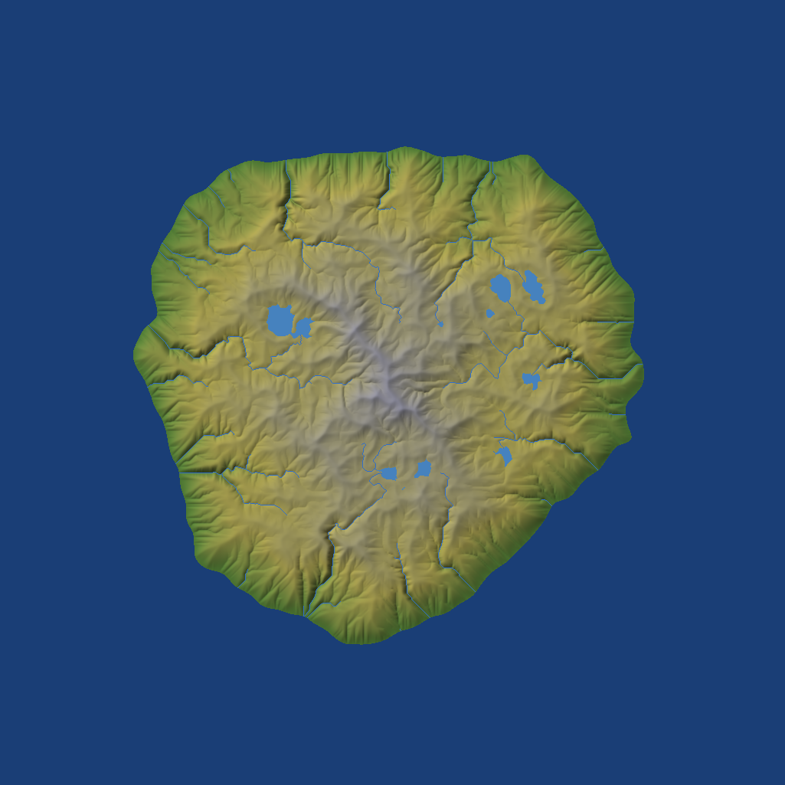
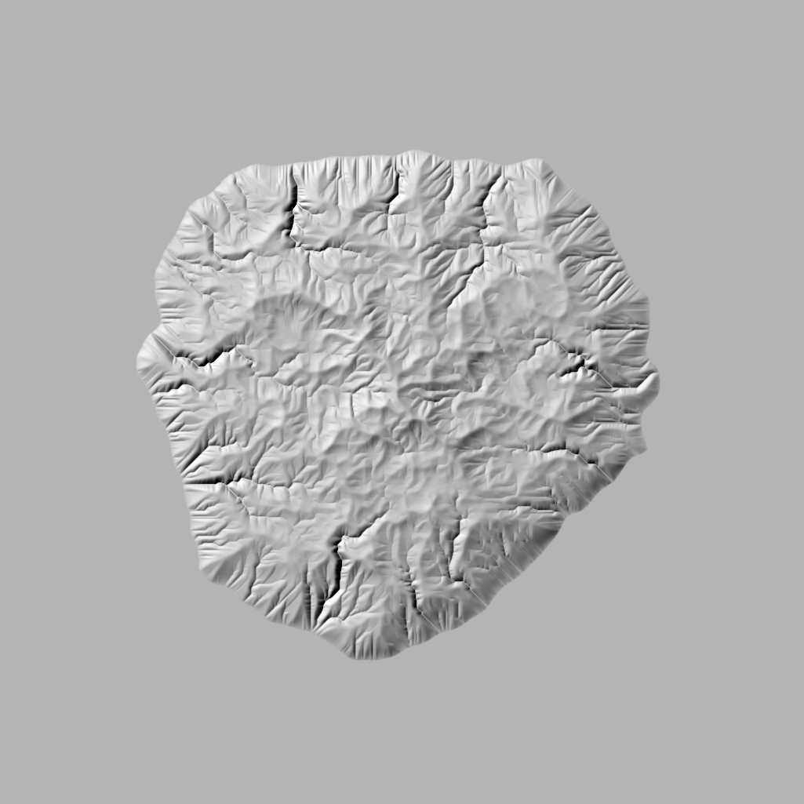

# Demo: island

Phase 2's demo (`docs/ROADMAP.md`): a 16 km island generated from a seed, later
orbit-to-ground on the planet variant, and the first step of rebuilding tropical-island (#81).
It is built in steps; the first, the terrain's genesis on the CPU, started on 2026-09-26 in a
cloud session, following `docs/research/terrain-genesis.md` ("Recommendation for Forge").

| Step | State |
|---|---|
| The island's mask, uplift, hardness and rain fields (stages 1–2) | ✅ `forge_procgen::island` |
| D8 drainage, the downstream-first stack, integer areas; depressions by the basin graph each step, by priority flood for the reference and the lakes | ✅ `forge_procgen::flow` |
| The implicit stream-power erosion with diffusion, rows and drainage trees in parallel on the job system; lakes as filling depressions (stage 3) | ✅ `forge_procgen::erosion` |
| PNG previews: height, hillshade, flow, the overview with sea, rivers and lakes | ✅ `forge_procgen::preview`, `tools/genesis` |
| Hydrology: rivers as polylines with Strahler orders and widths, lakes with levels and outlets (stage 4) | ✅ `forge_procgen::hydrology` |
| The water's fields: the signed coast distance; the sea's directional spectrum (JONSWAP/TMA, Horvath's spreading) synthesised by an inverse FFT on the CPU into a tiling patch of heights, displacements, slopes and the Jacobian | ✅ `forge_procgen::coast`, `forge_procgen::ocean`; the first step of `docs/research/water.md`'s plan, the GPU's cascades to be diffed against it |
| Amplification to 2 m per tile with halos (stage 5) | planned |
| Materials from the fields, the layer map (stage 6) | planned |
| The hand-off to the cluster-DAG cook: the island drawn by today's renderer (stage 7) | built, to see on a GPU: `city-blocks --island SEED` (#96 for the props and the demo of its own) |
| The planet: the same stages on the cube sphere's coarse graph, tiles amplified at streaming time | planned |

```
cargo run --release -p genesis -- --spacing 16 --steps 150 --out captures/island
cargo run --release -p city-blocks -- --island 7
```

`genesis`: `--seed N`, `--spacing M` (16: 1025² samples; 4: the 4097² target), `--steps N`,
`--k` (erodibility), `--diffusion`, `--uplift` (metres per step at the heart), `--every N` (a
hillshade every N steps), `--threads N` (workers besides the main thread; the default is one
per hardware thread, `0` is serial, the result is the same). It prints each stage's time, the
erosion step's breakdown, and writes `uplift.png`, `height.png` (16-bit), `hillshade.png`,
`flow.png` (log drainage) and `overview.png`.

`city-blocks --island SEED` draws the island in the engine (stage 7, written in the cloud
and not yet seen on a GPU): the heightfield (`--island-spacing`, 8 m by default: 2049²,
8.4 M triangles like the city's ground; 4 m for the 4097² target, 33.5 M) is generated once
into `mesh-cache/island-<key>.f32`, cooked into a cluster DAG through the same path as the
city's terrain (`PropKind::Heightfield`, `forge_geom::city::heightfield_mesh`) and cached, and
drawn as the scene's one instance on the ground's layered material, rock where the ground is
steeper than 0.45 or higher than 380 m and grass elsewhere (`forge_procgen::slope_layers`, a
texel every 4 m), under the city's sky, with the sun's shadows, the probes and TAA. The camera
starts over the sea south of the island, looking north at its coast; `--view` and the usual
keys apply, `--origin` too. The first start costs the erosion (13 s at 8 m on four cores) and
the cook (about the city's 13 s); the next ones load both.

## The genesis, on the CPU (2026-09-26)

Every stage is a pure function of the seed and a parameter record, deterministic on every
machine (D-016): the noise is gradient noise on an integer lattice hashed with `pcg3d`, with
eight fixed gradient directions so a sample needs no transcendental; the drainage area is an
integer count; the D8 tie-break and the flood's queue order are pinned; the heavy arithmetic
is `f32` and `f64` with `sqrt` only.

1. **Mask** (`island`): a distance-to-centre shape warped by four octaves of noise, land where
   it is positive; the domain's edge stays sea, since it is the outlet.
2. **Uplift**: zero at the coast, rising inland as the square root of the shape, times ridged
   noise (a 3 km period, four octaves) so the mountains have crests; 4 m per step at the heart.
   Hardness, a factor on the erodibility, in 1.8 km patches; rain flat for now.
3. **Erosion** (`erosion::step`, 150 times): the uplift is added; the water is routed
   (`flow::drain`: D8 receivers on the raw field, Braun & Willett 2013; every pit's basin
   labelled, the lowest pass between adjacent basins, the spanning tree of the passes from the
   sea, and each pit's path to its pass reversed so its water leaves through it, the basin
   graph of Cordonnier, Bovy & Braun 2019 in carve mode; then the downstream-first stack and
   integer areas); each land cell then lowers towards its receiver by `f / (1 + f)` of the
   difference with `f = K · √(A · rain) / Δx` (the implicit stream-power update with `n = 1`,
   `m = 0.5`, unconditionally stable), the receiver already at its new height; an explicit
   diffusion sweep smooths the hillslopes. The height keeps its depressions: a cell below its
   receiver rises towards it by the same rule, which is sediment settling in a lake, so lakes
   appear in the uplifted basins and slowly fill, from the carved outlet path outwards.
4. **Hydrology**: rivers where more than 0.5 km² drains through a sample, traced as
   polylines (`hydrology::trace_rivers`): from every mouth the trunk follows the largest
   tributary upstream to its head, every other river donor met on the way starts a tributary,
   so each river runs from a head to the sea or to its junction with a larger one; Strahler
   orders bottom-up, widths `w = 0.005 √A` (Leopold & Maddock's exponent: 5 m at a square
   kilometre of catchment, 14 m at the island's largest). Lakes (`hydrology::trace_lakes`)
   where a final priority flood (Barnes 2014, once) stands more than 0.5 m over the eroded
   field: each 4-connected patch with the flood's level there, its deepest point and its
   outlet (the lake cell draining out lowest), which is what the water plan's lake planes
   need (polygon, level, outlet).

| Run (seed 7, 150 steps) | Samples | Erosion | Per step | Was (flood, one thread) | Peaks | River samples | Lake samples |
|---|---|---|---|---|---|---|---|
| `--spacing 16` | 1025² | 3.1 s | 0.021 s | 0.13 s | 530 m | 3 657 | 4 387 |
| `--spacing 8` | 2049² | 13 s | 0.087 s | 0.66 s | — | 7 336 | 62 819 |
| `--spacing 4` (the target) | 4097² | 50 s | 0.331 s | 3.13 s | 545 m | 14 809 | 181 377 |

In the cloud container, four cores (the owner's 9800X3D has eight, faster); the 4 m run's
stages 1–2 take 5.4 s, the hydrology 3.0 s, the previews 1.1 s, the whole run one minute. The
8 m row is a 20-step timing run (its counts are after 20 steps).

**Where the time goes** (#97). Before, the priority flood was 89 % of a step: a heap over
every cell, `n log n` with a large constant. Three changes, each measured at 4 m:

1. *The basin graph* (`flow::drain`): linear work on the raw D8 receivers, the depressions
   alone cost anything (523 pits at 8 m; the passes are kept per row, the lowest per basin
   pair, then sorted once); the D8 receivers, the passes, the uplift, the diffusion and the
   implicit update (the stack's segments, whole drainage trees each) on `forge-task`: 3.13 s
   to 0.85 s a step.
2. *The stack in parallel* (`Drainage::build`): the donor lists counted and filled by row
   bands (a receiver is a neighbour, so a band writes one row past itself; the even bands run
   together, then the odd ones, and the lists come out in the sequential order), a parallel
   prefix sum, the trees below each band's outlets walked into a part of their own, the parts
   concatenated with each cell's position stored through atomics, the areas per segment:
   0.85 s to 0.73 s.
3. *Buffers kept across steps* (`Drainage`, `Erosion`): a step touches a dozen arrays of
   67 MB at 4097²; paging fresh ones in each step cost more than the work on them (the
   position copy alone was 53 ms, the area gather 50 ms, the fill copy 54 ms): 0.73 s to
   0.33 s.

A step at 4 m is now `uplift 0.004, drain 0.270, incise 0.042, diffuse 0.014` seconds. What
remains sequential in the drain: labelling the basins (a walk to each cell's root, about
0.1 s), the pass sort and Kruskal (about 0.05 s), the prefix over the parts; the rest is
parallel but memory-bound on four cores. `--threads 0` at 16 m gives 0.055 s a step against
0.021 with four workers. The result is the same bytes with any thread count and with kept or
fresh buffers (tests run the drainage and the erosion with none and with three workers, and
reuse a drainage across two fields). The carve changes the field slightly against the flood's
routing (water leaves a lake by one path rather than over the whole flooded flat), so the
counts above differ from the first runs' (3 487 river and 2 774 lake samples at 16 m); the
pictures below are from the new field. At 4 m the lakes cover 3.5 % of the land samples
(181 k of 5.2 M) against 1.4 % at 16 m: the finer grid holds more small depressions, which the
sediment rule fills more slowly; a lake area limit, or the basin graph's fill mode with a
spill rule, is the part of #97 that remains.

**The network** (seed 7, 150 steps): at 16 m, 43 rivers, 27 of them to the sea, 68 km in all,
the longest 6.3 km, orders up to 3; at 4 m, 42 rivers, 24 to the sea, 82 km, the longest
7.5 km, orders up to 2 (the same square kilometres of catchment are more cells, and the finer
network branches differently), the widest 14 m at both; the tracing takes 0.7 s at 4 m. These
polylines are what the water research (`docs/research/water.md`, item 3 of its
recommendation) turns into river ribbons with flow maps. The lakes: 11 at 16 m, the largest
41.5 ha, the deepest 19.7 m; 2 614 at 4 m, the largest 52.2 ha, the deepest 30.9 m (the finer grid's many small depressions, #97's
open lake rule).

**The water's fields** (`genesis`, its `stage 5` line; `coast.png`, `sea-height.png`,
`sea-hillshade.png`). The signed coast distance (`coast_distance`: an exact Euclidean distance
transform, rows then columns in parallel; positive inland, negative at sea, zero on the coast
line) is what the shore's waves, foam line and wet band key on in the water research's plan;
seed 7's island reaches 4.6 km inland at most; 0.04 s at 16 m, 0.65 s at 4 m. The sea
(`Ocean::new`, `surface(time)`): a JONSWAP spectrum for a 12 m/s wind over 200 km of fetch,
the TMA factor for a 50 m shelf, Hasselmann's spreading with Horvath's swell term (0.3),
Gaussian amplitudes from the seed on every wave vector of a 256 m patch at 256² (waves shorter
than 2 m left to the next cascade), the inverse FFT with `dmath` twiddles: a significant wave
height of 3.36 m, the tile from −3.85 to 3.71 m, horizontal displacements up to 3.58 m
(choppiness 1), no folding; the eight transforms of a surface take 18 ms on one core, which is
the CPU side D-009 needs (the lowest cascade re-run for the physics) and the reference the GPU
cascades will be diffed against. What the pictures show: a sea of 30–60 m waves running with
the wind, crests broken by the spreading; nothing of it is drawn in the engine yet (the surface
pass is the water plan's first item on a GPU).

**Digests** (D-016). `genesis` ends with a 64-bit FNV-1a of the field's bits
(`Field2::digest`), the same on every machine and with any thread count; seed 7 after 150
steps: `0189d031eff0fb84` at 16 m (the same with `--threads 0`), `9eacfe0f827fa7dd` at 4 m,
both from the cloud container. A different value on the owner's machine is a D-016 bug to
find before the planet's tiles depend on it.





**What the pictures say, and what is next.** The drainage is dendritic and reaches the coast
everywhere; the crests follow the ridged uplift; the highland basins hold lakes. Visible now:
the D8 network's straight runs on gentle slopes (D∞ for the moisture, and the amplification,
soften them), a coast without cliffs or beaches (the materials and the near-field detail come
with stages 5–6), and highlands more uniform than a real range (orographic rain and a hardness
with layers are the levers). The immediate next step is stage 7 with what exists: the
heightfield handed to the cluster-DAG cook the city's ground uses, so today's renderer draws
the island with TAA and the F1 overlay, and the look is judged in the engine, not on a map.
