# Demo: island

Phase 2's demo (`docs/ROADMAP.md`): a 16 km island generated from a seed, later
orbit-to-ground on the planet variant, and the first step of rebuilding tropical-island (#81).
It is built in steps; the first, the terrain's genesis on the CPU, started on 2026-09-26 in a
cloud session, following `docs/research/terrain-genesis.md` ("Recommendation for Forge").

| Step | State |
|---|---|
| The island's mask, uplift, hardness and rain fields (stages 1–2) | ✅ `forge_procgen::island` |
| D8 drainage, the downstream-first stack, integer areas; depressions by the basin graph each step, by priority flood for the reference and the lakes | ✅ `forge_procgen::flow` |
| The implicit stream-power erosion with diffusion, rows and drainage trees in parallel on the job system; lakes as filling depressions (stage 3) | ✅ `forge_procgen::erosion` |
| PNG previews: height, hillshade, flow, the overview with sea, rivers and lakes, the network by Strahler order | ✅ `forge_procgen::preview`, `tools/genesis` |
| Hydrology: rivers as polylines with Strahler orders and widths, lakes with levels and outlets, the depressions under 5 ha filled (stage 4, the lake rule of #97) | ✅ `forge_procgen::hydrology` |
| The water's fields: the signed coast distance; the sea's directional spectrum (JONSWAP/TMA, Horvath's spreading) synthesised by an inverse FFT on the CPU into a tiling patch of heights, displacements, slopes and the Jacobian | ✅ `forge_procgen::coast`, `forge_procgen::ocean`; the GPU's three cascades (#105, `forge_render::water`) agree with it within 3 × 10⁻⁶ ("The sea on the GPU" below); the surface drawn from them with `--water`, reflecting the island through traced mirror rays |
| Amplification to 2 m per tile with halos (stage 5) | started on the CPU: ×2 with a detail erosion, tiles with halos equal to the untiled field (`forge_procgen::amplify`, `genesis --amplify`; "Amplification" below); the ground drawn in tiles (#106), at 2 m with the amplification's detail (`--island-drawn 8` for the field's cells; "The ground in tiles, towards 2 m" below) |
| Materials from the fields, the layer map (stage 6) | started: sea floor, sand, grass and rock from the height and the slope, dry and lush grass by the wetness index, the rivers and lakes painted in (`forge_procgen::slope_layers`, `paint_rivers`, `paint_lakes`; "In the engine" below); the beaches by type, black sand, shingle and pale sand ("The beaches by type" below, #128); moisture, soil and the rivers' banks planned |
| The hand-off to the cluster-DAG cook: the island drawn by today's renderer (stage 7) | ✅ drawn on the 5070 Ti (2026-09-26): `city-blocks --island SEED`, with its own ground, a sea floor, rocks and a stand-in sea ("In the engine" below, #96) |
| The demo of its own: golden shots at four times of day, a tour (#96's step 3) | ✅ `cargo run -p island` (2026-10-02; "The island demo" below) |
| The planet: the same stages on the cube sphere's coarse graph, tiles amplified at streaming time | planned |

```
cargo run --release -p genesis -- --spacing 16 --steps 150 --out captures/island
cargo run --release -p island
cargo run --release -p island -- --tour
cargo run --release -p island -- --shot mouth
```

`island` is `city-blocks --island 7` with the island's own window, shots and tour: every
`city-blocks` command on this page runs the same with `island` in its place.

`genesis`: `--seed N`, `--spacing M` (16: 1025² samples; 4: the 4097² target), `--steps N`,
`--k` (erodibility), `--diffusion`, `--channel-ha H` (the catchment from which a channel
carries the hillslopes' material away; 0, the default, lets the diffusion raise every cell,
#109), `--uplift` (metres per step at the heart), `--every N` (a
hillshade every N steps), `--threads N` (workers besides the main thread; the default is one
per hardware thread, `0` is serial, the result is the same), `--wind-from W` (a compass point,
north up: orographic rain, see below) with `--rain-contrast C` (1). It prints each stage's
time, the erosion step's breakdown, and writes `uplift.png`, `height.png` (16-bit),
`hillshade.png`, `flow.png` (log drainage), `overview.png`, `network.png` (the rivers by
Strahler order and the lakes over the hillshade), `coast.png`, `sea-height.png`,
`sea-hillshade.png` and, with a wind, `rain.png`.

`city-blocks --island SEED` draws the island in the engine (stage 7, written in the cloud,
first seen on the 5070 Ti on 2026-09-26: "In the engine" below): the heightfield (`--island-spacing`, 8 m by default: 2049²,
8.4 M triangles like the city's ground; 4 m for the 4097² target, 33.5 M) is generated once
into `mesh-cache/island-<key>.f32`, cooked into a cluster DAG through the same path as the
city's terrain (`PropKind::Heightfield`, `forge_geom::city::heightfield_mesh`) and cached
(since #106 drawn at 2 m in 64 tiles, `--island-drawn`: "The ground in tiles, towards 2 m"
below). It is drawn on its own layered ground: sand on the shore, rock where the ground is steeper than
0.45, grass elsewhere, and a sea floor falling away from the coast (`forge_procgen::slope_layers`
with a texel every 4 m, and `forge_procgen::sea_floor`). Around it:
- 60 000 rocks of its granite and limestone, placed by the GPU where rocks gather (#130; 300 000
  of the city's boulders before it, `--no-rock-sites`);
- a flat plane at 0 m that stands in for the sea out to the horizon;
- the city's sky at a 30° sun, with the sun's shadows, the probes, the mirror rays and TAA.

The camera starts on the south coast looking inland; `--view` and the usual keys apply, and so
do `--origin`, `--sun-elevation` and `--instances`. The first start costs the erosion (5 s at
8 m on the 9800X3D, 13 s on the cloud's four cores) and the cook (11–16 s); the next ones load
both.

## The genesis, on the CPU (2026-09-26)

Every stage is a pure function of the seed and a parameter record, deterministic on every
machine (D-016): the noise is gradient noise on an integer lattice hashed with `pcg3d`, with
eight fixed gradient directions so a sample needs no transcendental; the drainage area is an
integer count; the D8 tie-break and the flood's queue order are pinned; the heavy arithmetic
is `f32` and `f64` with `sqrt` only.

1. **Mask** (`island`): a distance-to-centre shape warped by four octaves of noise, land where
   it is positive; the domain's edge stays sea, since it is the outlet.
2. **Uplift**: zero at the coast, rising inland as the square root of the shape, times ridged
   noise (a 3 km period, four octaves) so the mountains have crests; 4 m per step at the heart.
   Hardness, a factor on the erodibility, in 1.8 km patches. Rain flat by default; with a
   wind (`IslandParams::wind`, `island::orographic_rain`), moisture rides the wind's lines from
   the upwind edge, fills up over the sea (5 km to saturate), rains out as the ground rises
   under it (400 m of climb empties it) and a little on every flat kilometre, so the windward
   slopes are wet and the lee dry; the raw rain is scaled to a mean of 1 over the land and
   pulled towards flat by the wind's contrast; it is refreshed from the relief every ten
   steps. The rain enters the erosion summed over the catchment (the discharge), which is the
   area when it is flat.
3. **Erosion** (`erosion::step`, 150 times): the uplift is added; the water is routed
   (`flow::drain`: D8 receivers on the raw field, Braun & Willett 2013; every pit's basin
   labelled, the lowest pass between adjacent basins, the spanning tree of the passes from the
   sea, and each pit's path to its pass reversed so its water leaves through it, the basin
   graph of Cordonnier, Bovy & Braun 2019 in carve mode; then the downstream-first stack and
   integer areas); each land cell then lowers towards its receiver by `f / (1 + f)` of the
   difference with `f = K · √(A · rain) / Δx` (the implicit stream-power update with `n = 1`,
   `m = 0.5`, unconditionally stable), the receiver already at its new height; an explicit
   diffusion sweep smooths the hillslopes. The channels can carry away what the hillslopes
   shed into them (`ErosionParams::channel_area`, `genesis --channel-ha`, `city-blocks
   --island-channel-ha`; 0 and off for now, see "The rivers' grading" below): the sweep then
   never raises a cell draining that much, and raises a smaller channel's by the share of its
   catchment short of it. The height keeps its depressions: a cell below its
   receiver rises towards it by the same rule, which is sediment settling in a lake, so lakes
   appear in the uplifted basins and slowly fill, from the carved outlet path outwards.
4. **Hydrology**: rivers where more than 0.5 km² drains through a sample, traced as
   polylines (`hydrology::trace_rivers`): from every mouth the trunk follows the largest
   tributary upstream to its head, every other river donor met on the way starts a tributary,
   so each river runs from a head to the sea or to its junction with a larger one; Strahler
   orders bottom-up, widths `w = 0.005 √A` (Leopold & Maddock's exponent: 5 m at a square
   kilometre of catchment, 14 m at the island's largest). Lakes (`hydrology::trace_lakes`)
   where a final priority flood (Barnes 2014, once) stands more than 0.5 m over the eroded
   field: each 4-connected patch with the flood's level there, its deepest point and its
   outlet (the lake cell draining out lowest), which is what the water plan's lake planes
   need (polygon, level, outlet).

| Run (seed 7, 150 steps) | Samples | Erosion | Per step | Was (flood, one thread) | Peaks | River samples | Lake samples |
|---|---|---|---|---|---|---|---|
| `--spacing 16` | 1025² | 3.1 s | 0.021 s | 0.13 s | 530 m | 3 657 | 4 387 |
| `--spacing 8` | 2049² | 13 s | 0.087 s | 0.66 s | — | 7 336 | 62 819 |
| `--spacing 4` (the target) | 4097² | 50 s | 0.331 s | 3.13 s | 545 m | 14 809 | 181 377 |

In the cloud container, four cores (the owner's 9800X3D has eight, faster); the 4 m run's
stages 1–2 take 5.4 s, the hydrology 3.0 s, the previews 1.1 s, the whole run one minute. The
8 m row is a 20-step timing run (its counts are after 20 steps).

**Where the time goes** (#97). Before, the priority flood was 89 % of a step: a heap over
every cell, `n log n` with a large constant. Three changes, each measured at 4 m:

1. *The basin graph* (`flow::drain`): linear work on the raw D8 receivers, the depressions
   alone cost anything (523 pits at 8 m; the passes are kept per row, the lowest per basin
   pair, then sorted once); the D8 receivers, the passes, the uplift, the diffusion and the
   implicit update (the stack's segments, whole drainage trees each) on `forge-task`: 3.13 s
   to 0.85 s a step.
2. *The stack in parallel* (`Drainage::build`): the donor lists counted and filled by row
   bands (a receiver is a neighbour, so a band writes one row past itself; the even bands run
   together, then the odd ones, and the lists come out in the sequential order), a parallel
   prefix sum, the trees below each band's outlets walked into a part of their own, the parts
   concatenated with each cell's position stored through atomics, the areas per segment:
   0.85 s to 0.73 s.
3. *Buffers kept across steps* (`Drainage`, `Erosion`): a step touches a dozen arrays of
   67 MB at 4097²; paging fresh ones in each step cost more than the work on them (the
   position copy alone was 53 ms, the area gather 50 ms, the fill copy 54 ms): 0.73 s to
   0.33 s.

A step at 4 m is now `uplift 0.004, drain 0.270, incise 0.042, diffuse 0.014` seconds. What
remains sequential in the drain: labelling the basins (a walk to each cell's root, about
0.1 s), the pass sort and Kruskal (about 0.05 s), the prefix over the parts; the rest is
parallel but memory-bound on four cores. `--threads 0` at 16 m gives 0.055 s a step against
0.021 with four workers. The result is the same bytes with any thread count and with kept or
fresh buffers (tests run the drainage and the erosion with none and with three workers, and
reuse a drainage across two fields). The carve changes the field slightly against the flood's
routing (water leaves a lake by one path rather than over the whole flooded flat), so the
counts above differ from the first runs' (3 487 river and 2 774 lake samples at 16 m); the
pictures below are from the new field. At 4 m the lakes cover 3.5 % of the land samples
(181 k of 5.2 M) against 1.4 % at 16 m: the finer grid holds more small depressions, which the
sediment rule fills more slowly. The lake rule (below, 2026-09-30) settles it with an area
limit: 2.7 % at 4 m after it.

**The network** (seed 7, 150 steps): at 16 m, 43 rivers, 27 of them to the sea, 68 km in all,
the longest 6.3 km, orders up to 3; at 4 m, 42 rivers, 24 to the sea, 82 km, the longest
7.5 km, orders up to 2 (the same square kilometres of catchment are more cells, and the finer
network branches differently), the widest 14 m at both; the tracing takes 0.7 s at 4 m. These
polylines are what the water research (`docs/research/water.md`, item 3 of its
recommendation) turns into river ribbons with flow maps (`network.png` below draws them by
order, first-order streams pale, the trunks deep). The lakes: 11 at 16 m, the largest
41.5 ha, the deepest 19.7 m; 2 614 at 4 m, the largest 52.2 ha, the deepest 30.9 m (the finer
grid's many small depressions). The lake rule below keeps 7 lakes at 16 m, 14 at 8 m and 15 at
4 m.

**The lake rule** (#97, 2026-09-30; `hydrology::fill_small_depressions`,
`IslandParams::lake_min_area_m2`, `genesis --lake-min-ha`). After the erosion, every
depression of the flood under 5 ha fills with sediment to its spill level, and the larger ones
stay as the lakes. A depression is a 4-connected patch where the priority flood stands over the
field. Its cells take the flood's height, which keeps the flood's ε rise, so water still
crosses the filled floor.
- **Why an area:** small closed hollows silt up, and an area is the same limit at every
  spacing. The finer grid's erosion leaves many more small hollows, which the sediment rule
  fills slowly: 2 614 lakes at 4 m against 11 at 16 m.
- **Why 5 ha:** at 1 ha the depressions kept were 11 at 16 m, 32 at 8 m and 42 at 4 m. At 5 ha
  they are 7, 14 and 15. The two spacings the engine draws keep the same lakes, and their
  water covers 2.11 and 2.22 km² (2.90 at 4 m before the rule). The 16 m field is a different
  erosion and keeps fewer.
- **The fill:** 5 413 hollows and 56 485 samples at 4 m in 1.3 s, 828 at 8 m, 20 at 16 m.
- **The counts:** `genesis`'s lakes line still counts the patches deeper than half a metre
  (496 at 4 m, 75 at 8 m): one lake with shallows splits into several there.
- **In the engine:** the 8 m island paints 15 lakes of a hectare or more over 128 459 texels,
  against 31 and 153 040 before.

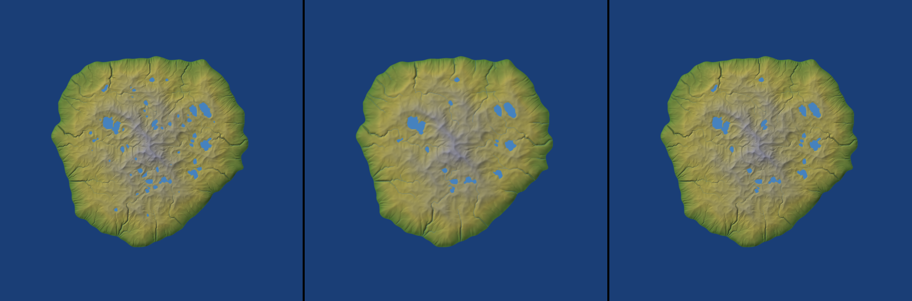

**The rivers' grading** (#109, 2026-10-01; `ErosionParams::channel_area`, `genesis
--channel-ha`, `city-blocks --island-channel-ha`). Every river of the 8 m island reaches the
sea steeply: of its 25 mouths, all fall over 5 % across their last 160 m and 21 over 10 %, a
14 m river at 15 % and the 4 m ones at 15–24 % (the demo's line `the rivers' last 160 m to
the sea`). The fall hardly depends on the river's size, so it is not the stream power's
profile, whose slope falls with the catchment. It is the hillslope diffusion: on 8 m cells a
valley floor is one cell wide between walls at 40° or more, and the sweep pours both walls
into that cell each step, about a metre, sixteen times what it poured at the 32 m spacing the
parameters were tuned at; the river re-cuts it, and the balance is a slope of about the fill
per cell whatever the river. Real channels carry that material away, and `channel_area` lets
them: the sweep never raises a cell draining that much, and raises a smaller channel's by the
share of its catchment short of it (a 3 × 3 unit test in `erosion`). At 25 ha (half the
drawn rivers' catchment) every mouth falls 2–5 %, one over 5 %, none over 10 %. But two things
go with the fill:
- **The lakes.** The island's 14 lakes were dams of the same fill at the valleys' narrows:
  at 25 ha there are none, at 100 ha 3 (and the 4 m rivers are back at 7–12 %), at 400 ha 5
  (14 mouths over 10 %).
- **The valley floors.** The fill is, in effect, the island's alluvium: 150 steps of it lift
  the valley floors by up to 150 m over the stream power's profile (the same camera stands 3 m
  over a river on a plain before, and 150 m over a canyon after). Without it a floor is a slot
  a cell wide. The rivers' smoothed courses leave it at the D8 corners and land on the walls:
  the water stands up to 12.4 m under its banks (3.9 before) at a third of the points (6 314
  over 2 m, 621 before), which the carve cuts as gorges.
So the rule stays off (`channel_area` 0). D-040 proposed transporting the sediment down the
channels instead; `city-blocks --island 7 --island-channel-ha 25` shows the island with the
rule, and `reports/2026-10-01-109/grading.md` the sheets. The coastal plain below grades the
mouths without either: the fill is as large as the valley walls are steep, and the hills rose
straight out of the sea.

**The coastal plain** (D-041, 2026-10-01; `IslandParams::plain`, `plain_uplift`,
`plain_wander`; `genesis --plain`, `city-blocks --island-plain`, 0 for the island before).
The uplift's square root lifted the coast's foothills from the shoreline, so the steepest
valley walls, and the most fill, were at the mouths: the largest river's floor stood at
24.7 m only 160 m inland. Now the uplift stays at 3 % of the hills' starting rate over the
first quarter of the radius inland, that width wandering along the coast over its 5 km
scale (`plain_wander` 3: from none, where the hills still meet the sea as cliffs, to about
twice as wide), and the hills rise from the plain's inner edge on the square root eased in
over its first eighth, so they leave the plain on a slope rather than a wall.
- **At 8 m** (the engine's island): 19 mouths, every one falling 1–5 % over its last 160 m
  (25 mouths, all over 5 %, before); 50 rivers up to 17 m wide (43 up to 14); 11 lakes (14);
  the water at most 3.5 m under its banks, 125 points over 2 m (3.9 m and 621); the heights
  −60 to 525 m. The first view now finds its beach at z = 5 072 m.
- **At 16 m** (`genesis`): 46 rivers, 18 to the sea (27 before), up to 17 m wide, 3 lakes
  (7). `--plain 0` gives the island before, the same digest (2d17199dba8598bf).
- The rivers cross the plain winding to the sea, more of them join before the coast, and the
  mouths are calm; the massif keeps its torrents in V valleys. The sand rule (gentle ground
  under 2.5 m) now reaches further inland around the mouths.

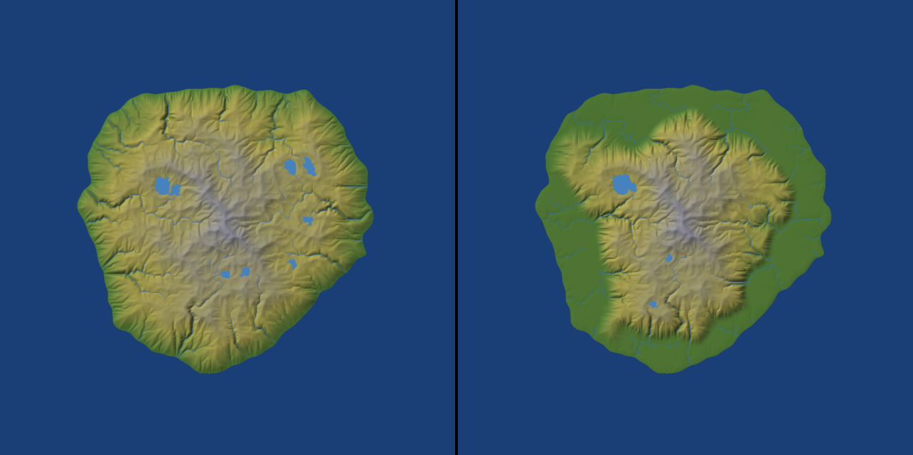

**The wind** (`--wind-from w`, seed 7 at 16 m): at contrast 1 the windward half of the land
gets a rain of 1.70 and the lee 0.21 (cells from 0.05 to the clamp at 10); the west coast is
cut by dense valleys and the east stays smooth (the picture below); the dry lee keeps its
depressions, 39 lakes against the calm island's 11, the largest 32 ha. At contrast 0.5:
1.34 against 0.61, 20 lakes. The refreshes cost 0.2 s over the run. Which contrast looks right
is the owner's call on the GPU (`city-blocks --island 7 --island-wind w`, another cache
key); the calm island is unchanged (its digest is the same).

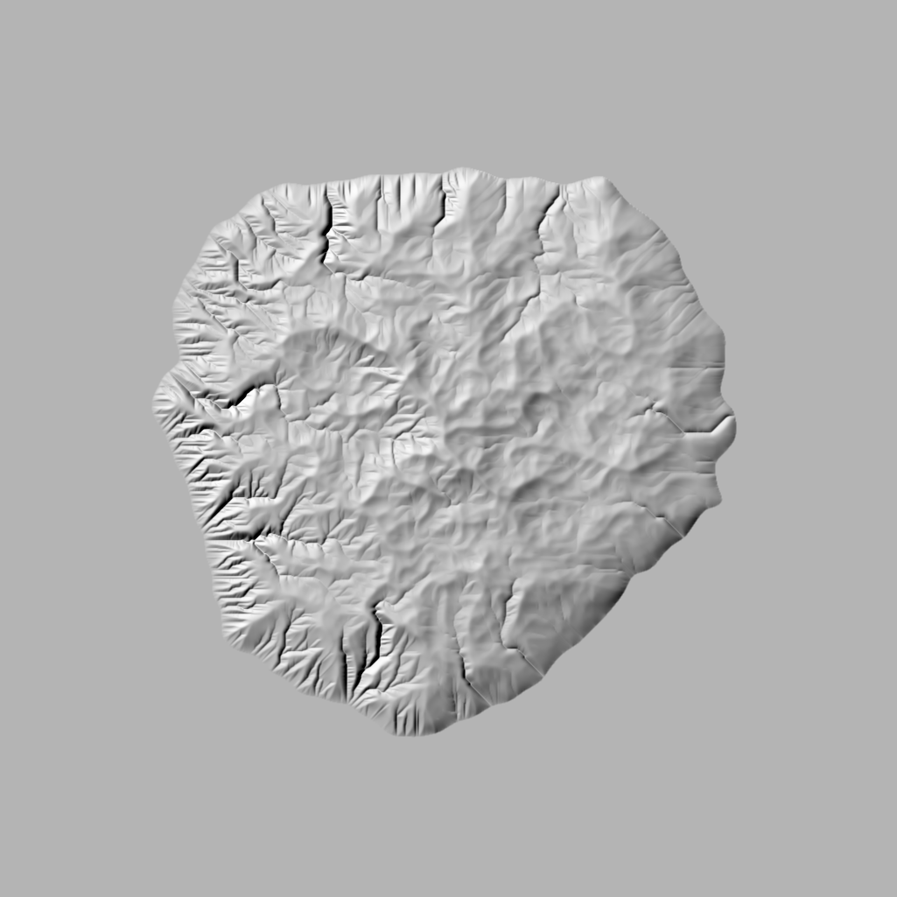

**The water's fields** (`genesis`, its `stage 5` line; `coast.png`, `sea-height.png`,
`sea-hillshade.png`). The signed coast distance (`coast_distance`: an exact Euclidean distance
transform, rows then columns in parallel; positive inland, negative at sea, zero on the coast
line) is what the shore's waves, foam line and wet band key on in the water research's plan;
seed 7's island reaches 4.6 km inland at most; 0.04 s at 16 m, about a second at 4 m. The sea
(`Ocean::new`, `surface(time)`): a JONSWAP spectrum for a 12 m/s wind over 200 km of fetch,
the TMA factor for a 50 m shelf, Hasselmann's spreading with Horvath's swell term (0.3),
Gaussian amplitudes from the seed on every wave vector of a 256 m patch at 256² (waves shorter
than 2 m left to the next cascade), the inverse FFT with `dmath` twiddles: a significant wave
height of 3.36 m (`Hs = 4 √m0`, and the tile's variance is checked against it), the tile from
−2.72 to 2.62 m, horizontal displacements up to 2.53 m (choppiness 1), no folding; the eight
transforms of a surface take 18 ms on one core, which is
the CPU side D-009 needs (the lowest cascade re-run for the physics) and the reference the GPU
cascades will be diffed against. What the pictures show: a sea of 30–60 m waves running with
the wind, crests broken by the spreading; nothing of it is drawn in the engine yet (the surface
pass is the water plan's first item on a GPU; its place in the frame and the cascades' queue are
D-038 ✅, accepted 2026-09-30).

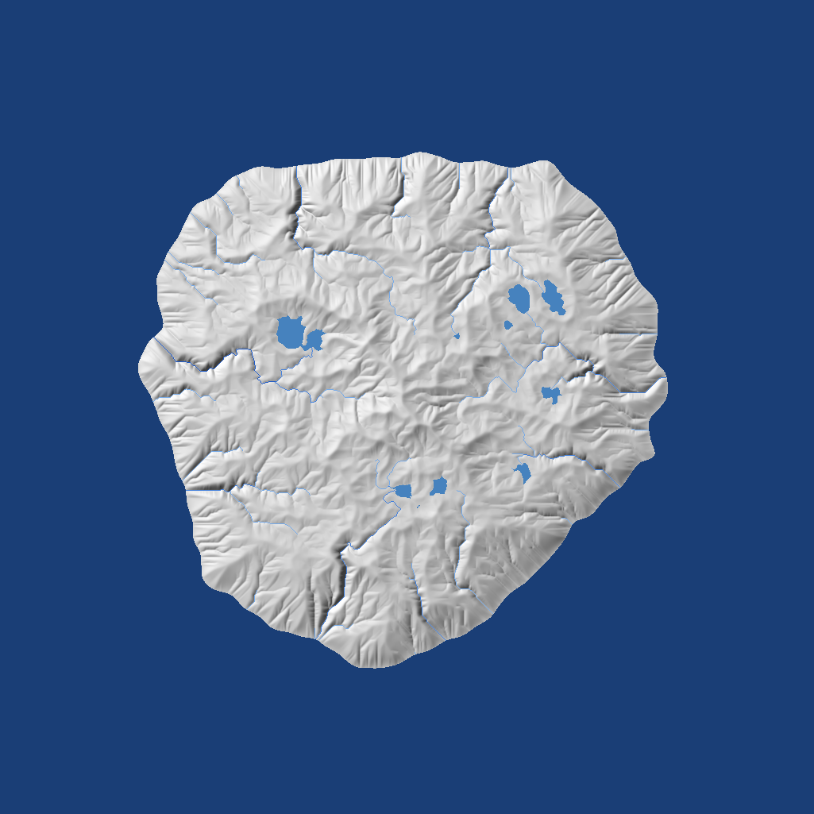

**Digests** (D-016). `genesis` ends with a 64-bit FNV-1a of the field's bits
(`Field2::digest`), the same on every machine and with any thread count; seed 7 after 150
steps: `0189d031eff0fb84` at 16 m (the same with `--threads 0`), `9eacfe0f827fa7dd` at 4 m,
both from the cloud container. A different value on the owner's machine is a D-016 bug to
find before the planet's tiles depend on it. *On the owner's machine (2026-09-26, Ryzen 7
9800X3D, 16 workers): the same two digests.* Those are the eroded field's, which
`--lake-min-ha 0` still gives. With the lake rule (2026-09-30, below) the island is
`2d17199dba8598bf` at 16 m, `9b712f95a51a2ea1` at 8 m and `9e1b2858f066b672` at 4 m. There the 4 m erosion takes 19.2 s (0.128 s a
step: drain 0.106, incise 0.015, diffuse 0.005, uplift 0.003) and the whole 4 m run 23 s; the
16 m run takes 1.4 s.

**Amplification** (stage 5, 2026-09-30; `forge_procgen::amplify`, `genesis --amplify`). The
eroded field goes to half its spacing, after Schott et al. 2024 (each finer level erodes under
the drainage the coarser one fixed):
1. The field is filtered by [1, 2, 1] / 4, then upsampled ×2 by Catmull-Rom. The eroded field
   carries a faint checkerboard at its sample scale, which Horn's gradient ignores but the cubic
   turned into a hatching over the whole hillshade; the filter removes it.
2. Half a metre of fractal detail goes on the land, its largest features 60 m across.
3. Twenty explicit iterations of three operators, each reading the previous iteration's field:
   - incision along the fine grid's own steepest descent, by the stream-power law with the
     coarse drainage's catchment, filtered twice (0.0006 · A^0.5 · S; stronger, it carved the
     coarse D8's straight runs into canals);
   - talus towards 0.9 (42°), symmetric between neighbours;
   - a little linear diffusion.

Every operator reads only a sample's eight neighbours, so the field is worked in tiles of 512
samples with a halo of 22. The tiles give the untiled field to the bit, with any number of
workers (a test): the planet's tiles can be amplified alone at streaming time and still agree
along their borders.

From 4 m to 2 m (8 193² samples) takes 1.5 s on the 9800X3D; from 8 m to 4 m, 0.4 s. Seed 7's
digests: `05a922f2380e03c5` at 2 m, `ce7d9331b56187e3` at 4 m from 8 m (with the lake rule;
`ede478ecd0115cff` and `96fc0548933e001f` before it). The island in the
engine still draws the 8 m or 4 m field: drawing 2 m needs the cook in tiles with locked
borders (134 M triangles, the next step).
The cook already locks them. Its simplifier runs with `SimplifyOptions::LockBorder`
(`forge-geom`, `lod.rs`), which keeps every vertex on a mesh's open edge in place at every
level. Tiles cooked alone therefore keep the same vertices along a shared edge and meet without
cracks at any pair of levels. The cost is that the edges never coarsen, which the planet
research's skirts avoid (`docs/research/planet-terrain.md`).

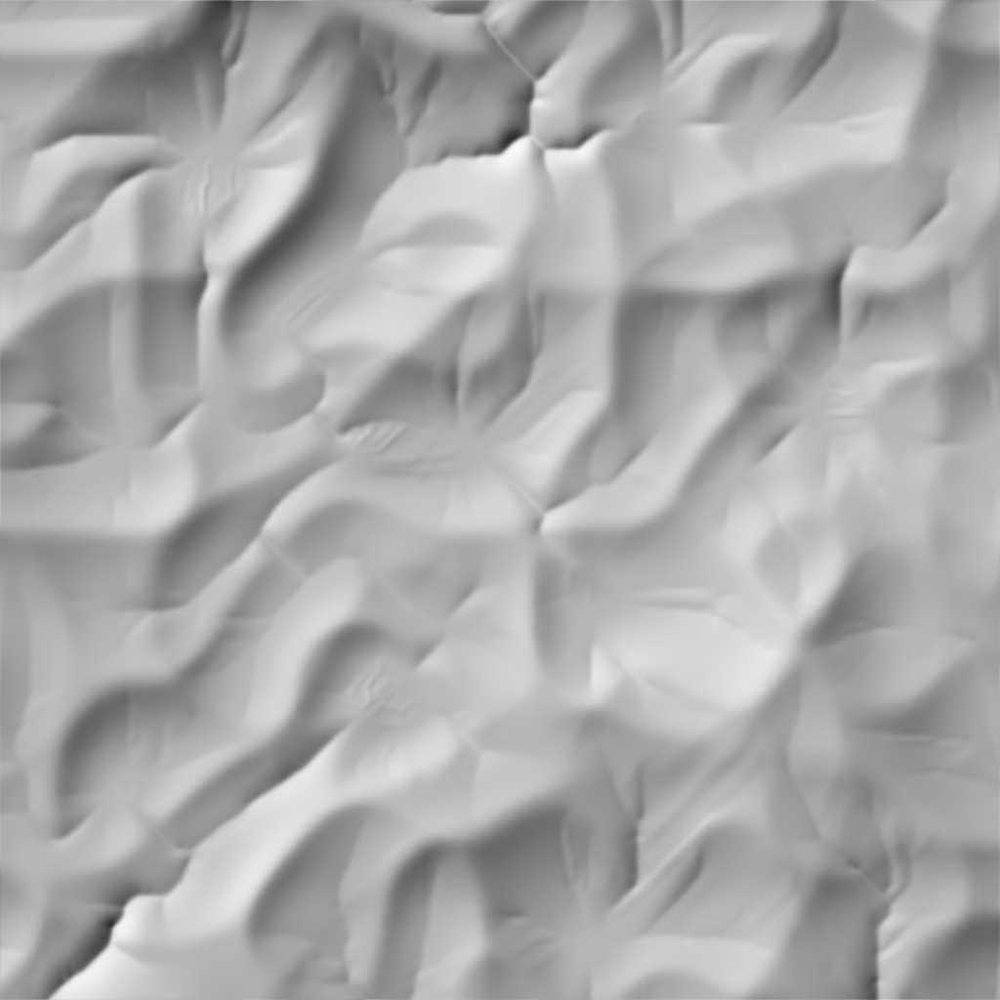


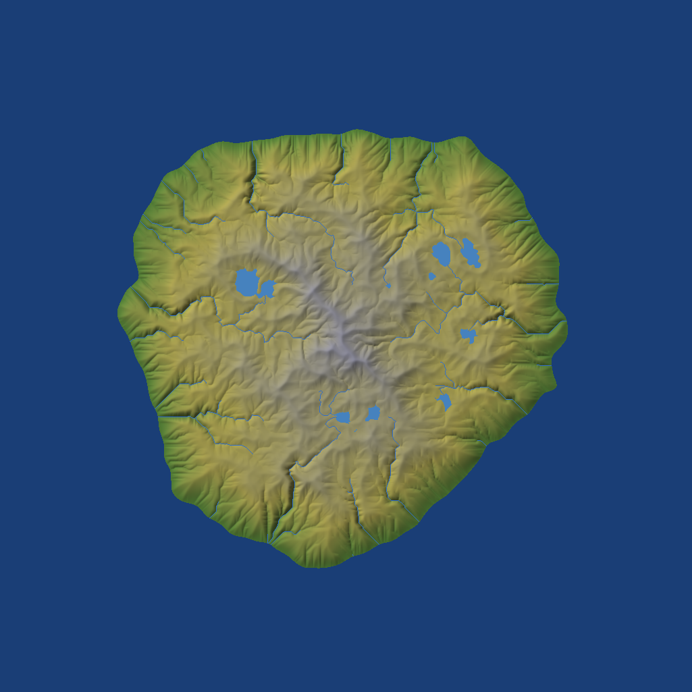

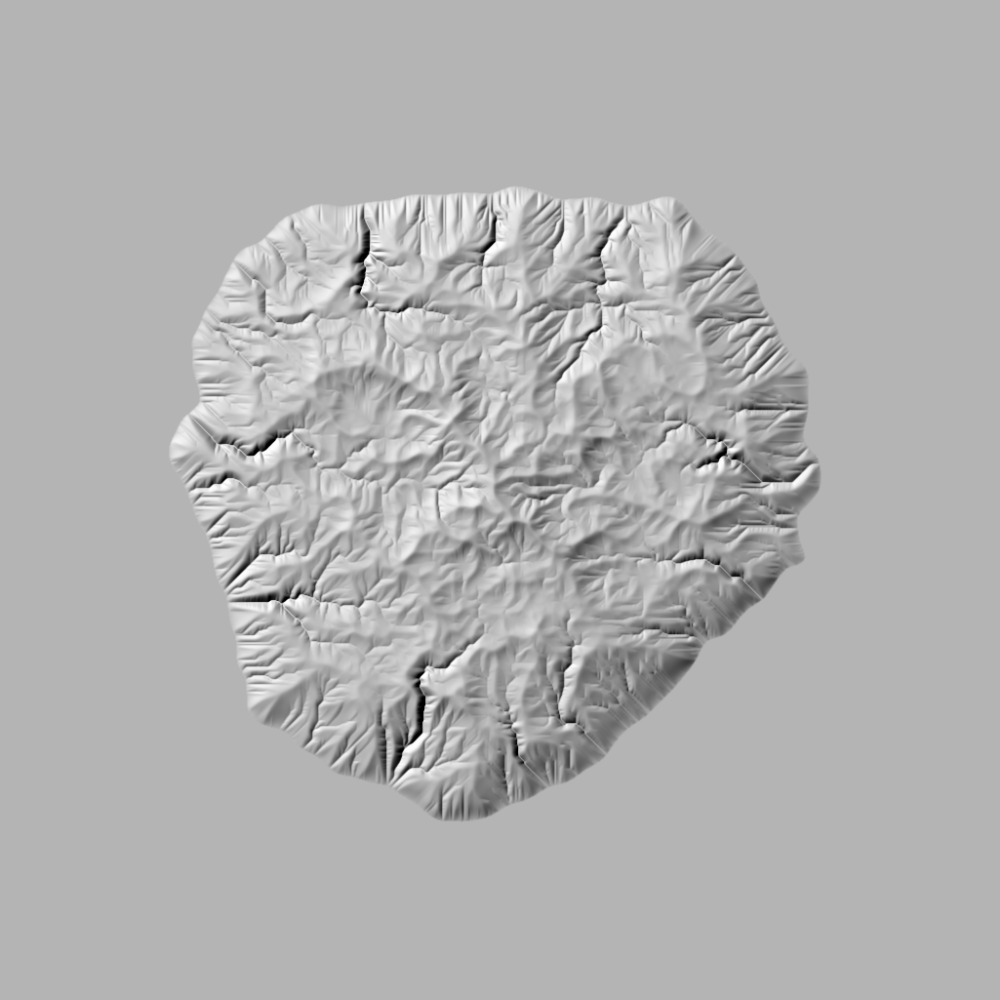

**What the pictures say, and what is next.** The drainage is dendritic and reaches the coast
everywhere; the crests follow the ridged uplift; the highland basins hold lakes. Visible now:
the D8 network's straight runs on gentle slopes (D∞ for the moisture, and the amplification,
soften them), a coast without cliffs or beaches (the materials and the near-field detail come
with stages 5–6), and highlands more uniform than a real range (orographic rain and a hardness
with layers are the levers). The immediate next step is stage 7 with what exists: the
heightfield handed to the cluster-DAG cook the city's ground uses, so today's renderer draws
the island with TAA and the F1 overlay, and the look is judged in the engine, not on a map.

## In the engine, first seen on the 5070 Ti (2026-09-26)

`cargo run --release -p city-blocks -- --island 7` works on the owner's machine: the first
start generates the 8 m field in 5.2 s and cooks it in 16.2 s (8.39 M triangles, 195 568
clusters, 1 922 pages of 240 MB, streamed); the next ones load both. The GPU takes 0.72–0.78 ms
a frame at 1600 × 900 (the probes' rays 0.16–0.24 ms, the layered shading 0.12–0.14), under
the city's sky with TAA.

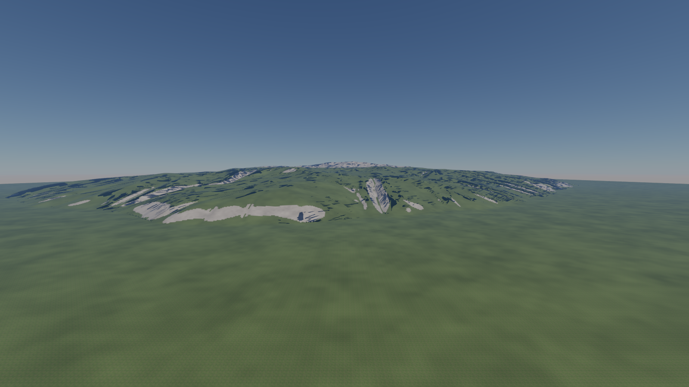


What the first look shows, for #96 to fix before the props:
- **Shadows where there are none** (fixed the same day). Dark, sharp-edged polygons covered the
  slopes facing the sun; `--no-shadows` removed them all. The shadow structure is a cut of the
  cluster DAG capped at 600 000 triangles for a terrain (D-029), fine for the city's flat
  ground (an error of 0.02 m), but the island's 8.4 M triangles of relief cut to 600 000 have
  an error of 1.03 m, far beyond the rays' 0.15 m start. A terrain's shadow rays now start
  twice its cut's error off (`raytrace::TERRAIN_SHADOW_START`; at once the error, 6 100 false
  pixels were left in the view from 1 200 m): that view is now within 583 px of the one
  without shadows, and the batch is unchanged (0 px; the props and rocks keep 0.15 m, since a
  larger start moved the rocks' own shadows in the ballad).
- **No sea** (a stand-in the same day). The sea floor was the field's 0 m, drawn as grass to the
  domain's edge.
- **Rock that reads as snow** (fixed the same day). Above 380 m and on slopes over 0.45 the
  ground took the city's rock layer, a pale grey that reads white from afar, with
  stair-stepped edges where the layer map's 4 m texels changed.
- **A camera to place with care.** `--view` takes an absolute height, and the land rises past
  500 m: a view at 250 m, 2.5 km in from the south coast, is under the ground.

**The island's own ground (2026-09-26).** The island no longer borrows the city's ground rows:
- `CityMaterials::island_ground` gives it four rows after its layered row: a deeper green, sand,
  the sea and a dark volcanic rock.
- `forge_procgen::slope_layers` takes a `Shore`: the sea at and below 0 m, sand on gentle ground
  up to 2.5 m, rock on slopes over 0.45 (no longer above an altitude: a tropical island is green
  to its peaks), grass elsewhere.
- The slope is Horn's gradient interpolated between the samples, rather than the nearest
  sample's, so a layer's border no longer steps with the 8 m grid. The 4096² map takes 190 ms.
- The rivers of stage 4 are painted over it: the drawn field's drainage (`forge_procgen::drain`),
  the rivers above 0.5 km² of catchment (`trace_rivers`, as `genesis` traces them), and every
  texel within half a river's width of its course (`paint_rivers`). The width comes from the
  catchment, 8 m at least, so a stream narrower than a texel still draws a steady line. They
  are a fifth layer, water over a dark bed, shaded like the sea. At 8 m that makes 43 rivers and
  45 121 texels, in 52 ms.
- So are the lakes of a hectare or more (`trace_lakes` over a priority flood of the drawn field,
  as `genesis` traces them; `paint_lakes`), on the same layer. They cover the depression's floor
  rather than standing flat at their level: a stand-in, like the sea. At 8 m that makes 31
  lakes and 153 040 texels. With the rivers it takes 0.5 s at the start, most of it the flood.
- Before those, the grass takes its moisture. The measure is the topographic wetness index,
  ln(a / tan β) (Beven & Kirkby 1979; `forge_procgen::wetness`): the catchment per metre of
  contour over the slope, box-blurred over 32 m so that D8's one-sample channels read as
  valleys. The driest quarter of the grass texels becomes dry grass on the ridges, the wettest
  quarter lush grass in the valley bottoms (`paint_moisture`), which brings out the relief from
  afar. That's 1.2 M texels each way; the whole step now takes 0.6 s at the start.
- Every textured row of the island takes hex tiling (#66). Near the coast the rock's 6 m repeat
  showed as a grid on the steep slopes. The layered shading grows from 0.118 to 0.154 ms, and
  the first view from 1.34 to 1.39 ms.

To place a view on the island, the log's line `island first view` gives the first view's
position and the beach it found (for seed 7 with the coastal plain: the beach at z = 5 072 m,
the camera at 0,25,5 222; 5 080 and 5 230 before). `--view` takes x, y and z in metres, then
the yaw and the pitch in degrees; the height is absolute, so a view inland must clear the
ground (up to 525 m).

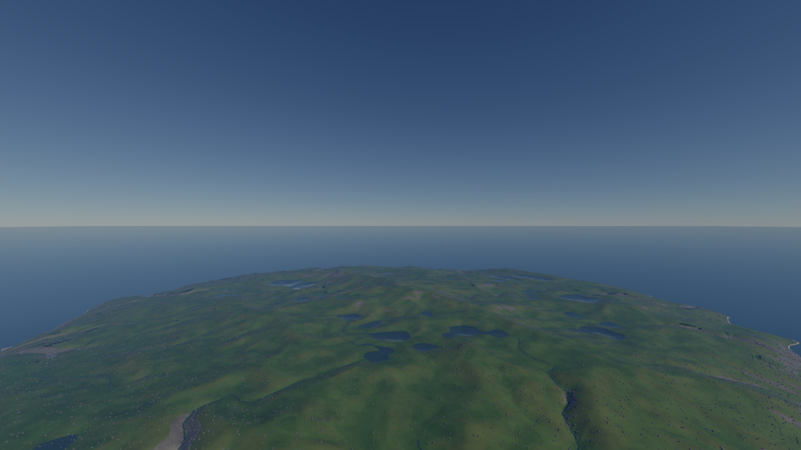

The sea is a **stand-in** until the water pass (D-038 ✅): one opaque plane at 0 m, 262 km across
(`sea_prop`), shaded smooth and dark (reflectance 0.02, a Blinn-Phong power of 400). It is smooth
enough for the traced mirror rays (D-031), so it reflects the island and the sky. It reaches the
horizon, where the field alone stopped 8 km out and showed the atmosphere's brown ground.

Under it the field now has a **sea floor** (`forge_procgen::sea_floor`). The erosion leaves the
sea flat at its base level, 0 m. Each sea sample is lowered to 60 m × (1 − e^(d / 1 500 m)), with
`d` its signed distance to the coast: 4 % of slope at the shore, levelling off at 60 m. This is
the floor depth the water research asks the genesis for. It is applied to the drawn field after
the erosion, so the genesis digests do not change. The coast is where the plane meets the ground,
between the samples. With the flat sea it ran along the 8 m grid's edges, a sawtooth at close
range. The layer below 0 m is a wet sand (`island_layer::SEABED`), out of sight under the plane.

**Rocks** (`placement::RockRule::Land`): (since #130, `--no-rock-sites` only: "The boulders where rocks
gather" below) the GPU placement puts 300 000 of the city's boulders and
rubble (`--instances`) on the island's land above 3 m. Each slot tries up to 32 candidates over
the square, keeping one on land with a chance that rises with the slope: 15 % on the flat, all
of them from a slope of 0.6. Since the coastal plain (#117, 2026-10-01) low ground keeps a tenth
of that chance under 5 m, the whole of it from 40 m (`ROCKS_LOWLAND` in `meshlet.slang`): the
plain had become a field of boulders, the first view's foreground among them; the hills take the
rest (`reports/2026-10-01-117/boulders.png`). They are shaded in the island's dark rock. A slot that finds no land
lies 50 m under the ground. The city's placement is unchanged: its checksum is still
`4e10743a3499dc0e`, and the batch is 0 px. (A first version wrote the city's rocks' height as
`ground − (0.15 r + 0)`, which the compiler no longer fused into one FMA, and 21 pixels of the
city's orbit moved; the expression is the city's again.)

**The first view** is now on the south coast, as #96's plan asks: 25 m over the water, 150 m off
the beach due south of the centre, looking inland. The beach is found in the field (`island_camera`),
so the view holds for any seed. The whole island from the sea is `--view 0,300,6800,0,-0.08`.

Two more changes:
- The island's sun stands at 30° by default (the city keeps 63.4°): from the default view a high
  sun lit the slopes head-on and flattened them.
- The island's prop is named `island`: as `terrain` it shared the city's cache file, and each
  evicted the other (an 11–16 s re-cook at every switch).

GPU, at 1600 × 900:
- **1.36 ms** from the coast, where the probes' rays take 0.43 ms among the rocks, the plane's
  shading 0.19 and its mirror rays 0.13;
- **1.12 ms** for the whole island from the sea, where the distant rocks go to the software
  rasteriser (0.20 ms);
- 0.74 ms before the rocks and the plane.

The batch is unchanged (26 images at 0 px).

**At 4 m** (`--island-spacing 4`, the 4097² target), the first start takes:
- 25 s to generate the field (a 67 MB `.f32`);
- 72 s to cook it into 33.5 M triangles, 784 586 clusters in 16 levels (a 1.10 GB `.fmesh`).

Its 7 721 pages (965 MB) stream through the default 512 MB pool. The shadow structure's cut
stands 2.4 m off (rays start 4.8 m off). The GPU takes 0.84 ms from the default view, against
0.74 at 8 m: cluster cull 1 grows 0.06 → 0.18 ms, and the probes' blend 0.07 → 0.15. The cache
keeps one file per prop, so switching between 8 and 4 m re-cooks.

Much of the 4 m island's lower flanks is rock, where at 8 m it was grass. This is the field,
not the rule: the erosion at 4 m cuts the flanks above 0.45 over 8 m. The rule now measures the
slope over 8 m at any spacing (`LayerRule::slope_over`), which changed 0.3 % of the 4 m frame's
pixels and nothing at 8 m. Whether the 4 m flanks should be that steep was a question for the
erosion's parameters at 4 m (#97), and a look to judge: the owner took them as they are
(2026-10-02), so the erosion's parameters stay.

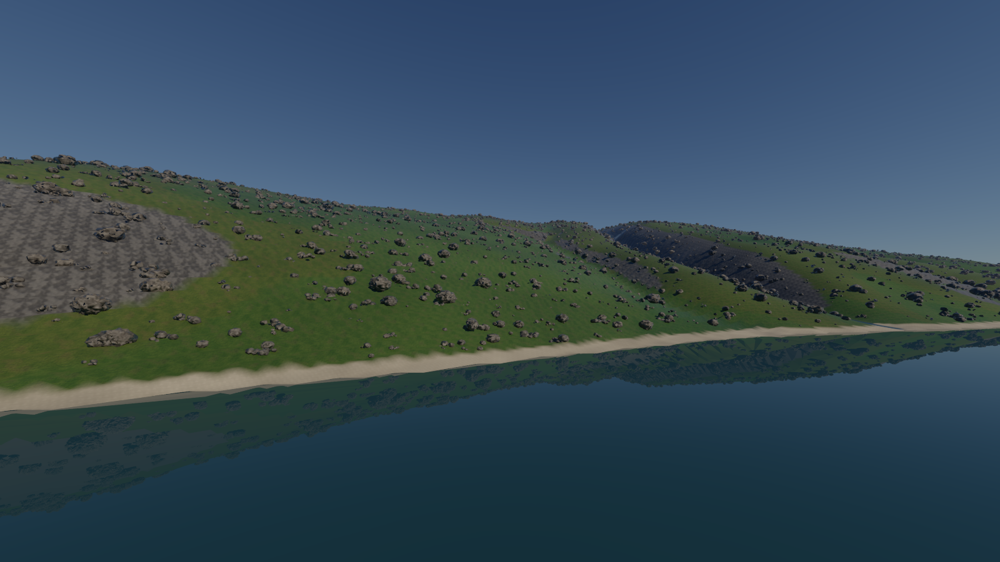

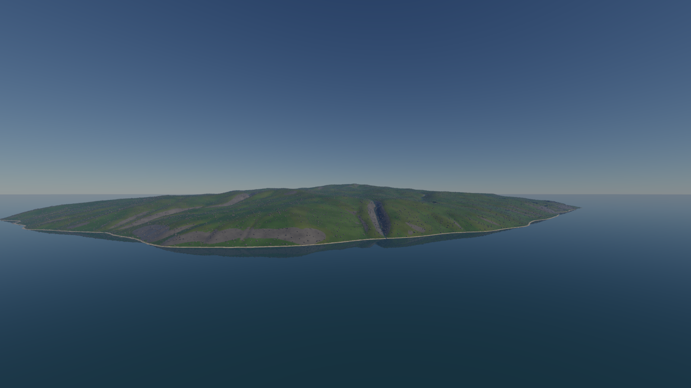

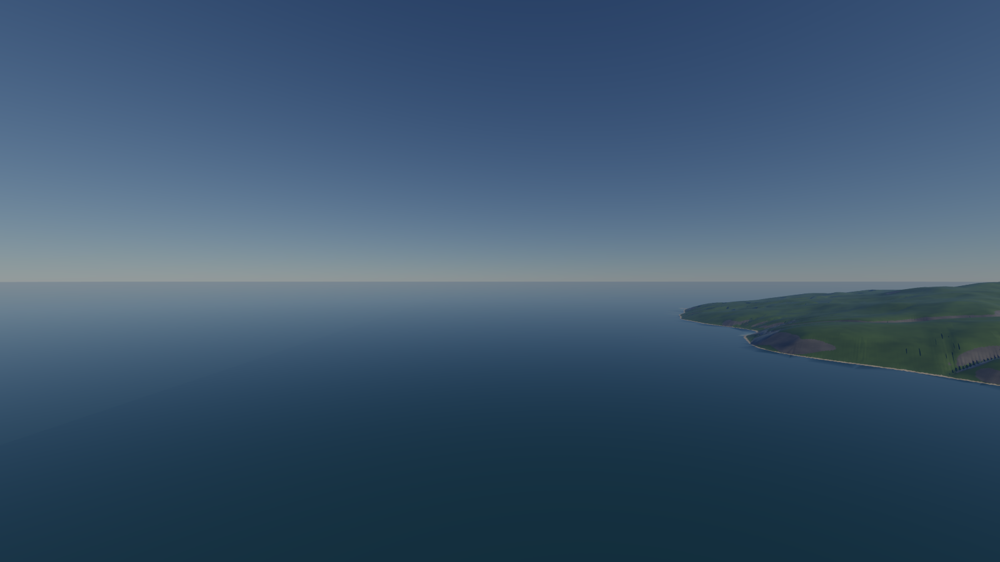

Without the traced rays (`--no-reflections`, or a GPU without ray queries), a line runs across
the sea where the probes' last cascade ends, about 900 m out. #68 dims an untraced sky
reflection by what the probes see towards the mirror direction, and their rays, which shade
diffusely, see the sea as nearly black (#100). The traced mirror rays skip that dimming, so the
default frames show no line.

## The sea on the GPU (issue #105, 2026-09-30)

D-038 was accepted on 2026-09-30. Its first step puts the sea's waves on the GPU:
`forge_render::water` and `shaders/water.slang`. The island draws its sea from them ("The
surface" below), its rivers and its lakes: by default since 2026-10-01, the owner's call after
the night's review (`--water` was the opt-in before; it is still accepted). `--no-water` draws
the stand-in sea, and the rivers and lakes painted into the ground's layers.

- **Three cascades** of 256² samples (`OceanParams::cascades`): patches of 1 024, 128 and 16 m.
  - Each holds the waves the one before is too coarse for. The bands meet at 32 m and 4 m
    (eight samples a wave at the coarser cascade), and the shortest wave is 0.25 m.
  - The breeze of `genesis`'s stage 5 (12 m/s, 200 km of fetch, a 50 m shelf) gives a
    significant height of 3.4 m over the three.
- **Four passes each frame on the async compute queue:**
  - `water/evolve`: the spectrum at the frame's time, and the spectra of eight fields packed
    two to a complex value. Their spectra are Hermitian, so the transform of A + iB is a + ib.
  - `water/fft-rows` and `water/fft-cols`: the inverse transform, radix-2 Stockham in 16 KB of
    groupshared memory, a workgroup per line.
  - `water/derive`: two half-float images per cascade. One holds the displacement (x, height,
    z); the other the slopes and the Jacobian, which marks the whitecaps.
- **The spectrum is the CPU's:** `Ocean::gpu_samples`, uploaded once. The GPU transforms the
  CPU's amplitudes, and its surface is `Ocean::surface` in single precision.
  - At the four wave vectors that are their own opposite (0 and N/2 on each axis), the evolve
    pass keeps the real part of each field's coefficient, as the CPU's transform does.
- **The start-up check:** at frame 120 the island reads every cascade back and compares its
  six fields with `Ocean::surface` at the same time. It passes when each field's largest
  difference is under 10⁻³ of its largest value, the half floats' precision. On the 5070 Ti the
  largest is 2.9 × 10⁻⁶ (the 1 024 m cascade's height: 1.8 µm of 2.94 m).
- **The cost:** 0.07 ms of the frame at 1600 × 900 and 0.15 ms at 1440p (`docs/PROFILE.md`),
  and 13 MiB with the mips. They run with the water only (not with `--no-water`).
- **Checks:** the batch is unchanged, and `tools/validate.sh` is clean, synchronization
  included.

**The surface** (step 2, `--water`). The sea is drawn by two passes after the sky's compose:
`water/scene-copy` (the HDR image and its depth, for what the water lets through), then
`water/surface`.
- **The mesh:** a clipmap of 13 levels of 128 × 128 quads, the finest 0.5 m apart and 64 m
  across, the coarsest 262 km across (Losasso & Hoppe 2004).
  - Each level is centred on the camera snapped to twice its spacing, and leaves out what the
    finer level covers.
  - Each level's lattice points are its vertices, indexed by its quads (since 2026-10-01): five
    sets of indices, the whole level for the finest, and a level less its finer level's hole
    in each of the two places it can sit along each axis. The quads go in blocks of 32 × 32,
    and a frame draws only the blocks whose box (40 m more every way, for the waves) can
    show.
  - Near its edge a level's odd vertices slide onto the coarser lattice, all the way by the
    edge, so the levels meet without cracks and nothing pops.
  - The cascades displace the vertices, each read at the mip that matches the spacing
    (`water/mips` builds the chains).
- **The shading:**
  - The normal and the roughness come from the slopes' mips: the mean slope, and the variance
    of those the mips average away, as GGX's α² (Bruneton, Neyret & Holzschuch 2010). Far away
    the sea turns rough instead of shimmering.
  - Schlick's Fresnel (F0 0.02) with the sky in the mirror direction, and the sun's GGX
    highlight.
  - Under the water, the copied scene is dimmed along the light's path to it (absorption
    0.35, 0.07, 0.05 m⁻¹), with the light the water scatters back. The shallows show the sand,
    and the deep sea turns blue. The path is the depth under the surface over the refracted
    ray's fall (Snell's law, n = 1.333; since 2026-10-01, `reports/2026-10-01-105/refraction.md`):
    at a grazing angle about 1.5 times the depth, where the straight view ray's was ten times,
    and every wave changed it by metres and speckled the shallows.
  - Foam where the Jacobian drops under 0.45, then the aerial perspective.
- **The graph:** the surface writes depth, so TAA's motion vectors and the culling harness see
  it as a surface. `--sea-time T` holds the waves still.

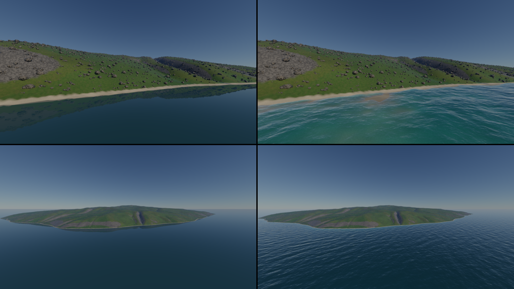

- **What it lacked:** the island's reflection (step 3, below), the sun's shadow on the water
  (step 4, below), and the shore's waves and foam line. That is why `--water` stayed opt-in
  until the owner had judged it (`reports/2026-09-30-105/`; the default since 2026-10-01).
- **Stability** (still camera, waves still, TAA on): pixels changing from one frame to the
  next, 0.43 % at the coast (the stand-in 0.37 %) and 0.57 % from the sea (0.34 %). Over 32
  frames at the same jitter phase, 0.0016 % and 0.0003 %: nothing crawls.
- **Cost:** 1.26 → 1.43 ms at the coast, 1.11 → 1.32 ms from the sea, 2.38 → 2.66 ms at 1440p
  (`docs/PROFILE.md`).
- **Checks:**
  - The batch gains the water's four captures: the occlusion A/B and mesh against fallback
    are at 0 px.
  - `tools/validate.sh` gains the water runs and is clean. It first showed the render graph
    naming graphics stages in a compute-queue barrier after a vertex shader read the mips;
    `forge-gpu` fixes that, with a test.

**The island in the water** (step 3). The surface asks for a mirror ray per pixel, and the
glass's ray tracing answers (#50, #52).
- **The request:** `water/surface` writes a second target beside its colour. It holds the
  mirror direction it read the sky in, and the weight of what a ray meets there instead: the
  Fresnel term, less the blur towards the sky's irradiance on a rough surface, the foam and the
  air in front. The target starts at zero, so a pixel without water asks nothing.
- **The rays:** `water/reflections` (`MeshletRenderer::trace_requested`), one thread a pixel.
  It rebuilds the water's point from the depth the surface wrote, traces the ray against the
  TLAS, and on a hit adds weight × (hit − sky). The hit is lit as the glass's are: the sun
  through a shadow ray, and the probes' light.
- **The keys:** **Y** (`--no-ray-reflections`) and **F** turn the rays off, as for the glass. A
  GPU without ray queries keeps the sky.

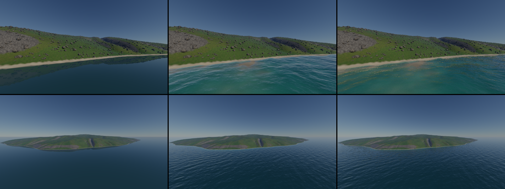

- **From the sea:** a darker, greener band under the island, broken by the waves.
- **At the coast:** the wave faces turned towards the camera reflected the bright sky low over
  the horizon. They now show the grass slopes and the beach behind the shore, in olive and sand
  patches; the faces turned away still show the sky.
- **The sea floor stays out:** a false colour of each ray's hit distance shows the rays from the
  water near the camera reaching the slopes more than 100 m away. Next to none hit anything
  under 0.5 m above the sea, so the floor's traced surface, which may stand up to a metre above
  the drawn one, doesn't show through.
- **Stability** (still camera, waves still, TAA on): 1.62 % of the pixels change from one frame
  to the next at the coast (0.43 % with the sky alone) and 0.98 % from the sea (0.57 %). They
  are isolated pixels on the edges of the reflected slopes, where a wave face's ray flips
  between the island and the sky as the jitter moves; 0.21 % change by more than 8 levels at
  the coast. Over 32 frames at the same jitter phase, 0.0021 % and 0.0003 %: nothing crawls.
- **Cost:** `water/reflections` takes 0.17 ms at the coast, 0.09 ms from the sea and 0.43 ms at
  1440p (`docs/PROFILE.md`).

**The island's shadow on the water** (step 4). The surface asks for a shadow ray per pixel too,
and the same pass traces it.
- **The request:** a third target holds the share of the pixel's colour the sun lights, through
  the same foam and air. It counts the highlight and the sunlight the water scatters back:
  under a shaded surface the water loses the sun too. The sea floor seen through the water was
  shaded by its own rays in the resolve. A share under 1 % of the pixel asks no ray.
- **The ray:** towards a point of the sun's disc, as the ground's shadow rays, so TAA averages
  the eight points into a penumbra. A blocked ray takes the share away. It starts 2 m off the
  water, the terrain's own start (`TERRAIN_SHADOW_START`): the sea floor's traced surface may
  stand a metre above the drawn one, above the water in the shallows.
- **The key:** **J** (the shadows), as for everything else.

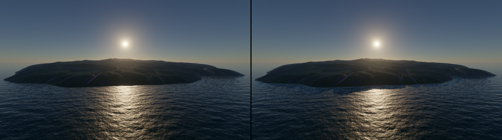

- **Where it shows:** under a low sun, on the side of the island away from it. At the default
  30° the island's slopes facing the sea are gentler than the sun, so they shade almost none
  of it: 54 pixels change in the view from the north-west. Under a 10° sun (`--sun-elevation
  10 --view=-5600,300,-4200,-126.9,-4.6`), the shadow cuts the sun's glitter short of the shore,
  and the shaded water keeps only the sky's blue.
- **Stability:** under the 10° sun, 1.42 % of the pixels change from one frame to the next
  (1.37 % without the shadow), and 0.017 % over 32 frames (0.021 %). The coast and the sea
  views don't change.
- **Cost:** the shadow rays add 0.03 ms to `water/reflections` at the coast and from the sea,
  0.07 ms at 1440p and 0.07 ms looking into the 10° sun, where they cross the island
  (`docs/PROFILE.md`).

**The shore** (step 5, D-038's shore). Its first part: the waves feel the floor.
- **The fields:** `water/surface` reads the island's floor height and signed coast distance
  (`WaterShore`: one `RG16F` image of the 8 m field, 16 MiB at 2 049²).
- **The damping:** each cascade is damped by the root of Kitaigorodskii's TMA factor (Bouws
  et al. 1985) at the frequency its energy centres on (`Ocean::mean_frequency`: periods of
  7.3, 3.5 and 1.2 s), in the local depth, relative to the 50 m its spectrum was made for. The
  displacement, the slopes, their variance and the Jacobian all follow. Long waves die first
  in the shallows, the open sea keeps its waves, and the factor falls to zero at the waterline
  (as the square root of the depth), which stands for D-038's shore fade.
- **What changes:** 150 m off the beach (6 m deep) the swell's cascade keeps 46 % of its
  height, the others 89 % and 100 %. The patches of sand that showed through near the shore,
  where the swell's troughs dipped under the floor, are gone.

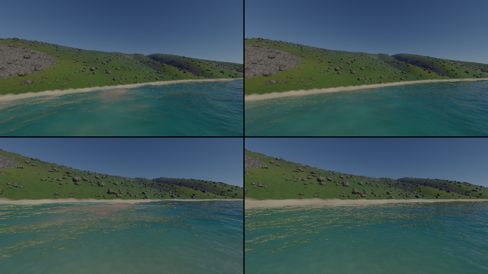

- **Cost:** `water/surface` 0.074 → 0.082 ms at the coast, 0.090 → 0.101 ms from the sea (a
  texture read per vertex and fragment).
- **Checks:** the batch changes only the four water images (ꟻLIP mean 0.036); the A/B harness
  and mesh against fallback at 0 px; validation clean.

Its second part: the shore's own waves (Uncharted 3's recipe, Gonzalez-Ochoa & Holder 2012).
- **The trains:** three Gerstner trains of 9, 7 and 12 s (0.9, 0.6 and 0.5 m high in deep
  water, around the swell's 7.3 s) come in along the coast distance's gradient.
  - Their phase is ω (t + τ), τ the time a crest takes from the point to the shore.
    `forge_procgen::shore` tabulates it against the coast distance, from the floor's mean depth
    at each distance and the dispersion relation (a crest takes 47 s from 200 m out). So the
    crests slow and bunch up over the shallows.
  - Their height grows by shoaling (the energy flux kept: `√(cg₀ / cg)`, Green's law in
    shallow water) until together they stand over 0.78 of the depth (McCowan's breaker
    index). Past that they follow the depth down: the surf zone, about 40 m wide on the
    south beach.
  - Along the coast the sets rise and fall and the crests drift a little out of line (two
    slow value noises), so the lines of surf are not ruled.
  - They fade in where the floor is under a fifth of their deep wavelength (the cascades fade
    out there), and out where they are shorter than four of the mesh's spacings or the
    pixel's footprints.
- **The foam:** the broken water on the front of each crest in the surf zone, left behind as
  the crest moves on. Also the swash's leading edge, where its sheet is under 3 cm thick (from
  the view ray's path to the floor). Two octaves of value noise that drift shorewards and fade
  to their mean below two pixels break up the broken water. They only fray the edge's line
  (40 % of its cover at most): cut into the noise's blobs, a band that narrow read as a dashed
  line.
- **The swash:** at the shoreline each wave runs up the beach as a thin sheet: a quick
  uprush, then a slow backwash, 0.3 of the trains' deep-water height at most.

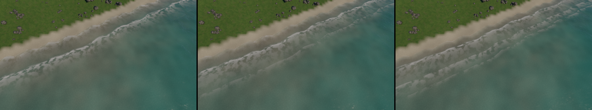

- **Stability** (still camera, waves still, TAA on), frame to frame and over 32 frames: the
  beach from 60 m up 0.019 % and 0.0002 %, the coast 1.46 % and 0.0019 %, from the sea 0.83 %
  and 0.0001 %. The damped shallows move less than before, so the coast and the sea are
  steadier than at step 4 (1.62 % and 0.98 %).
- **Cost:** `water/surface` 0.082 → 0.136 ms at the coast, 0.101 → 0.164 ms from the sea (the
  whole coast's shallows in view), 0.095 (before the damping) → 0.204 ms above the beach. The
  frame: 1.65 → 1.72, 1.45 → 1.52 and 1.64 → 1.76 ms against step 4. The surface was drawn
  without indices, each vertex six times: indexed and culled by blocks since (`docs/PROFILE.md`).
- **From low down** the surf is seen edge on and reads as a light band along the beach. The
  crest that curls over is D-038's later step for the golden shots (a baked mesh along the
  wavefront, as Horizon's).

Its third part: the wet sand.
- **Where it is wet:** the swash is a function of position and time, shared by the water and
  the ground (`shaders/shore.slang`), so the layered ground computes where the sheet ran up
  without a texture. It takes the highest reach over the last 19.5 s (14 instants 1.5 s
  apart), each dimmed by the drying since (25 s to lose 1/e), and stays damp for 0.25 m of
  height above it. The floor under the sea is left to the water, which shades what it covers.
- **What wet does** (Lagarde 2013): the albedo halves, and the surface turns smooth, with
  water's F0 (0.02) and a sharp sky reflection and sun highlight.
- **Against D-038:** the decision named a clip texture the water writes and the terrain
  reads. The same maximum run-up, decaying, comes from the functions themselves, with no pass,
  no clip edge to fade and no resolution limit, and it stays deterministic (D-016).
- **The resolve** reads the shore's block (`WaterSurface::wet_ground`, `AmbientLight::wet_ground`):
  the fields' frame, the trains and the sea's time.
- **What shows the island's grid:** the swash's edge and the wet band follow the beach's
  height contours, which step along the 8 m field's cells near sea level (the sand and grass
  boundary above them steps the same way). The 2 m amplification is what smooths them (#106).
  (Smoothed since, below: "The coast's definition".)

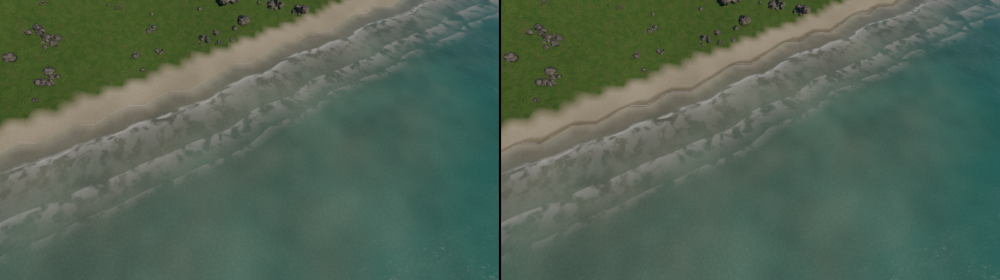

- **Cost:** `shading/layered` +0.012 ms at the coast, nothing measurable from the sea, +0.045 ms
  above the beach, where most pixels are within the swash's reach (`docs/PROFILE.md`).
- **Stability** (still camera, waves still): the beach from above 0.020 % frame to frame
  (0.016 % dry: the wet sand's sharper highlight), 0.0001 % over 32 frames either way; the
  coast unchanged.
- **Checks:** the batch changes the water images by the wet band (9 046 px, ꟻLIP mean 0.0031);
  the A/B harness and mesh against fallback at 0 px; validation clean.

**The rivers** (step 6, D-038's rivers). The rivers of stage 4 become water of their own:
`forge_procgen::river` makes each a ribbon, and `water/surface` draws the ribbons after the sea.
- **The courses:** the drawn field's rivers above 0.5 km² of catchment, as the layer map traced
  them (43 at 8 m), each from its head to the sea or to the larger river it joins.
  - Four passes of a binomial filter and three of Chaikin's corner cutting smooth the D8
    course, its ends kept, and it is resampled every 4 m: 16 397 points. The grid's stair steps
    straighten, and its right-angled turns open into bends.
  - Per point: the width from the catchment as before (`w = 0.005 √A`: 3.5 m at the
    threshold, 14 m at the largest mouth); the depth `0.3 (A / km²)^⅜` m (Leopold & Maddock's
    exponent, 0.23 to 0.65 m here); the speed by Chézy's formula, `15 √(d S)` over the smoothed
    bed's slope, from 0.3 to 3 m/s; the direction downstream.
  - In a bend the half width stays under 0.8 of the bend's radius, so the inner bank never
    folds over itself. A river fades in over its first 40 m (since 2026-10-01 it grows from its
    spring instead: from a sixth of its width and a third of its depth over those 40 m, its water
    in from the first 8 m).
- **On the ground:** the 8 m field cannot hold a bed a few metres wide. A channel carved into it
  would be a trench of 8 m triangles, and the water's outline would follow them. So the ribbon
  lies on the ground as the island's mesh draws it, and its outline is its own. Each vertex
  (four quads across) stands at the highest the ground reaches under the quads around it,
  sampled every half metre with the cells split as the mesh splits them, plus 0.1 m and a
  quarter of the depth. The depth the water shows is the ribbon's profile across, deepest in the
  middle. Once the 2 m field is drawn (#106), the beds can be carved and the water set at a level
  in them. (Superseded the next day: the channels are carved on cells of a metre along the
  rivers, below.)
- **In the pass:** after the sea, blended over what is under by how much of the pixel the
  river covers:
  - the banks, soft over half a metre or two pixels;
  - the head's fade, and the last 30 m to the coast, where the sea's swash takes over;
  - far away, a pixel either side at least, with the coverage scaled by the share the river
    fills (after Persson's phone-wire anti-aliasing), lifted by one and a half pixels' footprint
    over the ground's coarser levels of detail.
  The tributaries are drawn first, and the larger river, lifted more, covers their ends.
- **The water:**
  - the finest cascade's slopes on an 8 m tile, carried down the river by a flow map (Vlachos
    2010): two phases 2 s apart, cross-faded, each restarting where the other is strongest,
    their timing offset by a noise so the fade does not pulse; faster in the middle than by the
    banks;
  - the sky and the sun as the sea has them (the shading is shared), and the mirror and shadow
    rays asked for as the sea's, so the banks and the rocks show in it;
  - under it, the ground's light on a grey-brown sediment towards the middle, through the
    ribbon's depth (absorption 1.4, 0.4, 0.5 m⁻¹: fresh water with a little tannin and silt);
  - white water in riffles about 30 m apart, where the bed falls more than 6 % and the stream
    runs fast.
- **The ground:** with the water the rivers are no longer painted into the layer map (they are
  with `--no-water`). The lakes still were, until the lakes' step.

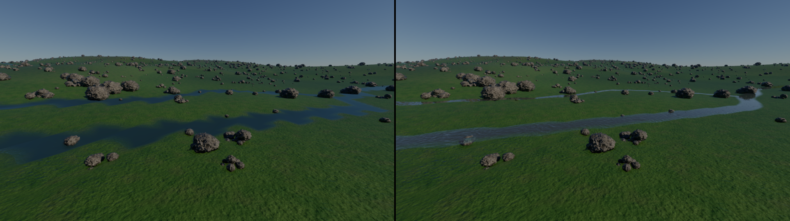

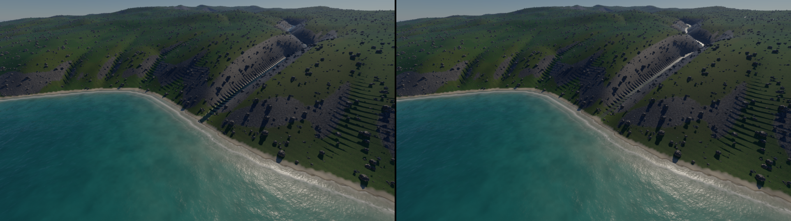

- **What to look at:**
  - From above, a river over a plain shows its bed and a faint sky, greyer than the painted
    stand-in, which mirrored the sky more than water does.
  - In a narrow 8 m valley the ribbon rests on the highest ground under it, so its water can
    stand up to about a metre over the valley's bottom. From low down across the valley, it
    shows as a sheet a little above the ground.
  - The valleys' sides step every 8 m (#106), and their shadows cross the rivers in stripes.
  - No waterfalls: the eroded field has no cliffs (the steepest reach falls 33 % over 24 m).
    The steep reaches have white water instead.
- **Stability** (still camera, waves held at 12 s, TAA on; pixels changing by more than two
  levels, frame to frame and over 32 frames): the stream from 16 m 0.18 → 0.26 % and 0.0017 →
  0.0020 %; the plain 0.31 → 0.33 % and 0.0019 → 0.0021 %; the valley 0.59 % and 0.015 % either
  way; the island from 2.5 km 0.87 → 0.82 % and 0.0003 → 0.0006 %. The ripples' reflections move
  with the jitter from one frame to the next, and nothing crawls.
- **Cost:** `water/surface` +0.015 to 0.026 ms (the ribbons' vertices, drawn whether in view or
  not, and the river's pixels), and `water/reflections` +0.02 to 0.03 ms where a river fills
  the view: the frame 1.46 → 1.54 ms for the stream from 16 m (`docs/PROFILE.md`). At start,
  77 ms for the drainage, the courses and the ground under the ribbons; 17 MiB on the GPU, the
  ground's heights in full precision (16 MiB at 8 m) and the points.
- **Checks:** the batch changes the water images by a river mouth and a gully in the first
  view (506 px, ꟻLIP mean 0.0003), #71's flake aside; the A/B harness and mesh against
  fallback at 0 px; validation clean; tests (two new in `forge_procgen::river`, among them
  that the ribbon never dips under the drawn ground), clippy, fmt.

**The rivers' beds, level water, mouths and stones** (2026-10-01, after the owner's look at step
6). The owner saw water that was not level across (it followed the ground's V), ribbons standing
over the ground or leaving gaps at the banks, no bed to see, and rivers stopping short of the sea;
and asked for water that flows around what stands in it. The ribbon on the ground gave way to
water in a carved channel:
- **Cells of a metre along the rivers.** `forge_procgen::Channels` lists the 8 m cells within
  8 m of a river's water plus half a cell's diagonal (36 267, 2.9 M fine vertices) and gives the
  ground there at any point. `forge_geom::city::refined_heightfield_mesh` draws those cells in
  8 × 8 quads and every coarse cell beside them as a fan from its centre over its edges' fine
  vertices, the same two planes as before: the vertices on an edge are shared, so there is no
  T-junction and no crack (a test checks the twins of every edge). The cook takes the channels
  from the samples (1.5 s) and the island's DAG simplifies them like the rest.
- **The ground around a river** is the field's samples through a Catmull–Rom cubic within a
  metre of the water, blended back to the 8 m planes by 8 m out, so the valleys the rivers run
  in are smooth where the water meets them, and the cells beyond are untouched.
- **The course settles on the valley's floor.** The corner cutting leaves a course on the
  valley's side in a narrow bend; four passes move each point half way to the lowest ground
  within 8 m across (a move costing 2 cm per square metre of it) and smooth it again.
- **The water is level across** and only falls downstream: at each point the lowest ground in the
  middle and on both banks (a little up and down the course), less a freeboard of `0.05 m + 4 %`
  of the width; then the running minimum from the head, a fall steeper than 60 % spread upstream,
  and two smoothing passes that keep both. Through a lake of a hectare the level is the lake's;
  it never goes under the sea's; a tributary ends on its river's course at that river's level or
  over it, and gives way to it in its channel. The depth is now `0.4 (A / km²)^⅜` m (0.31 to
  0.87 m), a little deeper, which the future underwater view will want.
- **The channel** is a parabola across from the level at the water's edge to the depth in the
  middle, and past the edge a bank rising `0.5 x + 0.1 x²` until it meets the ground, which it
  only ever lowers; where two channels meet the lower wins. The ribbon reaches `0.5 m + 10 %` of
  the half width past the edge, under the banks, so the ground draws the water's outline.
- **The bed** is a layer of its own, grey-brown gravel at the pebbles' scale (`island: river bed`,
  painted at the water's width), and the water shows it: the surface pass sees the scene under it
  through the true depth along the view ray, as the sea sees its floor (absorption 0.9, 0.35,
  0.45 m⁻¹, a little tannin and silt). The faked sediment tint is gone. The edge fades over the
  last 2 cm of depth, or a quarter of a pixel's footprint, wherever the water thins against
  something.
- **Not over nothing:** a river or a lake fades where the view ray finds nothing within the deepest
  it can be under its surface (its own depth and 5 m more): the ground not drawn yet, its pages
  still streaming in, where the owner saw ribbons floating.
- **Far away** the channel can be under a pixel and the DAG fills it: past a footprint of a fifth
  of the channel's depth under its banks the ribbon rises onto the ground as before (resting on
  the carved ground now), and past four fifths it lies there in full, a pixel wide either side.
- **The mouths.** A river's channel runs through the beach to the sea, and where its level comes
  down to the sea's the sea fills it. The ribbon fades out over the last 0.3 m of level, and from
  that point (25 mouths) the sea's own shading takes the river on: up the channel the water is
  the river's, with its flow-mapped ripples and its absorption and scattering; out to sea it is
  a jet that widens by 0.2 m a metre and slows as the root of the distance, its water mixing into
  the sea's over 60 half widths, the plume's edge broken up by noise. The same ripple function
  draws the river, the sea at a mouth and later the lakes (still water is the same ripples
  unmoved), so no two animated layers ever fade over each other. A grid of 128 m cells lists
  the mouths whose plume reaches each cell. A river that reaches the sea in white water brings
  it along (since 2026-10-01, `reports/2026-10-01-105/spill.md`): its share at the mouth (the
  rapids' rule over its last 16 m) whitens the sea up the channel and out along the plume,
  fading over six half widths, in the sea's foam pattern drifting out with the flow. Before, the
  white water stopped where the ribbon faded. The log names two mouths: the largest river's
  (`into_sea`, a cascade) and the gentlest of a river 6 m wide or more (`gentle_sea`), where no
  white water hides the handover and the plume.
- **The stones.** Past each point of a river drawn in full, a boulder with a chance of 3 %,
  rising to a third where the water falls 15 %: across the middle 70 % of the water, 0.25 to
  0.85 m and at least 0.8 of the depth there, so most break the surface (2 525 stones, 2 051
  of them through the water). They are instances of the island's boulders standing on the
  carved bed, and the GPU's rocks keep off the refined cells (their 8 m samples no longer follow
  the ground there). In the surface pass the water parts around a stone's outline at the level
  as a potential flow parts around a cylinder, piles up white in front of it and trails a wake
  behind, widening and fading over 8 radii; a stone under the water roughens the surface over
  it. Anything else standing in the water shows by the contact, the water's edge fading where it
  thins against it. A game's objects join the flow through a list of their own, written every
  frame (#107, "Objects in the water"). (A
  line of foam wherever fast water thinned against anything drew the banks' metre triangles and
  was left out.)
- **White water** (the riffles', the stones') is broken by two octaves of noise in streaks down
  the river (since 2026-10-01, `reports/2026-10-01-105/streaks.md`):
  - The cells are 0.35 m across and four times that long, laid out in the ribbon's own
    coordinates: metres along the river from its head, metres across it.
  - The pattern is carried down at the river's speed in the flow map's two phases.
  - Before, the pattern rode the ripples' flow, whose shear around a stone drew it into smooth
    bands metres long and a swirl. Where the flow ran straight, it stayed round blotches.
  - Streaking along the local flow in world space showed as harsh lines across it from low down
    (rotating coordinates thousands of metres from the origin).
  - `stone_view` in the log is a view of the stone in the fastest water.

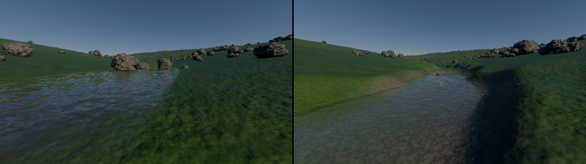

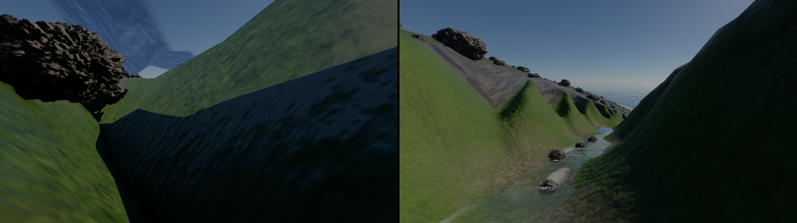

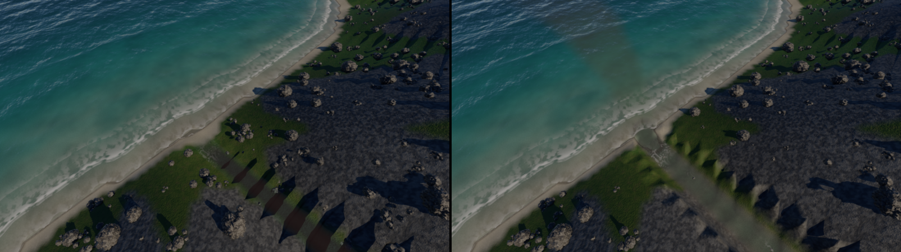

- **What to look at:**
  - The plume reads as a brownish band from above; it may want to be fainter.
  - From far away a river sits in its channel and shows less than the old ribbon did, which lay
    on the ground and mirrored the sky at grazing angles.
  - Where the 8 m field jumps 5 to 15 m between samples (#106's roughness), the level water cuts a
    gorge through the spurs: a fifth of the points stand more than 2 m under their lowest bank.
  - The 8 m cells beside the channels keep their facets and their shadows (#106).
- **Cost** (`docs/PROFILE.md`): the frame +0.03 to 0.09 ms over seven views, most where the bed
  fills the view (its layer blends with the grass's, `shading/layered` +0.09 ms down a river);
  `water/surface` +0.003 to 0.011 ms, the plume's grid keeping the sea's share to 0.006 ms. At
  start 0.75 s for the rivers' water and channels (twice: the ground's layers and the water), and
  1.5 s more in the cook.
- **Stability:** frame to frame the same or better in every view (down a river 1.00 → 0.42 %,
  the old sheet of water shimmered over the stepped floor), over 32 frames within 0.004 %.
- **Checks:** the batch changes only the island's images (52 582 px, ꟻLIP mean 0.0099; with the
  water 56 139 px, 0.0106); the A/B harness and mesh against
  fallback at 0 px; validation clean; tests (the refined mesh without a crack, the level under
  the banks, the tributary at its river's level, the channel's profile and seams, the stones on
  the bed), clippy, fmt.

**The lakes** (step 7, D-038's lakes, 2026-10-01). The 15 lakes of a hectare or more were painted
into the layer map; with the water each is now water of its own, a level plane, and the rivers
through it take its level:
- **The plane and its mask** (`forge_procgen::lake_waters`): the priority flood's depression at
  the lake's level (from the lake's samples, every neighbour where the flood stands at that level:
  its shallow margins too, which the lakes' 0.5 m threshold leaves out) and a sample more all
  round where the ground rises through the level (not past an outlet, where it falls away under
  it, since #120). The plane covers the mask's box at the level; the mask, a bit a sample and
  softened over half of one, clips it to the lake, and within it the ground rising through the
  plane draws the shore.
- **The shore on cells of a metre.** The 8 m cells of a mask whose ground spans the level within
  a metre, and a cell more all round, are drawn finer like the rivers' channels (51 958 cells
  refined in all, 4.2 M fine vertices), on the smoothed ground, not carved: the cubic's weight is
  1 wherever every cell around a sample is refined and 0 on the refined region's outline, so the
  shore is a smooth curve where the 8 m triangles drew a polygon.
- **Its water is the rivers'**: the same shading (`fresh_water` in `water.slang`: the ripples on
  the flow, the sky, the sun, the rays, the bed through the true depth), still but where a river
  runs in: the 20 points where a river enters a lake join the mouths' list, and the river's jet
  carries its ripples out into the lake as at the sea. The lakes are drawn before the rivers, and
  a river's ribbon fades out over its first three points in the lake at the lake's own level, so
  the handover is between two surfaces with the same ripples, level and water (where the lake
  takes the river on: #120, below). Patches of calm
  and of wind ripples drift over a lake (the ripples' slopes from 0.15 to 1 over a noise 60 m
  across, at 1.3 m/s), the river's own ripples where it runs in.
- **No channel through a lake:** a river's channel fades out in the lake
  (`ChannelParams::carve_lakes`): carved on, it showed as a dark trench under the water
  (`reports/2026-10-01-105/lake-outlets.png`). Until #120 it stopped where its course was under
  the lake's mask at both ends of a segment, in a round cap short of the water.
- **The bed** under a lake is dark mud (`island: lake bed`) wherever the plane stands over the
  ground (the ground as drawn, refined cells included), and the lake's water its own, darker
  than the rivers' (absorption 1.0, 0.6, 1.2 m⁻¹: the dissolved matter taking the blue), mixing
  to the rivers' along an inflow's jet; the GPU's rocks keep off the lakes. (At first the bed was
  the sea floor's silt and the water the rivers': from the air the lakes read as pale patches,
  `reports/2026-10-01-105/lakes-dark.png`.)

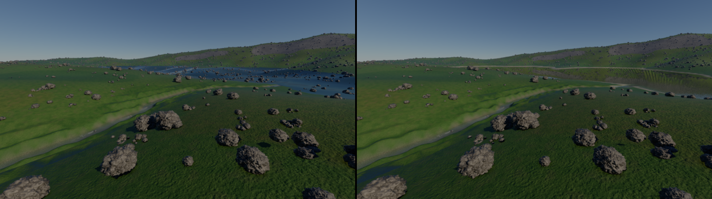

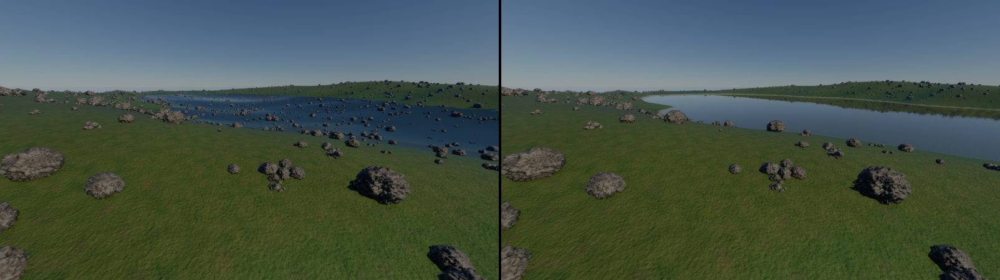

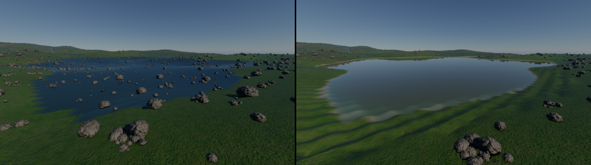

- **What to look at:** the depression at a lake's level reaches up the inflowing valleys, where
  the water is centimetres deep over silt; the far shores still show the stepped 8 m slopes
  beyond the refined band (#106); where the ground stands under the level at the edge of a mask
  (an outlet's channel), the plane ends there, softened over half a sample.
- **Cost** (`docs/PROFILE.md`): +0.04 to 0.09 ms in the lake views, most of it their mirror and
  shadow rays (`water/reflections` +0.02 to 0.05 ms) and the silt's layer; the other views
  unchanged within 0.01 ms.
- **Stability:** frame to frame the west lake 0.36 → 0.50 % (its ripples' reflections move with
  the jitter), the round lake 0.33 → 0.24 %; over 32 frames at most 0.0035 %.
- **Checks:** the batch changes only the island's images (26 633 px, ꟻLIP mean 0.0061; with the
  water 31 296 px, 0.0070); the A/B harness and mesh against fallback at 0 px; validation clean;
  tests (a basin's water covers its depression and a sample more), clippy, fmt.

**The coast's definition** (#106, 2026-10-01). The coast's contours ran in straight segments with
corners every 8 m: the water's edge, the wet sand's, the sand's top. The field itself terraced
there, not only its triangles: `sea_floor` sets the samples at sea from the coast distance and
leaves the eroded land at the sea's level, so along a coast that runs across the grid the samples
alternate between land at 0 m and floor at −0.3 m, and the sea's level traced through them
steps with them (a cubic through them scallops instead).
- **The shore smoothed** (`forge_procgen::smooth_shore`): four passes of a 3 × 3 binomial filter
  over the samples within 3.5 m of the sea's level (the sand's top at 2.5 m among them), the rest
  kept. The coast's contours then run smooth through the samples.
- **Drawn finer:** the cells the sea's level or the sand's top cross, and a cell more, join the
  refined cells (76 856 in all with the rivers' and the lakes', 6.2 M fine vertices), on the
  smoothed ground, so the water's edge and the wet sand's follow a curve and not the 8 m
  triangles.
- **The layers' edges wander:** the layer map's lookup is offset by a texel (4 m) over a noise
  three texels wide (`RenderLayer::cavity` for the layered class; 0 for the city's streets), so
  the sand's top and every other layer's edge stop stepping along the map's 4 m grid.
- **What remains:** the sand's top still shows the 4 m map's texels softly (drawn by the ground's
  height since, below: "The sand's top"); the slopes inland keep
  their 8 m facets and their shadows' steps, and the ground there is as rough as the 8 m erosion
  made it, which the 2 m amplification is for.

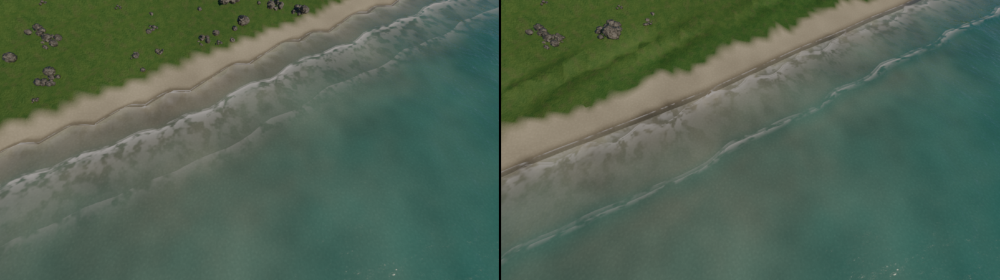

- **Cost:** up to +0.03 ms a frame (the wandering lookup up to 0.02 ms of `shading/layered`, the
  rest the refined cells). **Stability:** along the beach 0.44 → 0.26 % frame to frame, the same
  or better everywhere. **Checks:** only the island's images change; the A/B harness and mesh
  against fallback at 0 px; validation clean (`reports/2026-10-01-106/coast.md`).

**The ground's steps** (#106, 2026-10-01). The owner found the ground to the right of the first
view very uneven, and the valleys' sides step every 8 m; with the sun's shadows off the steps
still show, so they are the field's, not the shadows': the 8 m erosion leaves steps two samples
apart on the slopes (one sample a ridge, the next a gully). One pass of the 3 × 3 binomial filter
over the whole field (`GROUND_SMOOTHING` in the demo, before the sea floor) takes out what
alternates every sample and halves what repeats every four, and leaves the valleys, hundreds of
metres across, as they were.
- The valleys' walls lose their stripes, and the sand's top its teeth (they were the same
  gullies crossing 2.5 m).
- The rivers stand under their banks by 3.9 m at most where it was 14.5 m: the gorges the level
  water cut were mostly through those steps (621 points more than 2 m under their banks, from
  about 4 000). 14 lakes of a hectare or more where there were 15: the smoothing changes the
  depressions too.
- The rocks follow the new slopes.

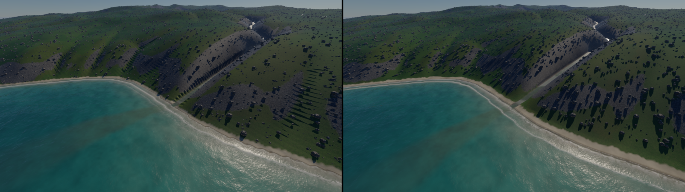

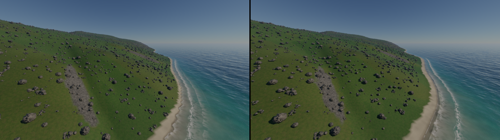
- **Cost:** none to draw; the frame within 0.04 ms of the lakes' commit over six views. Over 32
  frames as stable or more. **Checks:** only the island's images change; the A/B harness and mesh
  against fallback at 0 px; validation clean (`reports/2026-10-01-106/ground.md`).

**The swash's line** (#106, 2026-10-01). From above, a grey band with light dashes ran along the
beach where the waves run up, like a road's centre line. It was the foam at the swash's edge: the
sheet was whitened where under 8 cm (2 m wide on this beach), then cut up by the foam's 2.5 m
pattern.
The edge is now a line where the sheet is under 3 cm, which the pattern only frays (40 % of its
cover at most); the surf's broken water keeps its pattern.

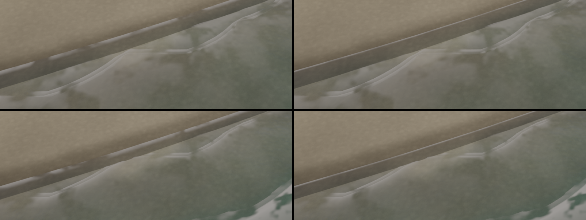

- **Cost** and **stability:** `reports/2026-10-01-106/swash.md`. **Checks:** only the island's
  water images change (ꟻLIP mean 0.0008); the A/B harness and mesh against fallback at 0 px;
  validation clean.

**The sand's top** (#106, 2026-10-01). The sand and the grass met in teeth along the coast, a few
metres deep and about ten apart: the layer map's 4 m texels, through the lookup's wander. The
map's rule for the sand is a height (gentle ground under 2.5 m), and the drawn ground there is on
cells of a metre, so the layered pass now applies that rule under each pixel
(`RenderLayer::contour`):
- Where the map shows the sand or one of the grasses (grass, dry, lush), the pixel takes the sand
  under 2.5 m and a grass over it: the map's own grass, or where the map shows sand, the heaviest
  grass among the four texels around the pixel (none: the sand stays).
- The height wanders by 0.3 m over two octaves of noise 7 m and 2.3 m wide, so the edge bends
  along the beach instead of running as a contour line. The layers blend over 8 cm of height, or
  the height a pixel spans far away.
- The other layers keep the map's edges: rock, the sea floor, the rivers' and lakes' beds. Where
  one of them meets the sand and the grass, the two heaviest of the three are shaded. The
  lightest fades out, its weight taken off the other two (#111): a third layer cost the whole
  pass a quarter of its warps.
- The traced rays' hits take the sand under the height too.

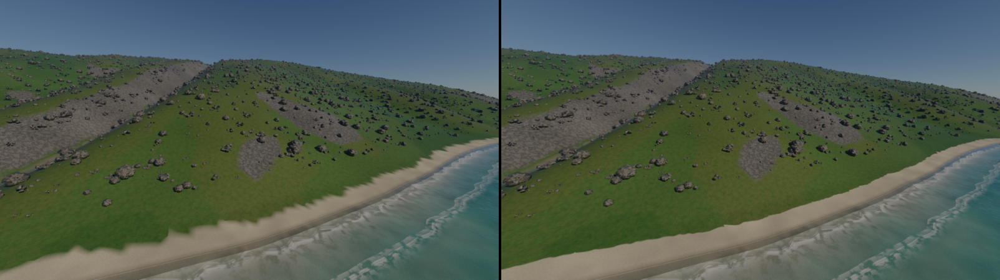

- **Cost:** 0.010 to 0.023 ms of `shading/layered` over six views. **Stability** as before. **Checks:** only the island's images change (ꟻLIP mean
  0.0045, 0.0053 with the water); the city's layered ground, the A/B harness and mesh against
  fallback at 0 px; validation clean (`reports/2026-10-01-106/sand.md`).

**The water up a valley from low** (#113, 2026-10-01). The owner looked up a steep valley from
just over its stream: the water showed only near the camera, and appeared further up as the
camera rose. Not the streaming nor the levels of detail (the same with every page resident):
the fresh water's contact fade measured its depth along the view ray under a *level* surface,
`path × v.y`. Looking up a river that falls 10–20 %, the water 50 m ahead stands metres over the
camera, so `v.y` was negative there, the depth zero and the water discarded, though its surface
tilts down towards the camera and is plainly in view. The depth is now taken under the surface
as it lies, tilted by the river's fall as drawn (`FreshWater::tilt`, uncapped where the shading's
`fall` stops at 30 %). From the logged view `up a steep river from low` the water runs up the
valley (ꟻLIP mean 0.015 on that view); elsewhere only the water's edge moves, by a thin line
(0.0004 down a lowland river, 0.008 at the largest mouth, under 0.00002 on the lake and the
first view). Sheet: `reports/2026-10-01-113/up-valley.png`.

**The rivers' banks, beds and lake entries** (#114, 2026-10-01). From the owner's view of a river
entering a lake: the channel read as a trench, the bed's colour ran wider than the channel and
fanned into the lake, and the channel stopped in a step at the lake's edge.
- **The bed, per pixel.** A pixel of the layered ground blends the four texels around it and the
  lookup wanders by one, so a bed painted on the 4 m map showed up to 8 m onto the banks, wider
  than most of the rivers. With the water the map now paints no river bed, and the lakes' mud
  only under a metre of water or more; the fresh water turns the ground it covers into its bed
  instead, at the ground's own brightness (grey-brown gravel for a river at 85 %, brown silt for
  a lake at 90 %, blended through the river's plume), exactly within its own coverage.
- **The banks by the bend.** In a straight reach the bank rises `0.3x + 0.06x²` from the water's
  edge (was `0.5x + 0.1x²`); in a bend the inner bank's slope falls to a fifth, a point bar, and
  the outer grows by three fifths, a cut bank (`ChannelParams::bend`: the curvature times the
  half width plus 4 m, times 2, is the bend's share).
- **Into and out of a lake** the channel shoals over 8 m plus three of its widths, to a fifth of
  its depth at the lake's edge (`ChannelParams::shoal`), so its bed meets the lake's shallows
  without a step (the lake's edge measured where its water stands since #120).
- From 40 m (`reports/2026-10-01-114/`): a river across the plain is a clean band where it was a
  blurred, jagged strip of bed texels (`beds-plain.png`, ꟻLIP mean 0.020); the lake entry has a
  crisp shore and silty water where it had a brown smear and a jagged grass edge
  (`beds-lake.png`, 0.14); the largest mouth's channel reads as shallow water over sand
  (`beds-mouth.png`, 0.054).

**The riparian strip** (D-041, 2026-10-01; `forge_procgen::paint_banks`, `RIPARIAN_STRIP`). A
river across the plain was a clean band in a uniform field of grass. The grasses within 6 m plus
two of a river's widths of its water now become the banks' growth, reeds, sedges and shrubs: a
deeper, bluer green than the lush grass, the grass's texture at a coarser scale
(`island_layer::RIVERBANK`, the row and id the river bed's layer had until the water drew its bed
per pixel). Near the coast the sand's contour still takes it under 2.5 m, per pixel. 88 202
texels at 4 m. From 300 m a darker corridor follows each river; from 3 m the banks are green to
the water (`reports/2026-10-01-112/riparian.png`, against da572f7, which also had the bed's
smear: ꟻLIP mean 0.014 from 300 m, 0.14 from 3 m).

**The estuaries** (D-041, 2026-10-01; `RibbonParams::estuary`, `ChannelParams::beach`). With the
coastal plain the mouths were calm, but each crossed the beach as a narrow channel with steep
walls, a canal. Under 1.5 m over the sea a river now widens towards its mouth, to twice its width
at the sea's level, and shallows by two fifths; its banks flatten there to three tenths of
their rise. The widest water at a mouth is 34 m (17 m before). From 40 m the mouths flare into
the surf (`reports/2026-10-01-110/estuary.png`: the gentlest and the largest mouth, from 4 m and
from 40 m; ꟻLIP means 0.11, 0.055 and 0.066).

**The confluences** (#115, 2026-10-01). A tributary's water ended in a straight edge a few
metres short of the river it joins, with a band across the junction. The channel was carved
through; the band was the tributary's own water thinning over the dry bed. Its ribbon faded out
from 4 m outside the main river's reach, and drawn first and standing a hair higher it kept the
depth, so the main's water never covered it.
- The rivers are now drawn per river, the largest first. The chunks of 64 segments never span
  two rivers, and only a river's neighbouring chunks merge into one draw.
- A tributary's water is whole from 1.5 m outside the main's water edge and gone 3 m inside it (six
  tenths of the half width in a narrower river, never on its middle), so
  its thinning blends over the main's water.

The tributary opens into the main river (`reports/2026-10-01-115/`; ꟻLIP mean 0.0073 on the
logged `confluence` view). Its corners are rounded since #119 (below).

**The rivers' size** (D-041's regional curves, `RibbonParams::island`, `city-blocks --river-k
K`; `k` = 3 by default since 2026-10-01, 0 for the catchment's square root). D-041 sizes a river
by the regional curves with an explicit exaggeration: `k · 2.7 (A/km²)^0.37` m wide,
`1.5 · 0.3 (A/km²)^0.21` deep, so the width grows downstream at nature's rate. With `k = 2` as
proposed, the largest rivers would narrow (the widest water 34 → 27 m with the estuaries) while
the small ones widen (3.5 → 4.2 m at 0.5 km²), against the owner's "small streams rather than
proper rivers". `reports/2026-10-01-112/river-size.png` shows the square root, `k` 2, 2.5 and
3, from 3 m down a lowland river and from 40 m over the plain:
- `k` 2.5 keeps the widest at 33 m and widens the rest by about half;
- `k` 3 reads as a river from the bank, the widest 40 m;
- the deepest is 0.75 m with the curve (1.0 m with the square root).

The owner picked `k` = 3 ("use k = 3 and keep the plain as default"). Against the square root
(seed 7, the same 50 rivers, 19 mouths and 11 lakes; `reports/2026-10-01-112/k3-views.png`, the
profile's four river views at frame 300, and `k3-mouth.png`, the batch's island at the mouth):
- the mouths 12–40 m wide (7–34 m), all but one under 5 % over their last 160 m;
- the deepest 0.75 m (1.0 m); stones breaking the water 1 148 (1 496);
- the banks' strip 239 k texels (183 k);
- the water deeper under its banks in the hills' V valleys: 602 points more than 2 m under
  the lower bank (125), the most 4.6 m (3.5). A wider channel climbs higher up the valley's
  walls; #116's benches are the cure.

The batch changes the island's two views only (ꟻLIP mean 0.0045 `island60`, 0.0057 `water60`).
The cost is in `docs/PROFILE.md`: +0.09 ms up the steep river, under 0.02 ms elsewhere.

**The rivers' valleys** (#116, D-041, 2026-10-01; `forge_procgen::carve_valleys`, `ValleyParams`,
`city-blocks --no-valleys` for the field as eroded). The erosion leaves the hill rivers in V
valleys whose floor is one 8 m cell. With the wider rivers of `k` = 3, the channels' carve cut
trenches into those walls: 602 points of water more than 2 m under its lower bank. Now the
valleys are carved into the 8 m field itself, before the rivers are traced for their water, so
every level of detail draws them:
- **Reach types.** Each point is typed by the water's fall over 40 m either way:
  - over 4 %, room for the water only (its half width plus 2 m);
  - 2–4 %, a bench one and a half widths past the water;
  - under 2 %, a floodplain three widths either side (12–64 m);
  - smoothly between them.
- **Deep valleys keep their walls.** Each side's floor stops where the ground stands 6 m over it.
  The floor's width changes by half a metre a metre at most along the course, and its edge
  wanders by a third over 96 m.
- **The floor** stands 0.3 m plus half the depth over the water, falling 2 % towards it.
- **The walls.** Past the floor a wall rises, steepening over 6 m to 0.15 plus 1.3 times the
  ground's slope beyond it, until it meets the ground (a smooth minimum over a metre). The wall's
  foot moves out and down rather than being cut, and the wall is never steeper than that.
- **Protections.** Nothing is raised, and nothing under a lake is carved. Within reach of a lake
  nothing goes under its level plus 0.5 m (the lakes are dams in narrow valleys). The carve fades
  out from 4 m of water level down to 1.5 m, so the mouths keep their beaches.

The rivers, the lakes and the ribbons are then traced again over the carved field (the field is
now made once a process, the sea, the camera, the layers and the cook all asking for it).

Seed 7:
- **Points by type:** 9 600 points get a floodplain (most of them on the coastal plain), 1 470 a
  bench and 6 578 room only; 967 are in lakes.
- **Earthworks:** 63 574 samples are lowered, by 7.9 m at most, and the lakes' guard keeps 2 449
  higher.
- **The gentler hill reaches** (water over 20 m) ask for a floor 22.4 m out on average and get
  21.4 m. Their valleys were already open: the ground at the floor's edge stood 4.4 m over it at
  most.
- **The steep hill reaches** (5 979 points over 4 %) keep D-041's V valleys with room for their
  water. So does the logged slot: its reach falls 14 % (5–23 %), and what darkens it is the
  sun's shadow in a narrow valley.
- **Lakes and mouths:** 11 lakes, 19 mouths and their falls are unchanged.
- **The water under its banks:** 602 → 125 points more than 2 m under the lower bank, the most
  4.6 → 4.3 m.
- **Start-up:** the carve takes 0.57 s at start (the island's cook 30.3 → 30.9 s).

`reports/2026-10-01-116/` holds before (left, `--no-valleys`) and now (right) at frame 60:
- `valleys-hills.png`: the logged slot from 3 m and 40 m, and a bench in the highlands at 284 m
  (`--view -613,287,2510,144,-10`, and from 40 m);
- `valleys-lowland.png`: down the lowland river from 3 m and 40 m, and up the steep river.

ꟻLIP means:

| View | ꟻLIP mean |
|---|---|
| slot, 3 m | 0.088 |
| slot, 40 m | 0.071 |
| bench, 3 m | 0.122 |
| bench, 40 m | 0.118 |
| lowland, 3 m | 0.096 |
| lowland, 40 m | 0.043 |
| up the steep river | 0.102 |

The batch changes the island's two views only (`island60` 0.0040, `water60` 0.0052).

**The steep valleys' look** (#118, 2026-10-01; `forge_render::textures::{gravel, scree,
scrub}`, `forge_procgen::paint_scrub`, `paint_valley_ground`, `bank_stones`). Most of the hill
rivers fall over 4 % and keep D-041's V valleys (#116). The owner chose to make them read better
through their look rather than wider floors: "go with the look: rocky beds, scree, plants on
the walls". Three procedural texture sets and three ground layers do it, so nothing is
downloaded:
- **Rocky beds.** Where a reach falls 2.5–4 % or more (the share of its texels growing with the
  fall, the threshold wandering with noise), the texels within 2.5 m ± 1.5 m of its water become
  cobbles and gravel. The water draws them under it as its bed (#114's tint over them), and
  beside it they are the floor `carve_valleys` left (23 810 texels).
- **Stones on the banks.** On that floor beside the water, a boulder past each point with a
  chance of up to two fifths from a 6 % fall, half a metre to three metres from the water's edge
  and 0.3–1.1 m across: 2 525 more boulders, clear of the water.
- **Scree.** On the walls' foot steeper than 0.55 (29°), up to 5 m ± 3 m over the nearest steep
  river's water, the pale broken rock (3 498 texels). On a third of those texels, a rubble pile
  at a fifth to two fifths of its size: 1 212 piles of broken rock.
- **Plants on the walls.** The rock of the valleys' walls under 1.4 (54°), up to 30 m ± 12 m over
  the water, becomes scrub, in patches (23 048 texels). Over the whole island, the wetter two
  thirds of the rock under 1.0 (45°) does too: the hollows (190 072 texels). The dry spurs and
  the cliffs stay bare.
- **The textures.**
  - Gravel: rounded cobbles over pebbles, grey, brown and ochre, 2.5 m a repeat.
  - Scree: flat-faced fragments with dark cracks, 4 m.
  - Scrub: seven rounded shrubs across 16 m, each its own green, over stony soil in their shade.

  All 512 × 512, tileable and hex-tiled like the others, generated in 210 ms at start (the
  island's only).

Before (left, d6699a7) and now (right), frame 60: `reports/2026-10-01-118/look-steep.png` (the
slot from 3 m and 40 m, up the steep river, the hills from 250 m), `look-wide.png` (a bench in
the highlands from 40 m, the island from 2.5 km), `look-zoom.png` (the scrub on the slot's sunlit
wall from 40 m). ꟻLIP means: slot 0.076, slot from 40 m 0.136, up the steep river 0.048, the
hills 0.037, the bench 0.053, the island 0.0041, the first view 0.0073. The batch changes the
island's two views only (`island60` 0.0062, `water60` 0.0073).

**The cost.** More of the valleys' pixels shade two layers:
- in the slot: `shading/layered` 0.565 → 0.617 ms;
- up the steep river: 0.599 → 0.681 ms, and the frame 1.960 → 2.057 ms;
- elsewhere, under 0.03 ms.

With #111's layered pass, which takes fewer registers, three rounds each at 1600 × 900:
- in the slot: 0.627 → 0.608 ms;
- up the steep river: 0.696 → 0.671 ms, and the frame 2.086 → 2.048 ms;
- in the slot from 40 m: unchanged (0.745 → 0.744 ms).

The scrub is a texture, read as shrubs from a few metres up. Close to the walls, shrubs as props
wait for Phase 8's vegetation (D-013).

**Where rivers meet lakes** (#120, 2026-10-01; `forge_procgen::river`, `channel`, `lake`). From
the owner's screenshot, a lake and the river leaving it: the river's channel ended in a round
hollow short of the water, 20 to 40 m of dry grass between them, and the lake's water hung past
its lip over the river's. Every junction was measured by the lake's 8 m samples, not by its
water:
- the channel stopped at the first segment with both ends under the lake's mask, the mask
  reaching a sample past the depression, so it ended in a round cap on the shore;
- the river's water faded out three points before the lake's deeper cells (over 0.5 m), and its
  level went under the lake's on the shallow margin, where its banks stood a freeboard over it;
- out of a lake, the lowest ground beside the river was the lake's own bed, so the river fell
  0.3 to 0.8 m at once, and the mask carried the lake's plane a sample past the lip, over it.

**What changed.**
- **The lake's edge is where its water stands:** a point is the lake's where the lake's water
  stands over its nearest sample. There the river is at the lake's level (a centimetre over it,
  so it draws over the lake's water as it fades), never under it upstream, its freeboard gone
  over 8 m and three widths towards it, and beside a lake its level, not its bed, holds the
  water up.
- **The lake takes the river on where it is half as deep as the river** (`lake_runs`): in a
  shallower flat at the lake's level the river runs on in its channel, its water at the lake's
  level. Its water is whole up to there and fades over its first three points in the lake; out
  of it, the reverse. Two runs a few points apart are one: a flat shore crosses the level back and
  forth.
- **Out of a lake** the river keeps the lake's level a sample past the lip, as far as the lake's
  mask fades, then falls 5 % a metre at most until it meets its own level, never over the lowest
  ground across it.
- **An outlet is a mouth too:** the lake's water within a cone back from the river's first point
  past the lake is the river's (its colour, its bed, its ripples drawn towards the outlet), as
  an inflow's jet is, so the two meet as one water. 20 lake mouths, 12 of them inflows (11
  before).
- **The channel** shoals and flattens its banks to three tenths into the lake's edge (a mouth),
  runs on into the lake over the same reach and fades out there, so it ends in no hollow.
- **The lake's mask** grows by a sample only where the ground rises through the level, the
  shore, not past the outlet.

Before (left, 191a295) and now (right), frame 60, from the logged `rivers into and out of the
lakes` views and from 70 m straight down (`reports/2026-10-01-120/`):
- **Into a lake** (`into-lakes.png`): on the plain, the river runs on in its channel across the
  lake's shallow margin into its water (ꟻLIP mean 0.034, from above 0.040); in the hills, where
  the river ended in a round pool on the shore, it runs straight into the lake (0.119, from
  above 0.051).
- **Out of a lake** (`out-of-lakes.png`): the hills' outlets open from the lake into the river
  where a cap and a grass band stood between them (0.044 and 0.067 from above, 0.018 for the
  second); on the plain's flat lake the river's channel runs on through the margin to the lip
  (0.128, from above 0.065).

**Numbers:** 12 runs in lakes (11 entries before), 20 lake mouths with the outlets; 86 875 cells
of 8 m refined (86 662), 1 390 000 at 2 m (1 386 592); the valleys' carve keeps 1 084 samples by
the lakes' guard (2 449), the rivers' levels by the lakes standing higher. The batch changes the
island's images only (`island60` ꟻLIP mean 0.0025, `water60` 0.0033, `island8-60` 0.0026); the
A/B harness, the streamed island against resident and mesh against fallback stay at 0 px;
`validate.sh` is clean; a test hands a river through a bowl's lake.

**Left for later:**
- On the plain's flat lake (centimetres deep over a kilometre) the lake's mask still ends across
  the outlet's channel in a straight soft edge, its 8 m samples' line; the outlet's mouth turns
  the lake's water there to the river's, which softens it. That lake went with #123; the same
  edge past the north-east lake's outlet is gone since its sill (2026-10-02, "The outlets'
  sills" below).
- Past a hill lake's lip a pale patch of thin water lies on one bank: the river's water over a
  bank lower than it at the mask's soft edge (a similar patch was there before, by the old cap).
  That lake went with #123 too.
- D-041's lake entry also widens the channel and paints a fan on the lake's floor: done since
  (2026-10-02, "The rivers' deltas into the lakes" below).

**The confluences' corners** (#119, 2026-10-01; `forge_procgen::river::Corner`, `channel`). The
owner, at the logged confluence: "the junction on the left could not be that sharp with flowing
water, same on the right". Each river's channel was carved on its own and the lowest kept, so
where a tributary met its river the two banks met in a corner on either side, the ground's and
the water's edge alike.

**What changed.**
- **A circle rounds each corner** (`Ribbon::corners`): it touches both rivers' water's edges,
  their own curves near the junction (Newton's method on the two edges' distances), its radius
  scaled until it touches them 2 m and the tributary's width from where they met
  (`RibbonParams::confluence`). An acute corner gets a tight circle, an obtuse one a wide one:
  8.6 m and 45 m at the logged confluence. None where a tributary meets its river in a lake or at
  the sea.
- **The ground** (`Channels`): inside the circle the bank rises from its arc as the banks it
  touches rise there. Between the arc and the old corner the water stands over a shallow bed,
  falling as steeply as the rivers' beds at their edges to half the shallower river's depth.
  Past the old edges that bed blends into the rivers' beds over seven tenths of the narrower
  half width, under them by then, so the old corner is gone under the water with no step.
- **The water** (`RibbonPoint::cover`): each part of a corner is drawn whole by the river whose
  edge is nearer. Where the tributary's water is fading into its river, the river covers it
  too. Each ribbon's water reaches past its half width there, and the ground draws the edge.
- **The water's edge across a ribbon** (`water.slang`) is measured in metres interpolated per
  vertex. It used to be a share of the half width times the half width, interpolated per
  triangle, which drew teeth where the width changes fast, as it does at a corner.

The corner's bank first rose as steeply as an outer bend's, from a bed falling at a twelfth.
The metre triangles across that kink stood centimetres over the water's plane, and the edge
followed them in steps a metre apart. Rising as the rivers' banks do over a bed as steep as
theirs, the edge is a smooth curve.

Before (left, a333254) and now (right), frame 60 (`reports/2026-10-01-119/`):
- `confluence.png`, `confluence-zoom.png`: the logged confluence (`--view
  3038,19.1,1409,-87.2,-20`), ꟻLIP mean 0.024, and from its other side (`--view
  3090,19.1,1405,92.8,-20`), 0.013. Both corners are now rounded and the water follows them.
- `from-above.png`: the same from 60 m (0.018), a junction at right angles on the plain (0.018)
  and one near the coast (0.018). The logged `the confluences' corners rounded` views are the
  four largest tributaries' junctions from 40 m.
- `junctions.png`: the right angle (0.015) and the coast's junction (0.014) from low, and a hill
  junction (0.022). Near the coast the tributary's clear water now fans out beside the river's
  pale, sea-mixed water.

**Numbers:** 51 corners at 26 junctions (the others meet their river in a lake or at the sea),
radii 17 m on average and 109 m at most (the obtuse corners'); 86 922 cells of 8 m refined
(86 875), 1 390 752 at 2 m (1 390 000). From 300 m the junction does not change; the rivers'
ripples shift a little with the metres across (ꟻLIP mean 0.008). The batch changes the island's
images only (`island60` ꟻLIP mean 0.0023, `water60` 0.0030, `island8-60` 0.0026); the A/B
harness, the streamed island against resident and mesh against fallback stay at 0 px;
`validate.sh` is clean; a test rounds a Y's corners: the old corner under the water, the arc its
edge, the water covering it, and no step on a 2 cm grid around it.

**Left for later:**
- The corner's water is a shallow shelf, not yet the bar and the scour hole real confluences
  have: no sediment of its own, and the river's bed is not deepened where the two flows
  meet.
- At a steep confluence the corner's water runs from the tributary's level to the river's,
  which can stand a metre apart. It follows the two ribbons' levels, not a surface of its own.

**The steep rivers' steps and pools** (#122, D-041, 2026-10-01; `forge_procgen::StepParams`,
`Step`, `channel`, `water.slang`). A third of the island's river points fall more than 4 %
(6 459 of 17 652, up to 54 %), D-041's type A, where a mountain stream runs in steps and pools.
Their water fell evenly from point to point. Seen up a steep river from low it was a slide, a
flat sheet with white streaks painted on it.

**Why not the far water first.** The roadmap had D-041's far water in the terrain's material
next. The far views (the island from 2.5 km, the plain from 60 m and 200 m, views down the
rivers) show the ribbons already doing what that layer was for:
- they are drawn at every distance, resting on the ground a pixel wide past a footprint, so no
  coarser level covers them (#113);
- the whole water surface from 2.5 km costs about 0.3 ms, mostly the sea.

Their light holds together too:
- Toward the sun the far rivers and a lake turn white with the sun's glitter; without the
  highlight they are dark blue-grey lines. The lake's glint stands at 212 against the sea's 169
  in the same glare, nearer the peak.
- From low the far rivers mirror the hills behind them, which their mirror rays meet rising at
  about 4° (started 2 m higher, they still do: it is not the traced ground's error).

A water layer in the terrain would change nothing visible, so it is left out (D-041's note).

**What changed.**
- **The profile** (`river::step_pools`, after each river's levels, so a tributary joining in a
  pool ends at the pool's level):
  - Where the reach's slope (`RibbonPoint::grade`) passes 4 %, and on while it stays over 3 %,
    clear of a lake, the head, the river it joins and the estuary, the water stands in pools.
    Each pool is at the level the water had at the next step's lip, so it is never higher than
    it was.
  - The steps are a width apart at 4 % and 0.4 of one from 15 % (the island's widths are three
    times nature's, so 0.6 to 4.5 natural widths with the jitter; Montgomery & Buffington 1997:
    half a width to four), 3 m at least before a jitter of half again or half as long, and no
    more than 2 m high.
  - Each fall is four points (the lip, just past it, just short of the foot, the foot): level
    up to the lip, steep between, 0.4 m long a metre it drops.
  - Over a lip the water is two fifths of its depth. Under the fall the pool is scoured by
    H/L/S (Abrahams et al. 1995, one to two): 1.8 at 4 %, 1.3 from 15 %. Its bed rises to the
    next lip.
  - Each step's line bows downstream, an arch in the middle and a slant toward a bank, drawn up
    to two fifths and three fifths of the half width (`RibbonPoint::lip`, `lip_shift`).
- **The bed** (`Channels`):
  - The banks rise from the level the water had before the steps (`RibbonPoint::unstepped`).
    Over a pool lower than that they climb back to it within a metre or so of the water, so
    the banks run on down the valley evenly past the steps.
  - Each segment from just past a lip to the margin past its foot carves nothing upstream of
    its own start. A lower segment's reach back cut the step away, and the banks beside the
    falling water.
  - The fall's segments carve as the water bows, its query moved upstream by the bow, so the
    bed holds the water exactly where the GPU draws it.
- **The lips' boulders** (`stones`):
  - Three lips in five carry one or two boulders about as tall as the step, somewhere across
    the middle of the water (none on the others).
  - Searches quote Zimmermann and Church: steps form on immobile keystones. The boulders' size
    is Forge's choice.
  - At first each lip carried a row of them over 55 % of the width, with a gap for the fall:
    25 740 stones, "way too many rocks in the water" at the owner's first look. Now 5 640
    (`rocks.png`: that row against now, from the head, from 40 m over the steep river and at the
    logged step).
- **The water** (`water.slang`):
  - A step's points carry its foam: white from the lip down, then a boil fading across a third
    of the pool (`RiverPoint::f`).
  - The white widens the streaks' coverage (`froth`). It breaks into chutes across the river,
    glassy and white by turns, so a lip is no straight white line.
  - The step's vertices are bowed as its line is.
- **Kept the same:**
  - The 8 m field: the valleys are carved from the rivers without their steps.
  - The steep valleys' look reads the level before the steps.
  - The stones off the steps: each point keeps its index from before the steps for the draws.
  - The views down the rivers are picked among those points.
  - `--no-steps` gives the rivers as before: the same pixels as a2d7cca on four views.
  - What changes in the log: the view up the steep river is 1.7 m higher (it stands on the carved
    ground), and the points standing 2 m under their banks (by the level before the steps) are
    100 for 124, the points cleared below the feet no longer counted.

The first try was a staircase of full-width falls a few widths apart. From the head it read as
a ladder, the narrow streams' steps all at the least spacing; up close, as terraces. Smaller,
jittered steps, chutes, bowed lines and the boulders on the lips turned it into a rocky stream.

Before (left, `--no-steps`) and now (right), frame 60 (`reports/2026-10-01-122/`):
- `steep.png`: up the steep river from low (`--view 1956,111.4,1965,88.7,4`), ꟻLIP mean 0.37,
  a lip's two boulders now standing in front of that camera; the highest step on a river 5 m
  wide or more from 15 m down its pool (`--view -915,131.0,-3049,-118.5,-5`, logged as `the
  steep rivers' steps and pools`), 0.087: a slide before, falls between pools now.
- `head.png`, `head-zoom.png`: a stream near the largest river's head from low (`--view
  -939,325.0,-177,126.5,-6`), 0.034.
- `from-above.png`: that stream from above (0.034), the steep river from 40 m (0.11) and the
  logged step from 30 m (0.057): bands of white water across the river, a boulder here and
  there.
- `far.png`: the island from 2.5 km (0.0089) and the plain from 200 m (0.0074).
- `rocks.png`: the row of boulders on every lip (35b78ce) against one or two on three lips in
  five.
- `far-light.png`, `far-mirror.png`: the far water as it was, its light taken apart (above).

**Numbers:**
- 5 805 steps on 27 rivers, 0.54 widths apart on average, 0.70 m high on average and 2.00 m at
  most.
- The deepest water 2.18 m, in a plunge pool (0.75 m before).
- 38 534 river points (17 652) and 5 640 stones (1 843).
- 86 919 cells refined (86 922).

**Cost** (`docs/PROFILE.md`): the head stream 2.82 ms either way; the island from 2.5 km 3.62 →
3.68 ms, `water/surface` 0.03 ms more for the steps' segments.

**Checks:**
- The capture batch changes the island's images only (`island60` ꟻLIP mean 0.0035, `water60`
  0.0046, `island8-60` 0.0033: the hills' streams in the distance). The A/B harness, streamed
  against resident and mesh against fallback stay at 0 px.
- `validate.sh` is clean. 215 tests pass, clippy and fmt are clean.
- A new test runs a 10 % valley's river in steps and pools:
  - each step drops the valley's fall over its spacing, and its pool stands level to the next
    lip;
  - its line bows, and the pool below starts past the bow;
  - the foam is white at the foot and gone by the next lip;
  - along every segment of the stepped reach, sampled where the GPU draws the water, the bed is
    under the water in the middle, and past the edge the ground never is;
  - the floor 4 m out runs on past every lip without a cliff.

**Left for later:**
- Standing waves on the 2–4 % rapids as displacement, which need a finer ribbon near the camera.
- The falls follow each step's bowed line between the boulders, not each boulder's shape.
- Deep pools could darken further than the river's water over its gravel.
- If the steep reaches still look too busy, the knobs are `StepParams` (spacing, jitter, bow)
  and the share of lips with boulders (`lip_stones`).

**Fewer, larger rivers** (#123, D-041's scale, 2026-10-01; `IslandParams::{basins, basin_depth,
basin_turn, basin_lakes, basin_lake_radius, grade}`, `forge_procgen::flow::grade_to_the_sea`,
`RibbonParams::brooks`; `city-blocks --island-basins`, `--island-grade`, `--no-brooks`). The
uplift was a dome, so the rivers ran out on every side, each in a basin of its own: seven of
5–11 km² at the sea, and 50 rivers that all read alike. D-041 asked for two to four basins of
20–50 km² and the small rivers as brooks.

**What changed.**
- **Trunk valleys in the uplift** (`island_fields`):
  - Three trunks, spread evenly round the island from a seeded start, each moved by up to a
    fifth of the spacing.
  - Across each sector the hills' uplift is lowered towards the trunk's line by up to 85 %, a
    cosine from the line to the ridge halfway to the next trunk, whole on the ridges.
  - The lines turn by up to 0.3 rad over a noise at the coast's scale. The lowering fades out
    within 2 km of the heart, so the trunks' heads share one massif.
  - Along the trunks the ridges' noise is calmed by half: its crests split one of seed 42's
    sectors into five basins.
  - The coastal plain loses 70 % of what the hills lose. With none of it the basins fell back to
    the dome's (13, 11 and 8 km²): the trunks gather their flanks across the plain. With all of
    it their last kilometres lay at the sea's level (6.6 km² of land under 2.5 m against 0.6).
- **Lakes placed on purpose** (D-040):
  - The trunks drained most of the dams: the lake rule kept 4 lakes for 15.
  - A bowl on each trunk's line, 2.3–3.3 km from the heart, loses 85 % of the uplift at its
    centre. It is half again as long down the valley as its 550 m radius and two thirds as
    wide, its edge ragged by a quarter.
  - On seed 7 two hold lakes, in the north-east's and the south's valleys; the west's holds
    none.
- **The alluvium's grade** (`grade_to_the_sea`, after the lake rule): every land sample at least
  0.3 % of its way down to the sea over it.
  - The erosion only cuts, so the west trunk lay flat at the sea's level over its last 1.5 km.
  - The shore's rule (under 2.5 m) painted it a beach, and the river widened as an estuary all
    along it.
  - 145 372 samples are raised (16 768 on the dome).
- **Brooks** (`RibbonParams::brooks`): under 3 km² of catchment the regional curves'
  exaggeration eases down to nature's, smoothly in the area's logarithm. The `k = k_d = 1` at
  0.5 km² gives 2.1 m wide; from 3 km² the island's 3 and 1.5 are as before (12 m there).
- **A preview of the basins** (`preview::write_basins`): `genesis` writes `basins.png`, each of
  the eight largest in a hue of its own, and prints the largest at the sea.
- `--island-basins 0 --island-grade 0 --no-brooks` gives the island before: the same pixels as
  8525e6b from 2.5 km.

Before (left, those flags) and now (right), frame 60 (`reports/2026-10-01-123/`); the islands
differ, so each view is the one its own island's log picks for the same thing:
- `basins.png`: the basins at 8 m (`genesis`) and the overviews.
- `far.png`: the island from 2.5 km (`--view -6500,2500,-1416,-90,-35`). The west trunk gathers
  its tributaries across the plain.
- `above.png`: from 9.5 km (`--view 0,9500,0,0,-89`): the three trunks' mouths, two lakes in
  their valleys.
- `views.png`, by rows:
  - the largest river's mouth from low (`where the rivers hand over`, `into_sea`);
  - a river across the plain (the second of `views down the rivers`);
  - up a steep river from low (`up_valley`), a brook in steps now;
  - the largest lake (`the island's lakes`, the first).

**Numbers** (seed 7):
- The basins at the sea at 8 m: 23.1, 17.8, 11.7 and 7.9 km² (the dome's 11.4, 10.6, 8.5, 7.5,
  6.7, 6.3, 5.4).
- At 16 m on other seeds:
  - seeds 3 and 11: three of 15–24 km²;
  - seed 99: 19.5, 14.7 and 10.7;
  - seed 42: 15.7, 12.9 and 9.4, the weakest.
- In the demo:
  - 52 rivers (50) and 17 mouths (19);
  - the trunks 52, 47 and 40 m wide at the sea, every mouth falling under 5 % over its last
    160 m;
  - 4 lakes of a hectare or more (11);
  - 32 259 river points (38 534), 4 457 steps on 23 rivers (5 805 on 27), 4 226 stones (5 640).

**Cost** (`docs/PROFILE.md`, the same build with and without the flags):
- The island from 2.5 km: 3.54 → 3.56 ms.
- The plain from 200 m: 2.58 → 2.63 ms, the software raster drawing more of the new ground.
- Its heightfield is generated once in 7.1 s, then read from the cache as before.

**Checks:**
- The capture batch changes the island's images only, a different island (`island60` ꟻLIP mean
  0.060, `island8-60` 0.060, `water60` 0.10). The A/B harness, streamed against resident and
  mesh against fallback stay at 0 px.
- `validate.sh` is clean. 217 tests pass, clippy and fmt are clean.
- Two new tests:
  - Three trunks gather seed 7 at 16 m into three basins over 10 km², the largest over 20, half
    again the dome's three together, and two bowls or more hold water.
  - The brooks are nature's size at 0.5 km², the island's from 3 km², and widen downstream in
    between.

**Left for later:**
- Some logged views now fall on lakes: the first of `views down the rivers` and `a head`.
- The hills read smoother: the trunks' sectors lose the dome's ring of escarpments around the
  plain.
- On the narrowest brooks the steps keep their 3 m least spacing, 1.1 widths apart on average.
- The knobs, for the owner's look:
  - `IslandParams::basins` (3), `basin_depth` and `basin_turn`;
  - the lakes' bowls (`basin_lakes`, `basin_lake_radius`);
  - `grade`;
  - `RibbonParams::brooks`.

**Under the sea** (#108, 2026-10-01; `shaders/water.slang`, "under the water";
`reports/2026-10-01-108/`). The owner asked for the underwater environment to come
(on #105). This is its first part, the sea's; the caustics follow below, and the lakes' and
rivers' water seen from below comes next.

**What changed.**
- **The water at the camera** (`water/at-camera`).
  - It runs only when the camera stands within 20 m of the sea's level.
  - The waves carry each point of the level surface sideways, so it steps back by their
    displacement to the point they carry over the camera.
  - Its result is the plane of the mesh's triangle over the camera, displaced as the vertices
    are. The exact surface stood centimetres off the drawn one, and a camera between the two
    looked through no surface at all.
- **Under or over, per pixel.** Each pixel tests the point it looks through on the near plane
  against that plane. With the camera at the waterline, the line crosses the lens, tilted with
  the wave, and is drawn a pixel and a half wide and dark.
- **The surface from below** (`sea_from_below`): the sea's pixels that look out from under it.
  - Within 48.6° of the normal is Snell's window. The ray is bent out of the water to the sky,
    or to the island where the copy of the scene holds it, and the window's edge holds the
    horizon.
  - The sun shows through the waves as a GGX lobe a third as wide as the normals'. The light
    crowds into the window, its radiance up by the index squared.
  - Beyond that angle the surface mirrors the water under it (total internal reflection).
  - The waves break the window's edge into patches.
  - No mirror or shadow ray is asked for there.
- **The water between** (`water/under`):
  - What each pixel under the water meets is dimmed along the view ray by the sea's own
    absorption, the one the surface applies seen from above.
  - It is also lit only by what reaches its depth: red is gone a few metres down.
  - The light the water scatters towards the camera is added, falling off with the depth along
    the ray.
  - That scattering is scaled so the water seen straight down from its surface is the colour
    it shows from above. Elsewhere it follows a Henyey–Greenstein phase (g = 0.8): the sun's
    light along its refracted ray, the sky's straight down. The water glows towards the sun
    and the surface, and is darkest looking down and away from it.
  - The pass is dispatched indirectly, with no groups while the near plane stands over the
    water.
- **A view under the sea** in the log (`under the sea (--view)`). From the largest river's
  mouth it goes out along the river's course to where the floor lies 8 m deep, 3 m under the
  sea's level, and looks back to the shore across the floor, then up at the surface.

**Sheets** (`reports/2026-10-01-108/views.png`, seed 7, frame 60, 1600 × 900; by rows):
- across the floor towards the shore, and up at Snell's window, both from 3 m under
  (`4770,-3.0,-2847,91.1,-10` and `…,40`);
- towards the sun (`4770,-3.0,-2847,-60,35`), and the floor from 6 m (`4770,-6.0,-2847,91.1,-30`);
- the waterline across the lens from 0.48 m (`4770,0.48,-2847,91.1,0`), and from 0.45 m, where
  the camera's lower half looks at the wave in front of it from inside.

**Cost** (`docs/PROFILE.md`, 2560 × 1440):
- From 2.5 km and over the plain, unchanged.
- From 4 m over the largest mouth, 3.24 → 3.26 ms.
- 3 m under the sea, 3.15 ms: `water/under` 0.095, `water/at-camera` 0.018.

**Checks:**
- The capture batch is unchanged (42 images at 0 px), as are the A/B harness, streamed against
  resident and mesh against fallback.
- Four logged views within 20 m of the sea, which the batch does not hold, are unchanged to the
  pixel: the largest mouth, a wave from 0.5 m, a river from 9 m and a confluence.
- `tools/validate.sh` is clean and now also runs the view under the sea on both paths. The
  mouth from 4 m, whose `water/under` dispatches no groups, is clean too.

**Left for later:**
- The lakes and the rivers are not yet seen from below (their water draws from above only).
- The look is the sea's coefficients as tuned from above, so the water is a dark teal. Clearer
  or bluer water, an exposure that adapts under the water (`--day` already meters the frame),
  or light shafts are for the owner's look.
- Over the water, a camera within a metre of the waves sees the island mirrored in the faces
  of the nearest waves, in patches. That predates this work: four views compared to the pixel
  with the previous commit.

**Caustics** (#108, 2026-10-02; `shore_caustics` in `shaders/meshlet.slang`, `--no-caustics`).
The waves bend the sun's light into the water and focus it under their crests. The floor under
the sea now takes that light, seen from above through the water as from under it.

**What changed.**
- **Where:** in the resolve's layered ground, which already read the shore for the wet sand.
  Under the sea's level, the sun's share of a pixel's light (its shadow term) is multiplied by
  the caustics.
- **How:**
  - The light that reaches the floor `d` metres down crossed the surface up the sun's
    refracted ray.
  - A tilt of the surface turns that ray by a quarter of the tilt (1 − 1/1.333), so the surface
    maps onto the floor with the Jacobian I + d·k·H. H is the waves' Hessian there, taken from
    the cascades' slopes.
  - The floor's light is the surface's over that Jacobian's determinant: the area the light
    crossed over the area it lands on. It is brighter under the crests and darker between,
    the mean about kept (61–65 % of the changed pixels of the sheets' views brighten, on
    fewer dark ones). It is capped at 6×.
- **The cascades:** the 16 m and 128 m ones. The 1 km swell curves the surface too gently
  (under 1 % at 3 m), and is left out.
- **Their filtering:** the Hessian is taken over the wider of the pixel's footprint and the
  blur of the sun's disc at that depth (0.0093 rad), at the slopes' mip whose texels match.
  Deep and far caustics soften rather than alias.
- **The waves feel the floor:** each cascade is damped by the floor's depth under the surface
  point, as the surface's own waves are (Kitaigorodskii's factor, now in `shaders/shore.slang`
  for both).
- **Three limits:**
  - Past 3 m of depth the focusing grows no stronger. Deeper the map folds over, and the light
    of the other surface points that land on a point of the floor, which one point's Jacobian
    does not see, fills the dark cells in. Without the cap, the floor 8 m down was a network of
    black cells.
  - The contrast fades with depth (1 / e at 25 m).
  - It fades out where a pixel spans 0.5–1.5 m, and the work is skipped where nothing is left.

**Sheets** (`reports/2026-10-01-108/`, frame 60, seed 7):
- `caustics.png`: the floor from 3 m and from 6 m under the sea, without (left) and with
  caustics (right).
- `shallows.png`: the shallows off the first view's beach from 25 m, without and with, at full
  resolution.

**Cost** (`docs/PROFILE.md`, 2560 × 1440, `shading/layered`): 0.06 ms from the coast's first
view, nothing from 2.5 km, 0.09 ms across the floor 3 m under the sea, 0.12 ms with the floor
filling the view. The pass keeps its 96 registers.

**Checks:**
- The capture batch changes the four water images only, the coast's shallows (143 576 pixels,
  ꟻLIP mean 0.018).
- With `--no-caustics` those match the previous commit to the pixel.
- The A/B harness, streamed against resident and mesh against fallback are at 0 px.
- `validate.sh` is clean, the view under the sea included.

**Left for later:**
- The water itself carries no light shafts: the caustics' light is on the floor only.
- The river stones and the rocks don't take caustics: none stand under the sea yet.

**Under the lakes and the rivers** (#108, 2026-10-02). The last part of the issue: knowing
which water the camera is in.

**What changed.**
- **The camera's water.**
  - The CPU keeps the lakes' masks and levels and the rivers' points (`ShoreFields::fresh_at`).
  - A lake holds the camera when its mask covers the sample nearest it, and the camera stands
    between half a metre over the level and a metre under its deepest water.
  - A river holds it within half the water's width of its course, between the same bounds of
    its level and depth there.
  - `water/at-camera` then takes that water's level as the plane, and its absorption and
    scattering, the lakes' dark water or the rivers' silty one, in place of the sea's.
- **Their surfaces from below.** The rivers and the lakes get a second pipeline each, as the
  sea did, used when the camera can be under their water: in or over a lake or a river, or
  within 2 m of the sea's level, where a river's mouth holds the sea's water.
  - There a pixel looking out from under the water sees Snell's window and the mirror of the
    water. The surface is tilted by the river's fall, without its ripples, and blended by its
    coverage as from above.
  - Within 20 m of the sea, but higher than 2 m, they keep the shader seen from above alone:
    the one that can also see them from below shades the white water seen from above a few
    levels differently, the compiler's choice (47 pixels at the largest mouth from 4 m).
- **A view under the largest lake** in the log (`the island's lakes`, `under=`): at its
  deepest sample, halfway down its 18 m, looking up and across.
- **The light scattered towards the sun is capped** at 30 times what is scattered back up
  (`WATER_PHASE_MAX`). The lakes' water scatters much for what it absorbs, and a metre under
  a lake the glow towards the sun filled the view with white. Under the sea the sun now shows
  through the waves in the glow, rather than melting into it.

**What it looks like** (`reports/2026-10-01-108/fresh.png`):
- The lakes' water is the dark lake water tuned from above (absorption 1.0, 0.6, 1.2 m⁻¹):
  under it one sees a metre or two in a murky green, black by 9 m down, bright towards the sun
  near the surface.
- The rivers' water is silty and brown-green, and their beds show through a metre of it.

**Checks:**
- The capture batch is unchanged, as are the four views within 20 m of the sea.
- `validate.sh` now also runs under the largest lake on both paths, and is clean.

**Left for later:**
- Clearer lake water for diving, a choice of look (`LAKE_ABSORPTION`, `LAKE_SCATTER`), for the
  owner.
- The ripples on the lakes' and the rivers' surfaces seen from below.

**The rivers' deltas into the lakes** (#120, D-041's lake entry, 2026-10-02;
`forge_procgen::DeltaParams`, `Delta`, `paint_fans`; `city-blocks --no-deltas` for the rivers
before). #120 met the lakes where their water stands, but a river still ran in as it came:
- the trunk ran down its steps to a few metres from the north-east lake, then into its dark
  water through a neck as wide as itself;
- a brook on the plain reached its bay as a straight canal with square corners.

D-041's lake entry asks for three things (`docs/research/rivers.md`, its recommendation's
step 7).

**What changed.**
- **The water eases flat to the lake's level.**
  - The reach is 8 m and five widths before the lake's edge, the first point where the lake's
    water stands.
  - Over it the river's level becomes `L + (z − L)(2t − t²)`, `t` the share of the reach up
    from the edge.
  - It meets the lake with no fall. It falls a third faster than it did at most, two thirds of
    the way up, and is only ever lowered.
  - The valleys' carve (#116) reads the rivers' levels, so the floor beside the water comes
    down with it.
- **The channel widens.** Over the same reach the river grows as a trumpet, `1 + (1 − t)²`
  times its width and two fifths shallower at the edge, as the estuaries do. It stays so while
  its water fades into the lake's. Its banks already flattened into the shore there (#114).
- **A fan on the lake's floor** (`Delta`):
  - **Its shape.** In front of the mouth, a lobe 6 m and three and a half widths long along
    the river, at most three fifths of the lake's water ahead of it. The lobe is the disc whose
    diameter is that length, joined to a disc of the river's half width round the mouth. Its
    outline wanders by a fifth over one octave of noise.
  - **Its depth.** The water stands 0.3 m over its top at the mouth and 1.1 m at its far end.
    Past the outline its front falls at 0.3 (17°) to the lake's floor.
  - **The ground.** It only raises the ground, under the lake's water, before the channel is cut
    across it (`Channels`). The cells it raises are drawn finer, with a cell more round them, so
    the 8 m ground draws it too.
  - **Its sand.** Its top is painted with a new layer of silty sand, darker and greyer than the
    beaches' (`island_layer::LAKE_SAND`). The beaches' sand gives way to the grass over 2.5 m
    (#106), so it could not be used. The paint stops a sixth of the half length inside the
    outline, so the sand fades out where the front drops off.

**The first try** was a fan 10 m and four widths long, its top 0.2 m under the water and a
centimetre deeper a metre out, painted with pale sand to its outline. From above it read as a
white cloud in the lake, and at the brook's mouth it spilled onto the shore's shallows. Smaller,
deeper, darker, and painted only where the ground is the fan's, it reads as a shallow of sand in
front of the mouth that fades into the lake.

Before (left, 1606253, the same as `--no-deltas` to the pixel) and now (right), frame 60
(`reports/2026-10-02-120/`):
- `into-lakes.png`: the trunk into the north-east lake from 40 m up it (ꟻLIP mean 0.141), from
  4 m over its water (0.162) and from 40 m up (0.125); a brook on the plain into its bay (0.118)
  and a brook from the south into the same lake (0.062). The water widens into the lake over a
  shallow of sand where it ran into dark water through a neck.
- `from-above.png`: the three mouths from 70 m straight down (0.178, 0.118, 0.082). The fans are
  pale lobes in front of the mouths, darker towards their fronts.

The close views change beyond the delta too. The valleys' carve follows the eased water, and the
rivers traced again over the carved field move by a few metres over their last 50 m: the logged
junction views (`rivers into and out of the lakes`) moved from `1504,-1290` to `1506,-1294` and
from `2303,-890` to `2296,-891`, and their steps, stones and the valley's paint with them. The
demo logs the two longest deltas as `the rivers' deltas into the lakes (--view)`, from low and
from above.

**Numbers** (seed 7):
- 6 deltas, the fans 48, 23, 22, 17, 16 and 15 m long: the trunk, 11.9 m wide, into the
  north-east lake, and five brooks of 2.7 to 4.9 m into it and into the south one.
- 133 texels of sand.
- 71 271 cells of 8 m refined (71 220), 1 140 336 at 2 m (1 139 520); the valleys' carve lowers
  44 666 samples (44 625).

**Checks:**
- The capture batch changes the island's images only: `island60` ꟻLIP mean 0.0015, `island8-60`
  0.0016, `water60` 0.0019.
- The A/B harness, the streamed island against resident and mesh against fallback are at 0 px.
- `validate.sh` is clean.
- A new test runs the bowl's river into its lake by its delta:
  - its levels eased by the formula over the reach, never raised, still falling, the same
    beyond;
  - twice as wide and two fifths shallower at the mouth;
  - the fan's top under the water by 0.3 m and deeper away from the mouth, and the ground never
    raised over the lake's level less that, nor out of the lake;
  - the fan's cells refined and its top painted.

**Cost** (`docs/PROFILE.md`, 2560 × 1440): over the trunk's delta the frame takes 0.01–0.05 ms
more (`water/reflections` 0.1 ms more, `shading/layered` 0.03), a brook's within noise;
`timings.sh` within noise on every view.

**Left for later:**
- One channel runs in, and above the water the delta is the valley's floor: D-041's distributaries
  around sand bars at the large mouths are #127.
- The outlets' leftovers above: since done (below).
- The knobs, for the owner's look, are `DeltaParams`: the reach, the flare, the fan's length,
  its top's water, its front and its wander.

**The outlets' sills** (#120, 2026-10-02; `forge_procgen::Outlet`, `LakeWater::arm`,
`trim_outlets`, `ChannelParams::sill`; `city-blocks --no-sills` for the outlets before). Past the
north-east lake's outlet the valley's floor lies 1 to 60 cm under the lake's level for about
110 m. The lake's mask covered all of it, a sheet of centimetres of water round the river. It
ended in a wavy line across the river's channel, its 8 m samples', and the river's water began
in a straight edge across it a little upstream: from low, two waters meeting along a shaped line.
The research's outlet is "a sill at the lake level with a riffle below" (`docs/research/rivers.md`,
its recommendation's step 7).

**What changed.**
- **Where a river leaves a lake** (`Outlet`): the last point of each run in a lake that the river
  runs on past, where the lake's water still stands half as deep as the river.
- **The arm** (`LakeWater::arm`): the lake's samples more than 8 m past it down the river,
  within 40 m of the river's water either side, the water over them under 0.75 m deep.
- **Its water** is trimmed off the arm (`trim_outlets`): the river's is whole 4 m past the
  outlet, the lake's fades out over the sample from 8 m.
- **Its ground** rises 0.2 m over the lake's level, blended over the arm's samples, and the
  river's channel is cut through it (`Channels`): a low sill the river runs out over at the lake's
  level, before it falls past the lip as before. The arm's cells are drawn finer.

Seed 7: 173 samples trimmed off the arms; the refined cells are the same (the arms' were the
lakes' shores). Before (`--no-sills`) and now, frame 60 (`reports/2026-10-02-120/outlets.png`),
the north-east lake's outlet:
- from 40 m down the river and from 4 m over it, looking back at the lake (ꟻLIP means 0.0034 and
  0.0068): the lake's thin sheet round the river and its wavy edge across the channel are gone,
  and the river runs out of the lake in one channel;
- from 70 m straight down (0.0050);
- from the lake (0.0021): the outlet's banks stand over the water.

The means are small because the change covers few pixels.

**Checks:** the capture batch changes the island's images only (`island60` ꟻLIP mean 0.00025,
`island8-60` 0.00031, `water60` 0.00033); the A/B harness, the streamed island against resident
and mesh against fallback are at 0 px; `validate.sh` is clean; `timings.sh` within noise on
every view. A new test floods a flat past a bowl's lake: its arm is the flat's samples, none of
the bowl's; with the sill the ground beside the river's water there stands over the lake's
level and the channel under it, without it the flat is under the level; the trim clears the arm.

**The outlets' handover** (#120, 2026-10-02). At the hill lake's outlet
(`-183,328.8,-2109,78.3,-20`) a dark band lay across the channel past the lip, its upstream edge
straight. It was not the water's depth: keeping three fifths of the river's depth over the lip
changed nothing seen.
- **The cause** (debug colours in `water.slang`): the lake's plane is drawn wherever its mask
  reaches, softened over a sample whatever the ground, and past the shore that is over the
  channel carved under the lake's level. The river kept the lake's level only a sample past the
  last point where the lake's water stands over the uncarved ground, then fell to the ground
  across it, 28 cm lower 4 m on. Under the lake's plane the river failed the depth test, and the
  lake's water, fading out, showed the channel's bed through it: the band, and the straight edge
  where the lake's quad ends.
- **The fix** (`forge_procgen::ribbons`): out of a lake the river keeps the lake's level, a
  centimetre over it, to the point past the last where the lake's water is drawn at all (a corner
  of the point's cell covered, across its water's width), the outlet's arm left out as
  `trim_outlets` trims it (`LakeWater::in_arm`). Past that it falls as before.

Before (9f4f039) and now, frame 60 (`reports/2026-10-02-120/handover.png`):
- the hill outlet from 40 m (ꟻLIP mean 0.0026), lower down the river (0.0061) and from 70 m
  straight down (0.0029): the river runs out of the lake in one channel;
- the north-east outlet from 40 m (0.0008) and 4 m (0.0034): its river is held at the lake's
  level a few metres further, over its sill.

**Checks:**
- The capture batch changes the island's images in a few pixels (`island60` 4, `island8-60` 11,
  `water60` 8; ꟻLIP means 0.000001 to 0.000003).
- The A/B harness, the streamed island against resident and mesh against fallback are at 0 px.
- `validate.sh` is clean, and `timings.sh` within noise on every view.
- The test of a river through a bowl's lake now checks that the river keeps the lake's level as
  far past the lip as the lake's water is drawn, and a point more, and falls past that.

**A correction** (found with #127): those captures drew the ground the tile cache held. The
cache is keyed by the parameters' text, and the fix moved the river's levels in code only, so
the carve under the held stretch was the old one. On freshly cooked ground (`--recook`) the
river runs out of the hill lake in one channel all the same; those views differ from the ones
above by ꟻLIP means of 0.003 to 0.011.

## The bars in the large mouths (#127, 2026-10-02)

D-041's mouth rule: "distributaries split around bars where the catchment is large"
(`docs/DECISIONS.md`; `forge_procgen::BarParams`, `Bar`, `paint_bars`; `city-blocks --no-bars`
for the mouths before). The four largest rivers crossed the beach into the sea in one channel,
35–52 m wide after the estuary's widening.

**What changed.**
- **Where:** a river whose mouth at the sea (`sea_mouth`) is 20 m wide or more gets a bar, 40 m
  or more two.
- **The bars:** teardrops along the river, a blunt head upstream and a tail tapering
  downstream, two and a half widths long between them, ending a third of a width short of the
  mouth. Each bar is 0.3 of the width broad, give or take a quarter. Each its own: up to two
  fifths shorter, staggered along the river, turned a little, its outline wandering in long
  bays and spits.
- **Their sand** rises 1 in 12 out of the water to a crest 0.3 m over it, and falls 1 in 3
  under it to the channels' beds (`Channels`, after the channels' carve; their cells are drawn
  finer). The water stays level across: the sand rising through it draws the channels round the
  bars, as a lake's shore draws itself.
- **The river widens** by the bars' breadth over their length, a parabola along it, so each of
  the two or three channels keeps its share of the water. Across it, channels and bars take
  turns from the right bank.
- **The sand** is the beach's layer (`paint_bars`); on seed 7 the mouths were already sand.

Seed 7: four mouths with bars, two in each of the three largest (the longest 99, 78 and 66 m)
and one in the fourth (72 m); the widest river 86 m where it was 52; 10 more refined cells of
8 m. The demo logs the two largest mouths' views as `the bars in the large mouths (--view)`.
Before (`--no-bars`) and now, frame 60 (`reports/2026-10-02-127/`):
- `mouths.png`: the largest mouth from 40 m back up the river, 15 m over its water (ꟻLIP mean
  0.055), and from straight over its bars (0.061); the second's the same (0.067, 0.076). The
  channels run round the bars to the sea; past the bars they join again over the beach.
- `sea-far.png`: the largest mouth from 4 m over its water, 30 m back (0.028), a bar's head in
  front; and from 500 m up the valley, 80 m up (0.003).

**From far away** (fixed the same day, `reports/2026-10-02-127/`, "From far away"):
- **What it was:** the bars faded into the water past a few hundred metres. The cause was
  neither the ground's coarser levels of detail (`--lod-error 0.05` barely changed it), the
  sea's surface (shown in false colour, it stands under their crests), nor the wet sand
  (switched off, little changed).
- **The river's own water:** far away its ribbon lies on the ground across its whole width (the
  drape, `RIVER_DRAPE`), lifted a pixel and a half and drawn regardless of the depth under it.
  It covered the bars at 40 % or more. Without the river's water their pixels are the dry sand's;
  without the sea's they are unchanged.
- **The fix:** `forge_procgen::bar_spans` gives each ribbon point the span of each of its first
  two bars across it, from end to end of the outline at the water. The ribbon's points carry
  them to the GPU, and the river's water is drawn nowhere inside them, eased over its far soft
  edge (`on_span` in `water.slang`). Near, the sand hid the water there anyway.
- **A correction:** the same cut-out was tried while building the bars and judged useless.
  That judgement read the whole frame's ꟻLIP mean (under 0.00002), which a few hundred pixels
  cannot move. The bars' own pixels go from 116,120,120 (the water's grey) to 128,121,112, the
  dry sand's.

**Checks:**
- The capture batch changes the island's images only: `island60` 9 240 px (ꟻLIP mean 0.0020),
  `island8-60` 9 683 (0.0021), `water60` 9 092 (0.0026). That is the bars and the hill outlet's
  fix on freshly cooked ground (the batch before drew the old carve, above).
- The A/B harness, the streamed island against resident and mesh against fallback are at 0 px.
- `validate.sh` is clean; `timings.sh` within noise on every view (the island 1.583–1.586 ms
  against 1.582–1.585).
- 254 tests: a new one runs a broad valley into the sea. Its 64 m mouth gets two bars, the river
  widened by their breadths and otherwise unchanged, each bar short of the mouth, its crest 0.3 m
  over the water, the channels either side under it, the sand painted inside the outlines.
- The cost at 2560 × 1440 is in `docs/PROFILE.md`: a bar's mouth in view takes 0.03–0.07 ms
  more of the frame, its water wider.

**Left for later:**
- The bars only stand in the mouths' widened reach. True distributaries, channels leaving the
  river to reach the sea apart, would need a ribbon each.
- Bars on the large lake fans (the trunk's 48 m fan into the north-east lake), if the owner
  wants them.
- Past the widened mouth's banks, the steep sand face (`--view 4354,14,-2830,180,-25`) stands a
  few metres nearer the water. *Corrected the same day:* it is no berm but the river's own
  bank. The coastal plain stands about 1 m over the water there, and the bank climbs it over
  2–4 m; its face turned from the sun reads dark ("The island demo", below).

## Moving geometry (#79, 2026-10-02)

The first thing Forge draws that moves: `--movers N` sets N barrels drifting down the island's
four largest rivers, half under the water's level, rolling and bobbing, each river's barrels
spread along its course and starting over at its head (`reports/2026-10-02-79/`). They drifted
at 1.5 m/s here; since #107 the water carries them at its own speed and one in ten is moored
("Objects in the water"), so the views below are no longer the log's. It
follows `docs/research/dynamic-scenes.md` ("Recommendation for Forge"), in three steps: the
movers drawn with their motion vectors, their own acceleration structure (their shadows and
reflections), and the probes woken where they pass (#69).

**What changed.**
- **The movers' range** (`MeshletSceneBuilder::reserve_movers`): the instance table's last
  records. Nothing is added after them, and the static acceleration structure leaves them out.
- **Their transforms every frame** (`MeshletScene::set_movers`):
  - The CPU writes the movers' whole records (cell, offset, rotation, scale, bounding sphere)
    into a ring of three host-visible slots: this frame's, the frame before's, and one a frame
    in flight may still read.
  - `movers/upload` copies this frame's slot into the table.
  - `movers/cell bounds` takes the bounds of the movers' cells of 64 again (`cell_bounds_main`
    from a first cell).
  - No change to the culls: the two-pass occlusion tests again, against this frame's pyramid,
    whatever the previous one hides, wherever it stood before.
- **The graph sees it.** The table and its cells are graph buffers. When a scene has movers,
  every pass that reads them declares them: the cell and instance culls, the cluster culls,
  the mesh passes and the fallback's, the software raster, the shading passes and the
  reflections (`PassBuilder::buffer_if`). Scenes without movers declare nothing new.
- **Their motion** (`movers/motion`, `mover_motion_main`): for the pixels a mover shows, the
  point is taken back onto the mover through this frame's transform, placed by the frame
  before's, and seen by the camera of the frame before. It is written over the camera's
  motion vectors, so TAA reprojects the mover instead of smearing it (`taa.png`).
  `--no-mover-motion` is the A/B.

**Sheets** (frame 60, seed 7, 1 000 barrels):
- `barrels.png`: barrels on the largest river by its mouth (`4384,4.0,-2840,-88.9,-20`), and
  the first barrel from 4 m, floating in the lake at that river's head (the log's
  `barrels on the rivers` view, `-238.2,318.14,-1843.9,135.2,-18.1`).
- `taa.png`: that barrel without TAA, with TAA and its motion, and with TAA and the camera's
  motion alone. The last blurs its hoops and ghosts its rim: 2 394 pixels differ from the
  second, ꟻLIP max 0.27.

**Cost** (`docs/PROFILE.md`, 2560 × 1440):
- From the barrel's view: +0.02 ms with 1 000 movers, +0.05–0.13 with 10 000.
- `movers/upload` 0.002–0.006 ms, `movers/cell bounds` 0.003, `movers/motion` 0.032 (a pass
  over the screen).

**Checks:**
- Without movers the capture batch is unchanged (0 px), and so are the A/B harness, streamed
  against resident and mesh against fallback.
- `validate.sh` is clean, and now also runs 1 000 movers on both paths, synchronisation
  validation included.

**Their acceleration structure** (the second step, 2026-10-02; `SceneRays::declare_movers`,
`forge_gpu::DynamicTlas`). As the research recommends, the static structure stays as it was,
built once. The movers get one of their own, rebuilt every frame from nothing (fast to build,
not to trace):
- `movers/tlas instances` writes its records from this frame's table (`tlas_instances_main`
  from a first instance, so a hit names the mover's instance).
- `movers/tlas` builds it (`Commands::build_dynamic_tlas`). The graph knows the build's accesses
  now: its input, its output and the ray queries that read it (`BufferAccess::BuildInput`,
  `BuildWrite`, `AccelerationStructureRead`).
- Every ray traces both structures (`ray_blocked`, `trace_closest` in `meshlet.slang`):
  - the shadow rays the movers' after the static one, when that one let the ray through;
  - the mirror and probe rays both, keeping the nearer hit.
- The passes tracing rays declare it: the shading passes, the reflections, the water's
  requested rays and the probes on the compute queue (`MoversFrame`).
- So the barrels shadow the water and the bed, and the water mirrors them (`rays.png`: the
  nearest barrel at the mouth without the rays, with them, and the pixels that changed).
- Its cost (`docs/PROFILE.md`, 1440p): about 0.3 ms with 1 000 movers. The build takes
  0.14 ms, and the second traversal adds 6–30 % to the ray passes, as the research estimated.
  10 000 movers cost little more. Built on the async compute queue it gained nothing, so it
  stays on the graphics queue.
- The batch is unchanged without movers. `validate.sh` is clean with them, the build's and the
  rays' synchronisation included.

**The probes woken** (the third step, 2026-10-02; #69; `probe_wake_main`, `gi/probe wake`):
- A probe settles after 8 updates and then keeps its place and state; the movers may change
  what those were made from.
- Every frame, before the probes' rays, a thread per mover and cascade looks at the probe
  cells within a cell of the mover's bounding sphere of this frame and of the frame before.
  The settled probes whose cell the mover entered or left start their settling over: their
  age back to 0, so their relocation and classification run again, and as young probes they
  update every frame.
- A mover that stays over a probe leaves it alone, so a parked one does not wake it every
  frame.
- The demo's frame-120 log counts the young probes per cascade at the largest mouth from 4 m:
  none without movers, 4–10 with 1 000 barrels, 37–65 with 10 000.
- The pass takes 0.008–0.010 ms at 1440p, and `validate.sh` is clean with it.

**The demo the issue asks for, and a refit** (2026-10-02):
- Ships fly through the ballad's belt (`asteroids --ships N`, `--chase K`;
  `docs/demos/asteroids.md`, "Ships through the belt"): the same movers, a ship's hull with
  wings, banking into the turns, sharp under TAA by their own motion vectors.
- The issue asked to measure a refit against a rebuild (`FORGE_TLAS_REFIT=1`,
  `docs/PROFILE.md`): the update costs a seventh of the build (0.146 → 0.019 ms with 1 000
  movers), but the tree it keeps updating degrades as the movers travel (the reflections
  0.03–0.05 ms slower after 25 s with 10 000). The frame gains 0.03–0.10 ms with 1 000 and
  nothing clear with 10 000, so the rebuild stays.

**Left for later:**
- The woken probes blend at the probes' usual 97 %, not the research's 90 % for a faster
  change: the barrels are small beside a 4 m probe. (Majercik et al. 2021, re-read for #99,
  halve the hysteresis for 10 frames after a large change.)
- Where the water is drawn over a mover, its motion comes from the water's depth, not the
  mover's.
- The barrels jump back to their river's head past its end. The water parting around them is
  #107 (below).

## Objects in the water (#107, 2026-10-02)

The owner, on the rivers: the water should flow around obstacles, or at least react to objects
in it, like rocks or game items. The stones of the rivers' beds already part the flow
("The rivers' beds, level water, mouths and stones"); this is the same for what arrives or moves
at run time, in the rivers first, as the issue proposes (`reports/2026-10-02-107/`).

**What changed.**
- **A list of floaters every frame** (`WaterSurface::set_floaters`, `WaterFloater`):
  - The caller gives each thing's position, the radius of its outline at the water's level and
    its velocity.
  - The water takes the nearest 64 (`MAX_FLOATERS`), written after the frame's block in the
    same host-visible buffer.
  - With them goes a grid of 16 m cells, 32 a side around the camera, listing per cell the
    floaters whose reach overlaps it, so a pixel looks at those alone (`floater_grid`). Looping
    over all 64 in every river pixel cost 0.1–0.34 ms at 1440p.
  - A frame that writes none draws none.
- **In the rivers** (`floaters_at` in `water.slang`, after `stones_at`):
  - Each floater adds the stones' flow: the potential flow past a cylinder, white piled up in
    front, a rougher, whiter wake behind, widening and fading over 8 radii.
  - The flow is the river's relative to the floater. So a thing the stream carries at its own
    speed leaves the water as it is, and one held back or pushed through it parts the stream.
  - Its change fades out over the second half of 30 radii, so the reach has no edge.
- **The demo's barrels** (`--movers N`):
  - The water carries them at its own speed: a table of the seconds to each point of the
    course from the points' speeds, at least 0.2 m/s where a river slows into a lake.
  - One in ten is moored where it is and only bobs, so the stream runs past it.
  - The log's `barrels on the rivers` line now gives two views: the first barrel from 4 m, and
    the first moored barrel the water passes at 1.2 m/s or more, from above
    (`-1954.0,51.69,249.9,77.1,-49.6`).
  - `--no-floaters` is the A/B.

**Sheet** (`moored.png`, frame 60, seed 7, 1 000 barrels): the moored barrel without floaters,
with them, and the pixels that changed:
- The wake runs downstream (to the right): white water in streaks and a rougher surface over
  3–4 m, where the riffles' white already was.
- In front, the pillow of white is there (a debug colour showed it in place), but the white
  water's streak pattern leaves the 0.3 m in front of the barrel mostly clear, as it does for
  the stones.
- 8 588 pixels differ; ꟻLIP mean 0.0017, max 0.40.
- The carried barrels change nothing where they float: their speed is the water's in the middle
  of the river. Only the slower water towards the banks moves past them a little.

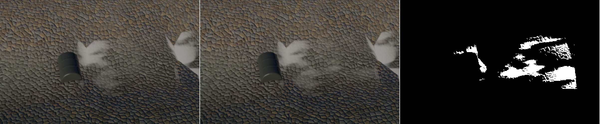

**Cost** (`docs/PROFILE.md`, 2560 × 1440, 1 000 barrels, two rounds): `water/surface` 0.081 ms
with the floaters against 0.069 without from the moored barrel, and no change beyond the
rounds' spread from the largest mouth (0.446–0.479 against 0.451).

**Checks:**
- Without movers the capture batch is unchanged (0 px), and so are the A/B harness and mesh
  against fallback.
- `validate.sh` is clean, its 1 000 movers included.

**The wakes** (the second part, 2026-10-02; `forge_render::wakes`, `shaders/wakes.slang`). In
still water and the sea a wake is waves, which the stones' flow does not draw. A first try on
the lakes, the stones' flow around a barrel crossing still water, gave a smooth pale crescent
rather than a wake: the lakes' white water has no streak pattern, and their ripples barely
follow a flow. So the lakes and the sea get the wave particles of `docs/research/water.md`
(D-038's afterwards; Yuksel, House & Keyser 2007):
- **What makes waves** (`WaterWakes::update`, `WaterWake`): the caller's list of things moving
  through still water this frame, the nearest 32, each with its outline's radius, its velocity
  and its speed upwards. The demo gives its barrels where their river has faded into a lake.
- **The particles**, on the async compute queue:
  - 30 times a second each thing adds 16 around its outline: a crest where it pushes the water
    out, a trough where it leaves it, rings where it rises or sinks (`wakes/emit`).
  - A particle moves out from where it set out at its waves' speed. When the gap to its
    neighbours on the spreading front passes half its radius it splits in three, a third of the
    height and of the angle each. It fades by e every 3 s and is dropped under 0.2 mm
    (`wakes/advance`, two buffers of 131 072 in turn).
  - Each carries a packet rather than a bump (after Jeschke & Wojtan 2017): a cosine envelope
    1 m across its radius over waves 0.5 m long running along its heading. Their speed,
    0.88 m/s, is deep water's for that length, so something faster leaves a V of half-angle
    asin(c / v), about Kelvin's 19.5° at 2.5 m/s. Their phase is the world's (where and when),
    so the packets of one front add up instead of cancelling. A single bump per particle drew a
    smooth glossy ridge; the packets draw crests.
  - As it is written, each adds its packet to a field of heights 128 m across around the camera
    (cells of 12.5 cm, whole micrometres added atomically, so a frame's field is the same
    whatever order the particles come in). `wakes/slopes` turns it into slopes.
- **The water's shading** adds those slopes to the sea's and the lakes' (`wake_slope` in
  `water.slang`), fading out over the field's last tenth, and where a pixel spans 6 to 25 cm:
  gone at half the waves' length, their Nyquist limit, past which the moving crests would
  only shimmer (the field has no mips). Faded from 10 to 40 cm at first, half their height was
  left at the limit and a quarter at 30 cm.
- **The towed barrel**: the last of the `--movers` barrels goes round a circle of 20 m on the
  largest lake at 2.5 m/s (its middle found as the mask's sample farthest from the shore). The
  log gives a view of it at frame 300, its wake grown (`2168.0,36.90,-1234.0,-102.9,-36.2`).
  `--no-wakes` is the A/B.

**Sheets** (frame 300, seed 7, 1 000 barrels, without the wakes, with them, and the pixels that
changed):
- `towed.png`: the towed barrel from its logged view. Crests ring its bow and trail 15 m behind
  it along its curve, the sun's glint broken on them; 35 138 pixels differ, ꟻLIP mean 0.0070,
  max 0.99 where a crest catches the sun.
- `towed-low.png`: the same 2 m over the water from 16 m: fine lines of ripples in its wake,
  fading out behind it where the view grazes the water; 4 080 pixels, ꟻLIP mean 0.0005.
- The barrels carried slowly through the lakes leave faint rings.

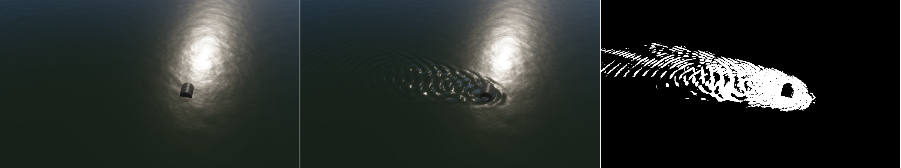

**Cost** (`docs/PROFILE.md`, 2560 × 1440, 1 000 barrels, two rounds):
- The frame grows by about 0.08 ms: from the towed barrel's view 3.60–3.62 → 3.68–3.70 ms, from
  the first barrel's 4.09–4.10 → 4.17–4.18 ms.
- On the compute queue, `wakes/advance` 0.08–0.11 ms, `wakes/emit` 0.014–0.018, `wakes/slopes`
  0.010, `wakes/clear` 0.004; `water/surface` 0.01 ms more for the slopes it reads.
- By the heights and the splits, a thing at 2.5 m/s keeps about 7 000 particles alive and one at
  0.2 m/s about 700: the buffers hold 131 072.

**Checks:**
- The same capture twice is the same to the pixel (the field's sums are whole numbers).
- Without movers there are no wakes and the batch is unchanged (0 px); `validate.sh` is clean
  with them (its movers runs make wakes).

**Left for later:**
- The wakes' particles cross the shore: they do not reflect, they fade where the water is not
  drawn.
- The rivers draw no wave particles: there the stones' flow stands for the wake.
- There are no game objects yet (`forge-sim`, Phase 3): the barrels stand in for them.

**Splashes** (the third part, 2026-10-02; `forge_render::splashes`, `shaders/splashes.slang`;
`docs/research/water.md` §7; D-038, "Splashes"). Spray where the water splashes, as ballistic
particles on the GPU: D-009's near water, visual only, without a fluid solver. None of the
shipped games the research found uses one for splashes.
- **Where it splashes** (`WaterSplashes::update`, `SplashSource`). Each source's drops follow
  the research's rules:
  - **Something meeting the water:** a crown thrown up and out round its waterline, a hundred
    drops a metre of it per m/s over 2 m/s (Duez et al.'s threshold), at 0.2–0.6 of its speed
    (Chentanez & Müller). When its cavity closes, 2 √(R / g) later, a jet rises, weaker for a
    buoyant body.
  - **A step's fall:** drops at its foot and mist over it, by how much of the drop lies past the
    falling sheet's break-up length (Horeni's 6 q^0.32 m). The 4 457 steps are four pieces
    across each, along the fall's line as the water bows it (`lip_shift`), plus the distance the
    sheet is thrown.
  - **A bow:** a fringe of drops from a Froude number of 0.7, fans either side from 1.5. The
    towed barrel's is 1.03, so it only spills.
  - **Drips** off something lifted out of the water.
- **The drops:**
  - They live in a ring of 65 536 slots that the CPU hands out in blocks, in order. The draw's
    order is the same from frame to frame, so nothing flickers where drops overlap: no dead list,
    no sort.
  - A stream's drops are born at fixed times from its seed (`(k + phase) / rate`), and their
    random numbers come from the seed and `k`, so a stream is the same at any frame rate.
  - `splashes/emit` and `splashes/advance` run on the async compute queue: gravity, a quadratic
    drag towards the air (the sea's wind at 0.15 near the water), and death where a drop falls
    back into its water. Mist rides over it instead.
- **The draw** (`splashes/draw`, after the water and its reflections, before TAA):
  - Each drop is a soft sprite streaked along its velocity over half a frame.
  - It is at least a pixel wide (a streak a pixel and a half), its alpha scaled by the area it
    lacks (Persson's phone-wire AA), so a far drop fades instead of flickering.
  - The light: the sun through a shadow ray, scattered forwards (Henyey–Greenstein), and the
    sky's irradiance. The brightest a drop shows is sixteen times a white surface in the sun.
  - It is hazed by the aerial perspective and faded against the scene's depth.
  - It writes an R8 reactive mask, its coverage × 0.9. There, TAA takes at least that share of
    the current frame, so the history does not smear the spray away.
- **The demo:**
  - With `--movers 2` or more, one more barrel hangs 3 m over the middle of the towed barrel's
    lake. Every 10 s it falls (meeting the water at 7.2 m/s), plunges, bobs, and is lifted out,
    dripping.
  - Its view is logged (`dropped`, `2160.0,30.55,-1234.0,0.0,-8.5`). With `--fixed-step` it meets
    the water at frame 164.
  - The steps' falls splash with or without movers.
  - `--no-splashes` is the A/B; the hidden `--no-reactive` drops the mask.
  - The exit log gives the most drops alive and those born.

**Sheets** (`reports/2026-10-02-107/`, the fixed step, seed 7):
- `splash-drop.png`: the dropped barrel at frames 160, 170, 185, 200 and 215, and 185 without
  the splashes.
  - The crown rises at 170, opens out by 185, and rains back at 200 while the barrel bobs up.
  - The jet stays hidden behind the rising barrel, as it should for a buoyant body.
  - At 185, 13 313 px differ, ꟻLIP mean 0.0043.
- `splash-reactive.png`: the crown at frame 175 with the reactive mask, without it, and without
  the splashes. Without the mask the crown is dimmer and smeared: 5 627 px, ꟻLIP mean 0.0014.
- `splash-fall.png`: the foot of the highest step (2 m) from 8 m, enlarged three times.
  - A scatter of drops in front of the white water, and a haze of mist: 67 660 px, ꟻLIP mean
    0.0103.
  - From the step's logged view at 15 m: 15 860 px, ꟻLIP mean 0.0024.
  - A 2 m step stays a compact plunge (Horeni), so its spray is fine. With the research's
    starting values (150 drops a metre a second at 0.15–0.35 of the impact speed) the drops
    barely left the white water. They are now 200 at 0.2–0.5, and 0.8–2.5 cm across.

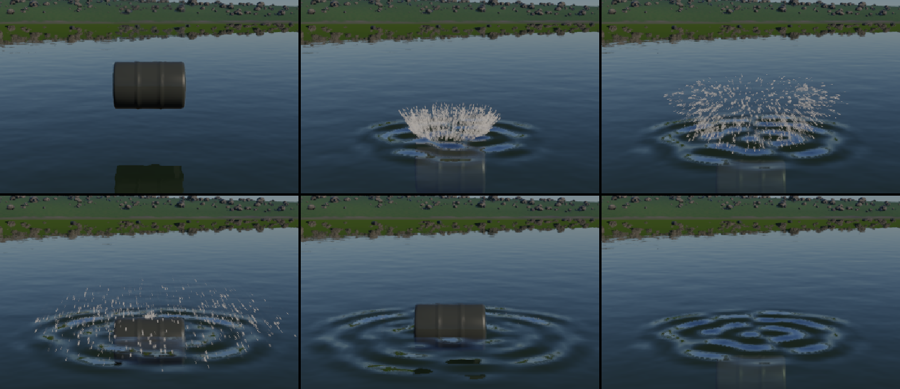

**Cost** (`docs/PROFILE.md`, 2560 × 1440, two rounds):
- From the dropped barrel over its cycle: `splashes/draw` 0.010 ms, emit and advance 0.004 ms on
  the compute queue, 1 447 drops alive at most.
- From 8 m below the highest step: the draw 0.032 ms and 0.007 ms of compute, 4 830 drops alive.
- The frame's total moves by up to 0.17 ms either way, from the async overlap. Serially it stays
  within the runs' spread.

**Checks:**
- The capture batch is unchanged (0 px): no fall lies within 150 m of its views.
- `validate.sh` is silent, with a run across the drop on both paths.

**Left for later:**
- **Landing:** drops falling back leave no foam and no ripples yet (the research's second step:
  a foam deposit, rings from the wakes).
- **The crown's curtain:** the crown is drops alone, not a sheet that tears into them.
- **Shore spray:** the shore's breaking crests throw none.
- **Mist:** it is sprites, not density in a froxel volume.
- **DLSS:** the reactive mask does not go to Streamline yet.
- **The underwater view:** spray over the water is not drawn as seen from under it.

## The ground in tiles, towards 2 m (#106, 2026-10-01)

The ground left on #106 is the 8 m field's own: its slopes keep 8 m facets and their shadows'
steps. The plan (#106): the ground cooked in tiles; then drawn at 2 m on the field's cubic; then
the amplification's detail on it (stage 5, `forge_procgen::amplify`), faded out near the water.

**The tiles** (`forge_geom::city::heightfield_window_mesh`, `CellWindow`,
`MeshletSceneBuilder::set_ray_group`). The ground is cooked as 8 × 8 tiles of 2 km
(`island@x-z` in the mesh cache), each on its own and in parallel, rather than as one mesh:
- **The same mesh, cut up.** A tile is a window of the whole field's cells, built with a cell
  around it so the vertices on its outline get the normals of every triangle they touch, then
  those cells dropped. Its vertices are the whole mesh's to the bit, normals included (a test):
  the tiles meet without a crack and shade alike across their borders. One tile over the whole
  field draws the batch's island to the pixel.
- **Their borders locked.** The cook locks a mesh's open edges at every level, so two tiles meet
  at any pair of levels. The cost: the borders keep their vertices at every level (1 525 roots
  instead of 175, 70 root pages instead of 8).
- **One surface for the rays.** The tiles are cut for the shadow and probe rays at one error,
  the finest whose triangles over all of them fit the terrain's 600 000, as the one mesh was:
  0.349 m against 0.312 m, the borders keeping their triangles.
- **One surface for the shading.** The layered ground's layers took each instance's tint and
  place in their textures (`standard_surface` hashes the instance), so every tile's border
  showed as a seam. A layered ground now shades as the first instance, so the island's ground
  and the city's look as before.
- **A far valley's blot.** With the tiles a far valley, drawn at a coarser level than the rays'
  cut and under it, shadowed itself in a dark blot. A terrain's shadow rays now start twice the
  drawn cluster's error further off as well. Near the camera, at no error, nothing changes; the
  one mesh could do the same wherever its levels fell that way.
- **The cook** takes 5 s on the 9800X3D where the one mesh took 16 s (45 s of work over 16
  workers). Pages: 661 MiB (652).
- **The frame** is 0.09–0.18 ms shorter at 1440p, 0.09–0.13 ms at 900p, over PROFILE.md's six
  views: the cluster cull walks each instance's DAG, and 64 tiles spread the walk that one mesh
  of 452 000 clusters kept on few threads (0.16–0.25 → 0.04–0.12 ms). From 2.5 km the software
  raster takes 0.04 ms more, for the borders' vertices (`docs/PROFILE.md`, "The ground in
  tiles").
- **Images:** the ground is the same, but the sea's, stones' and rocks' instance ids moved by
  63 (the tiles come first, so that an overflowing cull drops them last), and their tints hash
  the id; with the levels at the tiles' borders and the rays' cut, the batch's island view
  changes by ꟻLIP mean 0.024 (most of it the stand-in sea's tint) and its water view by 0.0055.
  The city's orbit view changes in 71 pixels (ꟻLIP mean 0.0003), from the shadow rays' start.
  The A/B harness and mesh against fallback stay at 0 px; validation is clean
  (`reports/2026-10-01-106/tiles.md`, with the blot before and after).

**At 2 m** (the default since the owner's look on 2026-10-01; `--island-drawn 8` draws the 8 m
tiles). The ground drawn at 2 m, 8 193² samples:
- **On the field's cubic, carved by the channels** (`Channels::cubic_height_at`,
  `Channels::fine`), so no 8 m facet is left; the channels', lakes' shores' and coast's cells stay
  at a metre (1.39 M fine cells in quads of a metre).
- **With the amplification's detail** away from the water (`--island-detail`, 1 by default):
  the field amplified to 4 m, then to 2 m, each over its own drainage (`forge_procgen::amplify`,
  "Amplification" above), blended over the carved cubic by a weight that is 0 within 4 m of the
  water's reach (the refined cells, the lakes, the ground under the shore's 3.5 m) and 1 from
  32 m (`DETAIL_FADE`, `forge_procgen::site_distance`). Where it is whole it adds 0.26 m root
  mean square, 4.8 m at most.
- **The rocks** stand on the drawn samples, and so does the rubble on the scree; the rocks'
  choice follows the finer ground's slopes, so they are placed anew.
- **The cost:** 143 M triangles in 3.3 M clusters, cooked in 45 s on the first start (278 s of
  work), 4.2 GB of pages on disk beside the 8 m tiles' (`island@x-z-2m`), 4 s at each start for
  the drawn ground, 0.3 GB more geometry on the GPU (1.8 GB in all with the 512 MiB pool). The
  frame is within 0.05 ms of the 8 m tiles' on PROFILE.md's six views at 1440p (the cluster cull
  0.02–0.04 ms more, the probes' rays up to 0.03): the cluster DAG keeps what is drawn to what
  the pixels need.
- **The look** hardly changes, from 3 m to 2.5 km: the slopes' 8 m steps were the field's and
  the smoothing took them out, the coast and the channels were already on cells of a metre, and
  the detail is a few decimetres under the grass texture. Three times the detail
  (`--island-detail 3`) changes little more. `reports/2026-10-01-106/drawn-2m.png`: a hillside
  at a river's head, a steep valley's wall from its water, the largest valley from 200 m; 8 m
  left, 2 m right.
- **Streamed only:** its 4.2 GB of pages exceed a resident pool, which the shaders address in
  32-bit bytes. The scene loads the pages of its first view's cut before the first frame
  (#121, D-025's start view): 290 pages (36 MiB) from the coast, so the first frame is already
  sharp, and the capture batch draws it at a fixed view that reads nothing more.

## The island demo (#96's step 3, 2026-10-02)

`cargo run --release -p island`: Phase 2's demo with the island as its scene and its own window
(`reports/2026-10-02-96/`). It runs `city-blocks`' renderer, now a library
(`city_blocks::main_island`), with `--island 7` unless another seed is given, so every option on
this page works on both. `city-blocks --island 7` draws the same island to the pixel.

**The golden shots** (`--shot NAME`, `demos/city-blocks/src/island_demo.rs`). Each is found in
the island's features, so it holds for any seed. The log lists them as `the island's golden
shots (--shot)`:

| Shot | Time of day | Where |
|---|---|---|
| `mouth` | dawn (0.08) | 140 m up the largest mouth with bars from them (#127), 60 m up, looking down the river into the sunrise over the sea |
| `lake` | morning (0.3) | the highest of the three largest lakes, 30 m over its water past its south edge, looking north across it |
| `island` | afternoon (0.7) | the whole island from 1.75 km off its southern beach, 300 m up |
| `valley` | dusk (0.92) | 40 m below the steepest point of a river 5 m wide or more, 2 m over the ground, looking up its steps and pools into the sunset |

A shot sets `--view` and `--time-of-day` unless they are given. `--time-of-day T` holds the sun
where `--day` has it T through the day (0 sunrise, 0.5 noon, 1 sunset), the exposure metered
from the scene as `--day`'s. The capture batch takes the four shots on both paths
(`mesh-shot-mouth` and the rest), and the mesh path and the fallback match to the pixel.

**The tour** (`--tour`): 70 s through the shots.
- **Its way:** from the valley up to the lake, across the hills and the plain to the mouth, then
  1.5 km on out over the sea and round to look back at the island from 220 m.
- **The path:** a Catmull-Rom spline through the shots, eased to rest at each for 2.5 s.
- **Over the ground:** between the shots it keeps 30 m over the highest ground within 60 m. The
  lift takes the most over 3 s either way, then its mean over 1.5 s, so the camera rises before
  a hill.
- **The view:** along its way, pitched a little down, turning to each shot's view as it comes
  to rest.
- **Run to run:** precomputed at 30 samples a second, so a frame depends only on its time
  (`--fixed-step` captures repeat).

At 1600 × 900 it takes 1.43 ms of GPU a frame (p99 frame 2.10 ms), and at 2560 × 1440 2.72 ms
(p99 3.67 ms; `docs/PROFILE.md`).

**Seen, left for later:**
- **The dawn mouth:** a dark blue band along the right bank, the bank's shadow on the water.
  - **What it is:** the river stands about 1 m under the coastal plain there, and its bank
    climbs that metre over 2–4 m. With the sun 6° up, that metre throws a shadow about 9.5 m
    long across the water, which loses its glitter there.
  - **Its cause:** dawn's own light, not a fault in the ground (measured across the river at 2 m
    steps).
  - **To soften it:** lower or gentler banks where a river crosses the coastal plain, the
    owner's call.
- **The tour's plainer moments:** climbing out of the valley, and the sea alone as it turns.
- **The planet variant** (orbit-to-ground, `docs/research/planet-terrain.md`): the demo's second
  step.

## The beaches by type (#128, 2026-10-02)

The owner's inbox asked for beaches of sand, of rock and of volcanic rock. Every shore of the
island was the same pale sand, the beach band the slope rule paints over the land's first metres
above the sea. Now `forge_procgen::paint_beaches` splits that band into two types
(`--no-beach-types` for the island before, `reports/2026-10-02-128/`):
- **Black sand, taken out the same day.** It went where the rock behind the beach is hardest
  (stage 2's hardness field, read as volcanic rock). The owner judged it makes no geological
  sense here, since the island's hard rock is no basalt. The rule keeps it for a volcanic
  island (`BeachLayers::black`); this island passes none. The report's first sheets, taken
  before, still show it.
- **Shingle** where the coast is roughest: on the headlands (much sea within 300 m) and under
  steep land (the land's height within 150 m behind). A quarter of the beaches away from the
  mouths. Its texture is new,
  `textures::shingle`: flattened pebbles of grey, blue-grey and brown stone with the odd white
  quartz, lying apart on coarse sand. The river beds' packed cobbles read as paving on a beach.
- **Pale sand** in the bays, on the gentler coasts, and within 400 m of a river's mouth, where
  the river brings its sand.

**How the rule reads the coast:**
- **Stretches:** the fields are read on a 32 m grid, each blurred over a few hundred metres, so
  a beach keeps its type along a stretch.
- **Ends:** within 0.8 of a standard deviation of a type's threshold, the types mix in patches
  about 10 m across, so one stretch fades into the next over tens of metres. Cut sharply, the
  first black stretch read as a dark rectangle.
- **Under the sea:** shingle runs 12 m out over the sea floor, so the water's
  edge does not show a pale floor beside a dark beach.

**The contour** (#106) now takes a set of layers under its height: the beaches' sand as before,
and the shingle. Each beach's top follows the drawn ground, not the map's
4 m texels. The layered resolve's registers are unchanged: 96, with no spill.

Seed 7, without black sand: of 30.4 km of beach, 22.9 km are pale sand and 7.5 km shingle. The
log gives a view of each, from 70 m out at sea: `the island's beaches: sand, shingle (#128,
--view)`. The rule and its views take 134 ms at start.

Before (`--no-beach-types`) and with the black sand still in, frame 60:
- `beaches.png`:
  - the shingle from 70 m out (ꟻLIP mean 0.055);
  - the black sand from 70 m out (0.123);
  - on the shingle (0.254);
  - on the black sand (0.242).
- `above.png`:
  - the black stretch from 400 m up (0.031), its ends mixing into the sand;
  - the island from the sea, the `island` shot (0.0056).

**Checks:**
- **The batch:** it changes the island's images only. `island60` changes by 19 px, `water60` by
  23 and the `island` shot by 2 539 (ꟻLIP mean 0.0056); the other three shots are unchanged.
- **The A/B harness and the paths:** 0 px.
- **Validation and tests:** `validate.sh` is clean; 256 tests pass. They cover the rule on a
  synthetic coast (shingle on its headland, black sand on its hard patch, pale sand in its bay
  and at its mouth, the dark types three texels out under the sea) and the contour's set.
- **Timings:** `timings.sh` is within noise. The island's layered shading takes 0.318–0.334 ms
  against 0.329–0.331, its frame 1.618–1.640 ms against 1.637–1.709.

## The rocks: a granite core, a limestone coast (#129, D-042, 2026-10-02)

The owner asked for rock types that make sense for the island. With the black sand gone (the
island's hard rock is no basalt), the owner picked its geology: a granite core under a limestone
coast (D-042). `forge_procgen::paint_geology` splits the bare rock the slope rule paints, last of
the rules that read it (`--no-rock-types` for the island before, `reports/2026-10-02-129/`):
- **Granite in the hills:** the rock above a height that wanders round the island between about
  20 and 70 m. It has a texture of its own (`textures::granite`): grey to pink, specked with pink
  feldspar, white quartz and black mica, weathered smooth into slabs, crossed by the odd sheet
  joint and stained by lichen. The old rock was one dark grey.
- **Limestone below it:** the low hills, the coastal plain and the sea cliffs, the old reefs
  raised with the island. Pale cream-grey, fine-grained and pitted (`textures::limestone`). The
  contact runs along a height, ragged by 4 m over a few tens of metres. It dips into each valley
  in a V, as level beds do.
- **Karst on the limestone:** pavements of pale grey blocks a metre or two across, moss in the
  fissures between them (`textures::karst`). They cover a fifth of the limestone's dry grass on
  slopes of 0.12 to 0.35, in patches 25 m across. A first try put them on the lush plain in
  white blobs that read as snow; karst lies on bare, drier slopes, and weathered limestone is
  grey.

Seed 7: 64 070 texels of granite (1.0 km²), 1 510 of limestone rock (the low land is gentle,
mostly grass over its limestone) and 17 948 of karst (0.29 km²). The rule takes about 130 ms at
start. The log gives a view of each: `the island's rocks: granite, limestone, karst (D-042,
#129, --view)`.

Before (`--no-rock-types`) and now, frame 60:
- `rocks.png`:
  - the granite from 150 m down its slope (ꟻLIP mean 0.076);
  - the limestone hill and its V of granite (0.075);
  - the karst's pavements (0.020);
  - the `valley` shot (0.0055).
- `island.png`:
  - the `island` shot (0.0079): the hills' granite pale against the green;
  - the stretch that was black sand (#128), pale sand again.

**Checks:**
- **The batch:** it changes the island's images only. `island60` changes by 4 767 px (ꟻLIP mean
  0.0016), `water60` by 5 234, the `island` shot by 6 922 and the `valley` shot by 12 738.
  The odd one out is `fb-ast-taa600`, 52 px with an ꟻLIP of at most 0.058: the ballad's frame
  600 flake (#71), which this change does not touch.
- **The A/B harness and the paths:** 0 px.
- **Validation and tests:** `validate.sh` is clean; 257 tests pass, one new. It covers the rule
  on a cone: limestone and karst only low, granite only high, karst only on the dry grass.
- **Timings:** `timings.sh` is within noise. The island takes 1.609–1.619 ms against 1.608–1.611,
  its layered shading 0.312 ms against 0.313.

**Later:**
- the boulders' colour following the rock under them, granite's pink in the hills and
  limestone's grey on the low ground (done in #130, below);
- the grus, the granite's coarse sandy soil, on its gentle slopes.

## The boulders where rocks gather (#130, 2026-10-02)

The owner, on #129's result: the boulders should follow the rocks, with "more varied shapes and
size", "and places that make sense. There's quite a lot, maybe too much". The island had
300 000 of the city's boulders and rubble: one squashed asteroid shape in one dark grey, kept
anywhere on its land with a chance that rose with the slope, so every hillside was strewn
evenly. Now it has 60 000 stones of its own rocks where rocks gather (`--no-rock-sites` for the
island before, `reports/2026-10-02-130/`).

**Where** (`forge_procgen::rock_sites`): a map of 8 m cells, each the weight of a rock in it
(0 to 127) and its rock (a bit). The likeliest site of a cell sets its weight:
- **talus**, 1: below the steep ground (slope over 0.55) within 40 m, lower than its mean
  height there. Talus is the rock it fell from: the granite's under a granite face, even on
  limestone ground;
- **scree**, 1: the scree's texels (#118);
- **crests**, 0.6: the granite's tops and ridges, 3 to 12 m over the ground 64 m around, where
  its corestones weather out as tors;
- **karst**, 0.35: the karst's texels, loose blocks on the pavements;
- **faces**, 0.06: the steep ground itself, a few blocks;
- **scatter**, 0.004: elsewhere on the land, none on the flat (deep soil, no stones) and all of
  it from a slope of 0.25.

Nothing lies on the beaches, the rivers' beds and gravel, the lakes and their beds, under 3 m,
or on the cells the channels and lakes reshape. Patches of noise 60 m across group the rocks,
a tenth of them left between the patches. A weight is rounded by a dither, so the scatter's
small weight keeps its share of the cells. The rock is D-042's contact
(`GeologyRule::is_limestone`, the line the ground's rock follows).

**Placed** (`placement::RockRule::Sites`): the CPU sums each rock's cells into a table of
cumulative weights; each slot on the GPU draws its cell from its rock's table (a binary search)
and a spot in it, so no slot is lost (with the old rule a slot that found no land in 32 tries
lay out of sight). The first slots are granite and the rest limestone, in the share of the
map's weights, so the CPU mirror of the meshes stays exact. A rock's size is 0.3 to 2.2 times
its mesh, the cube of a uniform draw: mostly small, now and then big. It leans two thirds of the
way with the ground, turns any way, tips a little, and sinks by 0.3 of its radius times the
slope. The city's placement is unchanged (`4e10743a3499dc0e`).

**Shapes** (`forge_geom::stone`, `PropKind::Stone`): cube-spheres pushed out to
superellipsoids and roughened by noise, sixteen of them, eight per rock. A rock is any of its
eight alike, so the shapes' counts are their shares:
- **granite:** five corestones (rounded blocks, exponent 3, of varied proportions), two
  exfoliation slabs (thin, exponent 2.4) and a tor (two or three corestones stacked, smaller up
  the stack);
- **limestone:** six blocks (exponent 6, cut by their bedding top and bottom, dipping a few
  degrees, and by two to four near-upright joints, pitted by solution) and two flags (thin
  blocks).

**Colour:** the granite's stones in the granite's texture and tint, the limestone's in the
limestone's, a shade greyer than its faces. The rivers' stones, the bank stones and the lips'
boulders keep their shapes (the water flows round them by their outline), in the granite they
were carried down from. The rubble on the scree is gone: the scree is a site.

Seed 7: 49 494 granite and 10 506 limestone rocks. By site: 28 511 talus, 9 579 on crests,
8 217 on the karst, 8 493 scattered, 4 914 on the faces and 286 on the scree, over 152 533
cells. The map takes about 570 ms at start, the placement 60 ms. The placed triangles fall
from 196 G to 8.7 G (clusters from 4.7 G to 0.2 G): the city's boulders were half a million
triangles each, the stones 77 k to 230 k.

**Tuned on the way** (seen in the first captures):
- **The scatter:** at 0.02 and on any ground it was 38 674 of the 60 000, pale blocks sprinkled
  evenly over the coastal plain. Now it is 0.004, from slopes of 0.05 up.
- **The faces:** at 0.25 they took 27 % of the rocks, an even spread over the granite's steep
  faces. Now 0.06: the rocks gather at the faces' foot.
- **The talus's rock:** first the ground's, which put pale limestone blocks under the
  granite's faces. Now the rock above.

Before (`--no-rock-sites`) and now, frame 60 (`reports/2026-10-02-130/`):
- `rocks.png`:
  - the granite's hill from 150 m (ꟻLIP mean 0.119);
  - the foot of a granite face, its talus granite (0.080);
  - the karst (0.084);
  - the granite's slope from 40 m, the shapes and sizes (0.174).
- `shots.png`:
  - the talus from close (0.103);
  - the `valley` shot (0.171): the dark rubble gone from its crests, and the whole frame
    moved by the probes' light and the metered exposure;
  - the `island` shot (0.0089);
  - the first view (0.0105).

**Checks:**
- **The batch:** it changes the island's images only. The exception is `mesh-ast-taa600`, at
  302 px: #71's flake. Two runs each of the old and the new build give the same frame.
- **The A/B harness, mesh against fallback:** 0 px.
- **The placements:** the city's is unchanged; the island's matches its CPU mirror.
- **Validation and tests:** `validate.sh` is clean. 261 tests pass, four of them new:
  - the site rule on a synthetic slope: talus under the cliff in the cliff's rock, none on the
    beach or the flat;
  - the stones: closed, on the ground and within their size;
  - a block's flat faces;
  - the placement's split between two rocks and its tables.
- **Timings** (`docs/PROFILE.md`): the island takes 1.493–1.507 ms against 1.583–1.620 and the
  tour 1.315–1.327 against 1.409–1.437, from fewer, lighter rocks.

**Later:** the grus on the granite's gentle slopes. The rivers' stones in the shapes of their rocks
followed (#132, below).

## The stones' LOD and the rivers' cobbles (#131, #132, 2026-10-02)

Two notes from the owner on #130.

**"LOD seems wrong for the rocks, I see the texture and maybe geometry changing even from close
distances"** (#131). The stones were cooked like the city's rocks, by their geometry alone
(`CookOptions::normal_weight` 0). Their coarse levels kept vertices whose normals no longer
matched the surface, so the shading and the props' triplanar texture, whose blend follows the
normal, changed at every switch of level. The chunks of the ballad met the same thing (#65);
the fix is theirs, the normals weighed per metre of the stone's size (`--stone-normals K`, 2;
`Stone::normal_weight`).

Measured as #65 did: a glide at 5 m/s past the granite's stones (`--view
-1184,140,-3178,-59.4,-15 --dolly 5`, fixed step, TAA off), each cooking at 1 px against its
own run at 0.125 px, 80 frame pairs (`--capture-every 1`, `imgdiff --then`, pixels whose change
to the next frame differs by more than 16 levels):

| Weight per metre | Pops per frame pair | GPU (one run) |
|---|---|---|
| 0 (before) | 6 415 px | 1.689 ms |
| 0.5 | 5 824 | 1.715 |
| 1 | 4 371 | 1.723 |
| **2 (the default)** | **3 142** | **1.769** |

At 0 whole stones speckle as they switch; at 2 what is left sits on their outlines and their
shadows' edges, the silhouettes' sub-pixel aliasing that TAA resolves (#65's floor).

**"Stones in a river should be more rounded because water erodes them"** (#132). They were the
city's lumpy, pitted boulders. They are now cobbles (`StoneShape::Cobble`): a superellipsoid of
exponent 2.2 with a faint noise, worn smooth, a metre long, 0.75 m high and 0.7 to 1 m wide,
standing as the boulders stood (the centre 0.65 of the radius up), so the water's outline of
each (`channel::Stone::waterline`) holds. Four are granite and two limestone. On granite ground
a river's stones are granite; on the limestone half of them are, the granite the river carried
down from the hills, and half are limestone. Holes and vesicles belong to young volcanic rock
(scoria, pumice); the island has none (D-042). `--no-rock-sites` keeps the boulders.

Checks (both together):
- **The batch:** against #130's, it changes the island's images only. The `valley` shot changes
  most, by 82 259 px (ꟻLIP mean 0.023), its cobbles; the island's views by about 1 850 px. The
  exception is `mesh-ast-taa600` at 302 px, #71's flake: no shader changed.
- **The A/B harness, mesh against fallback:** 0 px.
- **Validation:** clean; 261 tests pass, the stone test with a cobble.
- **Timings:** the island takes 1.501–1.503 ms against 1.491–1.493, the tour 1.324–1.337
  against 1.318–1.325: the stones' finer levels cost about 0.01 ms.

## The rivers' worn stones (#133, 2026-10-02)

The owner, on #132's round cobbles: a river's stones are "like other stones with different size
and shapes but often more like cobble / pebbles because water broken the big chunks first, but
they are more rounded at the edges because of erosion", and no giant ones beside the water,
where gravity would roll them away. "Pebbles are more likely in the river beds I think not very
big."

**Shapes** (`StoneShape::Worn`): a chunk broken off, then worn. A rounded box (a superellipsoid
of exponent 2.5) is cut by four to seven planes at random, each at 0.6 to 0.9 of the box's reach
along it: the faces of the break. Where the cuts meet the box and each other, a smooth minimum
(Inigo Quilez's quadratic one, credited) rounds the edge over about a third of the stone's
least half-size; a faint noise roughens the faces. Five granite chunks and three limestone ones,
each a metre long and 0.4 to 0.9 as high and wide, flat, blocky or long. A round pebble of each
rock (#132's `Cobble`) stays among them, one in six of the granite's and one in four of the
limestone's.

**Sizes** (`channel::stones`, `channel::bank_stones`):
- **In the water:** one stone in four is a boulder of 0.25 to 0.85 m in radius that breaks the
  surface, as before. The rest are pebbles and cobbles of 0.08 to 0.38 m, mostly small, lying on
  the bed. The chance of a stone past each point doubles to 6 % (over a third on the rapids):
  4 552 stones against 4 216, of which 3 866 break the water against 4 059.
- **Beside the water:** 0.08 to 0.33 m in radius instead of 0.3 to 1.1 (991 stones).
- **On the steps' lips:** unchanged, a boulder about as tall as the step (#122), now in the
  worn shapes.

**Checks** (the first change verified by tiers, Tier 0: a CPU-only change to the island's
props and procgen):
- **The gate:** fmt, clippy, 261 tests.
- **The sentinels** (meshlets, the ballad, the city, mesh path): 0 px against #132's batch.
- **The island's captures** (recooked): the views by 175–197 px (ꟻLIP mean ≤ 0.0003), the shots
  by 33–842 px apart from the `valley`, 232 577 px (0.0438): its stones and the water over and
  around them. The A/B pairs and streamed against resident: 0 px.
- **Left for Tier 2:** the fallback path, validation and timings (no GPU code or pass changed).

Report: `reports/2026-10-02-133/`.
