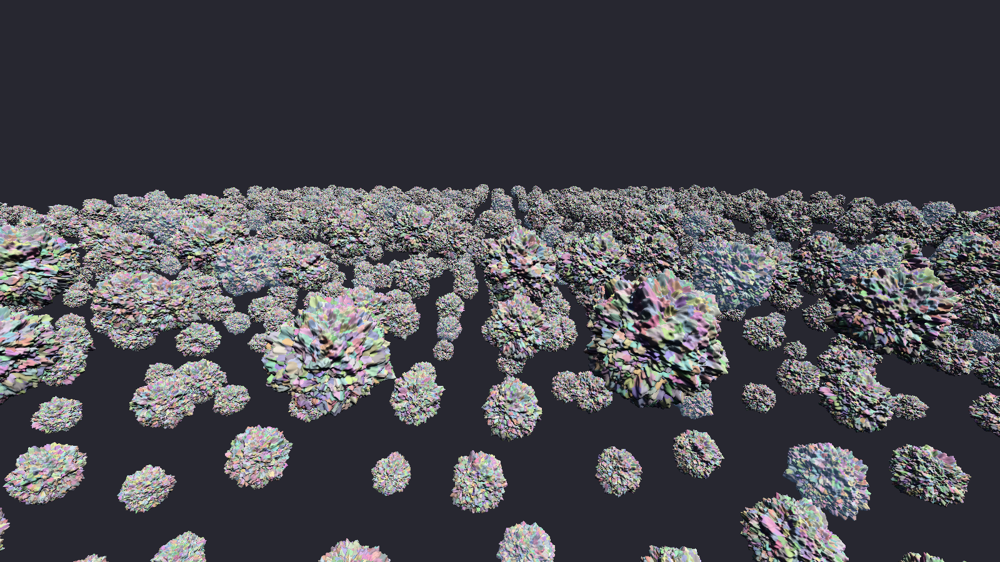

# Demo: `meshlets` — GPU-driven geometry: compute culling, mesh shaders, indirect-count fallback

Run: `cargo run --release -p meshlets` (options `--side N`, `--detail N`, `--roughness R`,
`--vsync`, `--validate`, `--no-occlusion`, `--lod-error PX` (1.0), `--no-lod`, `--orbit`,
`--frames N`, `--capture file.png --capture-frame N`, `--overlay`, `--ev100 EV` (15),
`--tonemap agx|aces|neutral|aces2|aces2-analytic`, `--force-fallback`, `--mip-check` (see
"Textures and the mip check" below), `--tone-check` (ACES 2.0's GPU paths against the CPU,
issue #76: see [asteroids.md](asteroids.md), "ACES 2.0")).
Controls: WASD/QE move, Shift fast, right mouse drag to look, **F1** profiler, **F** freeze
culling (move the camera to see what was culled), **C** cone culling, **V** frustum culling,
**O** occlusion culling, **L** cluster LOD, **K** LOD colours, **[** / **]** LOD threshold,
**M** meshlet colours (on by default here), **Tab** wireframe, **G** tone curve. The bench
draws without anti-aliasing or a sky on purpose: it measures culling, not looks; since
2026-09-24 it shades through the visibility buffer like the ballad (a compute resolve into
a pre-exposed HDR image at a fixed EV100 of 15, then the display transform into the
swapchain); the `asteroids` demo is where TAA, the sky and automatic exposure live.

With the cluster LOD DAG and the instance cull pass (2026-09-24, see
[asteroids.md](asteroids.md)) the static view draws 15 k meshlets and 1.09 M triangles in
**0.18 ms** at a 1 px threshold (0.15 before the visibility buffer's resolve pass); the
numbers below are the full-detail (`--no-lod`) figures that measure culling alone, taken
before the visibility buffer.
Machine: RTX 5070 Ti, driver 617.14, Vulkan 1.4, Slang 2026.13, 1600×900, 2026-09-24.
Research behind it: [research/gpu-geometry.md](../research/gpu-geometry.md).



## What it proves

- The whole Forge GPU stack works on this machine: `ash` device with the Vulkan 1.3 baseline
  plus `VK_EXT_mesh_shader`, Slang → SPIR-V through `slangc` with a content-hashed cache,
  timeline-semaphore frames in flight, GPU timestamps, validation clean.
- **No descriptor sets.** Every buffer is reached through its device address from one
  per-frame `Frame` block; the CPU pushes a single 8-byte pointer. This is the bindless model
  the rest of the renderer will use.
- **The CPU issues one draw per pass.** Compute passes cull instances and clusters (frustum
  spheres, normal cones, LOD, the depth pyramid) into a compacted list of visible clusters,
  and one indirect draw rasterises it: `vkCmdDrawMeshTasksIndirectEXT` with a mesh workgroup
  per listed cluster, or `vkCmdDrawIndexedIndirectCount` on GPUs without mesh shaders (see
  "Two paths, one culling" below; until issue #5 the culling ran in a task shader).
- Meshlets come from meshoptimizer (`meshopt` 0.6): ≤ 64 vertices, ≤ 124 triangles, cone
  weight 0.5, after vertex-cache optimisation. Bounds and cones are meshoptimizer's.
- **Two-pass occlusion culling** (Haar & Aaltonen 2015, Nanite 2021). Pass 1 draws the
  meshlets whose visibility bit was set last frame (since issue #33: that the previous
  frame's pyramid shows, with no bits; see "A million instances"). A compute pass builds a hierarchical-Z
  pyramid (1024×512, 11 levels, linear min-reduction sampler, conservative by construction)
  from that depth. Pass 2 projects every remaining meshlet's sphere to a screen rectangle
  (Mara & McGuire 2013), samples the pyramid at the rectangle's four corners at the level
  where a texel is at most the rectangle's size (provably conservative, see the shader),
  draws the survivors and rewrites the bits; previously visible meshlets are re-tested
  without drawing so the set never creeps. Normal-cone culling skips clusters whose cone is
  wider than a hemisphere (meshoptimizer marks them with a unit cutoff and a zero axis). Everything runs through the same global bindless set (images) and device-address
  buffers; the visibility bits were one bit per (instance, meshlet) on the GPU until #33.

## Two paths, one culling (issue #5, 2026-09-24)

Culling moved out of the task shader into compute, and both ways of rasterising draw what it
produces:

- **Instance cull** (one thread per instance): the frustum test and the LOD levels that can
  hold selected clusters at the instance's distance; appends the instance's work items
  (groups of 32 clusters) to the work list, or, when its roots alone are the cut, its roots
  to the root list (#37), and writes the cluster cull's indirect grid.
- **Cluster cull** (one per mesh pass; 8 work items per 256-thread workgroup, the root list
  after the work items at 32 roots to an item): LOD
  selection, frustum, normal cone and, in the second pass, the depth pyramid and the
  "visible last frame" bits; appends the survivors to the frame's visible-cluster list (pass
  1 from the front, pass 2 from the back, so neither draw needs the other's count; since
  #3 pass 2 follows pass 1, so the ids grow with the draw order). The last
  workgroup writes the pass's draw arguments.
- **Mesh-shader path:** `vkCmdDrawMeshTasksIndirectEXT`, one mesh workgroup per listed
  cluster, no task stage.
- **Fallback** (GPUs without `VK_EXT_mesh_shader`): the cluster cull also writes one
  `VkDrawIndexedIndirectCommand` per listed cluster and each pass issues one
  `vkCmdDrawIndexedIndirectCount`. The index buffer is the cooked triangle lists themselves
  (one byte per index, `VK_KHR_index_type_uint8`); a draw's vertex offset is the cluster's
  window of `meshlet_vertices` and its first instance the cluster's slot in the visible list.
  The vertex shader reads the slot back through `SV_VulkanInstanceID` (Slang's
  `SV_InstanceID` subtracts the base instance, the D3D meaning), the fragment shader adds the
  primitive id, which restarts at 0 in every draw: the same `slot << 7 | triangle` id the mesh
  shader writes, so the resolve cannot tell the paths apart. The only extra memory is the
  draw commands (20 B per listed cluster, 20 MiB per frame slot).
- `--force-fallback` (both demos) creates the device **without** `VK_EXT_mesh_shader`: the
  fallback runs here exactly as on a GPU that lacks it, and a stray mesh-shader call would
  fail validation.

**Pixel proof** (`tools/imgdiff`, tolerance 0, of 1 440 000 pixels): the fallback against the
mesh path, and the new mesh path against the task-shader path of the previous commit.

| Capture | fallback vs mesh | new mesh vs old task path |
|---|---|---|
| `meshlets` static, frame 60 | 0 | 0 |
| `meshlets --orbit`, frames 120 and 900 | 0, 0 | 0, 0 |
| `meshlets --orbit --no-lod` (full detail), frame 120 | 0 | 0 |
| `meshlets --orbit --no-occlusion`, frame 120 | 0 | 0 |
| `asteroids --fixed-step --no-taa`, frame 600 | 0 | 0 |
| the A/B harness on each path (`--no-occlusion`, `--no-cone`, `--show-culled`, `--no-group-window`) | 0 each | — |
| `asteroids --fixed-step` with TAA and automatic exposure (the golden), frame 600 | 0 | 14 946 at ±1 (see the draw order below) |

Validation and synchronization validation are silent on both paths in both demos, and with
the DLSS build.

**Numbers** (RTX 5070 Ti, 1600×900, GPU time per frame averaged over whole runs; the old task
path measured on commit 231d674 the same day):

| View | old task path | mesh path | fallback | drawn |
|---|---|---|---|---|
| `meshlets` static, LOD at 1 px | 0.180 ms | **0.180 ms** | 0.270 ms | 15 k clusters, 1.09 M triangles |
| `meshlets --no-lod` (occlusion on) | 2.09 ms | **2.15 ms** | 3.73 ms | 325 k clusters, 30.0 M triangles |
| `meshlets --no-lod --no-occlusion` | 5.70 ms | **5.77 ms** | 11.07 ms | 1 049 k clusters (list full, 92 k dropped), 97 M triangles |
| `meshlets --orbit`, 1200 frames | — | **0.114 ms** | 0.140 ms | |
| `asteroids` path (20 000 frames, TAA) | 0.322 ms | **0.326 ms** | 0.360 ms | 8 k clusters, 0.63 M triangles |

- **The mesh path costs what the task path cost** (within 3 %). Split: the two cluster culls
  take 0.014 + 0.013 ms of the ballad's frame and the draw of pass 1 0.038 ms (it was 0.06
  with the culling inside it); at full detail the culls are 0.11 + 0.12 ms and the draw 1.8.
- **The fallback's draw costs about twice the mesh draw** (0.159 against 0.071 ms at 1 px,
  3.40 against 1.82 at full detail, 10.9 against 5.6 without occlusion): one indexed draw per
  cluster through the vertex pipeline, against a mesh workgroup per cluster. The culling is
  the same work on both. On the GPUs the fallback exists for (integrated, older) the absolute
  numbers will differ; what this measures is that nothing but the draw differs.
- **The list capped at 1 048 576 clusters.** The full-detail view without occlusion needs
  1.14 M and dropped 92 k per frame on both paths (and did in the old one): the counters and
  the title say so. Issue #27 sized the list to the demand (next section).

**The draw order is part of the output.** The first version appended with atomics: frame by
frame pixel-identical, yet two runs of the ballad's golden capture (TAA on) came out 3 140
pixels apart about half the time (2 864 with a fixed exposure), while the old task path
gave the same image 17 times in 17. Everything the culling decides was identical run to
run (the per-frame statistics of both outcomes matched frame for frame), and without TAA or
without the planet's bright sky the difference vanished. The mechanism: two triangles can
meet a sample at exactly the same depth (sub-pixel rocks, crossing faces), and the depth test
(`GREATER_OR_EQUAL`) keeps the one drawn last. Building the old path with a strict `GREATER`
(first wins) changed its TAA capture by 13 933 pixels and its TAA-off capture by none: the
ties are real, rare, and only TAA's history accumulates them into something a diff can see.
A list filled by racing atomics draws in a different order every run; the task path drew in
work-list order, which happened to be stable.

So both culls now append **in a fixed order**, instance order then cluster order, with a
single-pass prefix sum (decoupled look-back, Merrill & Garland 2016): each workgroup takes a
ticket in the order workgroups start, publishes how many entries it appends, adds up its
predecessors' published counts (a window of 32 per round) and writes at that offset. Every
rerun since has been identical (twelve with a fixed exposure, five of the golden itself on the
final code). It cost 0.036 ms at first (0.206 ms at 1 px against 0.170 for the atomic
version): one ticket, one status word and at least one look-back read per work item, and at
1 px most work items draw nothing. Eight work items per workgroup brought it back to
0.181 (four: 0.185; sixteen: no better at 1 px, worse at full detail). The look-back relies
on a waiting workgroup never starving the one it waits for, which Vulkan does not promise:
it holds on this GPU; GPUs without that guarantee (Apple's M-series is the documented case)
need the bounded-spin variant, "Decoupled Fallback" (research/gpu-geometry.md; issue #28).

The golden image of the ballad moved once because of it: against the previous commit, 14 946
pixels differ by ±1 (711 by more than 2, at most 16) with TAA and automatic exposure; with a
fixed exposure, or without TAA, frame 600 is identical. The ties resolve differently in a few
earlier frames, the histogram of those frames moves by a hair, and the exposure carries it.
The new capture is the reference; it is identical from run to run.

## The visible list grows (issue #27, 2026-09-24)

The list had a fixed 1 048 576 slots per frame slot, which dropped clusters in full-detail
views and held 8 MiB per frame slot (plus 20 MiB of draw commands on the fallback) for LOD
views that list 4–15 k. Now it is sized to the demand:

- **It starts at 65 536 slots** (512 KiB per frame slot) and **grows** when a frame drops
  clusters: the cluster cull already counts what did not fit, the statistics come back two
  frames later, and `MeshletRenderer::begin_frame` raises the size to the power of two above
  1.5 × what that frame wanted. Each frame slot's list is replaced when its slot comes up
  (the frame that last used it has completed), so the frames already in flight keep their
  holes: two or three frames. It never shrinks. The ceiling is the id's 25 slot bits
  (33.5 M slots, 256 MiB per frame slot), or the fallback's `maxDrawIndirectCount`.
- **A caller that knows its demand reserves it** (`reserve_visible`). With LOD off every
  frame lists at most the scene's finest clusters (`MeshletScene::finest_clusters`: each is
  drawn at most once per frame), so `--no-lod` reserves them before the first frame:
  1.38 M slots in the bench (10.5 MiB per frame slot), 2.10 M in the ballad (16.0 MiB).
  Toggling LOD off at run time (L) goes through growth.

Growth alone would have been enough for the counters, but not for the images: the holes of
the first two frames are gone by frame 3, yet the automatic exposure remembers them. The
ballad at full detail (TAA off), grown from 65 536 against reserved from the start, differs
at frame 240 on 1.13 M pixels (up to 3 levels), and its occlusion A/B on 78 pixels, because
the two runs had different holes at start-up. Reserved, both are 0.

**Pixel proof** (tolerance 0, of 1 440 000 pixels):

| Capture | before (#29, 1 M slots) | now |
|---|---|---|
| the regular set on both paths (meshlets static, orbit, `--no-lod`, `--no-occlusion`; asteroids TAA on and off; the A/B harness) against #29 | — | 0 each |
| `meshlets --orbit --no-lod`, frame 120: occlusion on against off, each path | 0 (below the cap) | 0 |
| `asteroids --fixed-step --no-lod --no-taa`, frame 240: occlusion on against off, each path | **721 921** | 0 |
| the same without occlusion: fallback against mesh path | 0 | 0 |

With a fixed exposure (`--ev100 14.5`) the ballad's four full-detail images split 3 pixels
apart. Issue #30 found two causes, below ("Occlusion changes no pixel at full detail").

**Numbers** (GPU per frame over whole runs; listed clusters as means of the logged title
windows; the ballad measured 0.330–0.335 ms with this build and 0.331–0.334 with the
previous commit in the same session, 0.326 earlier in the day):

| View | mesh path | fallback | listed | work buffers, mesh / fallback |
|---|---|---|---|---|
| `meshlets` static, LOD at 1 px | 0.180 ms | 0.270 ms | 15 k | 4.3 / 6.8 MiB (was 19.3 / 59.3) |
| `meshlets --no-lod` | 2.18 ms | 3.76 ms | 325 k | 24.3 / 76.7 MiB (reserved) |
| `meshlets --no-lod --no-occlusion` | 6.34 ms (5.77 with 92 k dropped) | 12.62 ms (11.07) | 1 140 k, 105.6 M triangles | 24.3 / 76.7 MiB |
| `asteroids` path (20 000 frames, TAA) | 0.330 ms | 0.358 ms | 4–8 k | 6.0 / 8.5 MiB (was 21.0 / 61.0) |
| `asteroids --no-lod` (3 000 frames) | 5.15 ms | 9.67 ms | 640–900 k | 37.1 / 117.2 MiB (reserved) |

## The software rasteriser (issue #3, 2026-09-24)

Dense clusters, the ones with fewer than 2 pixels of their bounding sphere's screen rectangle
per triangle (`--sw-raster-area`), under 64 pixels across and in front of the near plane,
can be rasterised in compute instead of by the hardware (Nanite's split). In each pass
the cluster cull appends them to a second raster list, in the same fixed order as
everything else. A workgroup per cluster transforms its vertices with the mesh shader's
arithmetic, then does the fixed-function steps itself: perspective division, the viewport
of `set_viewport_full`, round-to-nearest-even to 1/256 pixel (8 sub-pixel bits). A thread
per triangle then culls back faces, walks the pixel centres of its bounding box with 32-bit
edge functions and the top-left rule, and interpolates the depth linearly in screen space.
It keeps `depth << 32 | id` per pixel with a 64-bit atomic maximum, only where it beats the
hardware's pixel of the pass: nearer or, at equal depth, the larger id. That is the rule the
hardware already follows, since its depth test (`GREATER_OR_EQUAL`) keeps the last drawn and
it draws in id order. To make that true across both passes, pass 2 now fills the list after
pass 1 instead of from the back; every golden capture is unchanged. A full-screen merge
(since #32, a rectangle per cluster when the pass has few), drawn indirectly with zero
vertices when nothing went to software, writes the samples into the visibility buffer and
the depth and clears them. The depth pyramid, the resolve, the sky
and TAA see one image. Pass 2 stayed in hardware until issue #30; it now rasterises its dense
clusters the same way, so a cluster is drawn alike whichever pass draws it.

**When it runs.** The cull counts the triangles of the dense clusters every frame, running
or not, and `--sw-raster auto` (the default; **R** cycles auto → on → off, **H** tints its
pixels) turns it on from 1.5 M dense triangles and off below 0.75 M. At the 1 px LOD both
demos hold 0.01–0.08 M, at full detail 29–70 M. Break-even measured near 1 M (`--lod-error`
0.5: 0.43–0.54 M dense, forced on 0.01 ms slower; 0.25: 1.8–4.7 M, 0.05–0.10 ms faster).

| GPU ms per frame | before #3 | auto (default) | forced off | forced on |
|---|---|---|---|---|
| bench, LOD 1 px | 0.191 | 0.193 | 0.191 | 0.206 |
| bench, LOD 0.25 px | 0.61 | 0.51 | 0.62 | 0.51 |
| bench `--no-lod` | 2.27 | **1.15** | 2.28 | 1.14 |
| bench `--no-lod --no-occlusion` (106 M triangles) | 6.41 | **2.48** | 6.72 | 2.42 |
| bench `--no-lod`, fallback path | 3.92 | **1.20** | 3.95 | 1.17 |
| ballad | 0.346 | 0.350 | 0.364 | 0.374 |
| ballad `--no-lod` | 4.37 | **2.02** | 4.42 | 2.01 |

The fallback gains the most: its per-cluster indexed draws are what compute replaces.

**Pixels.** Against the build before #3, the whole capture set is 0 pixels apart on both
paths, the A/B harness 0. The one exception is the bench at full detail, where auto turns
the software rasteriser on: 19 pixels.

| forced on vs forced off, no TAA | pixels | beyond one level |
|---|---|---|
| bench static, orbit, no occlusion | 0 | 0 |
| bench orbit `--lod-error 0.25` | 6 | 4 |
| bench orbit `--no-lod` | 19 | 9 |
| ballad frame 240 | 4 | 1 |
| ballad frame 240 `--no-lod` | 188 | 6 |

The differences are coverage at triangle edges. The fixed-function unit rounds a few vertex
positions to the other 1/256 step. Neither round-half-to-even written out (identical to
`Round`) nor a depth nudge of 1e-6 moved a pixel, and half-up or truncation made it far
worse. Beyond one level, they are silhouette pixels. With TAA and the software rasteriser
forced on, its depth values differ from the hardware's in the last bits and move TAA's
reprojection: frame 600 of the ballad differs by 0.07 levels on average (max 33, 6.6 % of
the pixels). Auto keeps the ballad in hardware.

**Measured and not kept.**
- The plan's single 64-bit target for all three rasterisers (a fragment atomic instead of
  the colour write, then an export of the depth) cost 0.05 ms at the LOD views, bench
  0.19 → 0.24 ms (fragment atomics 0.025, export 0.016, clear 0.007).
- Routing by size instead of density (clusters under 16 or 32 pixels) sent clusters the
  hardware draws cheaply: the LOD views paid the fixed cost for no gain.
- A read before each atomic was slower.
- A tiled 64-bit layout (a 2×2 quad per 32-byte sector) measured the same.
- Merging only the 16-pixel tiles the software rasteriser touched cost more in marking than
  it saved where it runs (full detail 1.07 → 1.16 ms).
- A second software raster in pass 2 cost more than it saved. Issue #30 turned it on after
  all: it keeps occlusion from changing pixels, and since #65 the ballad has enough newly
  visible dense clusters for it to pay.

Validation and synchronization validation are silent on both paths, with DLSS too.

## A million instances (issue #33, 2026-09-24)

The first step of city-blocks (#13). Two structures grew with instances × clusters:
- **Visibility bits:** one "visible last frame" bit per instance and cluster.
- **Work list and look-back words:** both sized for every cluster group of every instance.

At `--side 700` (980 000 instances of the 2 639-cluster rock), the work buffers alone took
2.8 GiB, and the city's props would need ten to twenty times that.

- **Occlusion from the previous frame's pyramid** (Nanite's main and post passes). Pass 1
  draws the clusters that the previous frame's pyramid shows, seen from the previous culling
  camera; a cluster entirely outside that image counts as unseen. The frame then builds its
  own pyramid into the other of two images. Pass 2 asks pass 1's question again, on the same
  inputs, to skip what it drew, and tests the rest against the new pyramid. Nothing is kept
  per cluster. Pass 1's answer only decides which pass draws a cluster, never whether: what
  it skips, pass 2 tests against a pyramid built from depth that is all in the final image.
  - After a resize, or with occlusion just turned on, there is no previous pyramid: pass 1
    draws nothing and pass 2 everything visible.
  - A frozen culling camera keeps the last pyramid.
  - A first version counted a sphere partly outside the previous image as unseen. That sent
    the 1 k clusters on the bench's screen border to pass 2 every frame (+0.005 ms); they
    now take the clamped test pass 2 uses.
- **Lists sized by demand.**
  - The renderer owns the work list and the cluster culls' status words, one per workgroup
    of eight items per pass.
  - It reserves the scene's bound up front when that is at most 1 M items (so no frame of
    today's demos drops one), and otherwise grows from the demand the instance cull counts.
  - Dropped items are counted like dropped clusters.

| `meshlets --side 700` (980 k instances, 2.59 G clusters, 108 G triangles) | before | after |
|---|---|---|
| allocated by the engine | 2 938 MiB (work buffers 2 823) | **197 MiB** (work buffers 68, the instance table 93) |
| GPU per frame | 7.23 ms | 6.20 ms |
| cluster cull 1 / 2 | 2.24 / 2.36 ms | 2.54 / 2.51 ms |
| meshlet pass 1 | 2.36 ms | 0.09 ms, + 0.78 ms software raster (auto: 40.8 M dense triangles) |

The view draws 713 k instances, 402 k clusters and 42 M triangles, from 714 k work items.
The culls now cost 0.3 ms more each: every cluster does a pyramid test in both passes
instead of reading a bit. At this scale they are the frame (#13 continues there). The usual
views are unchanged: bench 0.19 ms, ballad 0.35, their full-detail views 1.11 and 2.02.
Every golden capture is 0 pixels apart from the previous build, both paths, and so is the
A/B harness.

## Cooking a DAG in seconds (issue #34, 2026-09-24)

City-blocks needs twenty props of 0.5–3 M triangles. Cooking the bench's rock at that size
took minutes, more than linearly:

| Rock (`--detail`) | triangles | clusters | cook before | cook after |
|---|---|---|---|---|
| 96 | 110 k | 2 639 → 2 634 | 0.63 s | 0.15 s |
| 290 | 1.0 M | 24 111 → 24 101 | 49 s | 1.4 s |
| 500 | 3.0 M | 71 058 → 71 143 | 511 s | 4.5 s |

Every group's simplification and clustering was handed the whole vertex buffer, and
meshoptimizer builds its per-vertex tables over the buffer it gets, so each level cost
groups × vertices. Now each group runs on a compact copy of the vertices it uses:
- the copy keeps the mesh's vertex order, so ties break as before;
- the error comes back absolute, where it used to be relative and scaled;
- the members of each group are found in one pass instead of one scan of the level per group.

The ballad's seven rocks build in 0.64 s at start-up instead of 10.1 s.

The DAG is not bit-identical. meshoptimizer normalises positions to the extents of the
vertices it is given, now the group's rather than the mesh's, so some collapses go the other
way. This is also the recipe meshoptimizer's own `clusterlod.h` follows (sparse, absolute
error). A frame selects the same volume (the bench 14–15 k clusters, 1.07 against 1.09 M
triangles at 1 px) and the rocks look alike, but the golden captures move: 30 % of the
ballad's pixels, largely the automatic exposure shifting by a level. The full-detail
captures are unchanged, level 0 being the same. The A/B harness and mesh vs fallback stay
at 0 pixels.

## Far instances without work items (issue #37, 2026-09-24)

A work item is one instance's group of 32 clusters, tested by 32 lanes. A far rock selects
only its root, so 31 lanes idle, and both passes test the item. At `--side 700` the culls
ran 714 k work items for 713 k visible instances: 4.8 ms of a 6 ms frame.

**The root shortcut.**
- **What the mesh record holds:** its roots, when there are at most four: their indices,
  their largest error, and how far their spheres reach from the mesh centre.
- **The instance cull's test:** it projects that error from the nearest point any root
  sphere can have. If every root is fine enough there, the roots alone are the DAG's cut.
  Errors and spheres only grow up the DAG, so no cluster below a fine root can have a
  parent that is too coarse.
- **The root list:** such an instance takes no work item. Its roots go to a root list, in
  instance order: the second count of the look-back word the instance cull already
  publishes.
- **The cluster culls** read the list 32 roots to an item, after the work items. Each root
  takes the same tests as before (LOD, frustum, cone, occlusion). The shortcut only packs
  lanes; what is drawn does not change.
- **Status words:** the root items get no cluster-cull status words from the instance
  cull's appends. A fill before the instance cull clears them all (2 MiB at 1 M items).
- **Memory:** the root list has the work list's capacity, 8 MiB per frame slot at 1 M. Both
  lists grow from the larger demand, and the reserved bound counts roots too.
- **Meshes with more than four roots** keep their work items, like the city's terrain with
  its 173.

| `meshlets --side 700` (980 k instances) | before | after |
|---|---|---|
| GPU per frame | 5.95 ms | **1.36 ms** |
| cluster cull 1 / 2 | 2.42 / 2.39 ms | 0.12 / 0.13 ms |
| instance cull | 0.19 ms | 0.16 ms |
| what the culls test | 714 k work items | 3 k work items + 711 k roots (22 k items) |
| work buffers | 68 MiB | 84 MiB |

- **The city** (`city-blocks`, from its south edge):
  - 4.90 → **1.06 ms**; its orbit 5.50 → 1.52.
  - Culls 1.98 / 2.08 → 0.22 / 0.23 ms; the instance cull 0.54 → 0.30 ms.
- **The usual views are unchanged:** bench 0.191 → 0.192 ms, its orbit 0.120 → 0.123, the
  ballad 0.336 → 0.328.
- **Captures:** all 26 golden captures (bench, ballad, city, gallery, both paths) are 0
  pixels apart from the previous build, and so is the A/B harness.

**What is left** (#38):
- **Instance occlusion.** The city tests 791 k roots and draws 48 k clusters: most rocks
  are behind the hills or the buildings. An instance cull could drop them before any work,
  but with two passes it has to run twice: a list of the instances hidden last frame,
  tested again after the pyramid.
- **A hierarchy over instances.** The instance cull (0.30 ms in the city) is now the
  largest zone.

## Cluster pages (issue #36, 2026-09-25)

The geometry the GPU reads is now a pool of **128 KiB pages** and a page table (D-025).
The pages are streamed in city-blocks (`docs/demos/city-blocks.md`); here every page is
resident, each in the slot of its own index. The shared vertex buffer and its per-cluster
index lists are gone:
- **Each cluster carries its own vertices,** 16 bytes each: the exact position and a
  16-bit octahedral normal.
- **Its triangles follow** as one-byte local indices.
- **Readers:** the mesh shader, the software rasteriser and the resolve read the payload at
  `page_table[page] × 128 KiB + payload`. The fallback binds the pool as its index buffer,
  and its draws carry the pool offsets.

Packing keeps the LOD cut's decisions within one page: the roots first, a DAG group never
across two pages, each cluster pointing at its children's page (`forge_geom::page`).

| | before | after |
|---|---|---|
| bench (static view) | 0.192 ms | **0.177 ms** (meshlet pass 1 0.076 → 0.064, resolve 0.032 → 0.029) |
| bench orbit / ballad | 0.123 / 0.328 ms | 0.117 / 0.316 ms |
| `--side 700` | 1.36 ms | 1.28 ms (software raster 0.775 → 0.707) |
| geometry, bench / ballad | 3.32 / 34.97 MiB | 3.76 / 39.31 MiB |

- **Faster reads:** a vertex is 16 bytes read directly, where it used to be 32 bytes behind
  an index.
- **More memory:** a vertex on a cluster border is stored once per cluster, which costs
  about 13 %.
- **Captures:** the golden captures move by one level in at most 0.13 % of pixels (the
  normals), and the TAA ballad at frame 600 by up to 44 levels in 73 isolated pixels (its
  history diverging on edges). The A/B harness and mesh vs fallback stay at 0 pixels.

## Numbers — occlusion culling

Same scene, default roughness, 1600×900, validation clean:

| Camera | pass 1 + pass 2 meshlets drawn | triangles | occlusion-culled | GPU |
|---|---|---|---|---|
| static, occlusion off | 1 140 k | 106 M | 0 | 6.30 ms |
| static, occlusion on (steady state) | 325 k + 0 k | **30 M** | 816 k | **2.16 ms** |
| turning and drifting (`--orbit`), occlusion on | 399 k + 16 k | 38.5 M | 376 k | **2.66 ms** |

**Correctness proof:** `--orbit --capture` at frames 120 and 900 with and without occlusion,
compared with `tools/imgdiff`: **0 of 1 440 000 pixels differ** (tolerance 2, max channel
error 0). The pyramid is conservative, so culling never removes a visible triangle.

The 13.2 M triangles at 1.14 ms this table showed before 2026-09-24 were measured with two
culling bugs (a point-sampled depth pyramid and clusters culled by a NaN normal cone) that
silently removed about a quarter of the visible geometry — from both sides of the
comparison, which is why the pixel proof still passed. The bugs, the A/B harness that found
them and the fixes are described in [asteroids.md](asteroids.md).

The whole frame — two mesh-shader passes, an 11-level pyramid, one 8-byte push constant per
pass — costs 0.13 ms of CPU.

## Numbers — culling without occlusion

Scene: 1152 instances (24 × 24 × 2 layers) of a 110 592-triangle asteroid (cube-sphere,
detail 96, welded seams), 1194 meshlets per instance → **1.4 M meshlets, 127 M triangles**.
Measured before the visibility buffer's cluster list existed. From #6 to #26 the list capped
the default row at 1 049 k clusters; since #27 it draws all 1 140 k again, in 6.34 ms.

| Roughness | visible instances | meshlets drawn (frustum + cone) | triangles drawn | GPU | CPU (record) |
|---|---|---|---|---|---|
| 0.35 (default) | 1020 / 1152 | 1 140 k | 106 M | **6.3 ms** | 0.01 ms |
| 0.05 (smooth)  | 1015 / 1152 | 774 k (**32 % fewer**: cone-culled) | 74 M | 5.5 ms | 0.02 ms |

- 106 M triangles in 6.3 ms is ~17 G triangles/s; most of them are sub-pixel at distance,
  which is exactly the case that the cluster LOD DAG (next step) removes.
- Cone culling depends on the content: on the rough asteroid the mean cone cutoff is 0.913
  (a 124-triangle cluster spans ~66° of normals) and many clusters are wider than a
  hemisphere, so few are ever fully back-facing. Smooth surfaces cull a third. This matches
  meshoptimizer's guidance; it is not a bug.
- CPU time per frame is the cost of writing one 424-byte block and recording ~10 commands.

## Design notes confirmed

- Slang handles task/mesh/fragment stages and raw `T*` buffer pointers from one file; the
  wave-op capability upgrade warning is harmless and filtered.
- `-matrix-layout-column-major` makes glam matrices usable as-is with `mul(M, v)`.
- Negative viewport height gives a Y-up NDC with counter-clockwise front faces; reversed-Z
  with `D32_SFLOAT` and an infinite far plane (`GREATER_OR_EQUAL`).
- Frame statistics are written by the shaders into a per-slot host-visible buffer and read
  back two frames later, so the window title shows real visible counts without a stall.
- Resources are RAII (`Buffer`, `Image`, `Pipeline`, `Surface` hold their device). Anything a
  frame in flight may still use is retired through `Frames::destroy_later` (dropped when
  that frame has completed); resizes still wait for idle.
- Since 2026-09-24 the bench draws through the render graph (D-020): the cull pass, the two
  mesh passes and the eleven pyramid levels declare their buffers and images (per mip for
  the pyramid) and the graph derives the 28 image barriers and 2 memory barriers of a frame;
  the depth buffer is a transient. `FORGE_GRAPH_LOG=1` prints the plan. Captures are
  identical to the hand-written barriers (0 pixels, static and orbiting, occlusion on and off).
- Since 2026-09-24 the bench shades through the visibility buffer (issue #6): the mesh
  passes write the 32-bit id, the resolve shades into a bench colour transient (a background
  colour where nothing was drawn) and a blit pass copies it to the swapchain: 17 passes, 32
  image + 4 memory barriers, three transients in a 19.2 MB heap (the colour image aliases
  the depth buffer). Occlusion on vs off while orbiting: still 0 pixels.
- Since issue #7 (same day) the rocks are lit in physical units (the sun at 128 klux) and
  drawn at a fixed EV100 of 15 (`--ev100`), and the display pass (AgX by default, **G**
  cycles the curves) replaces the blit: 17 passes, 32 image + 3 memory barriers, GPU
  0.18 ms unchanged. Occlusion on vs off while orbiting: 0 pixels.

## Textures and the mip check (issue #20, 2026-09-25)

The resolve samples textures with `SampleGrad`, from derivatives it reconstructs:
- the analytic derivatives of the barycentrics give those of the object-space position;
- the triplanar projection turns those into texture derivatives (D-026).

A fragment shader takes its derivatives from 2×2 quads instead. `--mip-check` runs, next to
the bench, a ground quad 160 m × 400 m seen from 1.6 m up, drawn both ways:
- **The reference** rasterises the quad and samples with the hardware's derivatives.
- **The analytic pass** does what the resolve does, in compute.

Both sample a mip ramp: a 1024² texture whose level k holds k / 16. With trilinear filtering,
every sample is therefore the level of detail the sampler chose. A third pass reduces the
difference, and the bench logs it at exit:

```
cargo run --release -p meshlets -- --mip-check --frames 60
mip check passed: the resolve's derivatives pick the fragment shader's level max_levels=0.062 mean_levels=0.0085 pixels=781624
```

At most 0.062 of a level apart, over 781 624 pixels, on both paths, with the validation
layers silent. The residue is the quads' finite differences against the exact derivative at
the pixel centre, largest near the horizon.

The bench's rocks are two rows of the material table, rock and ice (a fifth of the
instances, by the rule the shader used before). The standard pass shades the rock and lists
the tiles that hold ice; the ice pass shades those. The bench costs 0.197 ms instead of
0.177 (`shading/standard` 0.040 and `shading/ice` 0.009, against one 0.029 resolve). Its
default view colours the clusters (**M**). There, ice instances now keep the ice's highlight
and rim, so 1.4 % of the pixels moved against the old captures. With the colours off, the
ballad's captures are identical to the single resolve's (`docs/demos/asteroids.md`).

## Occlusion changes no pixel at full detail (issue #30, 2026-09-25)

`asteroids --fixed-step --no-lod --no-taa --ev100 14.5`, frame 240: occlusion on and off gave
images 3 pixels apart on both paths, one of them by 19 levels. Two tools found two causes:
- a debug `printf` at those pixels, run under the validation layer with
  `VK_LAYER_PRINTF_ENABLE=1` and `VK_LAYER_PRINTF_TO_STDOUT=1`, printing each pixel's instance,
  cluster, triangle and depth;
- the per-frame image hashes (`FORGE_HASH_IMAGES`).

- **Which rasteriser drew a cluster depended on the pass.** Only pass 1 rasterised dense
  clusters in software; pass 2 drew them in hardware. With occlusion off there is a single
  pass, so a cluster that had just become visible went to software instead. The two
  rasterisers disagree on near ties (#3, above). At (139, 782), two triangles of one cluster
  lie 4 ulp apart in depth, and each rasteriser keeps a different one. Pass 2 now
  rasterises its dense clusters in software too.
- **The other pixels, one level apart, move with timing, not with the culling.** With the
  software rasteriser off, three scattered pixels still differed. Their triangle and depth
  were the same in both modes in every frame. The first image that differs is the colour
  after the starfield, which gives one of two results a rounding step apart depending on
  timing (issue #71). Bloom spreads that difference across a rounding boundary: without bloom,
  or without AO, the four images agree. A device wait after every frame moves these pixels
  from one configuration to another.

**Checks** (image hashes over 241 frames, occlusion on against off, each path):

| | depth and AO differ in | the starfield differs in |
|---|---|---|
| before | 239 of 241 frames (from frame 2) | 231–235 frames |
| after | 0 | 40–56 |
| after, one configuration run twice | 0 | 25–48 |

- The 19-level pixel is gone, and mesh and fallback agree in both modes.
- In the capture batch, every capture without TAA is identical to the previous build at
  tolerance 0. The ballad's TAA frame 600 moves 371 pixels by more than two levels: 3 % move
  by one level or more, the mean is 0.03 and the maximum 14. It is the same on both paths and
  in 6 of 6 runs. Pass 2's dense clusters now carry the software rasteriser's depth, whose
  last bits move TAA's reprojection (#3).
- Validation is silent.

**Cost** (GPU ms per frame, old and new builds alternating, three runs each):

| View | before | after |
|---|---|---|
| ballad, 1600 × 900 | 1.356 | 1.356 |
| ballad, 1440p | 2.750 | 2.783 |
| ballad `--no-lod` | 5.98 | **5.64** (pass 2: 0.505 → 0.020, plus 0.159 in software) |
| ballad `--no-lod`, fallback | 6.52 | **5.70** |
| bench `--no-lod` | 1.049 | 1.055 |
| `meshlets --side 700` | 1.377 | 1.382 |
| city-blocks, orbit | 3.006 | 2.976 |

The bench at 1 px and the city's default view rasterise nothing in software and are
unchanged. The cost is the second full-screen merge whenever pass 2 has software clusters:
0.01 ms at 1600 × 900 and 0.03 ms at 1440p. Merging only the rectangles of pass 2's clusters
would remove it (issue #32).

**For the harness:** at full detail with bloom on, a few pixels one level apart are #71's
effect. Rerun the capture, or compare with `--bloom 0`.

## The merge by rectangles (issue #32, 2026-09-25)

A pass with few software clusters now merges a rectangle per cluster instead of the whole
target: pass 2 almost always, since #30 gave it a software raster.
- **The rectangle** is the cluster's bounding sphere, projected as the cull projects it and
  grown by a pixel for the vertices' snapping.
- **The choice:** the cull's last workgroup knows the pass's count. It writes the merge's draw
  as 6 vertices per software cluster while there is at most one per 256 pixels of the target
  (`MERGE_RECT_PIXELS`), else as one full-screen triangle. The vertex shader reads that choice
  back.
- **Overlapping rectangles** only repeat work. The second fragment finds the sample taken and
  cleared, or writes the same sample again.

**Pixels:** every capture is identical to the previous build at tolerance 0, TAA's frame 600
included. Rectangles shrunk by three pixels on purpose moved 1 920 pixels, so the rectangles
are what merges.

**Cost** (GPU ms per frame, the merge zone for both passes, alternating runs, three each):

| View | merge before | merge after | frame before | frame after |
|---|---|---|---|---|
| ballad, 1600 × 900 | 0.024 | 0.020 | 1.365 | 1.352 |
| ballad, 1600 × 900, fallback | 0.023 | 0.020 | 1.446 | 1.438 |
| ballad, 1440p | 0.058 | 0.039 | 2.735 | 2.721 |

The views at full detail, `--side 700` and the city keep the full-screen triangle in both
passes, and their numbers are unchanged within noise.

**Rectangles for pass 1 too?** Not at the counts where the break-even lies. With one
software cluster allowed per 128, 64 or 32 pixels, the bench at `--lod-error 0.5` forced on
(7 k software clusters) merges rectangles in pass 1 too, and its merge zone goes 0.014 →
0.021 ms. Its dense clusters' rectangles add up to more than the screen. The threshold stays
at 256.

**The break-even today** (the bench, GPU ms per frame, forced on against forced off, two runs
each):

| `--lod-error` | dense triangles (static) | static | orbit |
|---|---|---|---|
| 0.5 | 0.53 M | +0.015 | +0.021 |
| 0.4 | 1.37 M | −0.005 | +0.011 |
| 0.35 | 2.08 M | −0.03 to −0.05 | +0.010 |
| 0.3 | 3.10 M | −0.055 | −0.005 |
| 0.25 | 4.60 M | −0.11 | −0.010 |

It lies near 1.2 M dense triangles, between auto's 1.5 M (on) and 0.75 M (off), so the
thresholds stay. At 0.5 the software rasteriser saves 0.008 ms of hardware drawing and
spends 0.010 in its raster, 0.005 in pass 2's and 0.012 in the merges. The ideas left in #32
(several clusters per workgroup, skipping the hardware-pixel check, a scanline loop for the
larger triangles) cut into the raster's part: at most about 0.01 ms, and only between 0.75 M
and 1.5 M dense triangles.

**Forced on against forced off** (pixels apart, and beyond one level, no TAA): bench static
0 / 0, orbit 0 / 0, orbit `--lod-error 0.25` 6 / 5, orbit `--no-lod` 20 / 9, ballad frame 240
90 / 11 (since #65 its dense clusters are rasterised in software), ballad `--no-lod` 280 / 48.
These are the silhouette pixels of #3, more of them in the denser belt.

## Instance occlusion (issue #38, 2026-09-25)

From its south edge the city has 500 k instances in the frustum. The previous frame's pyramid
hides 493 k of them behind the hills and the buildings, yet their clusters used to reach both
cluster culls: 791 k roots tested for 56 k drawn clusters.

**How:**
- **Instance cull 1** asks pass 1's question of each instance's bounding sphere
  (`visible_last_frame`, from the previous culling camera). An instance it hides goes to a
  deferred list instead of the work lists, in instance order: a second run of status words
  of the same ordered appends. Pass 1 sees none of its clusters.
- **Instance cull 2**, after pass 1 and the pyramid it builds, tests the deferred instances
  against this frame's pyramid. The work of those it lets through goes after pass 1's in the
  work and root lists (segment 2). Its grid heads the deferred list, written by instance
  cull 1.
- **Pass 2's cluster cull** covers both segments. Segment 1 is as before: pass 1's question
  again, then this frame's pyramid for the rest. Segment 2's clusters were never pass 1's,
  so they face this frame's pyramid directly.
- **`--show-culled`** still checks the instance test: hidden instances list their work
  anyway, tagged, and their clusters are drawn as culled (red), which must never show.
- **Memory:** a deferred list of 4 bytes an instance per frame slot, 7.6 MiB for the city's
  million, and three runs of status words instead of one (0.37 MiB).

**When:** the test and the second cull cost more than they save where few instances hide
(`meshlets --side 700`: 46 % hidden, +0.05 ms), and the second cull costs a fixed 0.006 ms.
`--instance-occlusion auto` (the default) turns it on once 60 % of the instances in the
frustum, and at least 65 536, were hidden, and off below 50 % or 32 768. The counting test
runs only in scenes of at least 65 536 instances. `on` and `off` force it.

| GPU ms per frame, 1600 × 900 (alternating runs, three each) | before | after |
|---|---|---|
| city, south edge (on: 493 k of 500 k hidden) | 2.898 | **2.639** |
| the same, every page resident | 2.777 | **2.574** |
| city orbit (on: 396 k of 529 k) | 3.126 | **3.030** |
| city flight (off: 97 k of 279 k) | 2.481 | 2.485 |
| `meshlets --side 700` (off: 326 k of 713 k; it still counts) | 1.431 | 1.439 |
| bench, bench orbit | 0.234, 0.145 | 0.236, 0.146 |
| ballad, 1600 × 900 and 1440p | 1.408, 2.825 | 1.403, 2.838 |

At the south edge the culls go 1.13 → 0.87 ms: instance cull 0.322 → 0.339, the cluster
culls 0.397 / 0.411 → 0.219 / 0.232, and instance cull 2 adds 0.084. 10 k roots are tested
instead of 791 k. What is left is the instance cull, a thread per instance of the million,
and the near instances' work items (41 k): a hierarchy over instances is #38's other idea.

**Streaming:** hidden instances no longer ask for their pages. Frustum culling already
worked that way, so a rock coming out from behind a hill streams in like one coming into
view. Measured against every page resident, the streamed images differ as before:
- the orbit at frames 120 and 300: 476 and 420 pixels, before and after;
- the flight in a 48 MiB pool at frames 300 and 900: 250 and 259 before, 250 and 239 after.

The south view keeps the same 463 resident pages.

**Pixels:** with `--instance-occlusion on`, `off` and `auto`, on both paths:
- the A/B views are identical to the previous build at tolerance 0: the ballad's frame 240
  with and without occlusion and with `--show-culled`, its frame 600, and the bench static,
  orbit, `--no-lod` and `--no-occlusion`;
- the city's streamed and resident views are identical too.

A single `off` run of the ballad's frame 600 moved 125 pixels by one level, and its reruns
were identical. That is #71.

## Cells of instances (issue #38, 2026-09-25)

After instance occlusion, the instance culls were the city's largest culling zone: every
frame, all million instances were read and tested, 64 to a workgroup.

**How:**
- **Cells.** A cell is 64 consecutive instances of the table, the instances one instance-cull
  workgroup takes. `MeshletScene::build_cells` computes the sphere around each cell's
  spheres once, on the GPU, after the scene is written (`cell_bounds_main`). An instance's
  sphere lies inside its cell's, so a cell out of view holds no instance in view.
- **A sorted table.** A cell pays only when neighbours in the table are neighbours in the
  world. The city placed its rocks in random slots, so after placement its table is sorted
  along a Morton curve of the centres (`placement::place`). Positions, meshes and ids stay
  as they were; only the order moves.
- **Cell cull 1**, before instance cull 1, one thread per cell:
  - It tests the frustum and, with instance occlusion, the previous pyramid.
  - It lists the cells in view for instance cull 1, which now takes one listed cell per
    workgroup through an indirect dispatch.
  - It defers the cells the pyramid hides whole.
- **Cell cull 2**, after the pyramid build, one thread per deferred cell: the cells this
  frame's pyramid does not hide are opened. Instance cull 2 takes each opened cell's
  instances in the frustum after the instances deferred one by one.
- **Order:** every list is appended in order (look-back), so the frame stays deterministic.
- **When:** scenes of at least 65 536 instances whose cells are built.
  `--no-instance-cells` culls instance by instance, for the A/B harness.
- **Counters:** the overlay's instance line gains "cells L listed, D hidden whole (O opened
  again)". The instances of a cell hidden whole count as in the frustum and hidden; they are
  not tested one by one.

**The instance cull's real cost.** Its zone hardly followed the instances it tested: with
cells it tested 134 k instead of 1 M and still took 0.256 ms. The terrain was the reason.
It is one instance with thousands of work items, and one thread wrote them all while the
rest of the dispatch waited. An instance with more than 64 work items now has them written
by its whole workgroup. That alone takes the instance cull from 0.308 to 0.225 ms without
cells. The clears that start the culls also have a zone of their own now
(`geometry/cull clears`, 0.008 ms); they used to count as instance cull.

| GPU ms per frame, 1600 × 900 (`tools/timings.sh`, alternating runs, three each) | before | after |
|---|---|---|
| city, south edge (2.1 k cells listed, 5.8 k hidden whole, 60 opened again) | 2.515 | **2.256** |
| the same, every page resident | 2.443 | **2.168** |
| city orbit | 2.887 | **2.706** |
| city flight (instance occlusion off: the cells cull the frustum) | 2.355 | **2.134** |
| `meshlets --side 700` (row-major cells: strips of 64) | 1.394 | 1.399 |
| bench, bench orbit (fewer than 65 536 instances: no cells) | 0.229, 0.144 | 0.231, 0.144 |
| ballad, 1600 × 900 and 1440p (five runs at 1440p) | 1.341, 2.785 | 1.341, 2.778 |

At the south edge the instance culls go from 0.317 + 0.080 ms to 0.014 (cell cull) + 0.076
(instance cull 1) + 0.008 (cell cull 2) + 0.033 (instance cull 2) + 0.008 (clears): 0.40 →
0.14 ms. The cluster culls stay at 0.21 and 0.22 ms and are now the largest geometry zones;
a pass 2 over pass 1's rejects only, #38's third idea, is the next step for them (#92).

**Pixels:**
- **Cells on against `--no-instance-cells`: 0 px.** This holds on both paths, with
  `--instance-occlusion auto`, `on` and `off`, for the resident city, its orbit, the
  streamed flight at frame 600, `--show-culled`, and `meshlets --side 700`.
- **The rest of the capture batch** (`tools/captures.sh`) is at 0 px against the previous
  build, except the city's two views: 399 and 238 px, at most 12 levels, the same on both
  paths. They come from the new order of the table (cells on and off agree), which changes
  the order of the drawn clusters and of the TLAS. Those two images are the new references.
- **`--show-culled` in the city** (new) shows no red. It differs from the plain frame by
  235 grey pixels of at most 17 levels, the same with cells on and off (104 without the
  probes).

## Next steps (from the research recommendation)

1. ✅ (issue #5, 2026-09-24) Culling in compute, shared by the mesh-shader path and the
   indirect-count fallback, 0 pixels apart ("Two paths, one culling" above).
2. Cluster LOD DAG with meshoptimizer's `clusterlod` (QEM with locked group borders) and
   per-cluster screen-space error selection ✅, and a software rasteriser for dense
   clusters ✅ (issue #3, above).
3. Visibility buffer: done (a 32-bit id next to the hardware depth, analytic barycentrics in
   compute, issue #6; the software rasteriser merges into it, #3), shading by material class
   ✅ (issue #20, D-026, above); material sections within a mesh ✅ (#41, D-027); next terrain layers (#42).
4. Streaming of cluster pages ✅ (issue #36, D-025: `docs/demos/city-blocks.md`) and, on
   RTX hardware, cluster acceleration structures (`VK_NV_cluster_acceleration_structure`)
   so the same clusters feed ray tracing.
