# Demo: physics-lab

Phase 3's first demo (`docs/ROADMAP.md`, "Phase 3"): small scenes of bodies on a flat floor,
each one a test of the physics with its numbers and its determinism hash. The owner's plan
(2026-10-02): simple dedicated environments first, one per kind of object or effect (rocks,
barrels, boats, planes, rockets, fluids, creatures, destruction), then a demo where everything
comes together, which is the island.

```
cargo run --release -p physics-lab
cargo run --release -p physics-lab -- --lab drop --fixed-step
```

`physics-lab` is `city-blocks --lab drop` in a window of its own: it shares that demo's
renderer, keys and options (the sun, the probes, TAA, `--view`, `--capture`). **Space** throws a
ball from the camera at 25 m/s; **Enter** takes the scene back to its start.

| Scene | What it tests | State |
|---|---|---|
| `drop` | the binding: boxes, cylinders, spheres and convex hulls falling, stacking, rolling and going to sleep; the determinism hash | ✅ #136 |
| `drop --record`, `--replay`, `--net MS` | inputs as commands, recordings replayed to the same digests, a server and predicting clients over a lossy link | ✅ #137 |
| `sea` | buoyancy on the sea we render: crates, barrels, logs, balls and a Blender boat afloat, rocks that sink, a jetty | ✅ #138 |
| `walk` | a walking character: stairs, ramps, a moving platform, crates to push, blocks to jump onto | ✅ #139 |
| `drive` | a car on wheels and springs: a jump ramp, a slalom of barrels, a wall of crates | ✅ #140 |
| `fly` | an aeroplane on flying surfaces: a take-off from a runway, turns over a wide field | ✅ #141 |
| `rocket` | a rocket off a launch pad: thrust vectoring, roll jets, fins as flying surfaces | ✅ #148 |
| `space` | a sci-fi spaceship in zero g over a planet under the stars: momentum kept through a crash into floating crates | ✅ #150 |
| `break` | destruction: a brick wall held by mortar that breaks, a wrecking ball, a concrete column that shatters | ✅ #142 |
| `creatures` | powered ragdolls: mannequins on stands and dogs modelled in Blender, their motors driving moving poses | ✅ #143 |
| `flood` | a dam break: the authoritative shallow-water model, drawn through the GPU's finer layer that shadows it, carrying what floats, which pushes it aside | ✅ #144, #151, #162 |
| `tank`, `tank-bench`, `tank-hole`, `tank-blocks` | a dam break in a glass tank: the GPU's particle liquid (D-044), drawn through the glass; the same tank as a bench to tune by; a jet through a round hole in the gate; the water round concrete blocks | ✅ #156 |
| `room` | a plain room to measure sharpness by: white walls, black squares turned 5°, a floor of squares, the sun alone; `--pan` and `--dlaa` to compare (the owner's report of a blurry image) | ✅ #159 |
| `dominoes` | an advanced test: a 300-domino run on a spiral that ends the same, replayed | ✅ #146 |
| `bridge` | an advanced test: a timber bridge that stands empty and collapses under a convoy of cars, replayed | ✅ #147 |
| `tug --net 100` | an advanced test: a tug-of-war on one sled, this player against the bot over a lossy link | ✅ #149 |
| skinned creatures, the GPU's shallow water, splashes | the later steps of the plan | planned |

## The binding (`forge-physics`, issue #136)

Jolt Physics 5.6.0 (D-009) is vendored in `third_party/jolt` and built from source by the
crate's `build.rs` through `cc`, on Windows (MSVC) and Linux (gcc) alike, with the flags Jolt's
CMake sets for `CROSS_PLATFORM_DETERMINISTIC` and `DOUBLE_PRECISION`: precise floating point, no
fused multiply-add, AVX2 without FMA on x86-64. The build takes about 25 s on the 9800X3D and is
cached after that.

Between Rust and Jolt sits a C layer of Forge's own (`crates/forge-physics/cpp/forge_jolt.h`),
written after JoltC (Second Half Games): opaque shape handles, the layer set-up, and calls that
read or write many bodies at once (one call returns every body's transform). It is bound by
hand: no bindgen, no libclang; a test checks the C structs' sizes against their Rust twins. The
safe API has shapes (box, sphere, capsule, cylinder, convex hull, static mesh, offset), bodies
(static, kinematic, dynamic; friction, restitution, damping, mass, swept collision, asleep at
the start), the step, transforms, velocities, sleep, impulses, forces, a ray cast, and the
whole state saved and restored.

## Determinism

The tests drop a pile of 256 bodies (boxes, balls, cylinders, rock hulls), their rotations made
without trigonometry, and hash every body's transform to the bit after 5 s:

| Check | Result |
|---|---|
| the same run twice | the same hash |
| 1, 2, 4 and 8 threads | the same hash |
| saved at tick 100, run on to 300, restored to 100 and run to 300 again | the same hash |
| MSVC on Windows, g++ 15 on Linux (WSL's Ubuntu) | the same hash, `0x3e65693b88928ad9` |

The last is a test against a constant, so CI's Windows and Linux runners check it on every
push. These are the first, second, sixth and the cross-platform tests of
`docs/research/physics-fluids.md` §6; the rest (bodies added far away, a different insertion
order, record and replay across runs) come with the fixed tick in step 2.

## `drop`

A stepped pyramid of 204 sandstone blocks (0.8 m, 2300 kg/m³, eight layers), and 260 bodies
dropped onto it and around it from 8 to 45 m, turned and spinning at random: 100 red barrels
(60 kg cylinders), 100 rocks in three sizes (convex hulls of the city's boulder meshes, 0.35 to
0.65 m), 60 orange balls (0.25 m, bouncing). 32 more balls wait asleep under the floor for
Space. 496 bodies in all on a 800 m floor; the movers of #79 draw them, with their shadows,
motion vectors and the probes they wake.

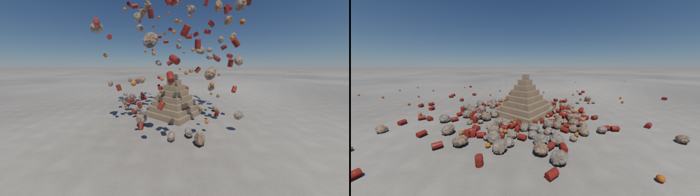

The physics ticks at 60 Hz whatever the frame rate; the movers are drawn between the last two
ticks. With `--fixed-step` a frame is a tick, so a capture at frame N shows tick N; the log
gives the hash at ticks 60, 300 and 600 and over the run. Jolt has no rolling resistance: the
barrels' and the balls' spin is damped (0.3 a second) to stand in for it, and a ball still rolls
far before it sleeps.

Measured on the 9800X3D and the 5070 Ti at 1600 × 900, `--fixed-step`, 600 ticks:

| | |
|---|---|
| the world ready (shapes, 496 bodies, the broad phase, the state saved) | 204 ms; the state 82 KiB |
| a tick, 5 workers and the caller | mean 0.56 ms, p99 0.80 ms, max 0.89 ms |
| awake at tick 60, 300, 600 | 260, 452, 340 of 496 |
| the frame (GPU and CPU) | p50 1.15 ms, p99 1.77 ms |

## Commands, recordings and the network (`forge-sim`, issue #137)

The lab's world is a `forge_sim::Simulation`: it ticks at 60 Hz, saves, restores and digests
itself (its bodies' transforms and velocities to the bit, the tick, the next ball to throw).
What a player does reaches it as commands stamped with the tick they act on, applied in a fixed
order (by player, then by number) whatever order they arrived in: Space is a `Throw` (a ball
from the camera), Enter a `Reset` (everything back to the start; the clock runs on).
`--throw-every N` throws as Space does every N frames.

**Recordings.** `--record FILE` writes the session's commands and a digest every second at
exit; `--replay FILE` plays them again in place of the keys and checks each digest. A session
of 601 ticks and 13 throws replays to all 10 digests, and to the same digests at ticks 60, 300
and 600 and at the end. A recording with one throw left out leaves it at the next digest
(the tests).

**The network, in one process.** `--net MS` runs the scene through a server and this player's
client, the second player a bot throwing at the pyramid every 2.5 s, over links of MS one way
with 10 % of it as jitter and 2 % of the packets lost, both ways, from seeds:
- the server owns the world and takes every player's commands at their tick; one that comes
  after its tick is taken at the next;
- a client runs ahead of the server by the delay and two ticks, so its commands arrive in time,
  applies its own at once, and sends every command it has not seen acknowledged in each packet,
  so a lost packet loses none;
- each snapshot (every 6 ticks) carries the server's state, its digest and the commands taken;
  the client compares the digest with the one it predicted for that tick. When they agree it
  does nothing; when they differ (the other player threw, a command came late) it goes back to
  the server's state and runs the ticks since again with its commands not yet taken (D-010's
  reconciliation).

A single-player game runs the same server in its own process: nothing changes when a second
player joins. With `--net 100 --throw-every 45`, 600 ticks:

| | |
|---|---|
| snapshots taken by this player's client | 99: 96 predicted to the bit, 3 corrected (the bot's throws), 42 ticks run again |
| a correction (the state restored, 14 ticks run again) | at most 9.9 ms |
| a tick: the server, the two clients | mean 2.0 ms, p99 10.9 ms (the corrections) |
| commands taken by the server | all 17, none late |
| bytes down to a client | 280 KB a snapshot (the bodies and the contacts between them), 2.8 MB/s: a whole state, uncompressed |

The last line is what Phase 5's netcode is for: snapshots against an acknowledged baseline,
quantised, only of what a client sees (D-010's budget is 24 KB/s). The tests check the scheme
on a toy world (a lone client is never corrected over 205 snapshots; two clients correct each
other and end where the server is; late commands) and on this one (a session over the lossy
link ends where the server is, to the bit).

## `sea`: what floats (issue #138)

```
cargo run --release -p physics-lab -- --lab sea
```

The open sea the island is drawn with (the same three FFT cascades from the same seed, D-038),
a floor 12 m down, a jetty of planks on twelve concrete pillars, and dropped from 1 to 6 m over
the water beyond its end: 30 wooden crates (600 kg/m³), 30 barrels (60 kg), 16 logs
(700 kg/m³, 3 m), 20 balls, 18 rocks that sink to the floor, and a boat. **The arrow keys**
drive the boat: up and down its throttle, left and right its rudder; **C** puts the camera
behind it. Space throws balls into the water as in `drop`.

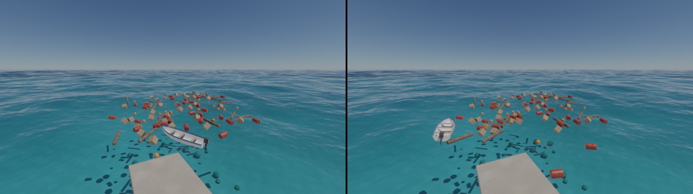

**The waves on the CPU.** What floats must sit on the waves the GPU draws. `forge_procgen::Ocean`
already synthesises the cascades' spectrum on the CPU (the GPU's agree with it within 3 × 10⁻⁶,
the water check at frame 120); `Ocean::displacement` now gives the height and the horizontal
displacement at a tick for less than its full surface: the phases only where the spectrum has
energy (3 208 samples of 65 536), two real fields in each complex transform, the rows outside
the cascade's band left out, and the rows and the columns spread over the job system with the
same bytes on any number of workers. A cascade takes 0.53 ms; the physics takes the two whose
waves move a hull (the swell and the waves down to 4 m), not the ripples. `SeaHeights` samples
them as the GPU's linear filter reads its images (texel centres half a texel off the transform's
samples) and finds the point under (x, z) by going back by the displacement there, twice: a
point of the surface is found again within 2 cm.

**Buoyancy** (`forge_physics::buoyancy`, after Jacques Kerner's model for boats, 2015). Each
floating body has a closed hull in its frame: a box cut into squares, a cylinder, a ball, or a
model's own shell. Every tick each triangle is cut where the surface crosses it, and each
submerged piece is pushed by the water's pressure at its depth along its normal; the pieces
moving into the water are dragged by it (pressure drag), all of them along it (skin friction),
and near the surface their motion makes waves that carry energy away (radiation damping, which
settles a raft in seconds where the drag alone left it bobbing). The pushes are worked out for
all the floaters in parallel and given to Jolt in one call; a body asleep wholly under the water
(a rock on the floor) is left asleep. The tests: a box under water is pushed by the weight of
the water it displaces, a raft half in by half of it and tilted it rights itself (a cube half in
does not: its metacentre lies under its centre of mass, and the code says so), a moving box is
slowed as a plate would be, a raft dropped into still water settles at its draft to 5 mm and
rests, and a stone sinks.

**The boat** was modelled in Blender 5.2 from code (`assets/blender/boat.py`, run headless) and
exported as glTF (`assets/models/boat.glb`, 280 KB): a 5 m open motorboat with a round-bilged
hull, a raised bow and a flat transom, a blue rim, three thwarts and an outboard motor, 10 248
triangles in four materials, and a second mesh, a coarse closed shell of 427 triangles, for its
buoyancy and its collision. `forge_geom::model::load_glb` (through the `gltf` crate) reads both
with their nodes' transforms; the drawn one becomes a prop (`PropKind::Imported`, cached by the
file's bytes) with a material row per glTF material. In the lab it weighs 420 kg with its weight
30 cm under its hull's centre; its motor pushes 2.6 kN at the propeller along the boat, turned by
the rudder, only while the propeller is under the surface: about 3.5 m/s ahead, and it comes
about with the rudder over. The throttle and the rudder are a command (`Steer`) through
`forge-sim`, so a session with the boat records, replays and goes through `--net` like the
throws; `--steer T,R` holds them from the first frame (the captures).

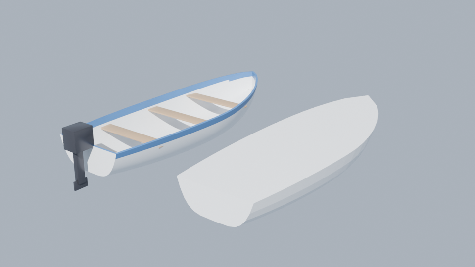

Measured at 1600 × 900, `--fixed-step`, 600 ticks, 147 bodies (115 awake: all but the balls not
yet thrown): **1.8 ms a tick** (p99 2.3), of it about 1.1 ms the two cascades of waves and most of
the rest the pushes. A test replays 4 s of the scene (a throw, the boat ahead and turning) to the
same digests: the waves, the buoyancy and the motor are as deterministic as the rest.

## `walk`: a character in a playground (issue #139)

```
cargo run --release -p physics-lab -- --lab walk
```

A character walks the lab's floor: Jolt's `CharacterVirtual` through `forge-physics`, a capsule
1.8 m tall standing on its feet, swept through the world by its velocity. It slides along what it
meets, walks up steps of up to 40 cm, keeps to the ground going down, stops at slopes steeper
than 45°, stands on what moves and moves with it, and pushes what it walks into with up to
400 N. Its state is saved and restored with the world's (the C layer saves the characters after
the bodies, each world numbering its own: Jolt's numbers run across the process, and a server
and a client in one process must agree).

The playground: six stairs of 20 cm, ramps of 20°, 35° and 50° (their angles from
`forge_core::dmath`, so the ground is the same bits on every platform), a red platform
shuttling along x at 2 m/s, six light crates (100 kg/m³: it shoves them) and three heavy ones
(900 kg/m³: they stay), and a pyramid of four layers of blocks to jump onto. **WASD** walk
along the view, **Shift** runs (6.5 m/s against 3), **Space** jumps (5 m/s up, about 1.3 m),
**the right mouse button** turns the view round the player, **X** throws a ball; the camera
stays 5 m behind its head. The walk and the jumps are commands (`Walk`, held until it changes,
and `Jump`), so a session records, replays and goes through `--net`; `--walk X,Z` holds a walk
from the first frame (the captures).

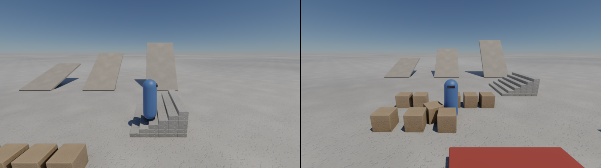

The tests: up the stairs to the top step (0.996 m) and not up the 50° ramp; carried 1 m by a
platform moving at 1 m/s for a second, and the same second again from a saved world to the bit;
and the playground replays a walk up the stairs, a jump and a turn to the same digests. A tick
of the playground (72 bodies, the character, the platform): **0.08 ms** on average, p99 0.22 ms.

## `drive`: a car (issue #140)

```
cargo run --release -p physics-lab -- --lab drive
```

A car on the lab's floor: Jolt's `VehicleConstraint` with its wheeled controller, through
`forge-physics` (`World::add_vehicle`, `drive`, `wheels`, `engine`). The chassis is a 1200 kg
convex hull of the car's shell with its weight 25 cm low; four wheels of 31 cm on springs of
1.6 Hz (0.55 damped) travelling 30 cm, found by casting a cylinder down, so they ride over edges
a ray would drop through; the front two steer by up to 31° and are driven through a
differential by an engine of 320 N·m up to 6500 rpm and its gearbox; anti-roll bars front and
back. Brakes of 1600 N·m, the handbrake 4000 N·m on the rear wheels. The car and its wheel were
modelled in Blender from code (`assets/blender/car.py`, a hatchback with its wheel arches cut
from the lower body; `assets/models/car.glb`, 100 KB) and drawn as the boat is: the body moves
with the chassis, each wheel is a mover placed where Jolt puts it, turned by its steering and its
roll.

The track: a 14° jump ramp ahead, a slalom of eight barrels to the right, and a wall of 32
crates in four courses at 95 m. **The arrow keys** drive (up the throttle, down the brake and,
once stopped, reverse; left and right steer), **Space** holds the handbrake, **C** lets the
camera go from behind the car. The throttle and the steering are the boat's command (`Steer`)
and the handbrake one of its own (`Handbrake`), so a drive records, replays and goes through
`--net`; `--steer T,S` holds them from the first frame.

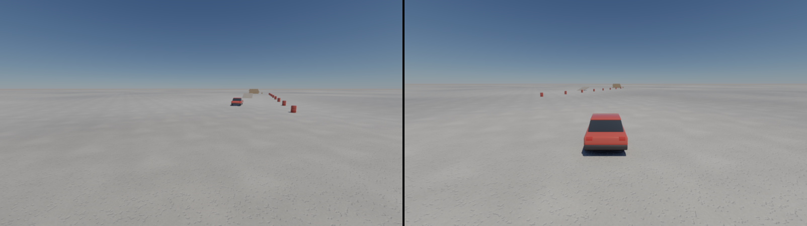

A test drives off, turns and replays (the car 10 m on and upright, the same digests the second
time); the lab's test drives the track with a turn, the handbrake and a throttle astern and
replays it. A tick of the track (73 bodies): **0.06 ms** on average, p99 0.16 ms.

## `fly`: an aeroplane (issue #141)

```
cargo run --release -p physics-lab -- --lab fly
```

A light high-wing aeroplane (7.3 m long, 10 m span, 750 kg; `assets/blender/plane.py`,
`assets/models/plane.glb`, 124 KB) on a 520 m runway across a field of grass 40 km wide (5 km
until #148, when its corner showed from the rocket's height). It flies on its surfaces
(`forge_physics::aero`): each wing's half, the tailplane and the fin is a plate in the aeroplane's
frame, and the air past it, from the body's motion and its turning, gives it an
incidence. Its lift follows the thin-wing law (2π a radian) up to the stall near 14°, then falls
to a flat plate's by 20°; its drag is a parasitic part, the drag its lift induces (by its aspect
ratio) and the plate's broadside drag. The elevator, the ailerons and the rudder add to the
incidence of their surface. As in the buoyancy, the incidence is carried by its sine and cosine
taken from the airflow, so the forces are the same bits everywhere. The wing is rigged 2° up with
4° of dihedral (a high wing's effective dihedral), the tailplane 1° down; the propeller pulls
3 kN at full throttle at the nose, and the fuselage and the gear drag besides.

On the ground it rests on the hull of its three wheels, a tail skid and its fuselage, with its
weight just ahead of the main wheels (`Shape::with_center_of_mass_at`); its friction is its
wheels' (0.04), and off its wheels (low and banked or turned over past 45°) it scrapes on the
field with 0.6 of its weight. **W** and **S** open and close the throttle, **the arrows** are the
stick (down pulls the nose up: half of the elevator, all of it with **Shift**; left and right
roll), **A** and **D** the rudder; the camera follows 17 m behind. The controls are a command
(`Fly`), and `--pilot T,E,A,R` holds them from the first frame.

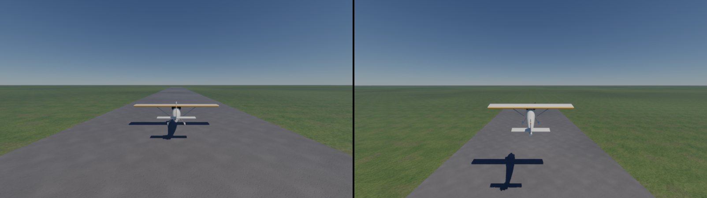

With full throttle and the stick 0.4 back it rotates near 24 m/s, lifts off near 30 m/s after
about 300 m, and climbs at 5 m/s; the ailerons roll it at up to about 37° a second, a banked turn
holds its bank and loses height unless the stick comes back, and a full pull from the keys
stalls it (hence half the elevator by default). The lab's test takes off, banks right, climbs
past 20 m and replays to the same digests. A tick of the field: **0.05 ms** on average, p99
0.10 ms.

## `rocket`: a rocket off a pad (issue #148)

```
cargo run --release -p physics-lab -- --lab rocket
cargo run --release -p physics-lab -- --lab rocket --pilot 1,0.1,0,0
```

Step 5's rocket, on a concrete pad in the aeroplane's field.
- **The rocket:** a white body 13.5 m tall with an ogive nose (a lathe), four swept red fins, 3 t
  fuelled, its weight 5 m up its axis. Its meshes weigh their normals 16 times a hard surface's
  in the simplification. With the default weight, the line between its lit and shaded sides
  moved a pixel as the cluster levels changed while it turned, which the owner saw shimmer in
  `--lab space`: 108–138 px a frame changed differently from the full-detail drawing, now 0–15.
- **Its engine:** pushes 50 kN (1.7 times its weight) along its axis from the nozzle.
- **The stick and the roll jets:** the stick swings the engine up to about 6° (thrust vectoring),
  as for an aeroplane pitched up on its tail:
  - pushing tips the nose downrange (−z);
  - the rudder yaws it;
  - jets at the nose roll it, 2 kN·m at full aileron.
- **The air:** the fins are flying surfaces (`forge_physics::aero`, the aeroplane's), so they turn
  it into its wind. Its body drags along its axis and across it.
- **Its controls:** the aeroplane's, from the keys or `--pilot T,E,A,R`, so a flight records,
  replays and goes through `--net`.
- **The camera:** follows from 30 m off its right, its pitch downrange crossing the view.

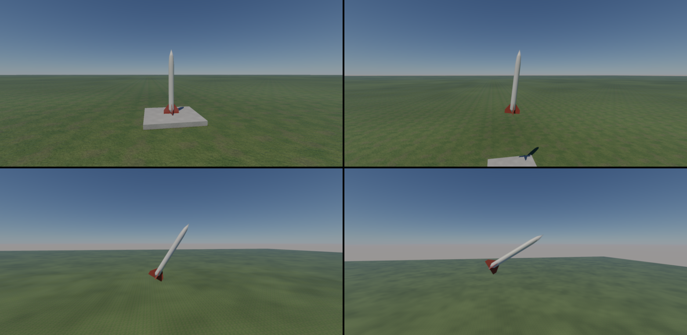

The lab's test:
- **On the pad:** the rocket stands untouched.
- **The climb:** at full throttle it climbs 85.68 m in 5 s straight up, where thrust and weight
  alone (½ (T/m − g) t², the drag under 300 N) say 85.71. Jolt's default linear damping had taken
  7 m of it, so the rocket has none: its drag is the air's.
- **The stick:** pushed for a second, it tips the rocket 3.8° downrange, where the fins hold it,
  339 m up at 10 s.
- **The replay:** the flight replays to the same digests.

A tick: **0.04 ms** on average, p99 0.08 ms.

Not yet:
- fuel burning off (Jolt's mass would change in flight);
- the exhaust's flame (it needs particles or an emissive material);
- a spaceship in zero g: `space` below.

## `space`: a spaceship in zero g (issue #150)

```
cargo run --release -p physics-lab -- --lab space
cargo run --release -p physics-lab -- --lab space --pilot 1,0,0,0
```

Step 5's last vehicle: a spaceship in a world with no gravity (`WorldDesc::gravity`) and no air.
It was the rocket until the owner's look of 2026-10-03 ("make the space scene look like space,
and spaceship looks like a more sci-fi spaceship").
- **The sky:** space's, in place of the ground's. The asteroids' starfield
  (`forge_render::Starfield`) draws the stars, the sun's disc and an Earth-like planet low on the
  left under its air (D-023), seen from about 5 600 km up so its oceans, land and clouds show. Its
  nebula is at a quarter of the asteroids' (`Starfield::faint`): the chase camera looks along the
  Milky Way's band, which at full strength lay over everything like a cloudy sky. The sun is
  unfiltered white, from the ship's right. There is no floor and no cloud. The shaded sides take
  space's constant fill, occluded by GTAO: no sky's light, no probes.
- **The ship:** a 16.9 m fighter-shuttle with a 13 m span, modelled in Blender from code
  (`assets/blender/ship.py` → `assets/models/ship.glb`):
  - a faceted hull with a dark canopy and glowing strips along its sides;
  - swept wings with blades turned down at their tips;
  - two engine nacelles and a main engine in the tail;
  - running lights, red and green.
  Its glowing parts are emissive (the glTF reader now takes a material's emission and its
  strength). Its collision is the hull of a coarse shell in the model. Its meshes weigh their
  normals as the rocket's do (#157).
- **Its engines:** 60 kN together along its nose (4 t, 1.5 g). Each flame slides out of its nozzle
  with the throttle, hidden inside it when closed.
- **Its jets:** a flight computer's. The stick asks for a rate of turn (pitch and yaw 0.8 rad/s,
  roll 1.4 rad/s at full stick), and the jets push towards it (150 kN·m per rad/s off, at most
  80 kN·m in pitch and yaw, 60 in roll). Centred, it holds still. These are the aeroplane's
  controls, so a flight records and replays.
- **The crates:** 27 of them float ahead of it in a block (100 kg each, 1.2 m apart).
- **No damping:** the solver damps nothing, not the ship and not the crates. The jets push no
  linear momentum.

So what it tests is momentum:
- the ship must gain exactly what its engines give it;
- when it ploughs through the crates and scatters them, the ship and the crates together must keep
  that momentum.

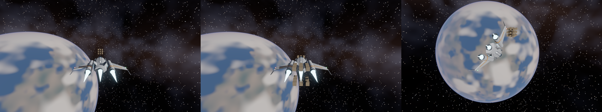

The lab's tests:
- **Untouched:** half a second leaves everything where it was.
- **The burn:** 60 kN for 1 s gives 60 000.004 kg·m/s along −z (60 000 by Newton).
- **The crash:** the ship coasts into the block and scatters it, 15 crates leaving at over 1 m/s.
  4 s on, the ship and crates together carry 59 999.973 along −z and 0.001 across: within half a
  part in a million.
- **The replay:** the flight replays to the same digests.
- **The handling:** half the stick to the right rolls it at 0.7 rad/s within 2 s about its nose
  alone, and let go it stops within 1.5 s.

The state log prints the momentum every few seconds (`momentum`). A tick: **0.061 ms** on average,
p99 0.142 ms. Its frame on the GPU: 0.55 ms at 1600 × 900, the starfield and the planet 0.14 ms of
it.

## `break`: a wall, a wrecking ball, a column (issue #142)

```
cargo run --release -p physics-lab -- --lab break
```

Phase 3's step 6, its first part. A wall of 324 bricks (21.5 × 6.5 × 10.25 cm, 2.6 kg) in
running bond, 24 courses on a 3 m run, every brick a body held to the bricks beside it, under it
and over it, and the bottom course to the floor, by mortar: 912 joints, Jolt's fixed constraints
through `World::join_fixed`. After each step the lab reads what every joint carried in it
(`World::joint_loads`, one call) and where its bricks are, and breaks (`World::set_holding`)
the joints that carried more than 2.5 kN or 150 N·m, or whose bricks moved apart by 3 mm or
turned by 1.5° from where they were laid: an iterative solver's joints yield a little under a
blow and pass on less of it than rigid mortar would, so the strain catches the cracks the load
alone misses. The wall's joints take 30 velocity and 10 position iterations of the solver
(Jolt's per-constraint override; the world's 10 and 2 let 24 courses sag and lean); standing,
it settles by under a centimetre at its top in the first half second and goes to sleep. Jolt
saves whether each joint holds, and its impulses, with the world: a broken wall restores, replays
and goes through `--net` like the rest.

A 3 t steel ball (0.45 m) hangs on a 5.5 m chain (a distance joint) from a yellow gantry, held
back 60° by one more joint; **Space** lets it go (then throws balls, as elsewhere), and it meets
the wall at about 7 m/s just past the bottom of its swing. Behind the wall stands a concrete
column (0.4 × 2.4 m, 920 kg), cut ahead of time into 14 pieces: the Voronoi cells of points
spread up it (`forge_geom::fracture`: the column clipped by the planes halfway between each
point and the others, in `f64` without trigonometry, each piece a convex hull in the physics
and a mesh whose cut faces are drawn paler). The pieces wait asleep on a shelf far under the
floor; when a blow changes the column's velocity by more than 1.5 m/s in a step (gravity
aside), they take its place, each with the velocity of its part of the column, and the column
goes to the shelf. Nothing is added or removed from the world while it runs, so the state keeps
its size and its order. `--release N` lets the ball go at frame N (the captures).

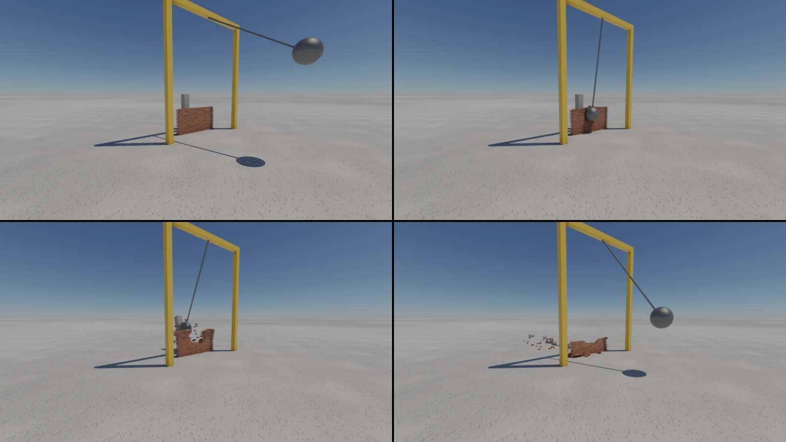

At tick 300, five seconds on, 412 of the 912 joints are broken: the lower courses and the
ends stand round a ragged breach, the column's pieces lie behind; by tick 600, after the ball's
swings back, 349 joints hold. The tests: a joint carries its load (a beam
of two boxes out of a wall: each joint the weight and the turn it should) and lets go when
broken; a broken joint is mended by a restored state, which then runs to the same bits; a ball
on a chain swings at its length; the cuts keep a box's volume and the Voronoi cells fill the
column without overlap; and the lab's wall stands untouched for two seconds, then breaks under
the ball and replays to the same digests. A tick through the impact (372 bodies, 912 joints):
**0.99 ms** on average, p99 2.0 ms, at most 2.5 ms; the state is 87 KiB.

## `creatures`: powered ragdolls, skinned (issues #143, #165)

```
cargo run --release -p physics-lab -- --lab creatures
```

Phase 3's step 7: D-012's physics layer, with Phase 7's first step, skinning. The creatures
are ragdolls whose motors drive them to a pose, drawn as bodies that bend at their joints.

**The bodies** (#165) were modelled and animated in Blender from code
(`assets/blender/skinned_creatures.py`, `assets/models/skinned-creatures.glb`, 2.3 MB, of
which 1.4 MB are its textures):
- a 1.8 m artist's mannequin of pale wood with dark joints, standing in an A-pose (with its arms
  straight down they melted into its torso);
- a 1 m dog with a dark nose, ears and paws.

Each is one continuous mesh of 10 000 triangles. Its shapes were joined by a voxel
remesh, smoothed, then decimated. It sits on an armature of eleven bones, named as the old
puppet's parts were, and Blender's bone heat sets the weights. Each kind has a walk and an
idle clip (1 s and 4 s for the mannequin, 0.75 s and 2 s for the dog). `forge-anim` reads and
samples those clips, but the lab does not play them yet.

**Their textures** (#166, D-047) are the model's own, laid by its UVs, so they stay on the
bending bodies:
- **The mannequin** is pale wood, its grain running along each limb, its joints darker and
  varnished (glossier).
- **The dog** has a tan coat whose strands follow its bones, a darker saddle along its back, a
  cream chest, belly and front legs, a dark nose, ears and paws, and glossy black eyes.

They were painted in Blender from code, as procedural materials (the grain and the strands
follow each vertex's nearest bone), and baked by Cycles on the model's smart-projected UVs,
each creature alone. Each has three 512 × 512 PNGs: its base colour, a tangent-space normal
map, and occlusion, roughness and metalness packed in one image, as glTF packs them. The
exporter writes them as the material's glTF textures, and Forge reads them as they are
(`forge_render::material::ModelTextures`):
- **the base colour** times the material's factor;
- **roughness and metalness** per pixel;
- **the occlusion,** which darkens the sky's and the probes' light, not the sun's;
- **the normal map,** whose tangent frame comes from the pixel's derivatives (no tangents are
  stored). On a skinned mesh it is taken in the bind pose and turned with the body by the
  skin's turn at the pixel.

The first step of #166 (b9058b0) projected procedural wood and fur from the bind pose. UVs
replace it. The bind-pose projection stays for projected materials on skinned meshes.

A first bake laid a dark band and a black blob on the dogs' sides: Blender baked the dog's
occlusion with the mannequin standing inside it at the same origin. Each creature now bakes
alone.

**The ragdolls** come from the same file, through `forge-physics` (`World::add_ragdoll`):
- **bodies:** one per bone, the hull of the vertices that bone carries most;
- **joints:** each held to its parent where its bone starts. Ball joints for the shoulders,
  hips, neck, waist, the dog's legs and tail; hinges for the elbows, knees and the dog's lower
  legs. Each joint has its limits, and a part does not collide with its parent.

Every tick, `World::drive_ragdoll` sets each joint's motor to a target:
- the mannequins swing their arms, bend their elbows and turn their heads;
- the dogs wag their tails and nod.

Each creature moves at its own phase, with the angles computed through `forge_core::dmath`, so
they are the same bits everywhere. The motors are springs with a stiffness in N·m per radian:
800 for the mannequin, and 4 000 for the dog's legs, which carry its 45 kg torso. They are not
frequency springs: Jolt scales a frequency spring by the lighter part each joint turns, and
with those the dogs folded under their own weight.

**The skinning** (`crate::skin` in `forge-render`, `shaders/skin.slang`):
- **The mesh:** each creature is a mesh of its own, cooked as one level of clusters, all of them
  roots (`SkinnedMesh::cook`). Every cluster is bounded by the sphere the body stays in
  whatever its pose (its bones laid end to end from the root), and the normal cones are off.
- **The mover:** each creature is drawn by one mover at its root body. Every frame, its
  bodies' transforms, between the last two ticks, become one matrix per joint
  (`MeshletScene::set_skins`). That replaces the puppets' 55 movers with 5.
- **`skin/vertices`:** one workgroup per cluster. It bends each vertex by its four joints and
  writes it into the pool of pages before the culls, so the draws and the shading see the bent
  body like any other mesh.
- **Ray tracing:** the same pass writes the ray tracing's copy of the vertices. `skin/blas` then
  refits each creature's bottom-level structure (`forge_gpu::DynamicBlas`, updated in place)
  before the movers' top-level structure is rebuilt over it, so the shadows bend too.
- **Motion vectors:** the pass also writes where the previous frame's joints put each vertex.
  The movers' motion vectors place a skinned pixel by its weights on its triangle, between
  those previous positions, so TAA and DLAA do not smear a swinging arm.

Three mannequins stand on poles, their pelvis held by a joint that lets go past 2 kN or
400 N·m; two dogs stand on their own legs in front.
- **Space** throws balls at them: a dog is shoved and finds its pose again; a mannequin hit
  squarely comes off its pole.
- **↓** lets every motor go: the dogs fold to the ground, bending at every joint, and the
  mannequins hang from their poles. It is a `Limp` command, so it records, replays and goes
  through `--net`.
- **↑** powers them again.
- `--limp-at N` lets them go at frame N (the captures).

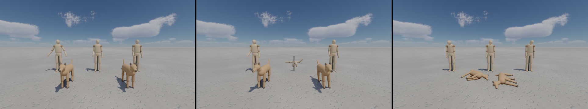

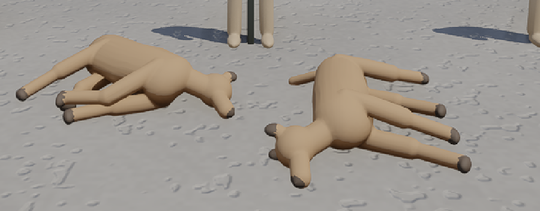

**The tests:**
- `forge-anim`: a clip sampled at its keys gives the keys, to the bit; two poses blended and a
  pose blended with itself; the same inputs give the same bits on two threads. The lab's file
  reads as two rigs of eleven joints whose rest pose skins to the identity, and whose clips
  loop.
- `forge-geom`: a skinned glTF keeps its bind pose and its joints; every cluster of a skinned
  cook is a root under the pose sphere, and each cluster vertex carries its own vertex's skin.
- `forge-physics`: an arm on a ball joint and a hinge holds its pose on its motors to a few
  millimetres, hangs when they let go (from a saved world, to the same bits twice), and bends
  its elbow to a target.
- The lab: the creatures stand for two seconds (the mannequins on their poles, the dogs'
  torsos over 45 cm), fold when let go (under 35 cm) and replay to the same digests.

The validation layer, with synchronization validation, reports nothing on either path.

**Costs** with balls thrown (the RTX 5070 Ti at 1080p):
- a tick (55 bodies in five ragdolls): **0.13 ms** on average, p99 0.27 ms;
- `skin/vertices`: **0.005 ms** for 34 000 cluster vertices in 535 clusters;
- `skin/blas`, the five refits: **0.109 ms**;
- `movers/tlas`: 0.050 ms.

A slime as a soft body is still to come in this step. Playing the clips through the motors
(the clip layer driving the physics layer) belongs to the procedural layer's step.

## `flood`: a dam break (issue #144)

```
cargo run --release -p physics-lab -- --lab flood
```

Phase 3's step 8, its first part: D-009's middle tier of water, the authoritative column model,
which the server runs and the clients predict like the rest. `forge_physics::shallow` keeps a
column of water on each cell of a grid and the water's velocities on the faces between cells,
after Matthias Müller-Fischer's height-field water (GDC 2008): each step the velocities are
carried along by themselves, the water flows through each face at its velocity times the depth
it leaves, each cell's outflow scaled so that it never gives more than it holds, and the slope
of the surface speeds the faces up; a face into a cell whose bed stands over the water carries
nothing. Two first-order fixes made its fronts run: a still face is traced back along the
velocity of the water arriving at it, and a dry cell the water runs into passes its speed on.
The volume is kept to the rounding and no column goes below zero; it is `f32` sums, products
and floors in a fixed order, saved, restored and digested with the world.

The scene: a basin 48 m by 24 m walled in concrete, a cell every 25 cm (192 × 96), a reservoir
2 m deep behind a red gate at its upper end, four concrete blocks and a brick hut downstream;
18 crates, 12 barrels and 9 logs, two thirds afloat behind the gate and a third lying on the
dry floor beyond it. **Space** (or `--release N`) lifts the gate: the water runs down the basin,
white where it is fast, round the blocks and the hut, and carries what floats; the buoyancy is
the sea's (#138) with the pool's surface and its flow in place of the waves (fresh water,
1000 kg/m³). **Enter** fills the reservoir again.

The water is drawn by the island's water pass as fresh water, a pool (#144): each frame the
lab hands the renderer its columns' surface, depth and velocity (`WaterSurface::set_pool`, 295
KB), two triangles between each four samples at the surface, faded in over the last 3 cm of
depth so its edge thins to nothing. A dry sample stands at its bed, so the front thins onto the
floor. Where its bed is the top of a block, the hut, a wall or the gate, it stands instead at
the water beside it, so the water runs on level into the obstacle, hidden there. Before
2026-10-03 the water climbed the obstacle's side in one cell, a grey sheet over the hut's lower
half (the owner's report). The rivers' shading (`fresh_water`) gives it the scene seen
through it, the sky and sun on it, its ripples carried on its flow and white water past 2 m/s.
The scene draws no sea (`WaterSurface::set_sea`).

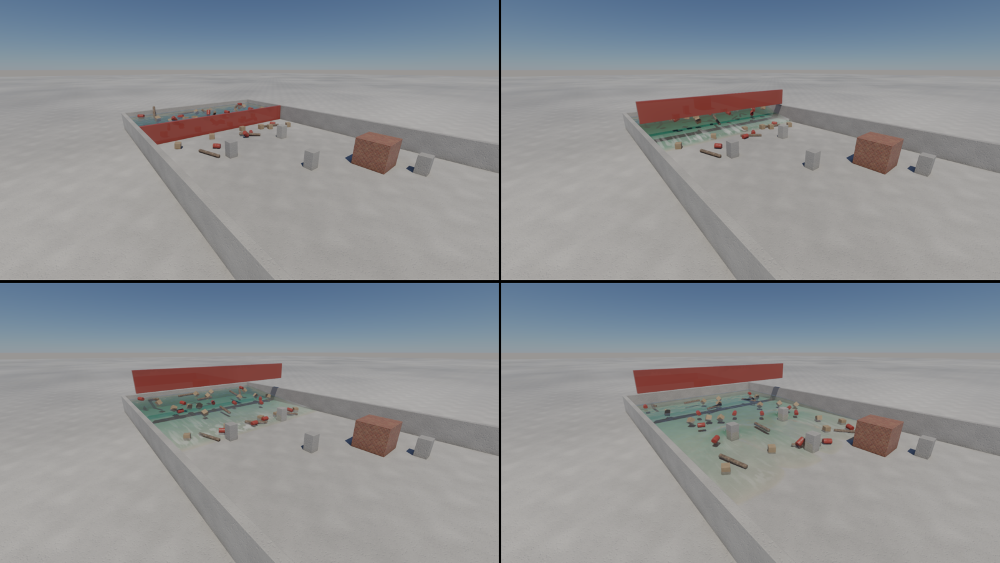

The tests: a dam break in a channel keeps its volume and never a negative depth; it follows
Ritter's solution where the dam stood (a depth of 4⁄9 of the reservoir's within 5 % and ⅔ √(g h₀)
within 10 %) and its front runs 3.25 m in the first second (Ritter's tip runs 6.3 m; a
first-order scheme lags where the water thins to nothing); a saved pool runs on to the same
bits; still water floats a box at its level. The lab's flood keeps its reservoir behind the
shut gate, then in four seconds puts a third of it down the basin, every drop kept, carries what
floats more than 5 m on, and replays to the same digests. A tick (18 432 cells in two half
steps, 39 floaters): **0.86 ms** on average, p99 1.1 ms. The GPU's own shallow-water layer
shadowing the model near the player, and particles for splashes, come next.

**What floats pushes the water aside (#151, two-way coupling).** The water no longer only pushes
what floats. After Müller-Fischer's height-field water (GDC 2008), as the column model already is:
- **The thickness:** each tick, each floater's volume under the water (its buoyancy over ρg) is
  spread as a thickness over the wet cells of its footprint (`Pool::displace`). The footprint is
  three quarters of its hull's reach round its centre of mass: a crate's about its side, a log's
  wider than the log.
- **The slopes:** that thickness adds to the surface the water's slopes see. The water flows out
  from under a body and rises round it: a body set down sends out a ring, and one carried along
  pushes water ahead of it.
- **The volume:** the depths keep it; the thickness is not water.
- **Buoyancy:** a body afloat reads the same surface, so at rest it sees the level it would have
  without it and sinks no deeper.
- **The state:** the thickness is saved with the pool, so a run still replays to the bit.

Each tick now pushes what floats by the water as it stands, then lets the water be pushed aside,
then steps the water.

The new test: 0.4 m³ set at once into still water 1 m deep in a 10 m square, over a footprint
0.6 m round.
- **The ring:** 1.6 m out, it rises over 5 mm within the second.
- **The volume:** kept.
- **Settled:** 40 s on, the water under the body is 0.6 m deep, and its surface and the far water's
  stand level, 4 mm over the first (0.4 m³ over 100 m²).

The lab's flood still carries what floats more than 5 m on and replays.

A tick: **1.12 ms**, against 0.90 for the same run before (measured the same day). The new order
alone gives 1.00 ms, so much of the rest is the floaters moving differently, more of them
jostling.

### The GPU's finer layer (issue #162)

What is drawn is now a finer grid on the GPU, `forge_render::ShallowLayer`
(`shaders/shallow.slang`), as D-044 planned: the heightfield stays authoritative and the GPU
adds detail near the player. `--no-gpu-water` draws the columns themselves.
- **The grid:** 768 × 384 cells of 6.25 cm, four a column's side, over the whole basin
  (12.4 MiB).
- **The scheme:** the column model's, ported pass for pass (advect, the share each cell can
  give, the depths, the front and the slopes), each tick in two steps (`--gpu-water-substeps`).
  Each pass writes what it does not read, with no atomics: three runs and the serial frame give
  the same image.
- **Shadowing:** once a frame, each block of 4 × 4 fine cells moves a quarter of the way to its
  column's depth (the same amount on each, so the column's volume is what moves), and each fine
  face a quarter of the way to the columns' velocity there (`--gpu-water-rate`). What floats
  is taken between the columns bilinearly. Nothing reads the layer back: buoyancy, the replay
  and the network stay on the columns.
- **How close it stays,** before each frame's pull: the volume to the columns' to the litre
  (both keep theirs), a wet column's fine cells 4–8 mm from its depth on average, at most 11–21 cm
  at the front.
- **The look:** the water curls round a floating crate where the columns cut a square hole, and
  the patches pushed aside round the barrels round off.

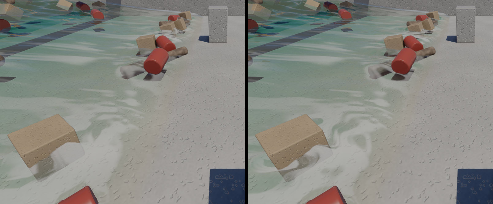

**Its cost,** at 1600 × 900: the frame 1.41 → 1.71 ms of GPU. The layer's passes take
0.15 ms (`shallow/front` 0.041, `shallow/apply` 0.039, `shallow/advect` 0.030,
`shallow/give` 0.028, the pull and the samples 0.018), and the surface's draw 0.050 → 0.119 ms
for sixteen times the quads; the rest is the passes' latency. Four steps a tick cost
0.78 ms in all for the same gaps.

**Splashes where the columns fail (#162's step 2).** Each column whose water runs at 1.5 m/s or
more is a source of the splashes' ballistic drops (`forge_render::WaterSplashes`, #107):
- **its front:** the column ahead along the flow is dry; a bow moving with the water;
- **an obstacle:** the column ahead is a wall, the gate's foot, a block or the hut, or the
  basin's edge; a bow moving against the water, so its spray goes up and back.

Each is a column wide and long, and its spray follows its Froude number (1.1–2.3 at the dam
break's front: a fringe, and fans past 1.5). They are found on the CPU from the authoritative
columns, each column's seed its own, so a replay splashes alike; their drops are visual only
and take no water from the columns (D-044 had them take and give it back; at a few litres
against the basin's 468 m³ it is left out). The dam break keeps up to about a hundred sources,
2 652 drops over its first four seconds, 972 alive at most. Three runs and the serial frame
give the same image. The drops are millimetres across, so a few metres off they read as a veil
over the front and where it strikes a block.

**Foam where the drops land** (#107's polish, the same night): a drop that falls back into its
water, or ends within 30 cm over it, adds foam to its cell of a field round the camera
(`splashes/foam`, 256 × 256 cells of 25 cm, `shaders/splash_foam.slang`).
- **The field:** whole units added atomically, so the sum is the same in any order. Each cell
  fades by e every 3 s and is cleared as it comes into the window, which scrolls with the camera
  without a copy.
- **The look:** the fresh water (the pool, the lakes, the rivers) whitens by it through its own
  foam's look, fully at four drops a cell, 80 % at most.
- **At the dam break:** a soft white along the front and round what it carries, 21 000 px apart
  from `--no-splashes` at the close view. Repeatable on the serial frame as on the async one.
- **The cost:** the fade 0.002 ms, and `water/surface` 0.124 → 0.152 ms on the GPU's layer
  (four loads a fragment).

**Left:** a window round the player for the island, and the run-up against a block (a thin
sheet of water up its face, in the columns too) to look at.

## `tank`, `tank-bench`, `tank-hole`, `tank-blocks`: a dam break in a glass tank (issue #156)

```
cargo run --release -p physics-lab -- --lab tank
cargo run --release -p physics-lab -- --lab tank-bench
cargo run --release -p physics-lab -- --lab tank-hole
cargo run --release -p physics-lab -- --lab tank-blocks
```

D-044's first milestone, after the owner's answers of 2026-10-03: the water is particles on a
grid, simulated and drawn on the GPU (`forge_render::liquid`, `shaders/liquid.slang`,
`shaders/liquid_draw.slang`), visual and lab-only.

**The scene.** A tank 1.6 m long, 0.6 m tall and 0.6 m deep inside, on a table, with 0.4 m of
water behind a red gate 60 cm from its left end. The owner asked for it larger than the first
1.0 × 0.6 × 0.5 m, with the same depth behind the gate, so 1.8 times the water. **Space** (or
`--release N`) lifts the gate at 3 m/s. The water runs out along the floor, climbs the far wall
to the rim, falls back, sloshes and settles. `tank-bench` is the same tank as a bench to tune by
(the owner's ask, after Sebastian Lague's fluid videos):
- no glass, frame or table to see;
- a floor of 10 cm squares in four tints, a darker line every metre, to read distances off;
- a plain violet background and the sun alone;
- the water tinted teal (`LiquidLook::tinted`) so its depth and motion show.

The keys **1**, **2** and **3** switch between the water as it looks, its **speed view** and its
**landing view** (`--liquid-view speed` or `landing` to start in one):
- **The speed view:** the surface matte, coloured by how fast the water flows, blue when still,
  through cyan and white, to orange at 3 m/s, as Lague colours his particles.
- **The landing view:** each pixel of water coloured by where its bent ray lands:
  - green: on a surface the camera sees;
  - red: on one it does not;
  - blue: on the sky;
  - yellow: trapped, mirrored to and fro;
  - grey: not bent.

`tank-hole` is the owner's second tank: the gate fixed, with a round hole 8 cm across through it,
low in its middle (its centre 12 cm over the floor), shut by a steel shutter on its dry side.
**Space** slides the shutter up at 2 m/s and the water jets out through the hole into the empty
side. The reservoir drains until both sides stand level, 152 mm.

`tank-blocks` puts concrete blocks in the dam break's way: the owner asked for water "correct
round the obstacles", where the column model of `flood` stuck above the level and glitched.
- **The blocks:** a 10 cm cube in the channel's middle 25 cm past the gate, then two posts 5 cm
  square and 30 cm tall, 15 cm in from each side.
- **What happens:** the wave wraps the cube and runs over it, climbs the posts and splits on
  them. It comes back off the far wall over all three and settles round them.

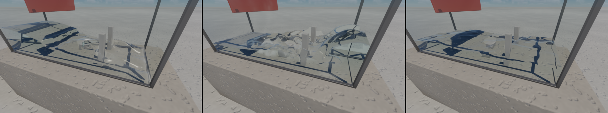

**How the liquid takes a block** (`LiquidTank::obstacles`, up to eight boxes):
- **In the solver:** the cells whose centres lie inside a block are solid, as the gate's are, and
  their faces' velocities are 0. A particle that would end inside one stops a hundredth of a cell
  outside the face it crossed. One already inside leaves by the nearest face that is not against
  the glass.
- **In the drawing:** the density field is smoothed with the solids left out (the gate's too). So
  the water meets a block full, as it meets the glass, rather than thinning into a gutter round
  it. A ray bent through the water stops at the block's mesh, as it does at the gate. The
  surface's normal takes its gradient on one side only where the other side's sample falls in a
  solid.
  - **The gate it fixed** (the owner's report of 2026-10-03, two screenshots: the red gate
    shredded into strips with white streaks, "inside the water itself the light should not
    bend"). The field dropped to nothing in the gate's cells, a false surface a cell in front of
    it. Rays under the water crossed it as if leaving the water, bent, and mirrored the sky at
    grazing angles. Now the field reaches the gate whole, and rays meet the gate before any
    surface.
  - **The waterline against it:** with the field carried into the gate, the normal's samples on
    the gate's side read its cells, and the surface tilted into the gate in its last cell or two.
    That showed as a white band, the sky mirrored, along the gate's waterline.
  - **What remains:** the floor just behind a block, which the block hides from the camera, is
    seen through the water by rays bent down steeply. It is shaded plainly (as the hidden
    landings below are), a smooth fringe a little lighter than the textured floor round it.
- **The level it settles at:** 151.0 to 151.3 mm, against the 151.8 its volume gives with the
  blocks taking their share. That is the same 0.6 mm short as the plain tank.
- **Two faults found on the way:**
  - **Trapped rays:** a ray mirrored under the surface at a grazing angle started from just
    above it, met the surface again at once, and went to and fro on the spot until it ran out of
    crossings. In thin water round the blocks, that showed as dark speckles; it now starts back
    in the water.
  - **A lost device:** with a `continue` in the smoothing's loop, the GPU lost the device as the
    water reached the cube, though nothing read the pass's output. A weight of 0 in its place
    works; the fault was not pinned down further.

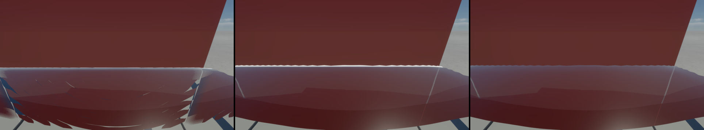

`--lab tank --fixed-step --view=-0.45,1.3,0.05,-90,-20`, frame 60.

**The solver** (APIC on a MAC grid, Jiang et al. 2015):
- **The particles:** 589 824, eight a cell, on a 1.25 cm grid (128 × 48 × 48 cells). That spends
  the owner's budget of answer 3 (~640 000, "bigger or finer") on the larger tank;
  `--liquid-cell 0.01` gives 1.15 million.
- **The substeps:** four of 1/240 s per tick of the lab's, with the gate's height and speed each.
- **The transfers:** trilinear weights, the affine vector per component. The faces' sums are
  64-bit fixed-point atomics (the weight and the momentum packed in one add), so a run replays to
  the same bits.
- **The pressure:** 32 red-black Gauss–Seidel sweeps with over-relaxation 1.7, warm-started
  from the last substep. The still water starts at its hydrostatic pressure.
- **The volume:** each cell's density, against a full cell's, is the particles' crowding. The
  particles move down its gradient, a quarter of it undone a substep, inside the water only
  (the surface's part-full cells are left alone). A cell against the glass expects an eighth
  less per solid side.
- **Gravity:** `--liquid-gravity x,y,z`, 9.81 m/s² down by default. At `0,0,0` the block floats
  where it stands: there is no surface tension yet.

**What it took to be still.**
- **The volume correction as a velocity:** first written as Ten Minute Physics writes it, a target
  for the pressure's divergence. Still water then shook itself apart in half a second (the
  owner's report: "it's always moving for no reason"). The correction went into the particles'
  velocity every substep, a spring with nothing to damp it. As a move it adds no energy: the still
  water stays at rest to the bit (rms speed 0.000 m/s over 540 ticks).
- **Correcting crowding only:** water that splashed apart settled 20 % high, its sparse cells
  holding their volume like full ones.
- **Tiled pressure sweeps:** sweeps in groupshared tiles, 8 cells a side, cost a third as much.
  They left errors on the tiles' edges that kept the water sloshing (0.4 m/s rms after 12 s,
  against 0.05), so they were dropped.

**The drawing.**
- **The density field:** the particles' density, smoothed twice by a 3 × 3 × 3 binomial, with
  4-cell bricks of its least and most to skip air and the water's inside.
- **The march:** each pixel's ray through the glass (Fresnel's reflection, its tint), into the
  water where the density crosses one half. There it is bent by Snell's law, with Fresnel's share
  mirrored (the sky, the sun's highlight).
- **Through the water:** absorbed and scattered along its path (pure water by default), out through
  the surface or the glass. Past the critical angle it is mirrored whole and marched on: a side
  wall seen at a slant mirrors the inside.
- **Where it lands:** the bent ray is traced against the scene's ray-tracing structures, the static
  one and the movers' (the gate, the shutter). Inside the tank it stops at the first surface it
  meets, the gate or anything later put in the water.
  - **Seen by the camera:** where the depth at that point's pixel shows that point (within 3 cm,
    plus 2 % of its distance), it takes the screen's colour there.
  - **Hidden:** where something nearer hides it, it is shaded as the glass's mirror rays shade
    theirs. That means its material's plain colour (its texture's average), in the sun with its
    shadow traced, and in the sky. An example is the reservoir's floor behind the gate, seen from
    the gate's dry side.
  - **Meeting nothing:** it takes the sky.
  - **The search it replaced:** a march over the screen against the depth (the owner's report of
    2026-10-03, three screenshots: "the side reflections are very bugged. it bugs from above as
    well"). It missed the surfaces a ray grazed between two of its steps, which gave sawtooth
    edges, and it could not see what something nearer hid. There it took the last place it saw,
    which gave the gate's red on the floor behind it and speckled panes.
- **The normal:** the density's gradient over two cells either way, smoother than the particles'
  noise. Next to the gate or a block, it uses only the water's side.
- **Under the water:** each ray starts on the near plane, so a camera crossing the surface sees
  the water below the line its near plane cuts and the air above, with a thin dark waterline
  on the lens between them (`--view=-0.6,1.212,0.05,-90,-3` puts the camera's eye at the
  reservoir's surface). The side walls seen at a slant mirror the inside whole, as an aquarium's
  glass does.
  - **The hatching it had:** the side walls first showed a hatching there. A straight ray stopped
    where the depth put the scene, and when that lay beyond the tank, the stop was the far pane
    itself, measured from the camera. The march measured the same pane from the ray's own
    point. Which came first was rounding's call, pixel by pixel, and a ray called stopped never
    bent. The depth now stops a straight ray only when what it shows stands inside the tank.
- **Moving water over hard edges:** through fast water the scene's shadow edges show a fine
  stair-step. The scene behind the water is the frame's own, before TAA smooths it: its shadows'
  edges are sharp and aliased each frame, and soft only once TAA has averaged the sun's disc. The
  water bends that image differently every frame, so TAA cannot average it (with no reactive
  mask at all the stairs stay).
  - **Fixed:** the copy of the scene behind the water now has a TAA of its own
    (`liquid/scene TAA`, 0.079 ms at 1600 × 900), with the frame's jitter and motion vectors
    and its own history, so the water bends an anti-aliased scene. Through moving water, the
    posts' sides and the shadows' edges were hatched and jagged; they are now smooth.
    `--no-behind-taa` shows the old way.
- **The floor:** the floor's glass lies on the table and mirrors nothing.
- **For TAA:** a reactive mask where the surface moves (at most half, at 3 m/s).
- **At the glass:** the field goes on into the glass and the floor as it stands beside them (air
  only over the open top). Ending it at the glass turned the surface's normal into the pane, and
  rays through a pane into thin water came out speckled.
- **White water:** each particle carries the air it holds, taken in where fast water meets the air
  (over 1.5 m/s) and where it is stopped hard (over 60 m/s²). It loses it as the bubbles rise
  and burst, over the liquid's `foam_life`, splatted to the cells once a frame and drawn as
  white scattering, in the water and in the spray. Fresh water's bubbles burst in a fraction of a
  second (0.3 s, `--liquid-foam`): it whitens only where the jet plunges and where it slams
  into a wall. The owner: "foam on clear, non salt water does not make too much sense". A sea
  water's foam, held by salt and surfactants, is a longer life; 0 is none.

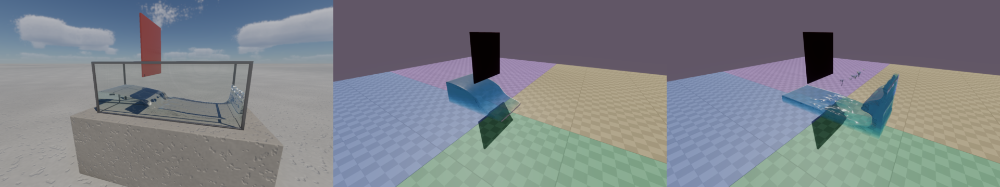

**The checks** (fixed step, `--liquid-log N` prints the line every N ticks):
- **The particles:** none lost.
- **The still water:** at rest to the bit before the gate lifts (rms and greatest speed 0.000 m/s).
- **The pressure's residual:** the line's `residual` is the outflow the last substep's solve left
  in the liquid cells, as a share of what it had to undo, and `residual_max` the worst cell's,
  m/s. The 32 sweeps leave 0.7 to 6 % in the dam break (2.4 % on average over ticks 60 to 240),
  0.03 m/s at worst.
- **The settled level:** 149.4 mm nine seconds after the gate lifts, against the 150.0 mm its volume
  gives over the whole floor. D-044's check asks within 2 mm. The column model of `flood` fails it.
- **The replays:** three runs give the same digests at all 100 logged ticks (every 6, 600 frames).
- **The front:** from the gate to the far wall (0.98 m) in 0.47 s; between ticks 42 and 54 it
  runs 3.0 m/s, three quarters of Ritter's 2√(g h₀) = 3.96 m/s for a dam removed at once (this
  gate lifts at 3 m/s, letting the water go over a tenth of a second).
- **The hole's outflow** (`tank-hole`): the reservoir falls 23.8 mm/s in the first second, 8.6
  litres a second through 50 cm² under a head of 0.265 m: a discharge coefficient of 0.75. A
  sharp-edged hole's is about 0.6; at 6.4 cells across the jet's contraction past the hole is
  under-resolved. Both sides stand level at 152 mm in the end (25 mm apart after 14 s).

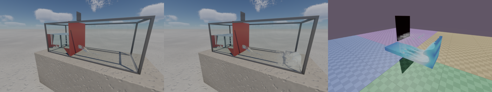

**The cost** on the RTX 5070 Ti, 1600 × 900, on the async compute queue (600 frames):

| Zone | `tank` (ms a frame) | `tank-hole` | `tank`, unsorted |
|---|---|---|---|
| `liquid/sort` | 0.24 | 0.21 | |
| `liquid/p2g` | 1.15 | 1.10 | 2.02 |
| `liquid/pressure` | 1.18 | 1.15 | 1.16 |
| `liquid/g2p` | 0.32 | 0.33 | 1.13 |
| `liquid/faces`, `cells`, `project`, `clear`, `foam` | 0.14 | 0.14 | 0.15 |
| `liquid/draw` (graphics) | 0.20 | 0.21 | 0.21 |

That makes 3.0 ms of simulation: more than D-044's 2.5 ms estimate for 190 000 particles
(answer 4: to be found by trying).
- **The sort:** the particles go by cell into a second buffer once a frame, a counting sort:
  places taken by atomics, the counts scanned in groupshared blocks. Unsorted, the dam break
  mixed them: neighbours in the buffer stopped being neighbours in the tank, and the sums to the
  grid and the gathers back missed the cache (4.5 ms in all).
- **Determinism:** the places within a cell come from the atomics, in no fixed order, which the
  physics does not mind (the grid's sums are integers, the rest per particle). The digest is
  now over the particles' states whatever their order: runs still replay to it, and async and
  serial draw the same.
- **Where the time could go next:**
  - the pressure in fewer passes: below, the multigrid tried for it;
  - a workgroup's sums gathered in groupshared memory before the atomics.

**The pressure as a multigrid** (`--liquid-cycles N`, opt-in; after McAdams et al. 2010):
- **The levels:** each half as fine as the last: 128 × 48 × 48 cells, then 64 × 24 × 24 and
  32 × 12 × 12 in passes of their own. Below that, 16 × 6 × 6 down to 4 × 2 × 2 run in one
  workgroup, in 30 KB of groupshared memory.
- **A V-cycle:** `--liquid-smooth` red-black sweeps on each level, its residual to the next
  coarser one (a coarse cell is air where any of its eight is), then each level corrected by the
  coarser one's answer, trilinear, and smoothed again.

It is not the default. In the dam break, against the sweeps (ms a frame: `liquid/pressure`,
`restrict`, `prolong` and `coarse` together):

| Pressure solve | Residual, mean of ticks 60–240 | Worst cell, m/s | Still water | ms |
|---|---|---|---|---|
| 32 sweeps, ω 1.7 (default) | 2.4 % | 0.03 | at rest | 1.27 |
| 128 sweeps | 0.13 % | 0.0002 | | 4.94 |
| V(2,2), a cycle a substep | 3.5 % | 0.41 | sinks 5 mm and sloshes | 0.75 |
| V(3,3), a cycle | 2.6 % | 0.62 | at rest | 1.02 |
| V(4,4), a cycle | 1.9 % | 0.32 | at rest | 1.24 |
| V(2,2), two cycles | 1.0 % | 0.14 | at rest | 1.54 |

- **Why it is not the default:** with two sweeps a level and one cycle a substep, the still
  water's residual grows eightfold a tick from the first. The mode lies at the free surface,
  which the coarse levels place up to a coarse cell off; McAdams et al. use their V-cycle as
  conjugate gradients' preconditioner, not alone. With three sweeps the water stays still and
  the cycle saves a fifth of the sweeps' time. But that is one sweep from diverging, and its
  worst cell is 20 times the sweeps'. Over-relaxing the smoothing (ω 1.3 or 1.6) makes it
  worse.
- **What it doesn't change:** nine seconds on, every variant settles at 149.4 mm, and all slosh
  alike after 12 s (0.16 to 0.18 m/s rms).
- **Where its time goes:**
  - **A pass costs about 4.6 µs whatever its size:** level 0's 147 000 threads or level 1's
    18 000. That is a launch, a chain of dependent loads and a drain. 32 sweeps are 64 such
    passes a substep, and a V(2,2) cycle 21.
  - **The single workgroup's coarse levels take 72 µs a substep:** about 60 phases between
    barriers on one multiprocessor.
- **What would make it pay:** fewer passes that each smooth more, such as sweeps inside
  groupshared tiles. On their own, the tiles' edges left errors that kept the water sloshing
  (above); within a multigrid, the coarse levels correct exactly those.

## `room`: a plain room to measure sharpness by (issue #159)

```
cargo run --release -p physics-lab -- --lab room
cargo run --release -p sharpness -- capture.png --edge 712,600,48,96 --edge 764,434,24,36
```

The owner's report of 2026-10-03: "I feel like the image is always a bit blurry of fuzzy, never
clear and neat as it should ... we can start with a very simple environment, simple geometry. in
a room with a simple light source and find where it's getting blurry or fuzzy."

**The scene.**
- **The room:** 8 × 10 m, white matte walls on three sides, open to the sky above, and a floor of
  black and white squares (12.5 cm, a test texture of their own).
- **The light:** the sun alone, white, with no sky light (the bench's constant fill).
- **The targets:** three black squares on the back wall, 8 m from the camera's start, and a
  fourth on a white board 2.5 m away. Each is turned 5° off the pixel grid.
  - They are flat colour, so their edges' softness is the pipeline's own: the raster, TAA,
    bloom, the tone curve.
  - The floor seen at a slant is the textures' filtering.

**The measure:** `tools/sharpness`, the slanted-edge method (ISO 12233, after Burns 2000).
- Each `--edge` is a rectangle round one edge. The tool fits the edge's line and bins every
  pixel's distance from it at a quarter of a pixel, which gives the edge's profile.
- From the profile it gives the 10–90 % rise in pixels and the MTF, the contrast left at each
  spatial frequency in cycles per pixel.
- An ideal pixel, the light averaged over its square, rises over 0.8 px and keeps half its
  contrast at 0.60 cycles a pixel (MTF50).
- `--rcas STOPS` sharpens the capture first as AMD's FidelityFX RCAS would, a preview of a
  sharpening pass.
- At 1600 × 900 from the start view, the four edges of the board's square are
  `712,600,48,96`, `750,555,96,48`, `840,590,48,96` and `760,682,96,48`; the middle wall
  square's are `764,434,24,36` and `780,414,36,24`.

**Two options to measure with.**
- `--pan SPEED` slides the camera sideways at that many metres per second. Started SPEED metres
  to the left (`--view=-2,1.5,3,0,0` for 2 m/s), frame 60 lands on the still view.
- `--dlaa` anti-aliases with NVIDIA's DLAA in place of TAA in a scripted run too. Since D-045
  DLAA is the default of an interactive run where it runs (the Streamline SDK in
  `streamline-sdk/`, an RTX GPU); `--no-dlaa` keeps to TAA.

**What it found** (MTF50 in cycles a pixel, the board's left and right edges and the wall
square's left; frame 60, TAA's history full):

| | Still | Panning 0.5 m/s | Panning 2 m/s |
|---|---|---|---|
| An ideal pixel | 0.60 | 0.60 | 0.60 |
| TAA (today's) | 0.54 | 0.30–0.38 | 0.30–0.33 |
| No TAA | over 1 (a hard, aliased step) | over 1 | over 1 |
| DLAA | 0.60–0.61 | 0.41–0.44 | 0.43–0.48 |

- **A still image is sharp.** TAA's edges are within a tenth of an ideal pixel's. The edges along
  the motion keep 0.56–0.59 in every pan.
- **Moving, it is not.** The edges across the motion lose half their contrast at 0.25 cycles a
  pixel and nearly all of it at 0.5. That is TAA's history, resampled each frame where the motion
  is a fraction of a pixel and blended for about ten frames.
  - At whole-pixel motion it stays sharp. At 0.7469 m/s the wall's squares move exactly 1 px a
    frame: 0.551, against 0.544 still.
  - With the jitter frozen it is just as soft (0.29–0.33). It follows the history's weight: at a
    blend of 0.3 it is 0.37–0.39, at 0.6 it is 0.56–0.60, and at 1 the edges are sharp and
    aliased.
  - The history's filter hardly matters. A 16-tap Catmull-Rom and a Lanczos-2 give the same as
    today's five taps; a Lanczos-3 (36 taps) gives 0.35–0.375.
  - Clipping and the motion term of the blend are not the cause: without either it is a little
    softer.
- **DLAA** is an ideal pixel's sharpness still, and keeps about 40 % more than TAA in motion. It
  costs 0.48 ms at 1600 × 900, against TAA's resolve at 0.055.
- **A sharpening pass** (RCAS, previewed on the captures): at 1 stop it brings the still image's
  contrast at 0.25 c/px from 0.85 to 0.99 without halos. Panning, at 0.5 stop, 0.62–0.67 becomes
  0.83–0.87. The finest detail lost in motion stays lost.
- **Bloom** at 4 % blurs nothing but lifts the black squares by a fifth (0.032 to 0.026 linear
  without it): less contrast.
- **The tone curve:** the black squares show as follows, in sRGB codes against a white wall at
  0.63–0.69:
  - AgX, the default: 0.20–0.23, a milky grey;
  - ACES: 0.07–0.09;
  - neutral: 0.07–0.09.

  A sunlit white wall shows short of white under all three at EV 15. AgX's lifted blacks are
  much of the "not clear" look in a still image.

What to do about it: D-045, accepted. The first two steps are done.

**DLAA by default where it runs**, in an interactive run (`--no-dlaa` for TAA; T cycles DLAA,
TAA sharpened, TAA plain and off). A scripted run (`--frames`) keeps to TAA unless `--dlaa`:
two runs of the city under DLAA differ by up to 3 codes, and the captures' checks want the
images to the bit. DLAA's display pass now mixes in bloom as TAA's resolve does (the black
squares' level is the same under both). Panning at 2 m/s, its MTF50 is 0.43–0.48 against
sharpened TAA's 0.37–0.40, and at 0.25 c/px 0.79–0.82 against 0.83–0.87. It costs 0.46 ms
for the DLSS pass at 1600 × 900, and 0.02 for the display pass.

**TAA sharpened** (`--rcas STOPS`, half a stop by default; `--no-rcas`). A pass after the resolve sharpens the display's signal (sRGB-encoded, or PQ)
with FidelityFX RCAS. The MTF at 0.25 c/px, the three edges (over 1 is an overshoot, a halo):

| RCAS | Still | Panning 0.5 m/s | Panning 2 m/s |
|---|---|---|---|
| none | 0.85–0.86 | 0.62–0.73 | 0.62–0.67 |
| 1.5 stops | 0.94–0.95 | 0.70–0.80 | 0.70–0.74 |
| 1 stop | 0.99–1.00 | 0.73–0.83 | 0.74–0.78 |
| **half a stop** | 1.08–1.09 | 0.83–0.91 | 0.83–0.87 |
| 0 (the strongest) | 1.32–1.35 | 1.08–1.16 | 1.08–1.11 |

- **The MTF50:** half a stop takes it to 0.60–0.62 still, an ideal pixel's (DLAA's 0.60–0.61),
  and to 0.37–0.40 panning at 2 m/s, against 0.30–0.33 unsharpened (DLAA's 0.43–0.48).
- **Why half a stop:** it gives back about 60 % of the contrast the moving edges lose, against a
  third at 1 stop. The still edges overshoot by 9 %, a halo too faint to see; at 0 stops it
  shows as a light line.
- **What it costs:**
  - 0.073 ms for the pass at 1600 × 900, less the 0.009 the resolve saves (`docs/PROFILE.md`).
  - What changes from frame to frame changes a little more. The city's view from frame 120 to
    121 differs by a ꟻLIP mean of 0.0085 against 0.0078, and 1172 pixels over 0.1 against 833.
- **Matching the preview:** the GPU pass gives the numbers `tools/sharpness --rcas` predicted from
  the captures.

**A Lanczos-3 history** (by default; `--taa-catmull-rom` for the five bilinear fetches before
it). TAA's history is resampled through 36 texels. Still, nothing changes (a still camera
samples it at the pixels' centres). Moving, with the sharpening:

| History | Panning 0.5 m/s, MTF50 (at 0.25 c/px) | Panning 2 m/s |
|---|---|---|
| Catmull-Rom | 0.36–0.43 (0.83–0.91) | 0.37–0.40 (0.83–0.87) |
| **Lanczos-3** | 0.42–0.47 (0.92–0.97) | 0.42–0.44 (0.92–0.95) |
| DLAA, for comparison | | 0.43–0.48 (0.79–0.82) |

It costs 0.03 ms (the resolve 0.047 → 0.077 ms at 1600 × 900). No ringing shows: the history
is clipped to the neighbourhood after it is sampled.

**SSAA 2 × 2 for screenshots** (`--ssaa`, every demo): the shell hands the demo a frame twice the
window's width and height and takes each window pixel as the mean of its four, in linear light.
TAA and the sharpening still run, at the larger size.
- **Sharpness:** MTF50 0.67–0.70 still and 0.60–0.66 panning at 2 m/s, an ideal pixel's even in
  motion (TAA with everything above: 0.42–0.44; DLAA 0.43–0.48).
- **Cost:** the city's frame 2.4 → 5.1 ms at 1600 × 900, and 0.02 ms for the filter. So it is for
  captures and stills, not play.
- Not with the off-screen HDR mode (it says so and draws at the window's size).

**AgX with more contrast** (`--tonemap agx-punchy`, in G's cycle after AgX): Wrensch's "punchy"
look, a power of 1.35 and saturation 1.4 between AgX's sigmoid and its outset. The black squares
show at sRGB 0.055–0.08, against AgX's 0.20–0.23 and ACES's 0.07–0.09. The sunlit white wall
shows at 0.55, against 0.67. AgX stays the default (the owner's answer 3).

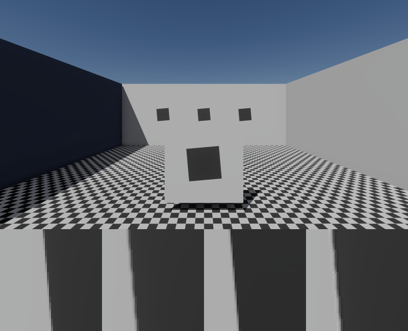

## `dominoes`: a run that ends the same (issue #146)

```
cargo run --release -p physics-lab -- --lab dominoes
```

The first of the advanced tests the plan suggests ("a domino run that ends the same on two
machines"). 300 wooden dominoes (64 × 32 × 8 cm, 650 kg/m³) stand on a spiral from 3 m out to
8 m, 40 cm apart along it (five eighths of their height), placed and turned through
`forge_core::dmath`, so the run starts from the same bits everywhere. **Space** (or `--release
N`) tips the first. The fall runs round the spiral at about 2.5 m/s, six dominoes a second,
and the last is down at tick 2 940, 49 s on; the dominoes fall asleep where they lie.

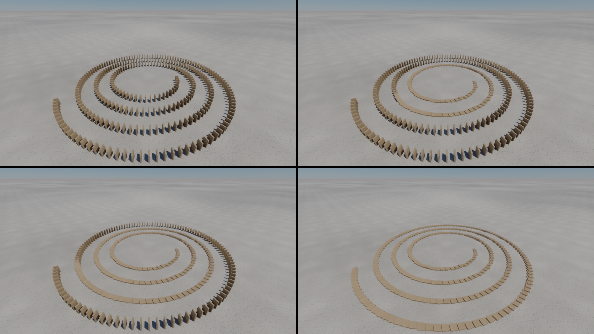

What it tests is the solver's determinism over a long chain of cause and effect, thousands of
contacts made and broken in turn, where one bit off anywhere would show at the end: the lab's
test runs the fall out (none falls untouched for a second; pushed, all 300 are down within 50 s)
and replays it from its recording to the same 25 digests; `--net` runs it through a server and a
client. That the world's hash does not depend on the workers, on a save and restore, or on the
platform is the pile's test (#136, Windows and Linux in CI). A tick: **0.21 ms** on average, p99
0.38 ms (332 bodies, those falling and fallen awake until the run is over).

## `bridge`: a convoy on a bridge that gives way (issue #147)

```
cargo run --release -p physics-lab -- --lab bridge
```

The second advanced test ("a bridge collapsing under a convoy"), where the car (#140) meets the
joints that break (#142). The bridge:
- **The deck:** 16 timber panels (4.4 m × 1 m × 12 cm, 600 kg/m³) spanning a 16 m gap between
  two banks 4 m high.
- **Its joints:** each panel is joined to the next, and the end ones to the banks, by fixed
  joints that break as the wall's mortar does.
  - That rule is now shared code (`lab/bonds.rs`): a joint breaks on its load (here 120 kN or
    78 kN·m) or its strain (12 mm or 1.3°), and Jolt saves whether each holds.
  - The panels settle under their own weight for five seconds as the scene is built: laid without
    their load, the joints swing past their load at rest on the way (93 kN·m against 55).
- **The convoy:** four of the track's cars wait on the near bank, held where they stand.
  - **Space** (or `--release N`) lets them go.
  - An autopilot keeps each on the middle line (against its offset and heading) at 4 m/s.
  - It stops each past a line on the far bank, or at once behind a car that went down.

The empty deck carries 55 kN·m at its worst joint. It holds the first car (up to 71 kN·m) and gives
way about 4.7 s after the cars set off, when the second is on it too:
1. the far bank's joint goes first;
2. the deck swings down from the near bank with both cars on it;
3. then the rest of its joints break as it lands.

The two cars behind stop on the near bank, the third 2 m short of the edge.

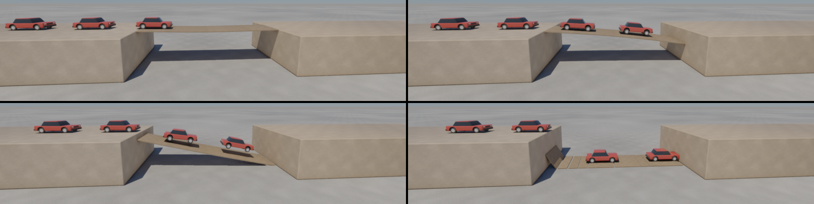

The lab's test checks the deck standing for a second untouched with the cars held. Then it lets
them go and checks, ten seconds on:
- most of the joints broken (16 of 17 at the time of writing);
- two cars down and none across;
- the run replayed from its recording to the same digests.

The wall's and the track's images did not change with the shared code (0 px). A tick: **0.11 ms**
on average, p99 0.23 ms, max 0.34 ms (52 bodies, 4 vehicles).

## `tug`: a tug-of-war over the network (issue #149)

```
cargo run --release -p physics-lab -- --lab tug --net 100
```

The third advanced test ("a networked tug-of-war on one crate at 100 ms"): the netcode (#137) on
a body two players fight over.

**The game:**
- A 200 kg sled sits on the floor (friction 0.4, 785 N to start it moving) between two ropes, on
  the middle of three lines 3 m apart.
- Each team pulls along its rope with up to 2 kN: the left team as player 0 (this player) says,
  the right as player 1, each with a `Pull` command.
- The pulls are held in the world's state like the other controls, so they are saved, restored and
  digested with it.
- Both start holding at half. Once the sled's middle is over a line, that team has won and both let
  go.

**Locally:** ← pulls with all the left team's strength and → eases to a fifth, against a right
team that holds.

**Over `--net 100`:** the right team is the bot, pulling hard and easing off to 0.3 every 1.5 s.
This player's client predicts the sled, but learns of each change of the bot's a link late:
- every snapshot after one disagrees with the client's prediction (the pulls are in the digest,
  and so is where the sled went);
- the client goes back to the server's state and runs the ticks since again.

Holding at half, this player loses: the sled is over the right line by tick 300.

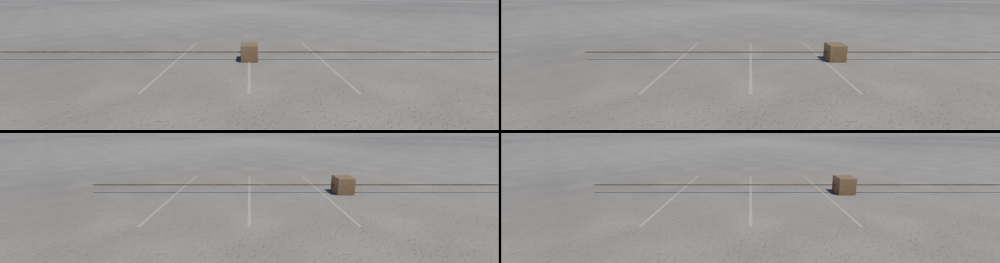

`--net 100`, 600 ticks, this player holding:

| | |
|---|---|
| snapshots taken by this player's client | 99: 93 predicted to the bit, 6 corrected (one for each change of the bot's pull), 84 ticks run again |
| a correction (the state restored, 14 ticks run again) | at most 0.55 ms |
| a tick: the server and the two clients | mean 0.12 ms, p99 0.30 ms, max 0.66 ms |
| commands taken by the server | the bot's 6, none late |
| bytes down to a client | 6.0 KB a snapshot (one sled), 60 KB/s |

The lab's tests:
- **Locally:** a second with both teams holding leaves the sled on the middle line. The left team
  pulling with all its strength (2 000 N against 1 000 and the friction) wins within 3 s, and the
  run replays to the same digests.
- **Over the lossy link:** this player eases and then pulls harder while the bot changes its pull
  six times. The server takes all eight commands in time, the client corrects at least six times,
  and it ends where the server is, to the bit.

## `models`: models made by others (issue #170, D-048)

The Khronos glTF sample assets, to compare Forge's renderings with Khronos's and to test the
importer and the materials on models Forge did not make. They are not in the repository:

```
tools/fetch-assets.sh                    # the open models, CC0 or CC-BY 4.0, 72 MB
tools/fetch-assets.sh --reference-only   # also Sponza (CryEngine Limited License), 53 MB
physics-lab --lab models                 # each on a plinth
physics-lab --lab models --model Fox     # one alone, framed as its Khronos screenshot
```

`assets/external.tsv` pins every file to one commit of the Khronos repository, with its size
and SHA-256. The script checks each file and keeps those already there. The models land in
`assets/external/`, which git ignores, with each one's `LICENSE.md`.

**For the labs only:**
- Nothing that ships reads `assets/external/`: `credits --check`, which CI runs, fails if any
  source outside the labs, the tools and the tests names it, or names a reference model.
- The reference models (restricted licences) are fetched only on request, are never
  committed, and never go into the engine or a game.
- Captures of them are ours and may be shown.

**The scene:**
- **The row:** each model on a plinth, scaled to fit a metre, its meshes placed as its file
  places them.
- **`--model NAME`:** one model alone, the camera framing its bounds, for a capture beside its
  Khronos screenshot.
- **Sponza** shows only alone, at its own size, the camera at a person's height under its
  arcade.
- **Skinned models** (Fox, CesiumMan) stand in their rest pose: the lab bends their vertices
  by their skin's matrices at rest (`forge-anim`). glTF keeps a skinned mesh in its bind pose,
  and CesiumMan's is turned on its back.
- **Missing models** are skipped, logged, and named in the log line. The batch captures the
  scene only where they are there, so CI and a fresh clone capture nothing of it.

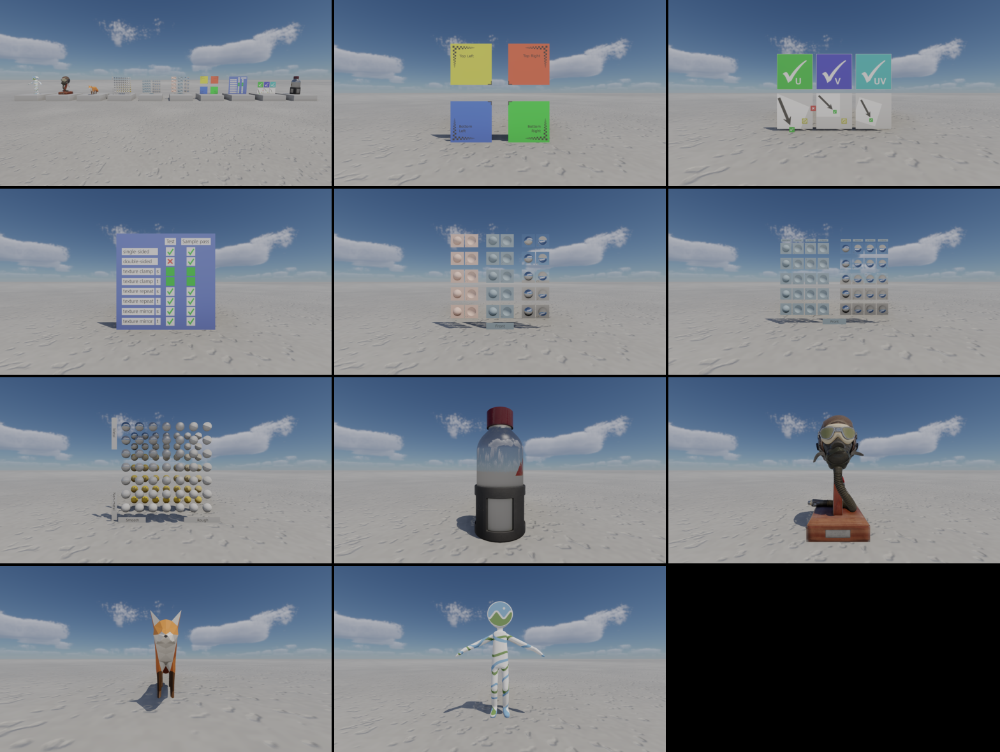

**The first set:**
- **The test models:** TextureCoordinateTest, TextureTransformTest, TextureSettingsTest,
  NormalTangentTest, NormalTangentMirrorTest and MetalRoughSpheres.
- **The objects:** WaterBottle and FlightHelmet.
- **The animated figures:** Fox and CesiumMan.
- **Sponza,** reference only: 262 000 triangles and 69 JPEG textures.
- **Size:** the ten open models are 619 000 triangles and 38 images. Their textures take
  534 MiB of video memory as RGBA8 with mips: FlightHelmet's fifteen 2048² maps are most of
  it. That is the case for block compression (D-047's table).

**What they found:**
- **Highlight NaN at roughness 1.** A material at roughness 1, glTF's default, gave a highlight
  exponent of 0. The shader's `pow(0, 0)` then produced NaN where the surface turns from the
  light, and bloom and TAA spread it into black squares (MetalRoughSpheres' roughest column,
  CesiumMan). The exponent now stays at least 0.001, in `RenderLayer::specular_power` and in
  the UV row.
- **`KHR_texture_transform`'s rotation had the wrong sign.** TextureTransformTest's arrows
  pointed at its red crosses. They now point at its green checks, as in Khronos's screenshot.
- **Double-sided materials are drawn one-sided.** TextureSettingsTest shows its one red cross
  on that row. Blender marks every material double-sided, so the importer does not warn of it.
- **Alpha cut-outs are drawn opaque:** Sponza's foliage and chains, logged.
- **The probes leave Sponza's interior dark**, already at frame 60, while the sky through
  the open roof is lit. Suspects: probes inside its walls and rays hitting back faces (#171). With `--no-probes` the open sky's light reaches under the
  arcade, too bright but nothing black.

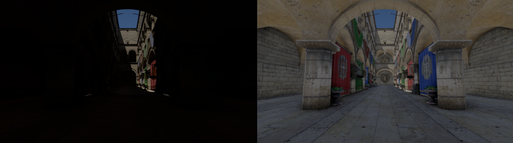

## Captures

The batch (`tools/captures.sh`, set `lab`) takes `lab-drop90` (the rain in mid-air), its A/B
twin with the occlusion off (`lab-drop90-noocc`, 0 px apart: the movers are culled like
everything else), `lab-drop600` (the pile at rest) and `lab-net300` (the client's view through
`--net 100 --throw-every 45`: thrown balls in flight, the bot's corrections behind it), on both
geometry paths; and from the sea (#138) `lab-sea300` (what floats and the rocks on the floor) with
its occlusion-off twin, and `lab-sea-steer600` (the boat under way with the rudder over); and from
the playground (#139) `lab-walk150` (halfway up the stairs) with its twin, and
`lab-walk-crates240` (through the light crates); from the track (#140) `lab-drive300` with its
twin and `lab-drive-turn600`; from the field (#141) `lab-fly1200` (climbing away) with its
twin; from the break scene (#142) `lab-break85` (the ball through the wall) with its twin and
`lab-break300` (the wall broken, the column in pieces); and from the creatures (#143)
`lab-creatures120` (posed) with its twin, `lab-creatures-throw240` (struck by balls) and
`lab-creatures-limp240` (let go); from the flood (#144) `lab-flood150` (the water running
down the basin) with its twin, `lab-flood300` (spread round the blocks) and `lab-flood150-columns`
(the columns drawn without the GPU's layer, #162); and from the
dominoes (#146) `lab-dominoes900` (a turn down) with its twin and `lab-dominoes3000` (all down);
and from the bridge (#147) `lab-bridge360` (the deck falling with two cars) with its twin and
`lab-bridge600` (in the gap); and the rocket (#148) at full throttle with the stick a tenth
pushed, `lab-rocket120` (climbing off the pad) with its twin and `lab-rocket600` (pitched over
downrange); and the tug-of-war (#149) through `--net 100`, `lab-tug-net200` (the sled on its way
right) with its twin and `lab-tug-net600` (over the line); and the spaceship (#150) at full throttle,
`lab-space90` (closing on the crates) and `lab-space150` (through them) with its twin;
and the glass tank (#156), the gate lifted at tick 31, `lab-tank90` (the wave climbing the far
wall) with its twin and `lab-tank-bench300` (the bench, the water settling), `lab-tank-hole120`
(the jet, the far wall white for a moment) and `lab-tank-blocks56` (the wave wrapping the cube);
and the sharpness room (#159), `lab-room60` (still) and
`lab-room-pan60` (slid sideways at 2 m/s into the same view).
