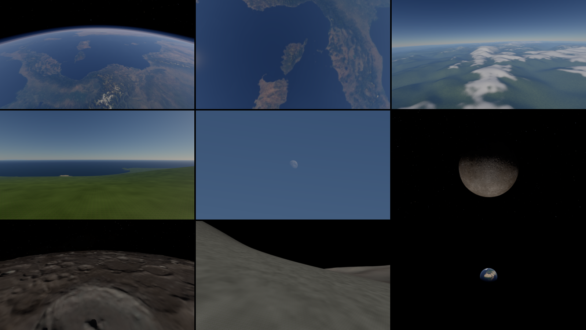
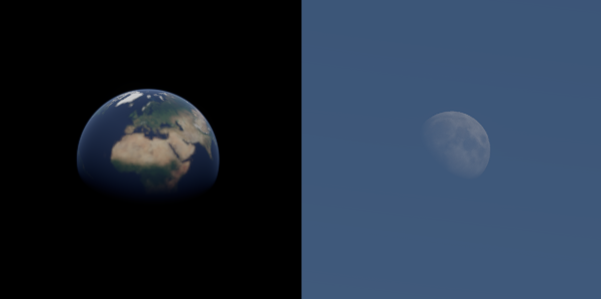

# Demo: planet

Phase 2's planet (D-056, #220): a planet of Earth's size from orbit down to its ground. The
Earth comes from NOAA's real elevation and NASA's Blue Marble, the Moon from NASA's elevation and
colour maps, and noise adds the detail under their resolution. The sky is NASA's map of the real
stars. It is the island demo's second step. The owner wanted it as a demo of its own
(2026-10-09), so that planets, moons and later suns stay apart from the island.

```
tools/fetch-planets.sh                                    # the maps, once: about 750 MB
cargo run --release -p planet                             # the Earth: a 60 s descent to Èze
cargo run --release -p planet -- --shot orbit             # held at a golden shot: orbit, high, ground, top
cargo run --release -p planet -- --target 42.15,9.1 --heading 0 --shot top   # Corsica from the station
cargo run --release -p planet -- --world assets/worlds/moon.toml
```

**P** stops the descent and flies: right mouse to look, WASD, Shift faster. The speed grows with
the height. The other keys are the ballad's: **T** TAA, **O** occlusion, **C** cone culling,
**X** show culled, **K** LOD colours, **J** shadows, **N** ambient occlusion, **G** tone curve,
**-** / **=** exposure, **[** / **]** LOD error.

| Flag | What it does |
|---|---|
| `--world FILE` | the world (`assets/worlds/earth.toml` by default, `moon.toml`); `--print-world` prints it |
| `--shot orbit\|high\|ground\|top` | holds the descent at a golden shot; `top` looks straight down from the orbit's height |
| `--target LAT,LON`, `--heading DEG` | where the descent ends and the way it looks, over the world's |
| `--sun-elevation`, `--sun-azimuth` | the sun over the target, degrees (25° and 240° by default) |
| `--ev100 EV`, `--auto-exposure` | the exposure: sunny 16 (EV 15) by default, as a camera takes anything sunlit; or metered |
| `--stars STOPS` | the stars' brightness: a map value of 1 at 2^STOPS cd/m² (12) |
| `--radius KM`, `--seed N` | over the world's |
| `--tour`, `--tour-stop N` | flies the world's tour, or holds its stop N |
| `--resident` | every page resident instead of the 512 MiB streamed pool (the A/B) |

## How it is made

- **The world file** (`assets/worlds/earth.toml`, `moon.toml`; `forge_terrain::planet`):
  - the radius and the noise;
  - the maps (elevation, colour, sea mask) and the noise under them;
  - the tiles' size and how finely the cut follows the target;
  - the target, the way the descent comes in, and the height it starts from (400 km on the
    Earth; 4 000 km on the Moon, from where it is seen whole);
  - whether there is air, and the sky's map with the body's pole and prime meridian.
- **The maps** (`tools/fetch-planets.sh`, into `assets/planets/`, which git ignores). The
  script pins each download by size and SHA-256, and Blender converts what the engine can't read
  (`assets/blender/planet_*.py`; Forge has no TIFF reader).

  | Map | Source | Converted to |
  |---|---|---|
  | The Earth's elevation | NOAA's ETOPO 2022, 60 arc-seconds (about 1.85 km), public domain | `i16` metres |
  | The Earth's colour | NASA's Blue Marble Next Generation, July 2004, without its relief shaded | 16 384 × 8 192 JPEG (a power of two, AMD's widest image) |
  | The Earth's sea | the elevation under 0 m | 8 192 × 4 096 grey PNG |
  | The Moon's elevation | NASA's CGI Moon Kit, 16 samples a degree (about 1.9 km) | `i16` metres |
  | The Moon's colour | the CGI Moon Kit's 2025 colour map at 4K | PNG |
  | The sky | NASA's Deep Star Maps 2020 at 8K (Gaia, Hipparcos) | sRGB PNG |
- **The height** (`Planet::height`):
  - the map, read through its samples with Catmull-Rom from its mip pyramid, at the level that
    holds nothing narrower than the tile's samples allow (bilinear left flat facets a texel
    wide: Tycho's central peak was a square pyramid);
  - then band-limited 3-D gradient noise (Perlin's improved gradients) for the octaves under the
    map's resolution, a quarter as strong at the sea's level as on the high ground.
  The Earth's ground under 0 m is sea, flattened at its level. The Moon has none.
- **The tiles:** a cell of D-037's equi-angular cube sphere each.
  - 257² samples in the planet's axes, relative to the cell's centre.
  - Normals from a ring of samples beyond the edge, so neighbours of one level share their
    edges' normals.
  - A skirt on vertices of their own hangs from the edge, so the simplifier keeps the edge
    locked.
  - Each is cooked into a cluster DAG through the cache (`cache/meshes/earth@face-level-x-y`),
    keyed by the world's shape, the map's digest and the code (not by its colours).
- **The cut** (`PlanetWorld::tile_cut`): a quadtree of cells. A cell splits while the target lies
  within its side plus half its diagonal, down to level 14 on the Earth (tiles of 611 m, samples
  2.4 m apart) and 12 on the Moon. Each tile's DAG coarsens with distance, so the 600 m tiles
  under the camera cost almost nothing from orbit.
- **Drawing:** the cluster renderer, streamed through a 512 MiB pool. The start view's pages load
  before the first frame. Each tile is an instance placed at its `f64` position
  (`add_instance_at`), turned so the target stands at the world's origin with +Y up.
- **Shading:** the layered ground with its layers by height, slope and latitude
  (`RenderLayer::planet_layers`, `planet_layers` in `meshlet.slang`).
  - **Near the ground:** on the Earth, sea, sand (where a pixel spans under 40 m), grass, rock on
    slopes over about 0.3, and snow over a line falling from 4 200 m at the equator to 300 m at
    the poles. On the Moon, regolith of a few kinds under its colour map.
  - **From afar** (a pixel spanning 30 m to 400 m and more), the maps stand for the ground: the
    Blue Marble's colour, and the sea from the mask rather than the coarse tiles' triangles, whose
    coasts were kilometre-wide shapes. Water is shaded flat, and on the planet the layers'
    highlights blend in strength and power alike, so no bright line follows the coasts.
  - The textures lie on the scene's frame, one surface over every tile.
- **The sky:**
  - **The Earth:** Hillaire's atmosphere at the planet's radius.
    - The aerial volume reaches up to 64 km. Each pixel beyond it is marched on its own in 32
      steps closing up towards the ground (`march_beyond`), and the volume's slices longer than
      2 km are marched in steps: from orbit, no rings.
    - When the camera is over 1.5 km up, the ground's sky light and the reflections it takes
      come from a second set of tables at 2 m over the ground under the camera: from orbit, the
      camera's own sky is space's black.
  - **The stars** (`forge_render::SkyBox`): NASA's map, turned by the body's pole and prime
    meridian (the IAU's, the Moon's at J2000) and added over the air's sky, fading through its
    lowest 40 km. On an airless body it draws the sun's disc too. The map is made for display (its
    bright stars clipped), so the stars carry no photometry: at sunny 16 they are faint dots,
    where an eye beside a sunlit body would see none, and `--stars` sets them.
- **Shadows:** the sun's rays against each level's tiles cut as one surface (120 000 triangles a
  level). Every tile is ground to the rays (`set_ray_terrain`), so the finest tiles' shadows
  start clear of the rays' cut, as the island's do.

## The tour and the bodies in the sky

`planet --tour` flies the world's `[[view.tour]]` stops in turn, and `--tour-stop N` holds stop N
for a capture. The camera travels along the great circle between stops, its height eased in its
logarithm and raised over long hops, so it clears the mountains between. Heading, pitch and field
of view ease too. A stop looking up narrows the field of view, because the Moon is half a degree
across.

| The Earth's tour (`earth.toml`) | The Moon's tour (`moon.toml`) |
|---|---|
| the Alps from the station (400 km) | the Moon from 4 000 km |
| Corsica straight down | Tycho from 60 km |
| Mont Blanc from 6 km | on Tycho's floor |
| Èze over the sea | the Earth over Tycho (12° field of view) |
| the Moon over the sea (6° field of view) | |



**The bodies** (`[[view.bodies]]`, `forge_render::SkyBody`): the Moon in the Earth's sky, the
Earth in the Moon's. Each is placed by its azimuth and elevation over the target. Its colour map
is the Moon Kit's or the Blue Marble's, turned so a given point faces the camera: the Moon's near
side, or Europe and Africa. It is lit by the same sun as the ground, so its phase follows: the
sun at 240° and the Moon at 100° make it three quarters lit. On the Earth, its light passes through
the air (the CPU's transmittance) and adds to the day sky, which lies in front of it. The Earth's
air is a rim of blue light at its limb.



- **Against photographs:** the Moon in the day sky is pale, its maria clear, its dark side lost in
  the blue. The Earth from the Moon has no clouds, since the Blue Marble is cloud-free, where the
  real Earth is about two-thirds covered and white with them.
- **Cost:** `sky/body` 0.01–0.02 ms.

## Numbers (RTX 5070 Ti, 1600 × 900, TAA, 2026-10-10)

| | Earth (Èze) | Moon (Tycho) |
|---|---|---|
| Tiles in the cut | 492 (14–48 a level) | 423 |
| Triangles in the tiles' finest levels | 65.5 M | 56.3 M |
| Cluster pages (128 KiB) | 12 848 | 10 834 |
| The rays' cuts | 1.68 M triangles, 101 MiB | 1.44 M, 86 MiB |
| First start (the maps, then every tile made and cooked) | about 26 s | about 18 s |
| Later starts (tiles from the cache) | 7.9 s (the 16K colour map 7 s, the elevation 0.5 s) | 2.3 s |
| GPU frame from orbit | 1.09 ms (`sky/compose`'s march 0.31) | 0.68 ms (4 000 km; `sky/box` 0.06) |
| GPU frame straight down over Corsica | 1.88 ms (the march 0.47 over the whole frame) | — |
| GPU frame over the ground | 0.78 ms | 0.77 ms |

- **A tile:** made in about 0.1 s and cooked in 0.16 s on one core (133 000 triangles, 23 pages),
  about 28 a second over the machine's cores (492 in 17.6 s).

## Left for later (#220 and D-056's steps)

- **Tiles that come and go as the camera flies:** the cut is made once at start, so the camera
  stays near the target. Next: the cut made again around the camera on a worker and the scene
  swapped, then the renderer's scene taking and freeing meshes at run time, and a tile cooked in
  milliseconds rather than a quarter of a second (a regular grid's DAG built directly).
- **Clouds for the Earth seen from afar,** as the Moon and orbit see it.
- **The tour's low stops away from the target** (Mont Blanc) draw coarse tiles until they stream;
  the snow layer on them reads as cloud.
- **Steps where levels meet:** a tile next to a coarser one meets it with a step its skirt fills.
  The research's swap rule (a level only where its parent errs under a pixel) comes with
  streaming.
- **The haze from orbit:** a light veil over the land that the station's processed photographs
  don't show; to compare with raw ones.
- **The Earth's land under the sea's level** (the Netherlands, the Caspian's shores) floods, and
  the Blue Marble is July's: no seasons, no clouds.
- **The 16K colour map's start:** 7 s to decode it and make its mips, every start; to cache.
- **The island on the planet** (D-056's step 2), the sea's waves on the sphere (step 3), the
  genesis across the faces (step 4), the descent's checks (step 5).

## Captures

`tools/captures.sh` takes the planet when its maps are fetched (never in CI):
- the Earth at its three shots (`planet-orbit`, `planet-high`, `planet-ground`);
- the ground's twins with the occlusion off and every page resident;
- Corsica straight down from 400 km at the sun's 55° (`planet-corsica-top`);
- the tour's stop under the Moon over the sea (`planet-tour-moon`);
- the Moon from 4 000 km, on Tycho's floor, and the Earth over Tycho (`planet-moon-earth`).
