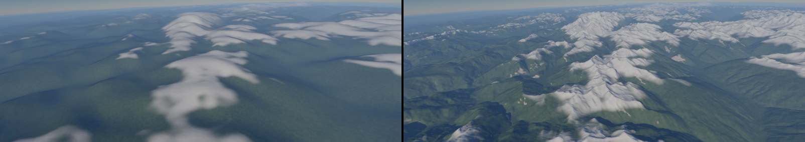
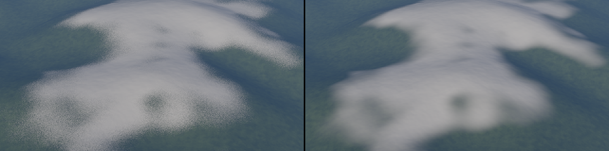
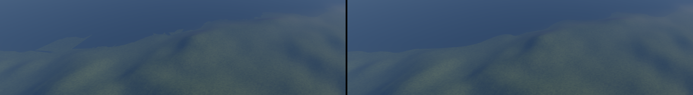
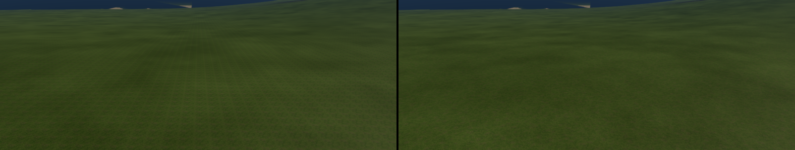
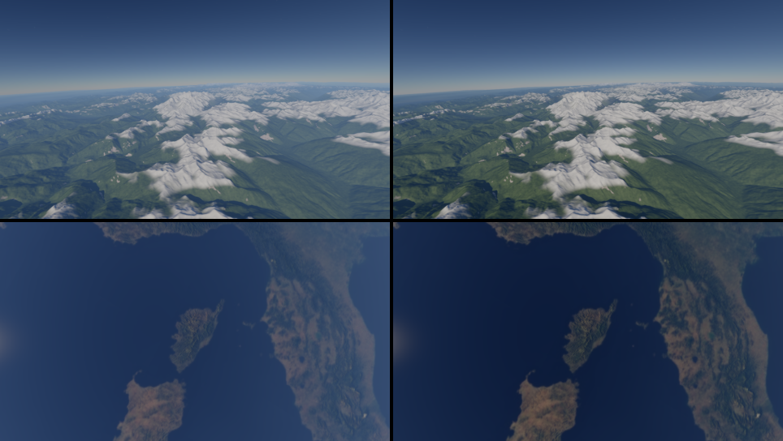
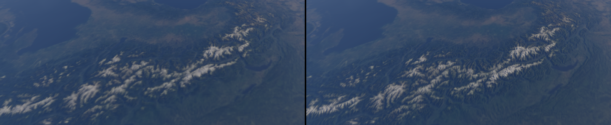

# Demo: planet

Phase 2's planet (D-056, #220): a planet of Earth's size from orbit down to its ground. The
Earth comes from NOAA's real elevation and NASA's Blue Marble, with the Copernicus DEM at 90 m
over the tour's region (the Alps, the Côte d'Azur, Corsica). The Moon comes from NASA's elevation
and colour maps, and noise adds the detail under their resolution. The sky is NASA's map of the
real stars. It is the island demo's second step. The owner wanted it as a demo of its own
(2026-10-09), so that planets, moons and later suns stay apart from the island.

```
tools/fetch-planets.sh                                    # the maps, once: about 850 MB
cargo run --release -p planet                             # the Earth: a 60 s descent to Èze
cargo run --release -p planet -- --shot orbit             # held at a golden shot: orbit, high, ground, top
cargo run --release -p planet -- --target 42.15,9.1 --heading 0 --shot top   # Corsica from the station
cargo run --release -p planet -- --world assets/worlds/moon.toml
```

**P** stops the descent and flies: right mouse to look, WASD, Shift faster. The speed grows with
the height. The other keys are the ballad's: **T** TAA, **O** occlusion, **C** cone culling,
**X** show culled, **K** LOD colours, **J** shadows, **N** ambient occlusion, **G** tone curve,
**-** / **=** exposure, **[** / **]** LOD error.

| Flag | What it does |
|---|---|
| `--world FILE` | the world (`assets/worlds/earth.toml` by default, `moon.toml`); `--print-world` prints it |
| `--shot orbit\|high\|ground\|top` | holds the descent at a golden shot; `top` looks straight down from the orbit's height |
| `--target LAT,LON`, `--heading DEG` | where the descent ends and the way it looks, over the world's |
| `--sun-elevation`, `--sun-azimuth` | the sun over the target, degrees (25° and 240° by default) |
| `--ev100 EV`, `--auto-exposure` | the exposure: EV 14 by default, a stop over sunny 16, as a camera takes anything sunlit; or metered |
| `--stars STOPS` | the stars' brightness: a map value of 1 at 2^STOPS cd/m² (12) |
| `--radius KM`, `--seed N` | over the world's |
| `--tour`, `--tour-stop N` | flies the world's tour, or holds its stop N |
| `--check-swaps DIR` | holds still at each change of the tiles and saves the frames before and after it, for `tools/swap-check.sh` |
| `--resident` | every page resident instead of the 512 MiB streamed pool (the A/B); its scenes are built whole |
| `--edited` | reaches the first scene by an edit in place, from a coarser cut (the A/B against the scene built whole) |

## How it is made

- **The world file** (`assets/worlds/earth.toml`, `moon.toml`; `forge_terrain::planet`):
  - the radius and the noise;
  - the maps (elevation, colour, sea mask) and the noise under them;
  - the tiles' size and the swap rule's settings, which say how finely the cut follows the
    camera and the target;
  - the target, the way the descent comes in, and the height it starts from (400 km on the
    Earth; 4 000 km on the Moon, from where it is seen whole);
  - whether there is air, and the sky's map with the body's pole and prime meridian.
- **The maps** (`tools/fetch-planets.sh`, into `assets/planets/`, which git ignores). The
  script pins each download by size and SHA-256, and Blender converts what the engine can't read
  (`assets/blender/planet_*.py`; Forge has no TIFF reader).

  | Map | Source | Converted to |
  |---|---|---|
  | The Earth's elevation | NOAA's ETOPO 2022, 60 arc-seconds (about 1.85 km), public domain | `i16` metres |
  | The Earth's colour | NASA's Blue Marble Next Generation, July 2004, without its relief shaded | 16 384 × 8 192 JPEG (a power of two, AMD's widest image) |
  | The Earth's sea | the elevation under 0 m | 8 192 × 4 096 grey PNG |
  | The tour's region | the Copernicus DEM GLO-90, 3 arc-seconds (about 90 m), 25 one-degree tiles from 41° to 47° N and 5° to 10° E, free under the Copernicus licence ("produced using Copernicus WorldDEM-90 …") | one 6 000 × 7 200 grid of `i16` metres, no data over open sea (`assets/blender/planet_region.py`) |
  | The Moon's elevation | NASA's CGI Moon Kit, 16 samples a degree (about 1.9 km) | `i16` metres |
  | The Moon's colour | the CGI Moon Kit's 2025 colour map at 4K | PNG |
  | The sky | NASA's Deep Star Maps 2020 at 8K (Gaia, Hipparcos) | sRGB PNG |
- **The height** (`Planet::height`):
  - the map, read through its samples with Catmull-Rom from its mip pyramid, at the level that
    holds nothing narrower than the tile's samples allow (bilinear left flat facets a texel
    wide: Tycho's central peak was a square pyramid);
  - then band-limited 3-D gradient noise (Perlin's improved gradients) for the octaves under the
    map's resolution, a quarter as strong at the sea's level as on the high ground;
  - over the tour's region, the 90 m heights read the same way (`[[map.regions]]` in the world
    file, `RegionParams`):
    - faded in over a quarter of a degree from the region's edges;
    - their own noise from 180 m down at 10 m (ETOPO's starts at 4 km, at 90 m);
    - at or under half a metre, the Copernicus DEM's sea, which takes ETOPO's depths two metres
      deeper at least and no noise, which had raised islands of sand along the coasts.

    Where the region has no tile (open sea), ETOPO alone.
  The Earth's ground under 0 m is sea, flattened at its level. The Moon has none.

  From 6 km up over the Alps, before (ETOPO alone) and after (the 90 m region):

  
- **The tiles:** a cell of D-037's equi-angular cube sphere each.
  - 257² samples in the planet's axes, relative to the cell's centre.
  - Normals from a ring of samples beyond the edge, so neighbours of one level share their
    edges' normals.
  - A skirt on vertices of their own hangs from the edge, so the simplifier keeps the edge
    locked.
  - UVs over the tile, for its normal map: 256² texels from the next level's height, mip-mapped,
    which the shading reads instead of the vertices' normals ("The tiles' normal maps" below).
  - Each is cooked into a cluster DAG through the cache (`cache/meshes/earth@face-level-x-y`),
    keyed by the world's shape, the map's digest and the code (not by its colours).
- **The cut** (`PlanetWorld::tile_cut_around`): a quadtree of cells around a few points, the
  camera and where the run heads (the tour's next stop, the descent's target). A cell splits while
  one of them lies within its side plus half its diagonal, down to level 14 on the Earth (tiles of
  611 m, samples 2.4 m apart) and 12 on the Moon. A camera high over the ground splits no cell much
  smaller than its height. Each tile's DAG coarsens with distance, so the 600 m tiles under the
  camera cost almost nothing from orbit.
- **Drawing:** the cluster renderer, streamed through a 512 MiB pool. The start view's pages load
  before the first frame. Each tile is an instance placed at its `f64` position
  (`add_instance_at`), turned so the target stands at the world's origin with +Y up.
- **Shading:** the layered ground with its layers by height, slope and latitude
  (`RenderLayer::planet_layers`, `planet_layers` in `meshlet.slang`).
  - **Near the ground:** on the Earth, sea, sand (where a pixel spans under 40 m), grass, rock on
    slopes over about 0.3, and snow over a line falling from 4 200 m at the equator to 300 m at
    the poles. On the Moon, regolith of a few kinds under its colour map.
  - **The layers' edges** wander over noise 700 m and 6 m wide. The narrow noise fades to its
    mean where a pixel spans 1.5–6 m. Unfiltered, it speckled the snow from a few kilometres up
    and would have shimmered as the camera moved. Below, Mont Blanc's snow before and after:

    
  - **From afar** (a pixel spanning 30 m to 400 m and more), the maps stand for the ground: the
    Blue Marble's colour, and the sea from the mask rather than the coarse tiles' triangles, whose
    coasts were kilometre-wide shapes. Water is shaded flat, and on the planet the layers'
    highlights blend in strength and power alike, so no bright line follows the coasts.
  - **Nearer, the sea starts at each tile's own coast:** its normal map's alpha, the height
    before the sea flattens it. The contour is read bilinearly per pixel at the map's texels,
    2.4 m on the finest tiles, whatever cluster the DAG draws. The triangles' height drew the
    coast in straight runs and wedges across a coarse tile's triangles, still kilometres long
    from 10 km up. Below, the 10 km shot before and after:

    
  - The textures lie on the scene's frame, one surface over every tile.
  - **Hex tiling** (#66, as on the island) on every textured row: the grass's 12 m repeat showed
    as a grid of stripes over the slopes at Èze (below, before and after). The planet's tiles
    count as one instance for its offset, so it is continuous across them.

    
- **The sky:**
  - **The Earth:** Hillaire's atmosphere at the planet's radius.
    - The aerial volume reaches up to 64 km. Each pixel beyond it is marched on its own in 32
      steps closing up towards the ground (`march_beyond`), and the volume's slices longer than
      2 km are marched in steps: from orbit, no rings.
    - When the camera is over 1.5 km up, the ground's sky light and the reflections it takes
      come from a second set of tables at 2 m over the ground under the camera: from orbit, the
      camera's own sky is space's black.
    - **The haze is the air at half its density** (`[view] haze = 0.5`, `--haze`): the owner saw
      "a light fog" even near the ground (2026-10-10).
      - The air's coefficients are Hillaire's Earth, the same as Unreal's defaults: a clear day,
        over 200 km of visibility. Even so, from 6 km over the Alps, the physical air laid as
        much blue over the grass as the sky's own (sRGB 19 to 109 at the foot of the frame).
      - The air between the camera and the ground now counts half: its transmittance becomes its
        square root and its light is scaled to match (`thinned` in `skyframe.slang`). The same spot
        reads 82. Scaling the distances instead, as Unreal's view distance scale does, would cut
        the air off from orbit, where a ray crosses 300 km of space first.
      - The sky keeps its light.
      - At Èze (120 m up) the change is small: the hills 2 km away go from blue 25 to 16. What
        reads as fog there is mostly the tone curve: AgX keeps the blue sky greyish, where its
        punchy look shows it deep blue. The owner, shown both (2026-10-10): "the one on the right
        is way better". The planet now draws with AgX's punchy look at EV 14 by default
        (`--tonemap agx` `--ev100 15` for the old look, G cycles the curves).

      Below, Mont Blanc from 6 km up and Corsica from 400 km, the physical air on the left and
      the half on the right:

      
  - **The stars** (`forge_render::SkyBox`): NASA's map, turned by the body's pole and prime
    meridian (the IAU's, the Moon's at J2000) and added over the air's sky, fading through its
    lowest 40 km. On an airless body it draws the sun's disc too. The map is made for display (its
    bright stars clipped), so the stars carry no photometry: at sunny 16 they are faint dots,
    where an eye beside a sunlit body would see none, and `--stars` sets them.
- **Shadows:** the sun's rays against each tile cut on its own, to at most 4 000 triangles
  (`set_ray_budget`), so that a tile added in place is cut as in a scene built whole, whichever
  tiles stand beside it. Every tile is ground to the rays (`set_ray_terrain`), so the finest
  tiles' shadows start clear of the rays' cut, as the island's do. Until #220's in-place scene
  each level's tiles were cut as one surface (120 000 triangles a level), which a tile coming or
  going changes for its whole level.

## The tiles as the camera flies

The cut follows the camera (`demos/planet/src/stream.rs`). Every 50 ms the demo gives the
worker where the camera will be once a change is ready (the last one's latency ahead, on the
tour and the descent) and where the run heads. The worker makes the cut there by the swap rule
(below). When that cut is finer somewhere than the one drawn, or the one drawn holds half as many
tiles again, it changes the scene:
- **The tiles:** it keeps those of the scene drawn, loads the ones it lacks from the cache, or
  makes and cooks them on a quarter of the hardware threads (half the cores), so the frames keep
  theirs.
- **In place** (`forge_render::SceneEditor`, #220): the worker removes from the drawn scene the
  tiles the new cut drops and adds the ones it brings. A new tile's cluster records, its record
  and its rays' cut go into free ranges of the scene's tables, which no frame reads; its
  structure is built on the compute queue; its root pages and the pages its first view wants are
  read; the next top-level structure is built over the tiles the edit leaves. The demo takes the
  edit in at the start of a frame (`MeshletScene::apply`): that frame's `scene/edit` pass copies
  the pages, their page-table entries and the tiles' records before the culls, and a removed
  tile's slot reads as vacant. What a removed tile held (its pages, its ranges, its structure,
  its normal map) is freed three frames later, once no frame reads it.
- **Whole:** the first scene, a scene with every page resident (`--resident`), and a cut whose
  tiles an edit would not find room for are built whole and swapped in, the old scene freed once
  no frame in flight reads it. The tiles keep their places in the world either way, so TAA
  keeps its history and the sky stays the same.

The scene reserves room for twice the first cut's tiles, 1 536 at least, each with as many
clusters as its largest tile and twice its pages, and their rays' cuts. An edit needs room for the
tiles it adds before those it removes are freed: a thousand tiles of room overflowed once on the
tour, and that cut was built whole. With 1 024 tiles of room the tour held 1.20 GiB of geometry
against 0.95 GiB for the whole scenes; the uploads fall from 249 to 23 KiB a frame on average. A
cut that would only coarsen waits for the next one that refines:
finer tiles where they are no longer needed cost little. The tour asks for its next stop's tiles
while it holds at the one before, so they are there when it arrives. They are made once, then
loaded from the cache.

| The Earth's tour, uncapped (2026-10-10) | Changes | Ask to ready | Longest frame between changes |
|---|---|---|---|
| Whole scenes, before #220's edits in place | 17 | 0.39 s on average, 0.65 s at most | 9.4 ms on average, 14.9 ms at most |
| In place, up to 10 tiles added (68 of 74) | 74 | 11 ms on average, 18 ms at most | 2.4 ms on average |
| In place, arriving over Corsica (210 tiles added) and Mont Blanc (314) | | 0.30 and 0.47 s | 5–10 ms for the frame that publishes them |

- **A tile not in the cache** adds 0.26 s on a worker thread. The tour's tiles are made once.
- **The first scene,** behind the loading screen: 0.15 s for 204 tiles.
- **One frame of 22.5 ms** came on the way to Mont Blanc with an edit of 7 tiles, unexplained;
  frames of 6–8 ms come without changes too.
- **The A/B:** `--edited` builds the ground shot's scene from a coarser cut (each finest tile's
  parent in its place) and edits it in place to the shot's cut before the first frame: 52 tiles
  added, 13 removed. Its image matches the scene built whole, 0 pixels apart (`tools/compare.sh`'s
  pair "edited in place against built whole").
- **A whole scene's cost to the frames,** before the edits: a new scene uploaded 50–300 MB (its
  clusters' table, its tiles' root pages, the pages of its first view).
  - **Before the staging fix** those frames reached 23–50 ms, in proportion to the upload. A
    Tracy capture showed the GPU idle after a present while the CPU waited for its frame slot.
  - **The cause:** each upload's staging buffer, larger than the allocator's blocks, was host
    memory of its own, allocated and freed every time.
  - **The fix:** staged uploads (`Device::write_buffer_staged`) now go through one buffer of at
    most 16 MiB, reused chunk by chunk.
  - **No difference:** the pool's size, the rays' structures (`--no-shadows`) and the queue the
    copies took.

**Checking the changes** (D-056's swap rule): `planet --check-swaps DIR` holds the camera still at
each change of the tiles. It saves the frame before it and the frame after, a whole number of
TAA's jitter periods apart, once each has settled, and the change's own first frame, a jitter
period after the one before. `tools/swap-check.sh DIR` compares the settled two with ꟻLIP
against D-017's class 2, and the first frame with the one before: what jumps from one frame to
the next, where the settled difference may come in over several.
- **In place, the tour at a fixed step:** 43 changes, every mean under 0.0066, far under 0.02;
  31 peak under 0.15. Twelve peak at 0.21–0.70 on the patch of a tile that splits under the
  camera, over Mont Blanc and on the way to Èze. Without shadows the same twelve peak at
  0.21–0.47: most of it is the split itself (the coarse parent's depth and ambient occlusion
  giving way to its children's), the rest the children's finer cut for the rays. An edit draws
  what a scene built whole draws (the A/B above), so a split shows the same either way; the
  edits are only sampled four times as often, each smaller.
- **Whole scenes, before:** 14 swaps, every mean between 0.0002 and 0.0027. 11 swaps peaked under
  0.15.
- **Three peaked at 0.15–0.24** on a patch rather than isolated pixels: the snow's shading on the
  slopes near the camera over Mont Blanc, up to 30 levels, as one cell gives way to its four
  children. Side by side the two frames look alike, but such a patch would show as a faint pop.
  The swap rule, splitting a cell where its error would show rather than at a distance, is the
  remedy to come.
- **Wider rings** (`rings = 2.3`, a sample under a pixel where a cell splits) move the patches
  out to the horizon, fainter, but 2 of 4 swaps still peak at 0.15. The tiles over Mont Blanc
  double (about 1 200) and a new scene takes 0.7 s.
- **Why: the normals, not the heights.**
  - Where a level-13 cell splits, about 2 km from the camera, its children add noise of 10–20 m
    wavelength. Their height differs by about 0.3 m, which is 0.13 px: the research's swap
    criterion, on the height's error, already holds.
  - Their slopes differ by about 8°, which is what the snow's shading and the layers' slope
    rules show.
  - The cluster DAG keeps its vertices' own normals as it simplifies (terrain cooks with
    `normal_weight` 0), so a fine tile's coarse clusters carry samples of its finest slopes,
    where its parent's normals are smooth.
  - Each level adds an octave of slope, and a swap reveals it, until the children's finest
    wavelength falls under a pixel: about 5 rings, three times the tiles.
- **The remedy:** a normal map per tile, mip-mapped, from the next level's height. The parent then
  already shows its children's slopes, and the mips filter the slopes a coarse cluster's vertices
  only sample. See the next section.
- **The horizon test** D-056 planned for the instance cull is left out. The whole instance cull
  takes 0.014 ms a frame for the planet's 400–700 tiles (Tracy, the tour), and the depth pyramid
  already culls the far side's tiles.

### The swap rule

Until #220's swap rule a cell split while a point lay within `rings` of its sides (plus half its
diagonal) of its centre, whatever the ground: the open sea split as eagerly as the Alps. The cut
is now made by what a split would show (`PlanetWorld::tile_cut_by_error`, the world file's
`[tiles]` keys):
- **A cell's error** (`Planet::cell_error`): the largest height its children add, over a grid of
  9 × 9 points across it, and the sag of its triangles under the sphere that their halved ones
  take away. It is a function of the cell alone, worked out on the worker's pool (0.05 ms a
  cell) and kept, so the cut is the same whichever were known.
- **A cell splits** where, seen from the nearest point (its bounding sphere, at the view's pixels
  a radian, the field of view taken no narrower than 45°), its samples would stand more than
  `spacing_px` (2.5) apart on ground whose children add slopes of `slope` (1°) or more, or where
  their height would show more than `error_px` (1). Flat ground (the open sea, plains) splits
  only where its height would show.

The errors at the tour's stops, in the cut by `rings` (`cargo test --release -p forge-terrain
calibration -- --ignored --nocapture`): the ETOPO and GLO-90 levels (7–9) add 10–120 m and sit
near a pixel; the finest levels add 0.1–3 m of noise, 0.05–0.27 px; the open sea adds nothing.
The height alone over-resolves the near tiles: what a split near the camera changes is the
shading of its normal maps, which the spacing measures.

| Tiles around the camera alone | Mont Blanc (6 km) | Corsica (400 km) | Èze (1.5 km) | Corsica (3 km) |
|---|---|---|---|---|
| `rings = 1` | 375 | 159 | 453 | 414 |
| `spacing_px = 3.2` | 300 | 90 | 312 | 282 |
| `spacing_px = 2.5` (kept) | 390 | 114 | 417 | 342 |
| `spacing_px = 1.8` | 555 | 144 | 585 | 498 |
| `spacing_px = 1` | 1 197 | 267 | 1 125 | 1 005 |

- **2.5 px keeps the near tiles as `rings` drew them on rough ground** (`rings` split where a
  cell's samples stood about 3.2 px apart at its nearest point, 1.8 at its centre) and spends
  fewer over the sea and the plains. The held shots differ from `rings` by a ꟻLIP mean of
  0.0003–0.0033 on the Earth and 0.008 on the Moon's floor; the tour's cuts hold 393–675 tiles, as
  before.
- **What a split still changes, settled.** The tour's swap check (fixed step, the tiles cached)
  finds 4 of 14 changes peaking at 0.17–0.79 at 2.5 px, and 6 of 26 at 0.18–0.69 at 1.8 px: the
  share `rings` had (12 of 43). Without ambient occlusion and shadows, 10 of 35 still peak at
  0.19–0.44. The flip maps show the split tiles' whole patches: the children's normal maps bring
  the band the parent's, magnified 2.5 times, could not. Splitting at a pixel would hide it at
  three times the tiles; wider rings (2.3) still left peaks.
- **But no frame jumps.** With the change's first frame saved too: of 21 changes on the tour, 4
  peak at 0.15–0.21 settled, and no first frame peaks over 0.13 (means 0.0002–0.0018). TAA's
  history takes a change in over several frames (the settled frame is five jitter periods on),
  so a split is a short blend already rather than a one-frame jump. A longer one (the parent
  dithered into its children over a fraction of a second, which the in-place scene allows) would
  cost a dithered raster for the fading tiles and a second structure for the rays: left until a
  view shows it is needed.

What the engine gained for it:
- **`MeshletSceneBuilder::set_material_rows`:** scenes built in turn over one texture set, which
  the demo keeps.
- **`Device::execute_transient_on`:** staged copies run on the transfer queue and structures are
  built on the compute queue, beside the frames rather than between them (the graphics queue
  without them, or with `FORGE_ASYNC=0`).
- **`Device::build_blases`** uploads every mesh's triangles in two copies rather than two a mesh.
  Each copy waited behind the frames in flight: a scene of 200 tiles took 0.65 s to build while
  frames ran, now 0.15 s.
- **The frame's per-instance transients** (the instance culls' status words, the deferred
  instances) are sized for the instances rounded up to 1 024. A scene a few tiles larger or
  smaller keeps the graph's layout, where before the 46 MB heap was laid out again at every swap.
- **The scene that takes and frees meshes in place** (`crates/forge-render/src/meshlet/dynamic.rs`):
  - `MeshletSceneBuilder::reserve_dynamic` makes the tables at a capacity; a shared room hands
    out their free ranges, first fit;
  - `MeshletScene::editor` gives the worker's side, `SceneEditor` (`add_mesh`,
    `add_instance_at`, `keep`, `remove_instance`, `remove_mesh`, `finish`);
  - `MeshletScene::apply` takes an edit in; the next frame's start publishes it, and its
    `scene/edit` pass (transfer queue) copies its pages, page-table entries and instance records;
  - an instance slot no instance holds is vacant (`INSTANCE_VACANT`): the culls skip it and its
    record in the top-level structure is inactive;
  - the streamer's pages come and go (`PageStreamer::apply`, `release`): a new mesh's roots are
    pinned over the least needed pages, and a page number's generation tells a read still in
    flight for a released page from one for the mesh that took its number since.
- **`MeshletSceneBuilder::set_ray_budget`** cuts each mesh for the rays on its own budget;
  **`keep_for`** keeps an item alive with one instance.
- **`Device::write_buffers_staged`** writes several tables through one staging buffer and one
  submission; **`Device::execute_compute_once_on`** runs a one-shot dispatch on the compute queue.

## The tiles' normal maps

Each tile carries a normal map (`forge_terrain::planet::tile_normal_map`).
- **What it holds:** 256² texels over the tile, each the ground's normal at its centre in the
  planet's frame, from the height of the next level down. Its alpha is the coast: that height
  before the sea flattens it, linear over four of the tile's samples either side of the sea's
  level (`COAST_RANGE`). Its mips are each the mean of the four texels below. It is made with the
  tile and kept in the world cache (`cache/world/`).
- **How it is drawn:** the tile's instance names the map (`set_instance_texture`, in the instance
  record's spare word). The layered ground reads its normal there through the tile's UVs, with
  the pixel's derivatives choosing the mip, and turns it by the instance's rotation.
- **What it changes:**
  - **The swaps:** a tile's map already holds the slopes its children's vertices add, so a
    split changes no slope that shows.
  - **From afar:** the mips filter the slopes a coarse cluster's vertices only sample. The DAG
    keeps each vertex's own normal.
  - **The Alps from orbit**, below, before and after: ridges and valleys where the snow was soft
    blobs that read as cloud, since the layers' slope rule now sees the next level's slopes.
- **Cost:**
  - 341 KB a tile with its mips, 228 MB for the 669 tiles over Mont Blanc.
  - Cooking slows from about 28 tiles a second to 19, for the map's 263 000 heights.
  - A scene with 317 new maps takes 0.58 s to build while frames run, otherwise 0.4 s: the maps
    upload together, as many to a submission as 16 MiB of staging holds (`upload_textures`), not
    one a map (0.98 s).
- **The swaps with the maps** (`--check-swaps`, the tour at a fixed step): 11 swaps, 9 under
  both thresholds, most with under 300 pixels changed. Two still peak:
  - 0.21 on 83 pixels;
  - 0.28 on a patch of snow, where the coarse tile's triangles showed through the ambient
    occlusion (from the depth) and the shadows, which follow the geometry, not its normals.



## The tour and the bodies in the sky

`planet --tour` flies the world's `[[view.tour]]` stops in turn, and `--tour-stop N` holds stop N
for a capture. The camera travels along the great circle between stops, its height eased in its
logarithm and raised over long hops, so it clears the mountains between. Heading, pitch and field
of view ease too.

The height is measured over a ground blended from one stop's to the next's, not over the ground
below. Over the ground below, the camera rose and fell with every ridge of the Alps (the owner's
note, 2026-10-10). It keeps 40 m over the ground under it, a smoothed ground with no detail under
a kilometre, so a hill on the way lifts it gently. A stop looking up narrows the field of view, because the Moon is half a degree
across.

| The Earth's tour (`earth.toml`) | The Moon's tour (`moon.toml`) |
|---|---|
| the Alps from the station (400 km) | the Moon from 4 000 km |
| Corsica straight down | Tycho from 60 km |
| Mont Blanc from 6 km | on Tycho's floor |
| Èze over the sea | the Earth over Tycho (12° field of view) |
| the Moon over the sea (6° field of view) | |


**The bodies** (`[[view.bodies]]`, `forge_render::SkyBody`): the Moon in the Earth's sky, the
Earth in the Moon's. Each is placed by its azimuth and elevation over the target. Its colour map
is the Moon Kit's or the Blue Marble's, turned so a given point faces the camera: the Moon's near
side, or Europe and Africa. It is lit by the same sun as the ground, so its phase follows: the
sun at 240° and the Moon at 100° make it three quarters lit. On the Earth, its light passes through
the air (the CPU's transmittance) and adds to the day sky, which lies in front of it. The Earth's
air is a rim of blue light at its limb.


- **Against photographs:** the Moon in the day sky is pale, its maria clear, its dark side lost in
  the blue. The Earth from the Moon has no clouds, since the Blue Marble is cloud-free, where the
  real Earth is about two-thirds covered and white with them.
- **Cost:** `sky/body` 0.01–0.02 ms.

## Numbers (RTX 5070 Ti, 1600 × 900, TAA, 2026-10-10)

| | Earth (Èze) | Moon (Tycho) |
|---|---|---|
| Tiles in the cut (camera and target) | 498 over the ground, 522 from orbit (14–56 a level) | 363–369 |
| Triangles in the tiles' finest levels | 66.3 M | 49.1 M |
| Cluster pages (128 KiB, with the tiles' UVs) | 16 298 | 12 098 |
| The rays' cuts | 1.92 M triangles, 115 MiB (from orbit) | 1.32 M, 79 MiB |
| First start (the maps, then every tile made and cooked with its normal map) | 15.4 s, the 378 tiles in 10.9 s (35 a second; 24 a second at midday, 19 before #220's faster tiles, 669 in 35 s) | 6 s for 192 tiles (31 a second) |
| Later starts (tiles from the cache) | 3.6–3.9 s (the 16K colour map 1.0 s, 4.3 on one thread; the scene about 0.6 s) | 2.6 s (the Earth's 16K map, for the Earth in its sky) |
| GPU frame from orbit | 1.20 ms (`sky/compose`'s march 0.30, `shading/layered` 0.28) | 0.74 ms (4 000 km; `sky/box` 0.06) |
| GPU frame straight down over Corsica | 1.46 ms (the march 0.46 over the whole frame) | — |
| GPU frame over the ground | 0.91 ms (`shading/layered` 0.29) | 1.26 ms (`shading/layered` 0.66: hex-tiled regolith over the whole frame) |
| GPU memory | 2.2 GiB allocated: textures 1.25 GiB (the 16K colour map and its mips, 0.18 GiB of normal maps), geometry 0.86 GiB | 1.9 GiB |

### A new tile

On one core, for the finest tile of the cut 6 km over Mont Blanc (133 000 triangles; the ignored
test `a_new_tile_s_time` in `crates/forge-terrain/src/planet.rs`):

| | Morning of 2026-10-10 | Midday | Evening |
|---|---|---|---|
| A height | about 0.65 µs | 0.54 µs | 0.25 µs inside a region, about 0.33 outside (the whole map's noise not made where a region's replaces it; the noise's eight corners hashed side by side) |
| Its heights (67 000) | 44 ms | 35 ms (the noise's octave seeds kept, not hashed again at every sample) | about 16 ms |
| Its DAG | 0.16 s (meshoptimizer clustered the first level in 0.05 s) | 0.11 s (the first level cut into the grid's cells of 7 × 7 quads, the levels above as before) | 0.11 s |
| Stored | 7 ms, and the caches scanned | 7 ms | 6 ms |
| Its normal map | 0.24 s (328 000 heights) | 0.12 s (197 000: the samples no texel reads left out; the same map, bit for bit) | about 50 ms |
| In all | about 0.46 s | about 0.27 s | about 0.18 s |
| What one new tile waits for, the machine otherwise idle | about 0.46 s | about 0.09 s: its heights and its map's samples spread over the threads by rows (6 ms and 16 ms), its DAG's groups simplified over them (0.06 s) | about 0.055 s: its heights 3.6 ms, its DAG 35 ms, its map 9 ms |

- **The caches' scans:** at every store, the derived cache listed `cache/world`'s 7 200 entries
  twice and read every entry's size and age, about 80 ms a tile, more than making its map. The
  mesh cache listed `cache/meshes`' 8 400 files at every save. Each now lists a directory once a
  process and keeps the listing.
- **On the demo's six workers,** made, cooked and cached, the old path replayed in the same
  process: the first start's fine tiles (levels 11–14 by Èze) went from 10 a second to 29
  (21.6 before the rows were spread over the threads), coarser ones from 31 to 67 (that step
  with the listings alone).
- **The cells' DAG** has the errors of meshoptimizer's clusters level by level (0.34, 0.73, 1.46
  and 2.62 m at the first four levels, against 0.34, 0.72, 1.42 and 2.71) and smaller spheres. A
  tile packs into 30–32 pages rather than 39. The GPU frame at the tour's stops is the same: the
  best of three runs is 0.996 ms over Mont Blanc against 0.995, and single runs on this machine
  vary by up to half.
- **The DAG's steps on one thread** (evening): each cluster's bounds (meshoptimizer's
  `computeMeshletBounds`, 4.5 µs a cluster, 14 ms a tile) and its triangles' order by section
  were worked out as it was appended. They are now made with the cluster: on the threads for
  level 0's cells and for each group's clusters, and only the appending stays in order. The
  groups were also cut into as many chunks as the machine has threads, but the parallel loops run
  two fewer, so most threads took two chunks and only 8 of 16 worked. The tile's DAG went from
  56 to 35 ms waited. The clusters are the same, bit for bit: the four finest tiles' pages and
  records hashed alike before and after, by both cooks.
- **What is left of the DAG** (35 ms waited, about 0.14 s of CPU over the threads):
  - each level's partition, on one thread, 6 ms in all;
  - meshoptimizer's simplification and its clustering of each group's triangles, about 55 ms
    of CPU each;
  - the bounds, 18 ms of CPU.
- **A height** (one thread, the map's samples over Mont Blanc), in ns:
  - 545 before: the whole map's sample 48, its noise 283, the region's sample 48, its noise
    140, the rest under 40.
  - Deep inside a region its height replaces the whole map's, so the whole map's noise is no
    longer made there: 281.
  - The noise's eight corners hashed side by side (the same bits as `hash_cell3`; 32 → 28 ns
    a call): 245.
  - Hashing them with vector multiplies would need AVX2 enabled for the whole build, a
    decision of its own.
- **The first start by Èze** (the demo's four tile workers): the 378 tiles were made, cooked and
  stored with their normal maps in 10.9 s rather than 14–16 (35 a second). The whole start took
  15.4 s.

## Left for later (#220 and D-056's steps)

- **A tile in milliseconds** is still to come: a new fine tile waits about 0.055 s, 0.18 s of one
  core ([A new tile](#a-new-tile)). What the next steps are:
  - **Its DAG** (35 ms waited, 0.11 s of one core): meshoptimizer's simplification and
    clustering of the groups, over the threads, and each level's partition on one. A template
    shared by every tile was measured and set aside (below).
  - **Its normal map** (9 ms waited, about 50 ms of one core): 197 000 heights. They are the
    children's own samples, three of each four of their vertices; kept, a split's children could
    take theirs from the parent's map.
  - **The heights** cost 0.25–0.33 µs each, mostly the noise's octaves.
  - **A DAG template, set aside** (2026-10-10; the code in
    `reports/2026-10-10-220/dag-template.patch`). Every tile's DAG was taken from one stand-in with
    the same triangles, simplified once, with only the bounds and errors worked out per tile: 23 ms
    against 0.16 s, the same shape. But a shared topology can't keep each tile's ridges. Its
    errors were 7 to 10 times a tile's own at the first level (2.3–3.1 m against 0.34), over white
    noise and over a sphere alike. In the one run timed, it slowed Mont Blanc's frame from 1.0 to
    1.9 ms. It could still serve for latency: the template's DAG shown at once, the tile's own
    cooked behind it and swapped in.
- **Cooking beside the frames** (measured 2026-10-10 on the real-time tour; the planet's tiles
  moved out of the cache before each run, so all of them were cooked):
  - **The longest frame between two swaps:** 1.9 ms on average from the cache. With tiles
    cooked, 3.7–4.8 ms, with peaks of 7.7 and 12 ms.
  - **Why:** each of the four tile workers spreads a tile's loops over every thread of the
    machine, which works against D-005's free cores.
  - **One thread per worker:** the cuts waited 5.7 s instead of 0.7 and the tour outran its
    tiles (7 swaps instead of 61).
  - **Three threads per worker:** the same wait (0.62 s) and frames no better (one run).
  - **Thread priorities, frames over 4 and 8 ms over the whole tour** (two runs each, every tile
    cooked):

    | Priorities | Over 4 ms | Over 8 ms | A cut waited |
    |---|---|---|---|
    | All normal | 55 and 78 | 5 and 6 | 0.65–0.68 s |
    | The cooking threads below normal | 142 and 134 | 42 and 39 (5 over 16 ms) | 0.72–0.81 s |
    | **The frame thread above normal** | **30 and 33** | **4 and 5** | 0.66–0.77 s |

    - **Below normal, worse:** the frame thread then waits on what a preempted cooking thread
      holds (the heap, a lock).
    - **Above normal, kept:** `forge_task::raise_current_thread_priority` at the planet's start,
      Windows only (Linux needs a privilege to raise a thread).
  - **Still to try:** #222's frame-time governor, which would slow the cooking while the frames
    run late.
- **The splits under the camera** still change a patch once settled (`--check-swaps` on the tour:
  4 of 21 changes peaked at 0.15–0.21; with the tiles' DAGs cut by their cells, 1 of 18 at 0.20),
  though no frame jumps (first frames under 0.15): TAA takes them in over several frames. A
  longer blend, the parent dithered into its children, if a view shows it.
- **The room's ranges** are taken first fit and leave gaps as tiles come and go: the page numbers
  in use reached 37 000 for about 26 000 pages on the tour, and the needs read back every frame
  cover them all (149 KiB).
- **Clouds for the Earth seen from afar,** as the Moon and orbit see it.
- **Outside the tour's region the land is ETOPO's,** 1.85 km samples with smooth noise under
  them: rolling hills from a few kilometres up. More regions of the Copernicus DEM go the same
  way, a download each (the owner's go for the tour's, 2026-10-10).
- **Rock and snow over the Alps:** grey rock on slopes over 44°, snow over a line by latitude.
  Glaciers, scree and forest lines come with the material rules, not the elevation.
- **Steps where levels meet:** a tile next to a coarser one meets it with a step its skirt fills.
  Since the swap rule, a coarser tile stays only where its height errs under about a pixel
  (`error_px`), so the steps are that small where they are seen.
- **The haze from orbit:** lighter since the air counts half (the sky above), still to
  compare with the station's raw photographs. The air in a mountain's shadow is lit as if in the
  sun (the aerial volume has no shadows), so a shaded slope far away is veiled a little too much.
- **The Earth's land under the sea's level** (the Netherlands, the Caspian's shores) floods, and
  the Blue Marble is July's: no seasons, no clouds.
- **The 16K colour map's start:** 1.0 s to decode it and make its mips at every start, its
  texels and mips worked out on every thread. Most of what is left is the JPEG decoder's, on
  one thread.
- **The island on the planet** (D-056's step 2), the sea's waves on the sphere (step 3), the
  genesis across the faces (step 4), the descent's checks (step 5).

## Captures

`tools/captures.sh` takes the planet when its maps are fetched (never in CI):
- the Earth at its three shots (`planet-orbit`, `planet-high`, `planet-ground`);
- the ground's twins with the occlusion off and every page resident;
- Corsica straight down from 400 km at the sun's 55° (`planet-corsica-top`);
- the tour's stop under the Moon over the sea (`planet-tour-moon`);
- the Moon from 4 000 km, on Tycho's floor, and the Earth over Tycho (`planet-moon-earth`).
