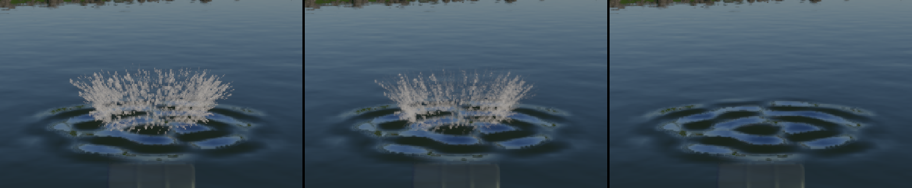
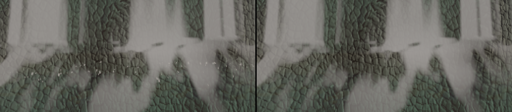

# #107: objects in the water (2026-10-02)

The first part: the rivers part around what floats in them, the flow taken relative to each thing
(`city-blocks --island 7 --movers N`, `docs/demos/island.md`, "Objects in the water"). Frame 60
with the fixed step, 1600 × 900, 1 000 barrels: carried at the water's speed, one in ten moored.

- `moored.png`: the first moored barrel the water passes at 1.2 m/s or more, from above
  (`-1954.0,51.69,249.9,77.1,-49.6`, the log's `moored` view), cropped and enlarged twice:
  - without the floaters (`--no-floaters`);
  - with them;
  - the pixels that changed: 8 588; ꟻLIP mean 0.0017, max 0.40.
  - The wake runs downstream (to the right) over 3–4 m, white in streaks and a rougher surface.
  - The pillow in front is in place (a debug colour showed it), but the white water's streak
    pattern leaves the 0.3 m in front of the barrel mostly clear, as for the stones.

**Cost** (2560 × 1440, two rounds): `water/surface` 0.069 → 0.081 ms from the moored barrel, no
change beyond the rounds' spread from the largest mouth. Without the grid of 16 m cells around
the camera, every river pixel looping over all 64 floaters, it was 0.10 and 0.34 ms more.

**Checks:**
- Without movers the capture batch is at 0 px, and so are the A/B harness and mesh against
  fallback.
- `validate.sh` is clean, with 1 000 movers on both paths.
- The tests pass; clippy and fmt are clean.

## The second part: wakes in still water (wave particles)

What moves through the lakes and the sea leaves waves (`docs/demos/island.md`, "The wakes"):
wave particles carrying packets of waves 0.5 m long, on the async compute queue, splatted into a
field around the camera whose slopes the water adds. Frame 300 with the fixed step, 1600 × 900,
1 000 barrels, the last one towed round a 20 m circle on the largest lake at 2.5 m/s.

- `towed.png`: the towed barrel from the log's `towed` view
  (`2168.0,36.90,-1234.0,-102.9,-36.2`): without the wakes (`--no-wakes`), with them, the pixels
  that changed. Crests ring its bow and trail 15 m behind it along its curve; 35 138 pixels,
  ꟻLIP mean 0.0070, max 0.99 where a crest catches the sun.
- `towed-low.png`: the same from 2 m over the water and 16 m away
  (`2163.1,30.9,-1235.1,-102.9,-7`): fine lines of ripples in its wake, fading out where the view
  grazes the water (the wakes fade before their Nyquist limit since a later commit); 4 080
  pixels, ꟻLIP mean 0.0005.

**Cost** (2560 × 1440, two rounds): the frame 0.08 ms more (3.60–3.62 → 3.68–3.70 ms from the
towed barrel); on the compute queue `wakes/advance` 0.08–0.11 ms, `wakes/emit` 0.014–0.018,
`wakes/slopes` 0.010, `wakes/clear` 0.004.

**Checks:** the same capture twice is the same to the pixel; without movers the batch is at
0 px; `validate.sh` is clean with the wakes; tests, clippy and fmt pass.

## The third part: splashes

Spray where the water splashes, as ballistic particles on the GPU (D-009's near water, visual
only). `docs/research/water.md` §7 is the research; D-038, "Splashes", is the decision's note;
`docs/demos/island.md`, "Objects in the water", is the write-up.

- **The sources** (`forge_render::SplashSource`), each turned into drops by the research's rules:
  - **Something meeting the water:** a crown of drops round its waterline, a hundred a metre of
    it per m/s over 2 m/s. When its cavity closes, 2 √(R / g) later, comes a jet, weaker for a
    buoyant body.
  - **A step's fall:** drops thrown up at the foot and mist over it, by how far the falling sheet
    breaks up (Horeni's 6 q^0.32 m). There are 4 457 steps, in four pieces across each, along the
    fall's bowed line.
  - **A bow:** by its Froude number. At 2.5 m/s the towed barrel's is 1.03: a thin fringe, no
    fans.
  - **Drips** off something lifted out of the water.
- **The demo's dropped barrel:** with `--movers 2` or more, one more barrel hangs 3 m over the
  middle of the towed barrel's lake. Every 10 s it falls, meeting the water at 7.2 m/s, bobs, and
  is lifted out, dripping. The log gives its view, `2160.0,30.55,-1234.0,0.0,-8.5`. With the fixed
  step it meets the water at frame 164.
- **The particles:**
  - They live in a ring of 65 536 slots that the CPU hands out in blocks, in order, so the draw's
    order never changes from frame to frame.
  - A stream's drops are born at fixed times from its seed, so it is the same at any frame rate.
  - `splashes/emit` and `splashes/advance` run on the compute queue: gravity, and a drag towards
    the wind (the sea's, at 0.15 near the water).
- **The draw** (`splashes/draw`, after the water and its reflections):
  - Soft sprites streaked over half a frame, at least a pixel wide with their alpha scaled by
    the area they lack.
  - Lit by the sun through a shadow ray and by the sky, hazed by the aerial perspective, faded
    against the depth.
  - It writes a reactive mask, which TAA reads.
- **The A/B flags:** `--no-splashes` turns the spray off, and the hidden `--no-reactive` drops
  the mask.

**`splash-drop.png`** (frames 160, 170, 185, 200 and 215, and 185 with `--no-splashes`):
- **Frame 170:** the crown rises off the barrel's waterline, among the wakes' rings.
- **Frame 185:** it opens out.
- **Frame 200:** it rains back while the barrel bobs up.
- **The jet** stays hidden behind the rising barrel, as it should for a buoyant body.
- **At frame 185:** 13 313 px differ from `--no-splashes`, ꟻLIP mean 0.0043.

**`splash-reactive.png`** (frame 175): the crown with the reactive mask, without it, and without
the splashes.
- Without the mask, TAA's history blends the drops away into a dimmer, smeared crown: 5 627 px
  differ, ꟻLIP mean 0.0014.
- With the mask, against no splashes at all: 8 751 px, ꟻLIP mean 0.0036.

**`splash-fall.png`:** the foot of the island's highest step (2 m) from 8 m
(`283.9,31.1,3133.0,-29.3,-8`), enlarged three times, with and without the spray.
- A scatter of drops shows in front of the white water, and a haze of mist over it: 67 660 px
  differ, ꟻLIP mean 0.0103.
- From the step's logged view at 15 m: 15 860 px, ꟻLIP mean 0.0024.
- **The tuning:** a 2 m step stays a compact plunge, so with the research's starting values
  (150 drops a metre a second at 0.15–0.35 of the impact speed) the drops barely left the white
  water. They are now 200 at 0.2–0.5, and 0.8–2.5 cm across.
- **The fix on the way:** the drops first sat behind the falling sheet, which bows downstream
  of the foot's point. Now they start on the bowed line, plus the distance the sheet is thrown.

**Cost** (2560 × 1440, 1 500 frames, two rounds):

| View | `splashes/draw` | `splashes/emit` + `advance` (compute) | drops alive at most |
|---|---|---|---|
| the dropped barrel, over its 10 s cycle | 0.010 ms | 0.004 ms | 1 447 |
| the highest step from 8 m | 0.032 ms | 0.007 ms | 4 830 |

- **The frame's total:** it moves by up to 0.17 ms in either direction with the splashes on,
  through the async overlap rather than their work. The probes' rays meet different graphics
  passes.
- **Serially** (`FORGE_ASYNC=0`) the total stays within the runs' spread, and TAA's resolve does
  not change with the mask.
- **No room:** no drop was dropped for lack of slots.

**Checks:**
- Tests: 251, three new: a stream is the same whatever the frames; an impact bursts once and
  its jet follows; a fall sprays by how far its sheet breaks up.
- Clippy and fmt pass.
- The capture batch is at 0 px: no fall lies within 150 m of its views, and its runs have no
  movers.
- `validate.sh` is silent, with a new run, `splashes`, that crosses the drop (frame 164 and
  after) on both paths.
- `timings.sh`: every view within the runs' spread.
