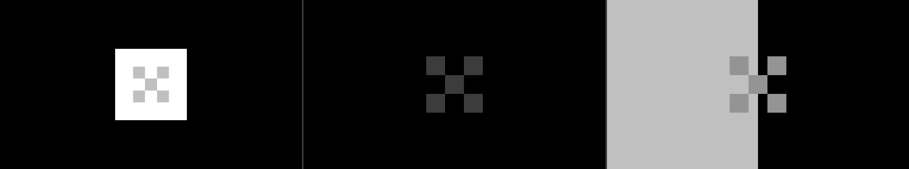

# #125: HDR calibration pages, MaxCLL and MaxFALL from the frame (2026-10-02)

What the HDR output (#94) left for later: a way to tell Forge what the display really shows,
and the content's light levels for the display's metadata. D-022, "Calibration", has the
decision; `docs/demos/asteroids.md`, "HDR output", the use.

- **F5** opens three pages over the frame, in HGiG's and Unity's form: the peak (a mark in a
  square of a tenth of the screen at the signal's top, raised until it disappears), the black
  (the darkest mark that still shows) and paper white (the mark across a half at the peak and
  a half of black). Up and Down move by 4 PQ codes (1 with Shift), Backspace goes back to the
  OS's value, F5 moves on and saves, Esc cancels.
- The calibrated values go over Windows' and apply at once: the peak picks ACES 2.0's preset,
  the black goes to the metadata, the UI's white to the overlay and the other curves. They are
  saved per monitor in `settings/display.txt`, which scripted runs never read or write.
- `--hdr-ui-white NITS` and `--hdr-stops EV` set the UI's white and the paper-white offset.
- `post/hdr metadata histogram` measures MaxCLL and MaxFALL from every HDR frame; the display
  is told the largest since the mode or the preset changed.

## The pages hold the codes they should

Captured off-screen at frame 60 of the ballad (`FORGE_HDR_CALIBRATION=peak|black|white
asteroids --hdr offscreen --tonemap aces2`), read from the `-pq.png` (largest channel per
pixel). The display here is in SDR, so the OS's values are not used: peak 1000, black 0.005,
UI white 203 nits.

| Page | Codes in the capture |
|---|---|
| peak | the square 1023 (380 × 380 px: a tenth of 1600 × 900), the mark 769 (1000 nits), the rest 0 |
| black | the mark 15 (0.005 nits), the rest 0 |
| paper white | the left half 769, the right half 0, the mark 594 (203 nits) |

The SDR previews of the pages show what an SDR display at the UI's white would: the square and
the mark both clip there, so the pages are judged on the HDR display only.

## The meter against the capture

The ballad's frame 600 in HDR (`--fixed-step --tonemap aces2 --hdr offscreen`), the GPU's
measurement (logged at debug level) against the same frame's capture read on the CPU:

| | GPU | the capture |
|---|---|---|
| MaxCLL | 1007.878 nits | code 770, 1007.9 nits (the half-code dither above the 1000-nit preset) |
| frame average | 10.068 nits | 10.06 nits |

MaxCLL is the largest signal kept exactly; the average comes from the 256 bins' centres,
within half a bin. Over the 600 frames the run ends at MaxCLL 1007.9 and MaxFALL 11.5 nits.

## On the display

On an HDR display the meter reads the swapchain's own images, which are created sampled in
the HDR modes when the surface allows it. The display here is in SDR and Windows' HDR switch
is not ours to touch, so that path ran in a temporary build that made the SDR swapchain
sampled and metered it. Under the validation layer, with synchronization validation, it was
silent (`sampled=true`, 60 frames, metered every frame). The scRGB branch of the shader is
compiled but has not run.

## Cost

`post/hdr metadata histogram`, the ballad, three runs: 0.033–0.038 ms at 2560 × 1440 and
0.015–0.016 at 1600 × 900 (the exposure histogram: 0.035 at 1440p). A thread per pixel with a
shared atomic for the largest signal took 0.048–0.051 ms. A quad per thread, a wave's pixels
of one bin counted together and the largest reduced over the wave first, took it to 0.033.
Sixteen pixels per thread were slower (0.045). The calibration page takes 0.029 ms while it
is open.

## Checks

- Tests: 246 (9 new), clippy with `-D warnings`, fmt.
- `tools/validate.sh`: silent on every run, with a new one on a calibration page.
- The capture batch, run before the change, after it, and again on the final kernel: the
  final batch matches the "after" one at 0 px on every line, the culling harness and the mesh
  path against the fallback included. Against the "before" batch, every line is 0 px but the
  fallback path's HDR frame 600, which is #71's flake (below).

**#71 on the fallback's HDR frame 600.** The "before" capture differed from the "after" one in
262 px of the preview and 120 489 px of the PQ codes, 133 of them by more than 2 codes (up to
71, scattered pixels at edges). The old build, run five more times, gave the "after" image
every time, so the "before" capture was the flake. Of three more runs of the new build, two
gave that image and one differed in 23 pixels by more than 2 codes. That is the flake again:
the new pass changes the frame's timing, not its pixels.
