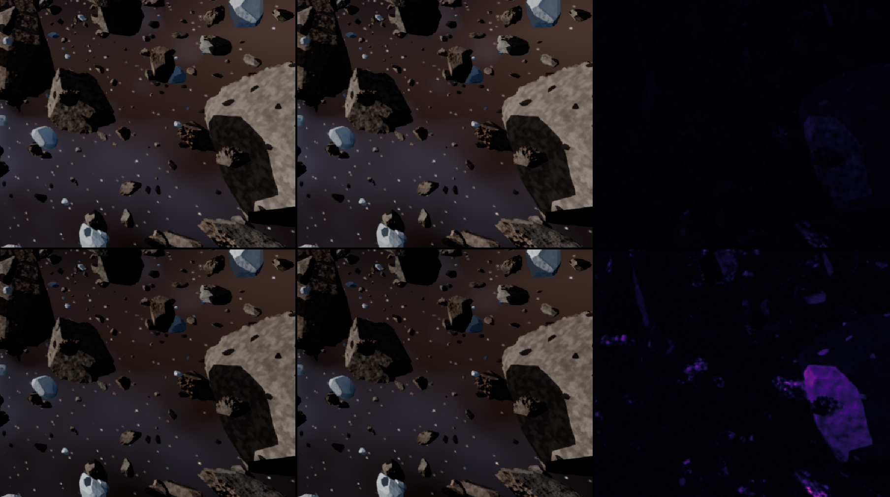

# #126: HDR-ꟻLIP in `imgdiff` (2026-10-02)

`imgdiff a-pq.png b-pq.png` now gives two HDR captures' PQ codes (#94) HDR-ꟻLIP
(Andersson, Nilsson, Shirley and Akenine-Möller, Eurographics 2021) instead of LDR-ꟻLIP:
- both images decoded to light, Rec.2020 to Rec.709, 1.0 = 100 nits;
- both tone-mapped with ACES at one exposure per stop, from the reference's brightest pixel
  at 0.85 to its median there;
- LDR-ꟻLIP at each exposure, each pixel keeping its largest error.

It prints the same statistics as LDR-ꟻLIP, the exposures used, and the largest error in
10-bit codes. `compare.sh` puts the codes and HDR-ꟻLIP's mean and largest value on the `-pq`
lines, for example:

    mesh-ast-hdr600-pq: 719762 px differ (max 2 codes), HDR-FLIP mean 0.021181, max 0.089546

## Against NVIDIA's tool

`--exr a.exr b.exr` writes the light `imgdiff` compares (32-bit float, uncompressed), and
NVIDIA's tool (v1.7, built from source) reads it:

    imgdiff a-pq.png b-pq.png --exr a.exr b.exr
    flip -r a.exr -t b.exr

Over 28 pairs, every statistic agrees to the six decimals the tool prints:
- the start and stop exposures and their number;
- the mean, the weighted median and quartiles, the largest value.

The error maps are identical to the pixel. The pairs, all at 1600 × 900 or 256 × 256:
- edits of the ballad's HDR frame 600: one pixel, a line and a 3 × 3 block, 20 and 60 codes
  brighter, and the brightest pixel darker;
- one code more over the whole frame;
- flat fields at 10, 100, 203 and 1000 nits with the same edits;
- the block and the whole frame again at 30 and 120 ppd.

Some of them:

| Pair | Exposures (stops) | Mean | Weighted median | Largest |
|---|---|---|---|---|
| frame 600, one pixel 20 codes brighter | 9 from −2.2500 to 6.6876 | 0.000001 | 0.036942 | 0.082766 |
| frame 600, one code over the whole frame | the same | 0.037377 | 0.037656 | 0.069814 |
| frame 600, a 3 × 3 block 20 codes brighter, at 30, 67, 120 ppd | the same | 0.000003–0.000004 | 0.358116, 0.140382, 0.062916 | 0.421526, 0.311114, 0.149587 |
| a 1000-nit field, one code over the whole field | 2 at −2.2371 | 0.008669 | 0.008674 | 0.008674 |

Each pair takes about 0.8 s in both (nine exposures).

## What the numbers mean

The calibration pairs (the HDR table against its per-pixel transform, far from the origin,
whole-frame shifts of 1–3 codes, specks, GTAO, a quarter stop, AgX) are in `docs/PROCESS.md`,
"The perceptual check", "HDR captures". Class 2's proposed HDR thresholds are in D-017's
second amendment (🟡): the largest value below 0.15 as before, the mean below 0.05 instead of
0.02. The reason is that HDR-ꟻLIP looks up to 7 stops above the display: the HDR table, which
nobody can tell apart, scores a mean of 0.021–0.025 against 0.0044 for LDR-ꟻLIP on the SDR
frame.

`gtao.png`: the large rock of frame 600, GTAO on and off and the error map. Top: SDR with
LDR-ꟻLIP (largest 0.135). Bottom: the HDR preview with HDR-ꟻLIP (largest 0.59). ACES 2.0's
SDR curve crushes the shadowed face GTAO darkens; HDR-ꟻLIP, a few stops up, sees it.

